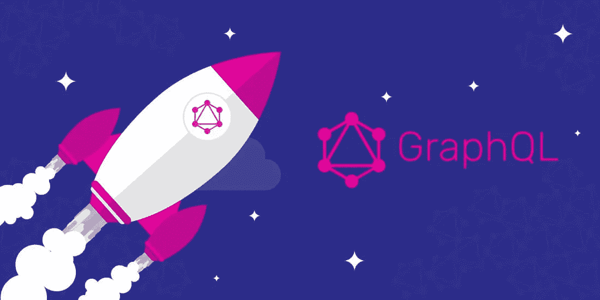

# 使用 GraphQL + Websocket 的实时反应应用程序

> 原文：<https://medium.com/hackernoon/real-time-react-app-with-graphql-websocket-fe64f42e97bc>

Source: [https://medium.com/@weblab_tech/graphql-everything-you-need-to-know-58756ff253d8](/@weblab_tech/graphql-everything-you-need-to-know-58756ff253d8)

GraphQL 开始成为编写可定制的 API 并将多种服务合并到一个端点的绝佳选择。拥有单个端点但获得不同模型组合的整个想法非常有吸引力，特别是对于那些与不同前端/移动开发人员和设计人员一起处理大规模多平台应用程序的公司。