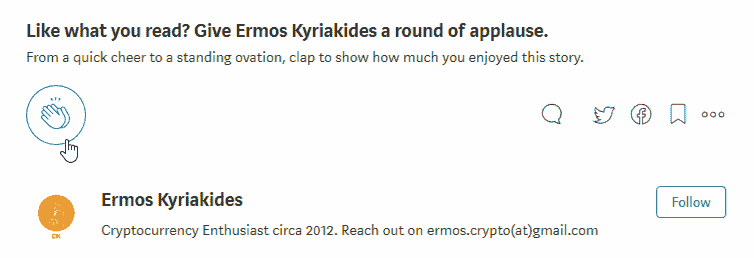

# 加密货币的现实应用——艺术品和收藏品

> 原文：<https://medium.com/hackernoon/real-world-applications-of-cryptocurrencies-art-collectibles-7ac3357dfcab>

鉴于这个系列已经积累了相当多的追随者，我想在我休息两周之前再写一篇。继我上一篇关于在线售票系统和 GET 协议的文章，你可以在这里找到，我将讨论一下**A**RTS**&****C**collectables(**A&C**)行业将如何被区块链和加密货币的出现所颠覆。

# 独特的资产注册——法典协议

## 概观

A & C 由艺术品、美酒、收藏汽车、乐器、珠宝等物品组成。在过去的几年里，A & C 变得如此之大，以至于德勤将它视为一个资产类别——“一组表现出相似特征、在市场上表现相似、遵守相同法律法规的证券”。

高净值个人(HNWI)目前平均将投资组合的 6%分配给这一资产类别。此外，根据[德勤 2017 年 Art &财务报告](https://www2.deloitte.com/content/dam/Deloitte/at/Documents/finance/art-and-finance-report-2017.pdf)，这一资产类别估计价值**2 万亿**美元，预计到 **2026** 年**年交易额约为**6200 亿美元，增长**0.7 万亿**。

## 问题是

尽管市场的规模和增长有一个巨大的问题；缺乏所有权登记处。这归结为缺少两样东西:

*   **出处** —这是某个特定对象的**所有权历史**和**相关文档**。它决定了一件物品的货币价值，因为它表明了这件物品的真伪。证明一件物品的真实性是一个漫长的、通常是手工的、艰难的过程，需要分析大量的文书工作，并且通常是不确定的。没有适当的出处，**造假**、**造假**、**造假**变得非常普遍。据估计，每年有超过 60 亿美元的损失。最近有许多欺诈的例子，包括，[约翰在九年多的时间里用伪造的杰森·布拉克(以及更多)艺术品骗取艺术品买家 250 万美元](https://www.bbc.co.uk/news/entertainment-arts-30289796)。
*   **元数据**—是与对象相关的信息，如照片、过去的评估、收据、修复记录等。空间被缺乏全面的、安全的、容易访问的元数据所困扰。元数据对收藏品的“解锁价值”至关重要，因为服务的提供(稍后将详细介绍)在很大程度上依赖于此。例如，购买者可能想知道可收藏的汽车在过去有什么样的损坏，或者是否有任何修改。

**出处**和**元数据**使用当前的技术很难透明且安全地实现。当然，有一些集中式注册中心提供出处，然而，无论是收集者还是中介都不会完全信任集中式注册中心*。*

这些问题抑制了安心的买卖。此外，收藏品的保护和保险变得更加复杂，同时，使得伪造和欺诈行为更加容易。

## 这个提议

进入 [**抄本协议**](https://codexprotocol.com/) 。

> [**Codex 协议**](https://codexprotocol.com/) 被设计为一个为& C 对象定制的资产注册表。法典记录旨在保存一件物品的所有信息，包括所有权证据和其他元数据。

法典小组正在建立一个**协议**，通过为他们创建一个**去中心化的所有权注册处**，再加上一个去中心化的专家联盟来验证真实性，这将彻底改变 **A & C** 。 **Codex Protocol** 将通过中立且分散的验证来跟踪一个对象的****所有权历史*** *。该协议还将能够**安全地存储关于对象的元数据**，同时也使它们易于访问(如果需要的话)。简而言之，食品法典委员会将把**原产地带到了区块链**——天作之合。**

*最重要的是，**法典协议**由 5000 家拍卖行和受信任的行业利益相关者组成的财团支持，从而使其处于被采纳和成为标准的有利地位。因为他们正在构建一个协议，它将提供其他人在其上构建分散的应用程序。抄本本身就是已经推出的**。***

## ***它是如何工作的***

***法典协议的核心是**法典记录**。Codex 记录包含特定对象的**出处细节**和其他**元数据**，并在对象加载到 Codex 时创建。***

***在将一件物品载入法典之前，所有相关信息都需要经过**验证人员**的验证(这些人员包括评估人员、拍卖行专家、经销商、画廊老板等)。).如果最终用户加载了一个对象，验证者需要确认他们提供的信息是正确的。如果一个对象是由验证者直接加载的，他们需要自己研究和加载这些信息。为了确保系统的完整性，验证者将会得到与现在非常相似的奖励。***

***起初，验证者(和他们的奖励)将在自由选择的基础上被选择，但是法典小组期望在未来奖励将会是*“通过算法和一个给有专业知识的终端用户评分的信誉系统一起分配”。****

******

***为了说明**法典协议**是如何工作的，我将通过下面一个简单的例子来说明:***

*   *****爱丽丝**将她的作品**洛娜·米砂**载入抄本。由于**洛纳·米砂**第一次被载入法典，任何相关信息都需要由**验证者**验证。***
*   ***验证者确认了**洛纳·米砂**的真实性，并成功载入了法典。***
*   *****爱丽丝**然后希望匿名**把洛娜米砂**卖给**鲍勃**。由于关于洛纳·米砂的所有信息都记录在一个抄本记录中，爱丽丝能够**将查看权限**委托给**鲍勃**来查看附加到记录中的信息。***
*   ***尽管事实上**爱丽丝**选择保持匿名，**鲍勃**可以确定**洛娜米砂**是**真实的**，因为协议提供了正确的出处。***
*   ***一旦出售完成，**鲍勃**将注册成为**新的洛纳米砂所有者**。***

## ***解决方案***

***通过成为一个为一个& C 对象定制的**分散资产注册中心**，Codex 将自己置于解决上述问题(并对其进行改进)的首要位置。它将通过提供**适当的出处&安全的&可访问的元数据来做到这一点。**通过利用区块链和智能合约的优势，对象的身份、其所有权路径、真实性和相关数据将始终是安全的、不可变的、有保证的、可验证的、可访问的和透明的。***

******

***History of Ownership***

***通过添加安全且可访问的元数据，拥有适当的出处将带来诸多好处，包括:***

*   ***匿名——现在可以证明 Cs 的所有权，而不会损害隐私***
*   *****更好的服务** —应用和服务(资产支持贷款、投标、托管、保险等)。)将更有信心为客户服务。***
*   *****更大的可访问性** —这特别针对新创建的加密货币富裕持有者。他们现在将有机会分散到一个资产类别，提供一个不相关的，升值和私人价值储存。***
*   *****更大的市场规模** —通过广泛采用带来诸多好处的注册，将有助于 A & C 空间*“增长数千亿美元”*和*“可能使该资产类别的价值增加超过 1 万亿美元”*。***
*   *****没有中间人** —《食品法典》协议将消除成本高昂的中间人，以及当集中的单一实体持有信息时有时会出现的风险和怀疑。这自然也会降低交易成本。***
*   *****减少欺诈**——这是显而易见的，但欺诈、伪造和假货的数量将大幅减少，因为来源现在将是安全、可访问和透明的。***

## ***CodexCoin ( **CODX** )令牌是如何使用的？***

> ***密码是一种用于访问协议的令牌。用户或代表他们的应用程序将以 CodexCoin 的形式支付费用，以创建、更新和转移 Codex 记录。这些费用将用于提供奖励。***

*****代码交换** ( **代码交换**)用于访问代码协议。它有多种用途，包括:***

*   ***支付**费用**用于创建、更新和转移法典记录。这些费用将根据一个应用程序(建立在 Codex 协议之上)的 CODX 数量和持续时间而有所折扣。***
*   *****奖励**验证人员的验证工作，如果没有遵循正确的行为，则处罚他们。***
*   ***为链上投票方案提供了一个**机制**，这意味着令牌持有者将能够管理分散的系统。***

***法典委员会还没有推出他们的令牌。你只能在 7 月底的**I**I**C**O**O**优惠期间购买 CodexCoins (CODX)。你可以在这里找到更多关于他们代币销售和注册 ICO 的信息。***

# ***这个帖子值得多少掌声？跟着来怎么样？***

***如果你喜欢这篇文章，请随意👏**拍手**👏很多次(你知道你想！)，给我的博客一个👣**跟随**👣**和**🤲**分享**🤲和朋友在一起。有一个限制👏 **50 拍手**👏你可以给每个职位，所以我劝你不要试图超过这个限度…你可能会打破中等！***

******

# ***说到这个…***

***如果你仍然关注我，请留下评论，让我知道你还想看到我写些什么。你可以找到我的社交媒体的链接，并在下面注册我的时事通讯。***

*********************

[ermos.crypto+medium@gmail.com](mailto:ermos.crypto+medium@gmail.com)*** 

***也可以捐款到以下地址以示支持:
**ETH**:[0x4c 7195 e 074 cf 0 ab 6 f 77 BDB 7 c 97 FD 2567066 bb 712](https://goo.gl/H8xSTn)***

***免责声明:这篇博文中的所有信息和数据仅供参考。我的观点是我自己的。我不提供个人投资建议，也不是合格的特许投资顾问。*我对任何信息的准确性、完整性、适用性或有效性不做任何陈述。我将不对任何错误，遗漏，或任何损失，或因其展示或使用引起的损害负责。所有信息均按原样提供，不提供任何担保，也不授予任何权利。****