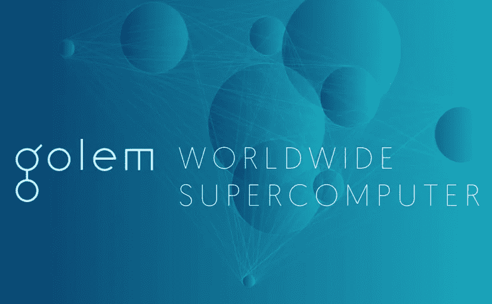

# 加密货币的真实应用——云计算

> 原文：<https://medium.com/hackernoon/real-world-applications-of-cryptocurrencies-cloud-computing-59745dd95145>

作为我的系列文章“*加密货币的真实世界应用”*的一部分，也是我上一篇关于支付系统&请求网络(你可以在这里找到的文章的后续，我将讨论云计算行业将如何被加密货币的出现所颠覆。

# 云计算—假人(GNT)

云计算在执行繁重的计算任务方面变得越来越受欢迎，但有一个主要问题——它极度**集中**。这导致了许多缺点，包括:

*   **单点故障** —由于我们当前的解决方案是集中式的，这导致了单点故障。例如，市场上的主要参与者亚马逊网络服务已经经历了无数次的中断，对许多使用它的公司造成了巨大的破坏。
*   **昂贵** —由于市场由极少数玩家主导，使用这些服务可能相当昂贵。

输入**假人(GNT)** 。

> 假人是一台每个人都可以访问的分布式超级计算机，它可以降低科学研究、大数据分析、图形渲染、机器学习、人工智能等几乎所有需要强大计算能力的领域的成本[有时超过 10 倍]。同时将 CPU 周期引入共享经济，这样任何拥有电脑的人都可以在不使用电脑时将其连接到假人网络，并自动获得额外收入。

假人以对等网络连接计算机，使应用程序所有者和个人用户(“**请求者**”)都能够租用其他用户(“**提供者**”)机器的资源。这些资源可用于完成需要任何计算时间和容量的任务。下面我将描述一个简单的例子:

爱丽丝是假人网络上的**请求者**。**鲍勃**、**查理**等很多人都是**提供者**；出租闲置的个人电脑资源以获取被动收入。爱丽丝已经创建了一个 CGI 动画，并希望使用假人渲染它。

动画可以分成帧。然后，将使用 Bob、Charlie 和网络上其他人提供的资源分别渲染这些帧。因此，Alice 实际上是付钱给 Bob，Charlie 来为她完成复杂的渲染。

A simple workflow of how the Golem Network functions

假人的目标是解决这些问题中的大部分，甚至在以下方面加以改进:

*   **去中心化**——假人带来的最重要的特点是它是**去中心化**。这意味着，**没有单点故障**和**对于请求者和提供者来说是同等的特权**。
*   灵活**——假人可用于多种任务，不像它的中央处理器。它可以用于科学计算、人工智能、计算机生成图像(CGI)渲染等等。此外，任何感兴趣的一方都可以将软件部署到假人网络，然后可以进一步扩展并定制其支付机制。*其* *的局限性仅由软件开发者的创造力*来定义。"**
*   ****更便宜** —使用假人要比现在的便宜得多。这不仅有利于当前繁重计算任务的用户，而且对于对 CGI 渲染、科学计算等感兴趣的人来说也变得更加容易。你可以在这里找到渲染农场和假人[价格差异的例子。](https://blog.golemproject.net/why-should-render-farms-be-afraid-of-golem-3dd1b9e70f47)**
*   ****全球参与** —任何人都可以加入假人网络；作为请求者和提供者。当计算机处于开机状态时，大多数时间，大多数计算周期都没有得到充分利用。假人允许出租这些资源获得被动收入。**

**d̵u̵e̵̵t̵o̵̵h̵o̵w̵̵t̵e̵c̵h̵n̵i̵c̵a̵l̵l̵y̵̵c̵o̵m̵p̵l̵i̵c̵a̵t̵e̵d̵̵b̵u̵i̵l̵d̵i̵n̵g̵̵s̵o̵m̵e̵t̵h̵i̵n̵g̵̵l̵i̵k̵e̵̵t̵h̵i̵s̵̵i̵s̵,̵̵t̵h̵e̵̵g̵o̵l̵e̵m̵̵t̵e̵a̵m̵̵h̵a̵s̵̵b̵e̵e̵n̵̵h̵i̵t̵̵b̵y̵̵a̵̵n̵u̵m̵b̵e̵r̵̵o̵f̵̵s̵e̵t̵-̵b̵a̵c̵k̵s̵.̵̵t̵h̵e̵i̵r̵̵f̵i̵r̵s̵t̵̵r̵e̵l̵e̵a̵s̵e̵̵(̵n̵a̵m̵e̵d̵̵b̵r̵a̵s̵s̵̵g̵o̵l̵e̵m̵̵—̵̵s̵p̵e̵c̵i̵a̵l̵i̵z̵i̵n̵g̵̵i̵n̵̵c̵g̵i̵̵r̵e̵n̵d̵e̵r̵i̵n̵g̵)̵̵w̵a̵s̵̵i̵n̵i̵t̵i̵a̵l̵l̵y̵̵p̵l̵a̵n̵n̵e̵d̵̵t̵o̵̵b̵e̵̵r̵e̵l̵e̵a̵s̵e̵d̵̵i̵n̵̵q̵2̵̵2̵0̵1̵7̵.̵̵t̵h̵i̵s̵̵h̵a̵s̵̵s̵i̵n̵c̵e̵̵b̵e̵e̵n̵̵p̵u̵s̵h̵e̵d̵̵t̵o̵̵q̵1̵̵2̵0̵1̵8̵,̵̵h̵o̵w̵e̵v̵e̵r̵,̵̵a̵n̵̵a̵l̵p̵h̵a̵̵v̵e̵r̵s̵i̵o̵n̵̵i̵s̵̵a̵l̵r̵e̵a̵d̵y̵̵r̵u̵n̵n̵i̵n̵g̵̵o̵n̵̵t̵h̵e̵̵t̵e̵s̵t̵-̵n̵e̵t̵.̵̵w̵e̵̵a̵r̵e̵̵s̵t̵i̵l̵l̵̵i̵n̵̵e̵a̵r̵l̵y̵̵s̵t̵a̵g̵e̵s̵̵b̵u̵t̵̵t̵h̵e̵̵p̵o̵t̵e̵n̵t̵i̵a̵l̵̵f̵o̵r̵̵t̵h̵e̵̵p̵r̵o̵j̵e̵c̵t̵̵i̵s̵̵g̵r̵e̵a̵t̵.̵**

**假人的第一个版本(代号黄铜)终于到达以太坊主网！你可以在这里找到更多信息。**

**下面你可以找到一个由假人团队制作的优秀短视频，简要介绍了什么是 GNT 以及它将如何工作。**

## **GNT 代币是如何使用的？**

**与其他项目不同，GNT 令牌的使用非常简单。来自假人的白皮书:*请求者向提供者支付的资源使用费和软件开发者的报酬将只在 GNT 进行。***

**我还想指出，GNT 并不是唯一一个试图解决这些问题的项目，包括，**deep brain Child**(DBC)**Elastic**(XEL)**grid coin**(GRC)**iExec RLC**(RLC)和 **SONM** (SNM)。如果你想看到这些项目的比较和对比，请随时给我留言或发推文。**

**GNT 可以在各种交易所购买，包括， [Bittrex](https://bittrex.com/) ， [Bitfinex](https://www.bitfinex.com) 和[more more](https://coinmarketcap.com/currencies/golem-network-tokens/#markets)。**

**可以在 Twitter[**@ ermos _ k**](https://twitter.com/ermos_k)关注我，了解最新博文。**

** [## Ermos K (@ermos_k) | Twitter

### Ermos K 的最新推文(@ermos_k)。大约在 2012 年，加密货币爱好者

twitter.com](https://twitter.com/ermos_k)** 

**想支持我的工作，多看看？请在此捐款以示支持:
**ETH/GNT**:0x4c 7195 e 074 cf 0 ab 6 f 77 BDB 7 c 97 FD 2567066 bb 712**

**免责声明:这篇博文中的所有信息和数据仅供参考。我对任何信息的准确性、完整性、适用性或有效性不做任何陈述。我将不对任何错误，遗漏，或任何损失，或因其展示或使用引起的损害负责。所有信息均按原样提供，不含任何担保，也不授予任何权利。**