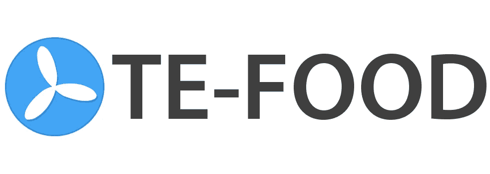
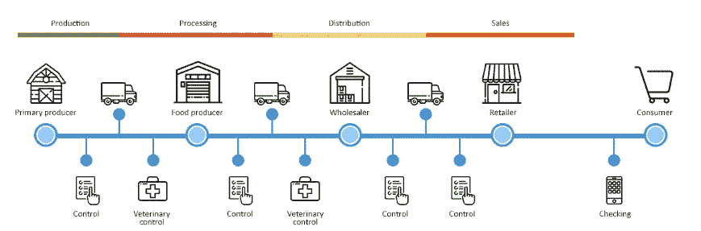
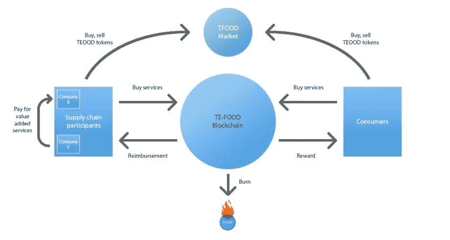

# 加密货币的现实应用——食品可追溯性

> 原文：<https://medium.com/hackernoon/real-world-applications-of-cryptocurrencies-food-traceability-3c46bc121b92>

作为我的系列文章“*加密货币的真实世界应用”*的一部分，也是我之前关于云计算&假人(你可以在这里找到)的帖子的后续，我将讨论食品可追溯性行业将如何被区块链和加密货币的出现所颠覆。

巧合的是，在我开始写这篇文章后，我参加了一个牛排课程，那里的厨师批评说，找到牛肉的确切来源、如何屠宰、是否是有机的等等是多么困难。—食品可追溯性需求的完美例子。

# 食品可追溯性— TE-FOOD (TFOOD)

食品可追溯性可能是你以前从未想到过的，但对你的健康极其重要。无论如何，这一领域存在许多问题，尤其是在新兴市场，这些市场也是主要的食品出口国。这些问题包括:

*   **食品安全**——缺乏食品安全所带来的社会和经济影响是多么严重，我怎么强调都不为过。食源性疾病导致全球每年 7 亿人住院和 40 万人死亡。此外，根据俄亥俄州立大学的一项研究，仅在美国，食源性疾病的平均成本估计为 555 亿美元。
*   **抗生素** —在农业中使用抗生素有很多好处；它们促进生长，对治疗动物感染是必不可少的。然而，抗生素被过度使用，在许多情况下，被用作集约农业的一部分，以防止感染和加快生长。这引起了抗生素耐药性，导致了新的“超级细菌”,这些细菌在人类食用食物时被摄入体内。这些“超级细菌”可以导致人类感染，从而导致不利的健康后果。世界各地的研究人员一直在警告农民大幅减少农业中抗生素的使用量，以避免危机。你可以在这里找到英国国家医疗服务系统的一篇精彩文章，解释这个问题。
*   **不信任&欺诈—** 食品供应链公司、当局和消费者都无法确认各自的运作方式。没有真正的方法来证明这一点，这可能会导致不信任和欺骗。此外，食品欺诈给食品行业带来了巨大的全球经济成本。[据普华永道](https://www.pwc.com/gx/en/services/food-supply-integrity-services/publications/food-fraud.html)估计，每年的经济影响约为 400 亿美元。
*   **经济不平等**——根据[公共政策集团 Demos](http://www.demos.org/publication/fast-food-failure-how-ceo-worker-pay-disparity-undermines-industry-and-overall-economy) 的一份报告，食品行业是美国经济中最不平等的行业之一，这在全球范围内得到了反映。举个例子，快餐连锁店的首席执行官的收入比普通员工高 1000 倍。这不仅伤害了低薪工人，也伤害了股东。

输入 **TE-FOOD** 。

> TE-FOOD 是一个成功的从农场到餐桌的牲畜和新鲜食品追溯解决方案，专注于新兴市场。自 2016 年起，越南开始实施 TE-FOOD。作为一种从农场到餐桌的解决方案，TE-FOOD 通过整个供应链(农场、屠宰场、批发商、零售商)跟踪食品，并为消费者和管理机构提供工具，以获取食品历史和食品质量信息。

TE-FOOD 是一家现有公司，自 2016 年起在越南成立。它目前为 6000 多家企业客户提供服务，每天跟踪 12，000 头猪、200，000 只鸡和 250 万个鸡蛋。

TE-FOOD 创造了一个集中的生态系统，食品供应链的每一步都可以被追踪。

然而，根据他们的[白皮书](https://ico.tefoodint.com/te-food-white-paper.pdf) *“即使来自第三方的数据，如现有的可追溯系统，对参与者来说似乎也是可疑的”*。解决这个问题的办法，就是引入[区块链](https://www.forbes.com/sites/bernardmarr/2017/01/24/a-complete-beginners-guide-to-blockchain)。通过移动区块链的 TE-FOOD 生态系统，TE-FOOD 将能够为食品供应链公司、当局和消费者提供一个完全透明、不可修改的环境(和工具)。

A general diagram of the food supply chain in the TE-FOOD ecosystem

上图只是食品供应链的一般表示。在 TE-FOOD 生态系统中，这可以根据具体的使用情况进一步定制。

TE-FOOD 致力于通过以下方式解决上一节中讨论的问题:

*   **透明&不变性**—通过移动区块链的 TE-FOOD 生态系统，它带来了食品供应链所有“利益相关者”之间的完全透明和信任。例如，当局可以追踪&确认农场是否遵循正确的做法。消费者可以立即发现他们的产品是如何采购、运输、屠宰等等。农民可以避免双重接种和过度使用抗生素。透明的食品供应链的优势是无穷的。
*   **控制**—**当局有能力在食品供应链中引入&强制控制点。这意味着产品在进入下一个环节之前需要满足一定的标准。**
*   **预测和分析** —如果有流行病爆发的迹象，复杂的算法将分析数据并向相关当局发出警报。由于数据是透明的和有效的，因此将更容易追踪根本原因，并防止其以比当前手段更快的速度传播。
*   **公平贸易**——提供资助和税收减免的政府和机构将有更容易和更准确的方式来确定谁有权享受这些。此外，有意识的消费者将更容易“支持”发展中国家。
*   **供应链评级**—食品供应链中的参与者将能够查看&其他交易方的评级。这将促进良好做法，并遏制不良行为者。

## 如何使用 TFOOD 令牌？

TFOOD 令牌有多种应用；它在 TE-FOOD 生态系统中的使用方式如下:

*   通过 TFOOD 支付执行可追溯性交易。
*   用于在供应链公司之间交换“付费”信息(即抗生素的类型)。
*   在零售中使用 TE-FOOD 消费者移动应用程序获得 TFOOD 奖励。
*   购买食品质量分析服务。
*   评价与他们“互动”的供应链公司。

How the TFOOD Tokens are used in the TE-FOOD Ecosystem

我还想指出，TE-FOOD 在供应链领域有许多竞争对手。类似的项目还有**安布罗斯**(AMB)**Modum**(MOD)**出处****瓦比**(瓦比)**沃顿** (WTC)。如果你想看到这些项目的比较和对比，请随时给我留言或发推文。

TE-FOOD 还没有推出他们的 token。您只能在 2 月 22 日首次发行硬币(ICO)期间购买 TFOOD 代币。你可以在这里报名参加他们的 ICO [。](https://ico.tefoodint.com/)

如果你喜欢这篇文章并想看更多，请确保给这篇文章一个**掌声**和我的博客一个**关注**。

您也可以通过在此捐款来表达您的支持:

**BTC**:395 jpxqaqlvyp 2 CP 4 uvmdbppartdkbfzk
**BCH**:181 fsplrfwvk 3 tpfmev 678 plrua 2 kpeofh
**LTC**:lgj w5 vjo 2 exxftqawuljvbrtqdiscxng 7 u
**ETH**:0x4c 7195 e 074 cf 0 ab 6 f 77 BD b 7

*免责声明:这篇博文中的所有信息和数据仅供参考。我对任何信息的准确性、完整性、适用性或有效性不做任何陈述。我将不对任何错误，遗漏，或任何损失，或因其展示或使用引起的损害负责。所有信息均按原样提供，不含任何担保，也不授予任何权利。*