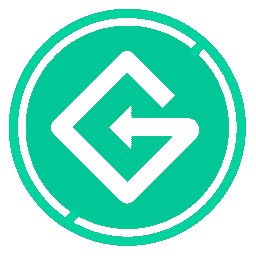
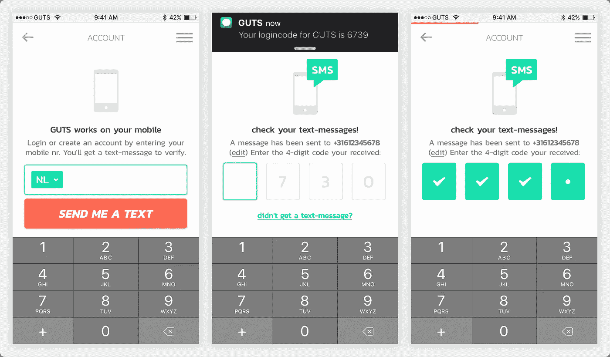
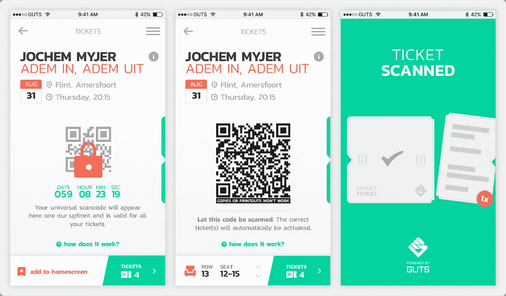
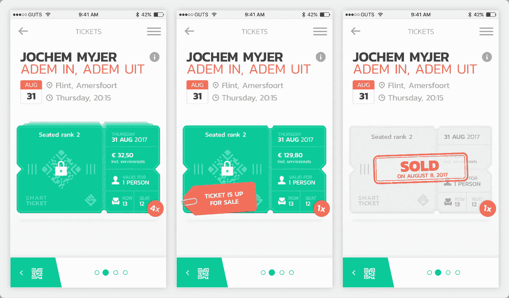
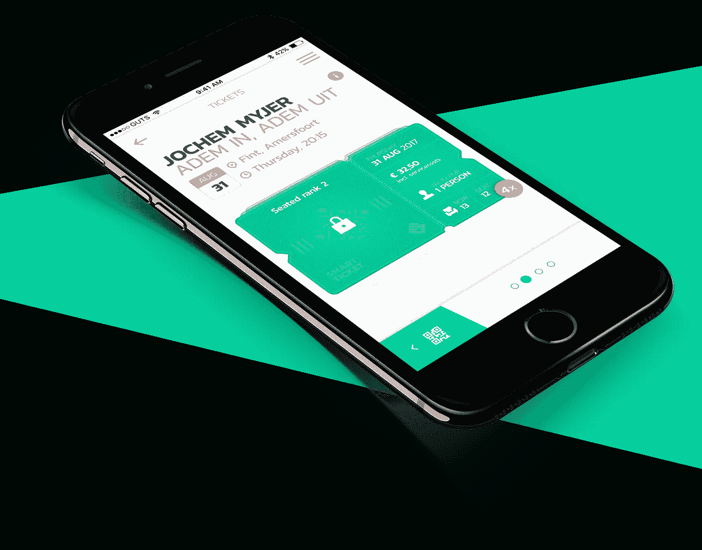

# 加密货币的现实应用——在线售票系统

> 原文：<https://medium.com/hackernoon/real-world-applications-of-cryptocurrencies-online-ticketing-systems-41c53b9c9605>

我以前说过，现在还要再说一遍；我们目前正处于熊市，但这不会改变区块链、加密货币及其背后的技术将如何改变世界的事实。作为我的系列“*加密货币的真实世界应用”*的一部分，我将讨论**在线售票系统**将如何被区块链和加密货币的出现所颠覆。

# 在线售票系统— [保证入场令牌(GET)协议](https://guts.tickets/get-protocol)

## 概观

我敢打赌，阅读这篇文章的大多数人至少使用过一次在线售票系统。在线售票系统市场**巨大**。为了客观地看待问题，这里有一些来自 [statista](https://www.statista.com/outlook/264/100/event-tickets/worldwide#) 的数据(这些包括电影、体育和音乐活动，而**不包括**剧院、博物馆、夜总会、喜剧俱乐部等。):

*   市场(如上所述)估计为 330 亿美元，年增长率为 11%。
*   **~84M** 预计 2018 年将有人出席**音乐活动**。
*   **~64M** 预计 2018 年参加**体育赛事**的人数。

## 问题是

尽管这个行业规模巨大，但两者都有严重的不利之处，一级市场(原始发行的门票)和二级市场(原始购买后转售的门票)。其中包括:

*   **缺乏透明度** —这导致隐藏的额外成本。例如，除了门票面值之外，消费者还需要支付一笔服务费、订单处理费以及偶尔的设施费；购票时有些或全部不一定看得见。(**一级市场**)
*   **利益相关者碎片化&合谋**——活动组织者、推广者、场馆和票务公司构成价值链。由于涉及的当事方太多，往往会出现各自为政和缺乏透明度的情况。反过来，这往往会导致串通，从而导致“内容创建者原始票价”大幅上涨。(**一级市场**)
*   **过高的转卖价格** —二级兜售者、黄牛和转卖者购买原始门票，无意参加活动，而只是继续出售。这导致二级市场上的门票价格过高。给你一个概念，根据 2009 年欧洲经济[的一项研究](https://www.google.com/url?sa=t&rct=j&q=&esrc=s&source=web&cd=1&cad=rja&uact=8&ved=0ahUKEwiV6PGGysnbAhWMmLQKHcRPAowQFggpMAA&url=http%3A%2F%2Fwww.europe-economics.com%2Fpublications%2Fsecondary_sales_market.pdf&usg=AOvVaw2MM09D62PU1KKwUYPC7n0Y)，20-70%的赛事门票被转售，加价幅度在 30-500%之间。[政府](https://www.gov.uk/government/news/new-rules-will-protect-fans-from-ticket-touting)甚至[艺术家](https://www.bbc.co.uk/news/entertainment-arts-44195496)自己都在试图解决这个问题，但收效甚微。(**二级市场**)
*   **门票欺诈** —无法保证从转售者处购买的门票是有效的或真实的。欺诈在这个领域相当普遍，因为许多粉丝因为他们的门票从未到达、是假的或无效的而被拒绝参加活动。仅在 6 个月内(2017 年 5 月至 10 月)，英国人就因机票欺诈损失了 166 万英镑(约 222 万美元)。(**二级市场**)
*   **市场数据丢失** —有价值的用户数据(经许可)丢失，因为最终的活动参与者不是最初的购票者。(**二级市场**)

## 这个提议

进入 [**得到协议**](https://guts.tickets/get-protocol) 。

> **GET 协议**提供了一个基于区块链的**智能票务解决方案**，票务公司和活动组织者可以使用该解决方案来完全合并一级和二级票务市场，从而消除倒票。该协议赋予持票人从第一张票售出到最后一张票被扫描的完全控制权。每张票都保证是独一无二的，这使得票欺诈成为不可能。

[**获取协议**](https://guts.tickets/get-protocol) 正在由 [**内脏票**](https://guts.tickets/) **团队**开发。 **GUTS Tickets** 是一家位于荷兰的运营智能票务公司。它创建了一个协议，供现有的(或新的)票务公司使用，作为他们改革在线票务系统的骨干。

事实上， **GUTS Tickets** 已经在最近的活动中试用了 **GET 协议**(在以太坊 Kovan testnet 上)，成功售出 **40，000 张**“智能门票”(截至 6 月 4 日)。 **GUTS Tickets** 的目标是在第三季度在以太坊主网上推出，并计划到 2018 年底再销售 **160，000 张**“智能门票”，到 2019 年至少再销售**100 万张**；全部使用**获取协议**。

## 它是如何工作的

购买门票和参加活动的流程如下:

*   消费者使用菲亚特(即美元、英镑等)购买机票。)通过支持 GET 协议的票务系统；未来将支持加密货币。这些票与经过验证的所有者相关联；验证方法灵活。这消除了部分门票欺诈，因为当门票被转售时，所有权被安全且迅速地转移(稍后将对此进行更多讨论)。

*   与现在的门票一样，直到活动开始前，购买者都会获得一张带有“动态”二维码的门票，该二维码是锁定的(即无法查看)。一旦解锁，二维码会定期更改，以防止最后一分钟再次出售。

*   为了消除任何欺诈的机会，二维码一旦被扫描就会消失。

GET 协议还有助于通过支持 GET 协议的售票系统以安全和公平的方式转售门票。活动组织者可以决定哪些折扣/加价门票可以转售，从而为他们提供对二级市场的控制，以防止过高的价格。此外，由于票证与一个所有者相关联，因此在售出后，票证的所有权会迅速安全地转移给新的所有者。

## 解决方案

[**GET 协议**](https://guts.tickets/get-protocol) 对于供应链中的各种利益相关方而言，处于解决上述问题(并对其进行改进)的首要位置，具体方式如下:

对于**消费者**:

*   **更好的价格** —消费者可以获得更公平的门票价格，因为交易更加透明，成本更低，此外，活动组织者可以控制二级市场的加价价格。
*   **更安全** —门票保证是真的，因为它们不能被伪造、复制等。
*   **易于转售**——持票人有了一种更加简化和用户友好的方式来安全地出售他们的门票。

对于**艺人&经理人**:

*   **粉丝满意度**—真正的门票以公平的价格卖给粉丝，而不是转售者。
*   **品牌形象安全**——禁止二级票贩子、黄牛和倒卖者在二级市场上漫天要价，玷污品牌。

对于**活动组织者**:

*   **基础设施的改进** —由于 GET 协议是可扩展的、安全的和可控的，它带来了许多好处，例如容易的退款、稳定的门票销售&分配、出色的正常运行时间、高效的销售&等等。
*   **更好的数据收集** —由于门票与其所有者相关联，因此可以收集更好的市场用户数据(取决于权限)。
*   **动态定价** —这可以优化出勤率，奖励客户忠诚度。

对于**场馆**:

*   **更好的体验** —向粉丝提供更好的体验，因为他们保证进入(没有无效票)，此外还有更有效的验证过程。
*   **目标销售** —场馆有能力在活动前营销产品(如果客户选择加入)，并直接向消费者销售额外优惠。

## 如何使用获取令牌？

> 创建和交易智能票证需要 GET。没有 GET，活动组织者不能创建活动或发行智能票证，也不能更改合同的状态。该协议的用户还需要被分配到他们唯一的用户账户，以便出售他们的票，因为 GET 支付并说明在该协议上发生的所有交易和处理成本。

**GET** 令牌对用户完全透明；他们不需要知道关于他们的任何事情(这对收养来说是非常好的)。一切都是使用菲亚特(美元，欧元，英镑等。)，与 GET 在后台工作。未来，交易也将支持其他加密货币(如 BTC、ETH 等)。).我不会深入讨论如何获得令牌的细节，因为令牌经济学有点复杂。如果你有兴趣了解更多关于 GET Token &及其背后的技术，你可以阅读他们的白皮书，[点击这里](https://guts.tickets/files/GET-Whitepaper-GUTS-Tickets-latest.pdf)。

可以在 [**上购买**获得**DDEX**](https://ddex.io/)， [**Qryptos**](https://www.qryptos.com/) ，**[**IDEX**](https://idex.market/)， [**雷达雷**](https://app.radarrelay.com/GET/WETH)[其他](https://www.reddit.com/r/GETprotocol/comments/7oq2aa/guts_comprehensive_faq_resource_sticky/)。**

**确保你给这篇文章你的👏**50**28】拍手👏和我的博客 a **关注**如果你喜欢这篇文章并想看更多。**

****

**也可以捐款到以下地址以示支持:
**ETH/GET**:[0x4c 7195 e 074 cf 0 ab 6 f 77 BDB 7 c 97 FD 2567066 bb 712](https://goo.gl/H8xSTn)**

**免责声明:这篇博文中的所有信息和数据仅供参考。我的观点是我自己的。我不提供个人投资建议，我也不是合格的特许投资顾问。*我对任何信息的准确性、完整性、适用性或有效性不做任何陈述。我将不对任何错误，遗漏，或任何损失，或因其展示或使用引起的损害负责。所有信息均按原样提供，不提供任何担保，也不授予任何权利。***