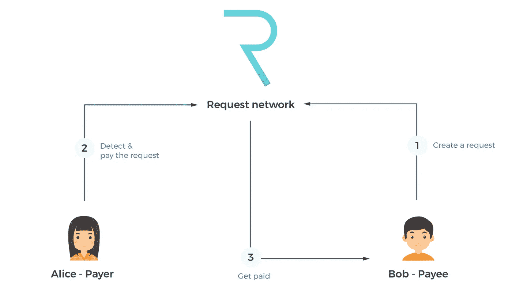

# 加密货币的现实应用——支付系统

> 原文：<https://medium.com/hackernoon/real-world-applications-of-cryptocurrencies-payment-systems-f69206586a7f>

加密货币有哪些现实应用？这些将如何影响我的日常生活？这是过去几周我在社交媒体和聚会上收到的一些问题。为了回答这些问题，我将创建一个系列，在其中我将讨论某些项目如何旨在颠覆和革新特定的行业。

# 支付系统—请求网络(REQ)

当前的金融支付系统有许多缺点。然而，现代生活已经发展到每天都使用它们的地步。当前系统的一些最重要的问题包括:

*   **个人信息安全** —为了使用当前的支付系统(PayPal、西联汇款等。)我们需要提供我们的个人信息(姓名、地址、信用卡详细信息等。).多年来，许多这样的金融机构遭受了[数据泄露](http://www.bbc.com/news/business-41192163)个人信息泄露。
*   **费用**——由于我们当前金融支付系统的集中性质，公司可以承担高额费用。例如，PayPal 向“卖家”[收取 2.9%外加每笔销售 0.30 美元](https://www.paypal.com/ag/selfhelp/article/what-are-the-fees-for-paypal-accounts-faq690)(在美国)，Visa 收取 1.43%至 2.4%之间的“交换费”。买家和卖家都受到了影响，因为产品需要更高的价格来支付这些费用。
*   **出售信息** —结合我之前关于个人信息的观点，这些集中的金融机构完全有权(根据他们的条款&条件)出售你的习惯和数据。

进入[**请求网(REQ)**](https://request.network/) ，在我之前的帖子里也有精选，[*2018 年 3 币看点*](https://blog.goodaudience.com/3-coins-to-watch-in-2018-890616de8d3b) ，这里可以找到[。](https://blog.goodaudience.com/3-coins-to-watch-in-2018-890616de8d3b)

> Request 是一个分散的网络，允许任何人请求付款(请求发票),接收者可以以安全的方式支付。所有信息都存储在分散的真实分类账中。这导致更便宜、更容易和更安全的支付，并且它允许大范围的自动化可能性。

REQ 旨在通过以下方式解决我们当前金融支付系统中发现的问题:

*   **安全** —请求不需要您共享您的银行信息，因此不存在恶意方截取和重复使用这些数据的风险。摘自 REQ 的白皮书:
    *例如，在亚马逊上购物需要通过信用卡/借记卡支付，从而暴露了敏感信息。或者，选择通过请求支付的选项，用户数据仍然受到保护。亚马逊会在网络上发布一个请求，用户的账户会检测到它，并要求用户确认支付。这将以最低的成本触发转账，而不会暴露支付信息。*

*   **便宜** —由于没有第三方参与，成本大大降低。平台上的预期成本将在交易的 0.05%至 0.5%之间。随着网络容量的增加，为了使 REQ 保持竞争力，成本将会降低。
*   **灵活**——它将允许以以太坊、比特币、ERC20 代币和法定货币支付。
*   **简单** —支付流程更安全，更人性化。*一键支付，无人工输入错误。*

## 如何使用 REQ 令牌？

为了在请求网络上进行交易，网关必须支付一笔费用(以请求令牌的形式)，这笔费用将在处理过程中被**烧掉**(或销毁)。这将确认交易成功。这些费用将随着时间的推移根据供应、支持货币的汇率等进行调整。然而，有一点要注意，你不一定需要[拥有 REQ 令牌；作为交易的一部分，将购买(并刻录)必要的数量。](https://blog.request.network/request-network-project-update-november-24th-2017-tech-ecosystem-request-core-kyber-network-b760637eba9b)

*例如，系统开始时的一个请求可能会消耗掉 100000000 REQ 总量中的 10 个 REQ。稍后，在系统使用一段时间后，一个请求可能会消耗 100 000 REQ 总供应量中的 0.0001REQ。*

REQ 不仅仅关注支付系统。它正在构建一个支付平台，其他人可以与它一起构建应用程序。此外，它甚至进一步尝试改善其他行业，包括，**发票**，**审计&会计**，**物联网**等等。我将在以后的博客文章中讨论这些。

你可以在[、币安](https://www.binance.com/?ref=10881502)、[以太三角洲](https://etherdelta.com/)和[库币](https://www.kucoin.com/#/?r=1caxM)上购买 REQ，但要获得提供 REQ check [的交易所的完整列表，请点击](https://coinmarketcap.com/currencies/request-network/#markets)。

可以在 Twitter[**@ ermos _ k**](https://twitter.com/ermos_k)关注我，了解最新博文。

 [## Ermos K (@ermos_k) | Twitter

### Ermos K 的最新推文(@ermos_k)。大约在 2012 年，加密货币爱好者

twitter.com](https://twitter.com/ermos_k) 

热葡萄酒过季了；你愿意给我买杯咖啡吗？请在此捐款以示支持:

**BTC**:395 jpxqaqlvyp 2 CP 4 uvmdbppartdkbfzk
**BCH**:181 fsplrfwvk 3 tpfmev 678 plrua 2 kpeofh
**LTC**:lgj w5 vjo 2 exxftqawuljvbrtqdiscxng 7 u
**ETH/REQ**:0x4c 7195 e 074 cf 0ab 6

免责声明:这篇博文中的所有信息和数据仅供参考。我对任何信息的准确性、完整性、适用性或有效性不做任何陈述。我将不对任何错误，遗漏，或任何损失，或因其展示或使用引起的损害负责。所有信息均按原样提供，不含任何担保，也不授予任何权利。