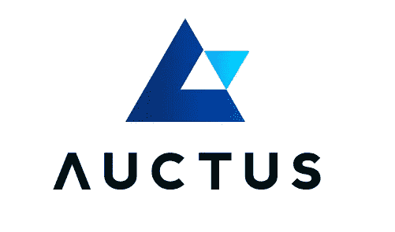
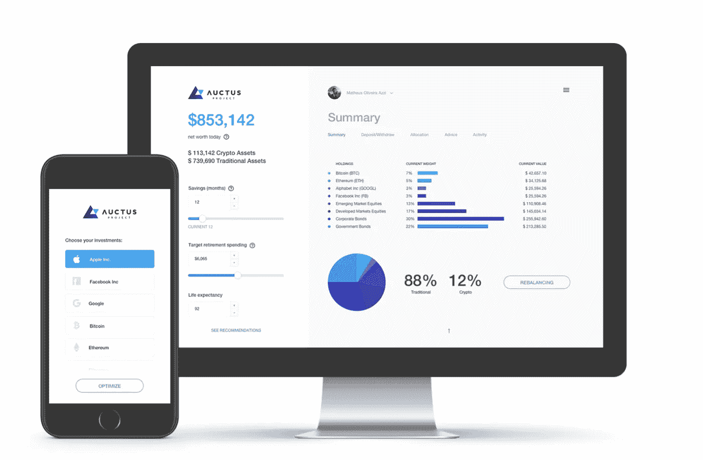
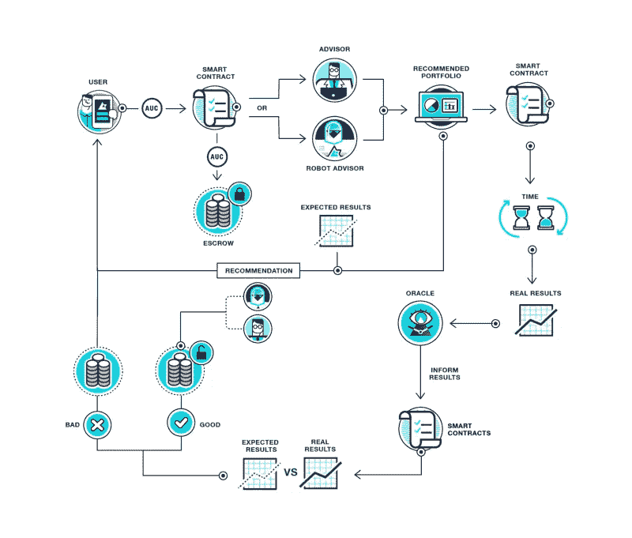

# 加密货币的现实应用——退休计划

> 原文：<https://medium.com/hackernoon/real-world-applications-of-cryptocurrencies-retirement-plans-d640a2c98ec3>

市场仍然存在不确定性，但这并不能改变加密货币将彻底改变众多行业的事实。作为我的系列文章“*加密货币的真实世界应用”*的一部分，也是我之前关于视频游戏虚拟商品的帖子的后续，你可以在这里找到，我将讨论退休计划将如何被区块链和加密货币的出现所打乱。

# 退休计划— [Auctus (AUC)](https://auctus.org/)

为了在退休后提供稳定的收入，大多数个人都要缴费来建立一个资金池。退休计划行业可能不是最有趣的行业，但它规模巨大——根据 2017 年威利斯沃森大厦[的报告](https://www.willistowerswatson.com/en/insights/2017/01/global-pensions-asset-study-2017)，全球机构养老基金在 22 个主要市场的资产估计为**36.4 万亿美元**。尽管这一市场非常巨大，但这一领域仍存在许多缺陷，包括:

*   **集中式** —会员的敏感个人和财务数据存储在集中式系统中。这增加了安全漏洞和数据操纵的风险。多年来，我们已经目睹了非常引人注目的[数据泄露](http://www.bbc.com/news/business-41192163)危及个人信息的事件。
*   **欺诈**—在过去几年里，该行业的欺诈活动是多么严重和频繁，我怎么强调都不为过。尽管受到严格监管，但无论是在发达国家还是发展中国家，仍有大量关于养老金诈骗的报道。就在最近，在英国，多达 245 人在成为一系列养老金骗局的受害者后，平均每人损失了 5.5 万英镑。英国广播公司有一篇关于它的信息文章。
*   **过时的基础设施**——尽管许多退休计划提供商已经存在多年，历史悠久，但大多数都缺乏创新和灵活性。在过去的几年里，人们的生活方式发生了变化。人们更频繁地更换雇主，更频繁地迁移管辖区；当前系统的设置无法适应这一点，即，轻松地将资金从一个提供商转移到另一个提供商。
*   **沟通不充分** —通常这是提供商和会员之间的主要摩擦点；成员只能获得不频繁的更新(即年度报告),很多时候缺乏透明度。这导致成员有一种无法控制自己退休储蓄的感觉。
*   **无/减少支出** —当前的集中系统具有很大的风险，可能导致支出减少或无支出。例如，2013 年，该国最大的两家银行持有 10 万欧元或以上的塞浦路斯银行账户被[“削发”47.5%。这直接影响了养老基金，因为他们的存款被征收，因此无法支付其成员。](https://www.rt.com/business/cyprus-crisis-bailout-deposit-631/)
*   **运营成本** —从上面的不充分沟通点展开，成员通常不知道所有涉及的成本。他们可能知道资产管理费，但还有更多他们不知道的(可能也没有被告知)。这些费用可能包括交易费用、管理和报告费用等等。这导致净投资回报减少，退休期间可分配的资金积累减少。

输入 [**Auctus (AUC)**](https://auctus.org/) 。

> Auctus 的使命是让退休储蓄者重新控制他们的退休计划，方法是提供一个全球投资平台，允许用户创建债券、股票和加密货币的优化投资组合，提供做出明智决策所需的信息，使用区块链提高透明度和自动化，并最终增加对所选退休计划的信任。

[**Auctus**](https://auctus.org/)**正在基于以太坊区块链打造全球首个退休计划平台。该平台允许退休储蓄者创建多样化的投资组合，包括传统的(令牌化的)资产类别和加密货币。利用各种来源(金融专家和机器人顾问)，它为退休储蓄者提供所有必要的信息，以便为他们的退休投资计划做出明智的决定。**

****

**该平台将提供专业化的投资组合管理服务。它还允许汇总所有退休储蓄(即包含 IRA/401k 计划、自愿传统退休计划、加密货币钱包等)。).通过将所有信息集中在一个地方，它允许退休储蓄者做出明智的决策并规划专业的长期战略。你可以在这里找到更多关于这个平台的细节。你也可以试一试，[这里](https://demo.auctus.org/)。**

**Auctus 旨在通过以下方式解决(并改进)之前讨论的问题:**

*   ****透明**——通过转移到以太坊区块链，该项目本质上变得更加透明，同时解决了许多问题。首先，金融专家建议投资组合分配和机器人顾问的预测将被永久记录，这使得它们易于访问和公开进行比较。其次，透明度的提高将让退休储蓄者确切知道所涉及的成本。**
*   ****治理**—由于一切都被编程到智能合同中，监管者和其他人可以轻松地进行审计，平台的参与者可以在决策过程中获得影响力*。***
*   ****安全性** — Auctus 将提供反欺诈免疫，因为区块链上的智能合同可以被审计，并且比当前手段更容易揭露欺诈活动。此外，由于其分散性，存储在区块链上的数据将比集中式数据库安全得多。**
*   ****全球社区驱动** —通过拥有一个全球平台，这将能够分享来自世界各地的产品和想法，同时仍然遵守当地的习俗或法律。不管你住在哪里，你都可以创建或购买工具和建议，而不需要任何中间人。**

**下面你可以找到一个来自 Auctus 团队的优秀短视频，给出了该项目的概述。**

## **AUC 令牌是如何使用的？**

****AUC** 代币将主要用于几个原因:**

*   ****访问和平台使用** —为了使用 Auctus 平台(即创建账户、开始为退休储蓄等。)用户将需要使用平台的智能合约托管持有一定数量的 AUC。**
*   ****平台货币** —来自人类专家和机器人顾问的定制建议(投资多少和资产分配)将使用 AUC 支付。此外，服务和工具(即视频咨询和平台插件)可以使用 AUC 进行协商。**

**下图显示了如何在平台上使用令牌。**

****

**Auctus 还没有推出他们的令牌。您只能在 3 月 27 日首次发行硬币(ICO)期间购买 Auctus 代币(AUC)。你可以在这里找到更多关于他们代币销售和注册 ICO 的信息。**

**如果你喜欢这篇文章并想看更多，请确保给这篇文章一个**掌声**，给我的博客一个**关注**。**

****

**您也可以通过向以下地址捐款来表达您的支持:**

****BTC**:395 jpxqaqlvyp 2 CP 4 uvmdbppartdkbfzk
**BCH**:181 fsplrfwvk 3 tpfmev 678 plrua 2 kpeofh
**LTC**:lgj w5 vjo 2 exxftqawuljvbrtqdiscxng 7 u
**ETH**:0x4c 7195 e 074 cf 0 ab 6 f 777**

**免责声明:这篇博文中的所有信息和数据仅供参考。我的观点是我自己的。我对任何信息的准确性、完整性、适用性或有效性不做任何陈述。我将不对任何错误，遗漏，或任何损失，或因其展示或使用引起的损害负责。所有信息均按原样提供，不含任何担保，也不授予任何权利。**