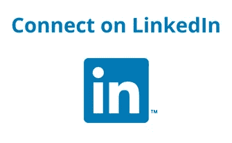

# 加密货币的现实应用——用户认证

> 原文：<https://medium.com/hackernoon/real-world-applications-of-cryptocurrencies-user-authentication-dc89c22f4756>

距离我上一篇**关于加密货币在现实世界中的应用**的帖子已经过去了近两个月，但它又回来了。继我上一篇关于艺术&收藏品&抄本协议的文章，你可以在这里找到，我将讨论**用户认证**将如何随着区块链和加密货币的出现而被打乱。

## 概观

**网络犯罪**是当今科技驱动世界的一个主要问题，而且只会越来越严重；这是美国增长最快的犯罪**。网络安全市场**正在**迅速扩张**，这完全是由网络犯罪的增加所推动的。根据一份网络安全风险投资[报告](https://cybersecurityventures.com/cybersecurity-market-report/)，网络安全行业在 2004 年至 2017 年间增长了超过 **350%** 。随着政府和机构在网络安全上投入了数十亿美元，信息技术在短短十年间从 35 亿美元增长到 1200 亿美元。****

**该报告还指出网络犯罪将如何在 2021 年给世界带来**6 万亿美元的损失，比 2015 年**3 万亿美元的数字**增加了**200%**。更深入地挖掘数字，在最近的一项调查中，英国政府报告说，仅在去年**就有超过 43%的企业*“经历了网络安全漏洞或攻击***。****

## **问题是**

**如前所述，政府和公司在网络安全上花费了数十亿美元。网络攻击可以有多种形式，但在这篇文章中，我将重点关注**用户认证攻击**。这些包括(定义取自 techopedia 和 rapid7):**

*   **[**暴力和字典攻击**](https://www.rapid7.com/fundamentals/brute-force-and-dictionary-attacks/)**——攻击者试图通过系统地检查和尝试所有可能的密码和密码短语来登录用户的帐户，直到找到正确的密码。****
*   ****[**域欺骗**](https://www.techopedia.com/definition/4048/pharming) —通过黑客攻击重定向网站流量，黑客利用这些工具将搜索重定向到虚假网站。****
*   ****[**网络钓鱼**](https://www.techopedia.com/definition/4049/phishing)**——**是一种获取隐私和敏感信息的欺诈行为，如信用卡号、个人身份以及帐户用户名和密码。网络钓鱼网站使用一套复杂的社会工程技术和计算机编程专业知识，诱使电子邮件收件人和网络用户相信假冒网站是合法和真实的。********
*   ********恶意浏览器插件** — 通过提供浏览器插件拦截敏感信息(如密码和 cookies)的行为。******
*   ****[**中间人攻击**(**MITM**)](https://www.rapid7.com/fundamentals/man-in-the-middle-attacks/)**——**允许攻击者窃听两个目标之间的通信。这种攻击发生在两台合法通信的主机之间，使得攻击者能够“监听”他们通常无法监听的对话。********
*   ******[**社会工程攻击**](https://www.techopedia.com/definition/4115/social-engineering) —信息安全的非技术性破解。它实施欺骗的唯一目的是收集信息、欺诈或系统访问。******

****目前，**用户名&密码**是认证用户的主要方式。可惜，由于人性使然，基于密码的认证**极其薄弱**。人类不擅长创建有效的密码，并且经常选择容易获得的密码。有时，当人们确实创建了有效的密码时，这些密码通常被写在一张纸上或一个电子文档上，使得它们的安全性大大降低。此外，密码可能会在多次登录时重复使用**或很少更改。******

****为了让你知道这个问题有多严重，[威瑞森 2016 年数据泄露调查报告](http://www.verizonenterprise.com/verizon-insights-lab/dbir/2016/)发现 **63%的已确认数据泄露涉及弱密码、默认密码或被盗密码**。****

****为了解决这个问题，**多因子** **认证** ( **MFA** )已经在很多地方推出。 **MFA** 是你需要**使用**附加‘因素】**确认你的身份**的过程(使用手机上的一个 app，通过短信的一个代码等。).不幸的是，这种二级安全措施[也不是简单的](https://www.economist.com/the-economist-explains/2017/09/13/where-are-the-flaws-in-two-factor-authentication)，因为即使启用了 **MFA** 也有很多账户被入侵的案例。****

**2FA 的替代方案是基于认证的**认证**，其中用户通过**交换数字证书**而不是用户名和密码来获得安全授权。这解决了用户名&密码认证的一些问题(如网络钓鱼，MITM ),但不是一切。**

**基于证书的认证是使用集中式公钥基础设施( **PKI** )构建的。PKI 的支柱是**数字证书**(只能由中央权威机构颁发)，用于将[公钥](https://searchsecurity.techtarget.com/definition/public-key)的所有权与拥有它的实体加密链接。这提供了更强的安全性(但不是傻瓜证明),因为受信任的部分通过安全通道相互认证客户端和服务器。不幸的是，这些证书都是**集中管理**和**容易受到网络攻击**。你可以在[这里](https://searchsecurity.techtarget.com/definition/digital-certificate)找到更多关于数字证书和 PKI 的信息。**

**总结这一节，现在用户认证有两个主要问题；密码的**弱点**和 **PKI 的集中实例**。**

## **这个提议**

**在研究这个特殊问题时，我注意到了这个问题。**

****

> **REMME 是一种利用开源协议的解决方案，同时利用区块链来取代传统的集中式公钥基础设施实例(如认证机构、注册机构、轻量级访问目录协议等)。).这是通过建立在 Hyperledger 锯齿之上的区块链信任网络实现的。**

**更简单地说， **REMME** 利用区块链，通过消除对密码的需求，提供更安全地登录任何服务(实现 **REMME** 的服务)的能力。**

****REMME** 是由 **Alex Momot** 和 **Kate Pospelova** 于 **2015** 推出的乌克兰公司，是 2017 年微软区块链激励奖[获得者](/remme/the-hackathon-we-won-5e9fe6a67189)。2017 年 10 月， **REMME** 推出了一个**试点项目**，面向寻求尝试其生态系统的公司。从那以后，它吸引了来自各行各业的近 300 家全球企业的兴趣，包括 Ukrinmash、Infopulse、Hotmine、Constitutional Health 和 Changelly。**

## **它是如何工作的**

**简单地说， **REMME** 正在创建一个**分布式 P**public**K**ey**I**n infra structure(**PKId**)，区块链充当**中央权威**。**

**REMME 将为用户提供生成/撤销他们自己的证书的能力。一旦生成了这些，节点将需要验证事务。在验证时，证书的唯一标识符(它的散列)、它的状态(它是被颁发还是被撤销)、公钥和到期日期都存储在区块链上。这实际上创建了一个**不可变记录来验证认证**所需的证书。**

**当用户希望进行身份验证时，他们只需简单地点击**按钮**即可。然后，将在区块链上执行检查，以验证设备的证书是否正确，一旦验证通过，即允许进入。**

****

**您可能想知道如果这个设备丢失或被盗会发生什么？REMME 团队提供了一个很好的解释，在这个场景中会发生什么，[这里](https://support.remme.io/hc/en-us/articles/360004951553-What-if-the-device-with-the-digital-certificate-is-stolen-)。**

**为了补充他们的协议， **REMME** 团队正在构建大量的 **D** 去中心化 **A** 应用程序(**dapp**)，包括:**

*   ****REMME WebAuth** —一种白标认证系统，允许用户无需密码即可登录服务。您可以尝试 WebAuth 演示，这里[这里](https://webauth.remme.io/)，详细介绍如何操作，这里[这里](/remme/remme-bi-weekly-update-5-11c057cb0658)。**
*   ****REMME Enterprise** —利用 X.509 自签名证书在设备级别进行身份验证和安全用户访问，无需用户名&密码，安全访问内部企业系统。**
*   ****REMME for IoT** —设备间通信授权**

**此外， **REMME** 正在创建一个 **SDK** ，它让开发者能够在 **REMME 区块链**上创建他们自己的 dApps。**

**事实上， **REMME** 刚刚在他们的 [**testnet**](https://remme.io/remchain) 上推出了他们解决方案的一部分。这包括以下内容:**

*   **REMChain 由 5 个主节点组成(用于维护测试网)**
*   **REMChain 块资源管理器 dApp**
*   **REMChain 节点监控 dApp**
*   **REMME WebAuth 演示 dApp**

**你可以找到更多关于上面的信息和他们的 **testnet** 发布，[这里](https://docs.remme.io/remme-core/docs/)。**

**事实上， **REMME 的** **testnet** 包含了数字证书完整生命周期的所有必要功能。REMME 邀请开发人员探索该技术如何工作，并通过在协议上实现他们自己的想法来称赞已经存在的用例。**

**REMME 团队制作了一个精彩的视频，展示了这一切是如何结合在一起的，你可以在下面找到。**

**为了跟上他们的最新发展，一定要访问他们的[网站](https://remme.io)并加入他们的[社区](https://remme.io/community)。如果你想更深入地了解他们的技术，一定要访问他们的博客。**

## **解决方案**

**通过引入**PKI id**和一套**dapp**来适应它， **REMME** 正在一举两得——用户名&密码的弱点和当今 PKI 的集中化本质。It 处于解决上述问题(并对其进行改进)的首要位置，方法如下:**

*   ****更好的凭证存储—** 通过利用区块链， **REMME 不再需要集中存储**，使得用户凭证几乎不可能泄露。**
*   ****降低成本** —随着政府、公司和个人花费越来越多的钱来保护他们的系统和流程， **REMME** 消除了大部分此类需求，从而降低了成本。**
*   ****去除人为因素** —人为因素是网络安全链中最薄弱的环节(钓鱼、常用密码等)。)并通过将其从等式中移除，显著提高了安全性。**
*   ****更强的保护——REMME**消除了网络安全的薄弱环节；最明显的是密码和集中式 PKI，它们是网络安全中最脆弱的部分。**

**你可以在这里找到一份可以防御的网络攻击的完整列表。**

## **如何使用 Remme (REM)令牌？**

**REM 将是生态系统中所有操作的中心，并将作为一个实用工具令牌来访问 PKI 和构建在它之上的 dApps。 **REM** 可以通过以下方式使用:**

*   ****证书生成—** 希望使用 REMME 的产品将**支付 REM** 至**为其客户、员工、合作伙伴等生成证书**。**
*   ****dApp 创建** — **开发**和**在 REMME 协议之上发布**dApp 将需要 **REM** 。**
*   ****staked**—**REM**可以“冻结”( [**staked**](https://www.hashtaginvesting.com/blog/what-is-crypto-staking) )以便设置一个 [**masternode**](https://www.investopedia.com/terms/m/master-node-cryptocurrency.asp) (需要 25 万 REM)。一旦下注(并获得批准)，主节点*“有机会(如果共识算法选择它们)签署大宗交易并获得奖励”*。你可以在这里找到更多关于 REMME 主节点的信息。**

# **这个帖子值得多少掌声？跟着来怎么样？**

**如果你喜欢这篇文章，请随意👏**拍手**👏很多次(你知道你想！)，给我的博客一个👣跟随👣**和**🤲**分享**🤲和你的朋友在一起。有一个限制👏50 次鼓掌👏你可以给每个职位，所以我劝你不要试图超过这个限度…你可能会打破中等！**

****

# **说到这个…**

**如果你仍然关注我，请留下评论，让我知道你还想看到我写些什么。你可以找到我的社交媒体的链接，并在下面注册我的时事通讯。**

**********************

contact@ermos.io** 

**也可以捐款到以下地址以示支持:
**ETH**:[0x4c 7195 e 074 cf 0 ab 6 f 77 BDB 7 c 97 FD 2567066 bb 712](https://goo.gl/H8xSTn)**

**免责声明:这篇博文中的所有信息和数据仅供参考。我的观点是我自己的。我不提供个人投资建议，我也不是合格的持牌投资顾问。我对任何信息的准确性、完整性、适用性或有效性不做任何陈述。我将不对任何错误，遗漏，或任何损失，或因其展示或使用引起的损害负责。所有信息均按原样提供，不提供任何担保，也不授予任何权利。**