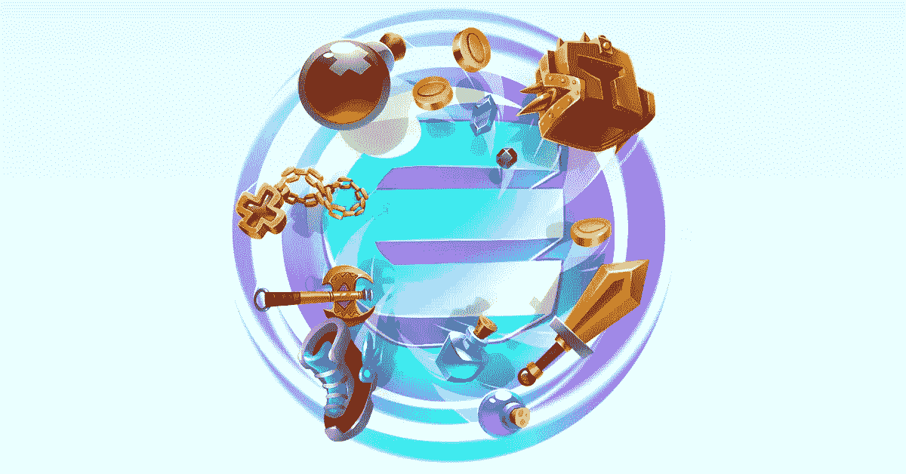
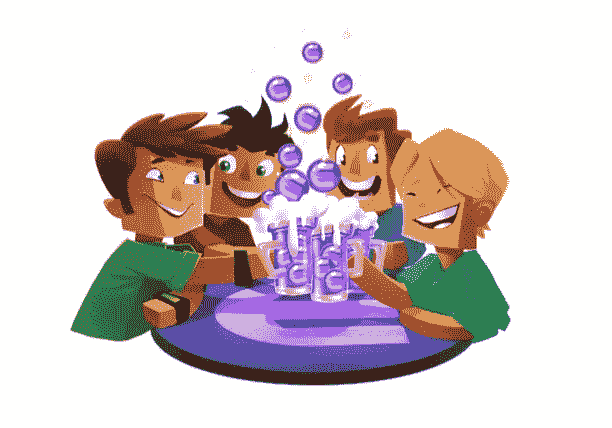

# 加密货币的现实应用——视频游戏虚拟商品

> 原文：<https://medium.com/hackernoon/real-world-applications-of-cryptocurrencies-video-game-virtual-goods-f721d39c0cce>

尽管市场目前处于动荡之中，但重要的是退后一步，记住加密货币及其背后的技术将如何改变世界。作为我的系列文章“*加密货币的真实世界应用”*的一部分，也是我上一篇关于食品可追溯性的文章的后续，你可以在这里找到，我将讨论视频游戏虚拟商品行业(从游戏玩家的角度)将如何被区块链和加密货币的出现所颠覆。

# 电子游戏虚拟物品— [金恩币](https://enjincoin.io/) (ENJ)

视频游戏行业非常庞大——消费者花在玩视频游戏上的时间比以往任何时候都多，这导致了市场的爆炸性增长。据 [NewsZoo 的全球游戏玩家市场报告](https://newzoo.com/solutions/standard/market-forecasts/global-games-market-report/)显示，目前全球有 22 亿活跃游戏玩家，其中 10 亿人在玩的时候花钱。如今，全球视频游戏产业价值约 1089 亿美元，预计到 2020 年将达到 1285 亿美元。这种增长是非凡的，然而，在视频游戏虚拟商品领域也有缺点，包括:

*   **所有权** — 购买虚拟物品时，游戏玩家实际上并不“拥有”它们。他们仅仅是购买一个“许可证”,通常只能在游戏发行商的专有平台上使用。如果一个玩家被禁止玩游戏，他可能会失去他们所有的商品和货币——他们并没有真正拥有他们所拥有的。想象一下，有一个价值 5000 美元的魔兽世界账号被封禁，不管是你自己的错，误解还是外部黑客造成的；你会失去一切。
*   **集中化** —虚拟物品通常绑定在一个游戏上，不可转让。例如，不可能用 Dota 2 物品换取看守角色皮肤。也有例外，即 Valve 让你可以用 CS:GO 的物品换 Dota 2 的物品，但这种情况很少见。此外，游戏之外的交易几乎不存在或者非常麻烦，这意味着所有交易都需要在游戏中进行。
*   **支付费用和速度**—游戏发行商/社区依靠第三方支付提供商来销售虚拟商品。例如，PayPal 收取 [2.9%的费用，外加每笔交易 0.30 美元](https://www.paypal.com/ag/selfhelp/article/what-are-the-fees-for-paypal-accounts-faq690)(在美国)，Visa 收取 1.43%至 2.4%之间的费用。游戏玩家和出版商/社区都受到了影响，因为虚拟商品需要更高的价格来支付这些费用。此外，这个过程通常很慢，虚拟物品需要几分钟才能出现在“游戏账户”上。

进入 [**金恩币**](https://enjincoin.io/)**【ENJ】**。

> 金恩推出了*金恩币*(“ENJ”)，这是一种新的 ERC20 令牌，为社区、内容创作者、游戏服务器和游戏发行商提供了一种简单的解决方案，用于在他们的游戏和社区中实现虚拟商品和真实价值。金恩将开发一个强大的框架，包括开源软件开发包(SDK)、钱包、游戏插件、虚拟物品管理应用和支付网关平台。

[**金恩**](https://www.enjin.com/) 是一家成立于 2009 年的新加坡知名公司。它是最大的游戏社区创建平台，拥有 1870 万注册玩家和 250，000 个游戏社区，涵盖数千种游戏。It 处于解决上述问题(并对其进行改进)的首要位置，方法如下:

*   **最低费用**—不需要昂贵的第三方支付处理器(例如 PayPal、Visa、Stripe 等)。)了。因为 ENJ 是建立在以太网之上的，所以唯一需要支付的费用是网络费用，与现在的费用相比是微不足道的。
*   所有权的证明——由于区块链是一个不可变的分类账，虚拟物品所有权的证明是微不足道的。此外，您不再“许可”数字资产，而是实际拥有它。即使你的帐户被禁用，你仍然拥有可以交易或出售的虚拟物品。
*   单一货币——你需要在 5 个不同的游戏系统中存钱来为各自的游戏购买商品的日子已经一去不复返了。ENJ 将作为跨游戏购买商品所需的单一货币。作为一名游戏玩家，我期待着有一天我可以用同样的货币(ENJ)购买炉石卡包、使命召唤武器和国际足联球员包。
*   **跨游戏交易**——ENJ 将允许不同游戏间的虚拟物品交易。想象一下，你可以用“旧的”尘封的命运物品来换取新发布的怪物猎人中的物品。
*   **赢得 ENJ**——ENJ 将为游戏发行商和社区提供轻松奖励玩家(真实价值)的能力。要么仅仅通过玩游戏，在论坛上投稿，获得成就，可能性是无穷无尽的。
*   **物品的真实价值**——通过将虚拟物品与 ENJ 挂钩，你实际上给它们附加了真实价值。玩家将能够出售他们的物品，并立即获得他们的 ENJ 作为回报。目前，以“真实价值”出售你的物品几乎是不可能的——游戏发行商通常会给予专有硬币作为回报，或者锁定他们生态系统的法令。

如前所述，这篇文章关注的是一个游戏玩家的视角。金恩提供的远不止这些——它还为游戏发行商、内容创作者和社区带来了许多好处。你可以在他们的[白皮书](https://enjincoin.io/enjincoin_whitepaper.pdf)中了解更多。

## 如何使用 ENJ 代币？

对于游戏玩家来说，ENJ 令牌的使用非常简单。它是多个 ENJ 实现的游戏之间的通用货币。它还将提供虚拟商品和数字资产的便携性和可转让性。

你可以在[币安](https://www.binance.com/?ref=10881502)、 [KuCoin](https://www.kucoin.com/#/?r=1caxM) 和 [COSS](https://sso.coss.io/api/invite/UG924F1RQ2) 上购买 ENJ，但要获得提供 ENJ 的交易所的完整列表，你可以查看这里的。

如果你喜欢这篇文章并想看更多，请确保给这篇文章一个**掌声**并关注我的博客。

您也可以通过向以下地址捐款来表达您的支持:

**BTC**:395 jpxqaqlvyp 2 CP 4 uvmdbppartdkbfzk
**BCH**:181 fsplrfwvk 3 tpfmev 678 plrua 2 kpeofh
**LTC**:lgj w5 vjo 2 exxftqawuljvbrtqdiscxng 7 u
**ETH/ENJ**:0x4c 7195 e 074 cf 0 ab 6

免责声明:这篇博文中的所有信息和数据仅供参考。我的观点是我自己的。我对任何信息的准确性、完整性、适用性或有效性不做任何陈述。我将不对任何错误，遗漏，或任何损失，或因其展示或使用引起的损害负责。所有信息均按原样提供，不含任何担保，也不授予任何权利。