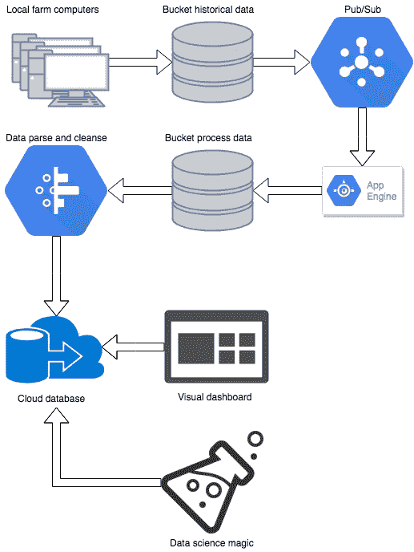

# 用谷歌云平台处理真实世界的数据

> 原文：<https://medium.com/hackernoon/real-world-data-processing-with-google-cloud-platform-eb5298b661ff>

## 我如何使用谷歌云平台和很少的钱，建立了一个从最终用户的遗留软件到现代云基础设施的数据管道

# 介绍

我的名字叫 Ido，我在科技行业已经有一段时间了。我的最新项目旨在将一些现代云和数据技术引入农业领域。我从一个足够简单的目标开始:将数据从现在的(过时的)农场管理软件交付到云中。在那里，我们可以进行高级分析，并帮助农民更好地管理他们的农场。

我的预算非常低，没有外部投资者或任何闲钱。此外，由于只有我在这个项目上工作，我需要尽可能保持任何解决方案简单，并注意不要在不必要的优化/功能上浪费时间。

为了满足这些需求，我使用了谷歌云平台的工具集。我发现他们有很好的数据处理和分析方法。此外，他们真的相信托管服务，这应该可以节省我很多时间。他们确实有一些缺点，我也会详细说明。

说到真正的东西…

# 高级描述

这就是我们在这个项目中要做的:

*   数据文件收集在每个场的本地计算机上。计算机连接到互联网，文件存储在本地。csv 格式。
*   将这些文件发送到云端。
*   在(深度)解析和清理之后，将这些文件的内容写入基于云的数据库。
*   在一个移动友好的网页上可视化和显示汇总的数据。
*   让数据可用于进一步的分析，以及我们可能想要对其应用的任何数据科学魔法。

# 体系结构

我将从描述数据从农场到最终目标的完整流程的图表开始(无论是仪表盘还是数据科学的东西)。接下来，我将描述每个阶段以及如何在 google cloud 上实现:

Data pipeline architecture diagram

1.  本地计算机到云存储:本地。csv 文件上传到 Google 云存储，一个普通的云对象存储。每天做一次，相当简单。
2.  发布/订阅作业:一个发布/订阅主题为每个新上传的 Google 存储对象获取一个作业。使用 google 的 CLI 工具很容易进行配置。您可以只为队列指定一个路径前缀，以及每次创建新文件时将调用的 HTTP 端点。当然，google Pub/Sub 本身是受管理的，并且可以无限扩展。我确实遇到了一些(自己造成的)麻烦:在我第一次使用时，我没有指定路径前缀，并且在我触发的 HTTP 端点上，我将上传的文件复制到一个新位置。这当然触发了一个新的作业，以此类推，造成了一个无限循环。哎呀。
    另一件事是，你必须确保向 PubSub 服务返回状态 200 OK，否则 is 会不断用请求轰炸你。这是你从该服务获得“至少递送一次”承诺的一部分。
3.  App Engine:这是我实现 HTTP 端点的地方。它根据新数据文件的类型将新数据文件复制到另一个云存储桶中。csv 文件可以上传)和来源(它来自哪个场)。我使用 python 语言来实现。我发现 App Engine 对于简单的工作来说是一个有趣的解决方案。它比真正的服务器更容易设置，但是有很多陷阱，如果你不小心的话，可能会花费很多时间。我将快速回顾一些要点:
    ——有两种应用引擎环境:标准和灵活。基本上，standard 就像你正在使用的编程语言的沙盒版本，但是它应该更容易部署(实际上并不容易)。我看到的最大区别:灵活环境比标准贵很多。
    -当使用标准环境与其他谷歌云服务交互，并在本地运行您的程序时，标准环境将在您的本地机器上与“模拟”服务一起工作。当我使用 google 的 Datastore 服务(一个托管的云数据库)时，我期望看到来自我的本地环境的变化反映在云数据库中，但是它却反映在一个很难找到的本地模拟中。
    -日志和版本控制以及许多其他东西都是现成的，我不得不说这非常方便。
4.  数据解析和清理:我在一个新的很酷的工具 Google Dataprep 上做了这个。它对于解析和清理数据非常有用和简单，我将在下一节介绍它(推荐[工具](https://hackernoon.com/tagged/tools))。它有一个 Google [BigQuery](https://hackernoon.com/tagged/bigquery) 的本地写机制，这是下一个。
5.  写 cloud DB:我用 Google 的 BigQuery 作为我的 cloud DB。这是一个非常棒的工具，提供非常快速的数据查询。请参阅推荐工具部分的更多信息。
6.  可视化数据:我使用了 google 的 Data Studio 来连接 BigQuery 并可视化数据。这是一个相当新的商业智能工具。与经典 BI 工具(Tableau、QlikView 等)相比，它非常精简。)，而且还很干净直观。它仍处于测试阶段，肯定会有许多小错误和恼人的陷阱。成为一个简单的工具也很好:它非常容易学习和使用，并且看起来非常好和清晰。它还具有到 BigQuery 的本机和直接连接器，并且与 big query 集成得非常好。数据显示速度快，并且非常容易配置。
7.  研究数据:我没有做过很多，但这是很小的一步。谷歌提供直接连接到 BigQuery 的托管 Jupiter 笔记本，用于研究数据，并创建生产机器学习模型。

# 推荐工具

1.  Dataprep:“一种智能云数据服务，用于可视化地探索、清理和准备数据以供分析。”(来自产品页面)。它基本上是一个基于 UI 的解析和清理工具，并且在这方面做得非常好。您可以使用非常全面的 UI 来定义解析和清理。它节省了我大量的时间来编写正则表达式，对不同类型的编码应用规则，删除空行等等。更多优点:它与云存储和 BigQuery 集成得很好，它有一个方便的作业调度机制，它看起来很棒。最糟糕的是(对某些人来说这可能是一个优势):它以非常大的开销运行在 UI 上创建的解析和清理工作。我认为发生这种情况是因为它针对的是比我正在使用的大得多的规模数据(我不会在这里深入讨论任何细节)，但底线是即使最小的解析工作也需要大约 5 分钟。因为这个原因，我考虑过离开它，但是它的可用性和与其他服务的集成是如此之好，以至于我坚持使用它。
2.  BigQuery:云托管(和管理)的分析数据库。它是关系型的，与谷歌的其他服务整合得非常好。此外，大多数商业智能和机器学习工具都有很好的集成，因为它已经成为非常受欢迎的工具。它有一个很好的基于 web 的用户界面来查询和理解数据。不需要设置索引(应该在每一列上都建立索引)。
    我真的很喜欢使用它，发现它有很多优点。我用过的大多数查询都很快返回了结果。然而，在他们不这样做的奇怪情况下，这有点难以优化，因为许多数据库细节被抽象掉了。

# 账单/成本

账单非常合理，尽管我的客户群仍然相对较小(我有几十个与之合作的农场)。环境的整个测试和设置都在免费层中，所以在发布之前不需要承诺任何费用。
目前，我以每月 10-15 美元的成本支持着数十个农场。这一成本的很大一部分可以“优化掉”，但正如前面提到的，我尽量避免过早优化。

# 结论

谷歌云平台帮助我快速有效地启动并运行了这个项目。他们的托管服务方法非常适合这些目的。他们的所有服务配合得非常好，为 web 应用程序开发和数据管道提供了完整的端到端解决方案。尽管如此，它也有好的一面。文档并不总是足够全面，而且仅仅搜索解决方案并不能很好地工作，因为许多服务都是新的，还不是那么常见。此外，托管服务中的问题更难解决，因为许多细节都被抽象掉了。
我省略了所有技术核心细节，但可以肯定的是，我面临许多陷阱和挑剔。请随意留下评论和问题，如果您对任何特定的东西感兴趣，我可以深入研究我使用过的许多工具。