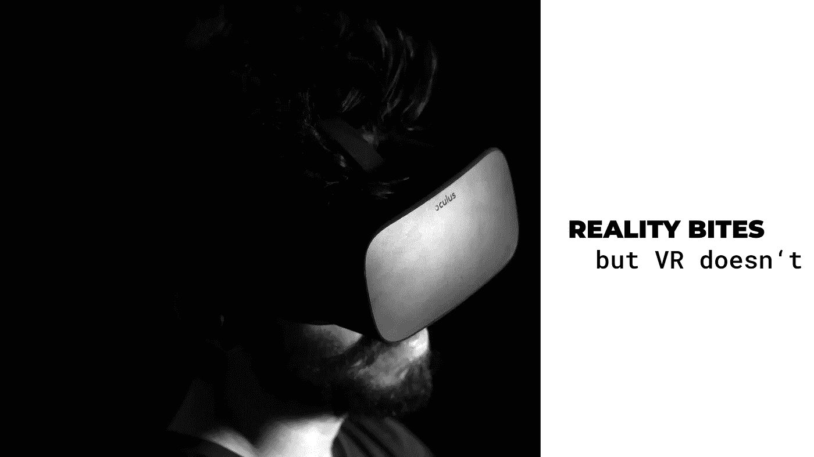

# 现实会咬人，但 VR 不会。

> 原文：<https://medium.com/hackernoon/reality-bites-but-vr-doesnt-be441a74ab15>

*奥尔加·格里尼纳*

看来 2018 年注定是 VR 和 ar 如火如荼的一年。目前，很明显这个行业还处于起步阶段，缺乏高质量的内容和应用程序以及昂贵的批量设备。从荒谬的 G.W. Bush 浴缸体验到合法的使用案例，如手术模拟，这个行业似乎在折腾。当微软、谷歌和 HTC 正在推动昂贵的虚拟现实耳机和新的虚拟现实产品时，技术观察家们正在猜测斯皮尔伯格的新电影[“Ready Player One”](https://www.youtube.com/watch?v=cSp1dM2Vj48)将在现实世界中推动虚拟现实。在技术发展的轨迹上，我们现在尽可能地接近曾经想象的“黑客帝国”和“创”的世界。随着谷歌和脸书为虚拟现实开发者创建他们的平台，创建虚拟现实变得越来越容易，将它从娱乐业推向医疗保健、电子商务和许多其他领域。

然而，一旦利用虚拟现实即将产生的影响，远远超过满足魔兽争霸 2 粉丝的渴望。在全球经济范围内，随着虚拟世界和市场的日益普及，*我们可能正在见证一个全新经济范式的诞生。*我们在这里谈论的不亚于后工业经济时代的精髓——虚拟经济空间，在虚拟市场购买的商品和服务可能会部分取代实体经济部门。

人们花费大量时间和金钱的 VR 沉浸式体验似乎有很好的市场潜力，因为它们具有超级可扩展性，能够无限地产生新的用例。更重要的是，由于有大量的游戏爱好者，几乎不可能找到一个更有成效的土壤来建立一个新的经济生态系统，在这里虚拟商品和服务就像在现实世界中一样进行交换。对企业和社区来说，数字商品的危险在于，这些虚拟世界的所有者完全控制了他们的商业活动。我们在这里谈论的是一种全新的垄断类型——一种独立于政府监管和经济波动的普遍分散体系。

尽管看起来像是未来科技，但虚拟世界作为一种新型的社会企业，在商业实践中提供了巨大的潜力。它们现在将会大量涌现，一点一点地填满还空着的虚拟空间——所以可能是时候分一杯羹了。