# ReasonML 和 NEM 区块链；我们去买面包吧🥖😎

> 原文：<https://medium.com/hackernoon/reasonml-and-nem-blockchain-crashcourse-8c8b540ed522>

## NEM 区块链入门结合 ReasonML 速成班

本文解释了 NEM2-SDK 与 ReasonML 以及 NEM2-CLI 的基本用法。

# 介绍

我们将通过设置 **NEM 弹射器**服务到*弹射器*我们的[区块链](https://hackernoon.com/tagged/blockchain)工作流，然后我们将使用 **NEM SDK** 为 [javascript](https://hackernoon.com/tagged/javascript) 与区块链本身交互，但是为了更酷**我们将使用 **ReasonML** 编写我们的示例。**

**ReasonML 本质上是 OCaml 编程语言的一种语法，它附带了一系列有用的工具，允许我们将其编译成 Javascript。**

**NEM 是一种相对较新的区块链技术，它可以轻松处理多重签名事务，并且有一个很棒的开发工具。**

## **先决条件**

**本文假设你对入门级的 [Docker](https://www.docker.com) 、 [Javascript](https://developer.mozilla.org/bm/docs/Web/JavaScript) 、Git 和区块链*(例如以太坊、Tezos、…)* 比较熟悉。**

# **入门指南**

**首先，让我们看一下我们将使用的技术:**

*   **[NEM 区块链](https://nemtech.github.io/getting-started/what-is-nem.html)是一个平台，旨在通过提供一个非常非常好的💆‍♀️开发者开箱即用的体验。它支持私有/公共链、智能资产交易和多签名交易。**
*   **是一个语法和工具箱，由 OCaml 提供支持，面向 Javascript 开发者。**

**我们将首先安装 NEM 弹射器堆栈。我们主要对这两部分感兴趣:**

*   ****投石车服务器节点** *(区块链节点)；这一层处理 P2P 的🧙‍♂️区块链魔术*🔮**
*   ****弹射休息节点** *(API 层)；这一层为我们(开发者)提供了一个与 NEM 集成的简单方法*💻**

## **1.安装弹射器**

**首先克隆 catapult-service-bootstrap 存储库，然后使用下面的命令组合所有 docker 服务。**

> **对于那些不熟悉 docker 或 git 的人来说，我们正在从远程存储库复制一堆代码，然后使用 docker 的“虚拟机”启动所提供的服务。**

**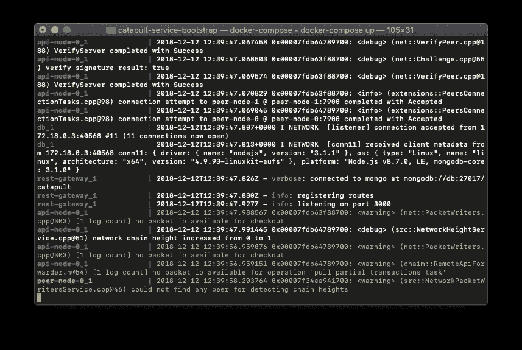**

**Once the NEM stack is running, your terminal output should look something like this.**

**下一步是验证我们的 Rest 和区块链节点正在运行。可以通过查询 Catapult Rest 提供的 REST API 来实现，如下所示。**

**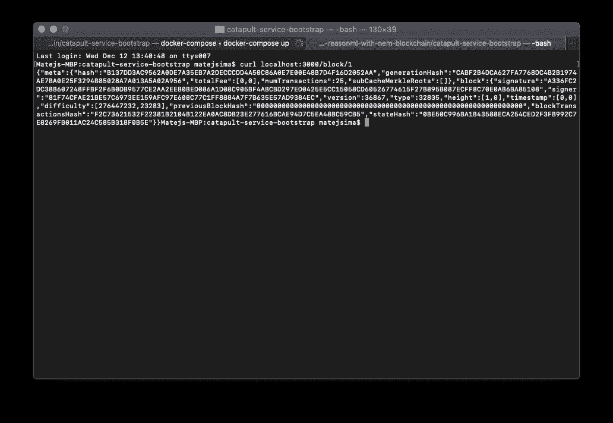**

**If everything went as expected, you’ll see a JSON reply similar to the one above.**

**您已经在您的机器上成功安装了 NEM 区块链和 REST 节点！😎**

## **2.设置理性/ NEM 环境**

**为了开发我们的区块链与 Catapult REST 的集成，我们将使用 NEM SDK。**

**首先创建适当的文件夹结构:**

> **下面的命令是在我们在步骤 1 中创建的“git 克隆”目录之外执行的**

**Create our file structure**

> **我们需要一个环境来编译我们的推理脚本。使用安装了 bs-platform (ReasonML 工具)的基于节点的 docker 映像。点击[这里](https://reasonml.github.io/docs/en/installation)了解 bs-platform a.k.a. bucklescript 编译器在这里起什么作用。**

**Contents of the Dockerfile created previously**

> **下一步是建立我们的 docker 映像，这样我们就可以使用我们的推理环境。**

**Build our image, so we can use it in run-in-docker.sh**

> **我们将使用 run-in-docker.sh 来提供一个安装了 ReasonML 的交互式 shell。**

**Tiny utility script, that allows us to run a reason-able 😎 shell, on top of our files.**

**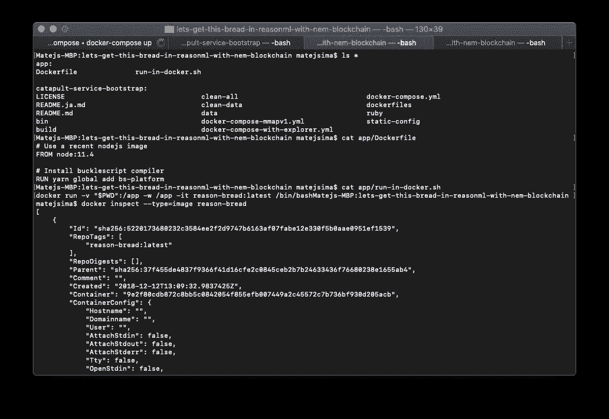**

**Result of the commands above. Dockerfile, run-in-docker.sh created with appropriate content, and reason-bread image available.**

**恭喜你，你现在已经准备好与 NEM 区块链交流了，通过用 ReasonML 编写的脚本——所有你需要编译和运行 ReasonML 脚本的事情，都发生在我们刚刚构建的 docker 映像中。**

## **3.原因项目设置**

**到目前为止一切顺利，我们已经建立了坚实的基础。NEM·区块链和 REST 节点正在运行，我们有一个 docker-image 和一个小助手脚本来运行 ReasonML 代码。**

**下一步是构建/产生一个原因项目。**

****

**Our interactive /bin/bash instance, with bucklescript available should look like this.**

**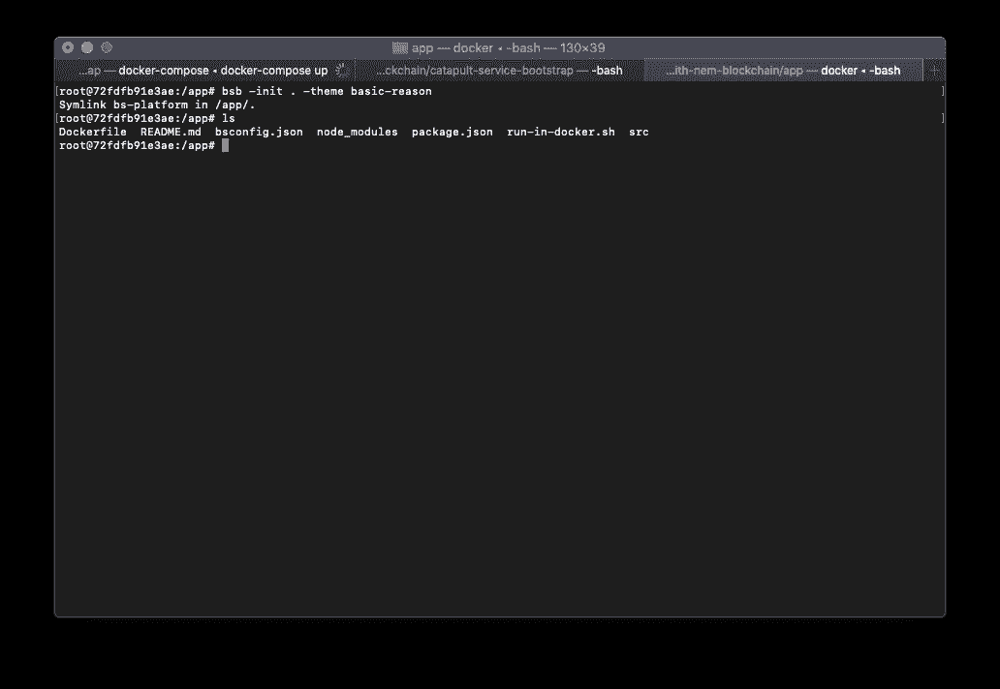**

**Yay, project generated successfully.**

> **为了确认我们的项目已经按预期生成，让我们编译并执行我们生成的演示脚本。**

> **请随意使用您选择的代码编辑器，我通常选择使用 vscode。我们的 docker 映像从我们可以从“真正的计算机”访问的同一个文件系统中获取/装载文件。要了解更多信息，请点击[这里](http://docker volumes windows path)。**

**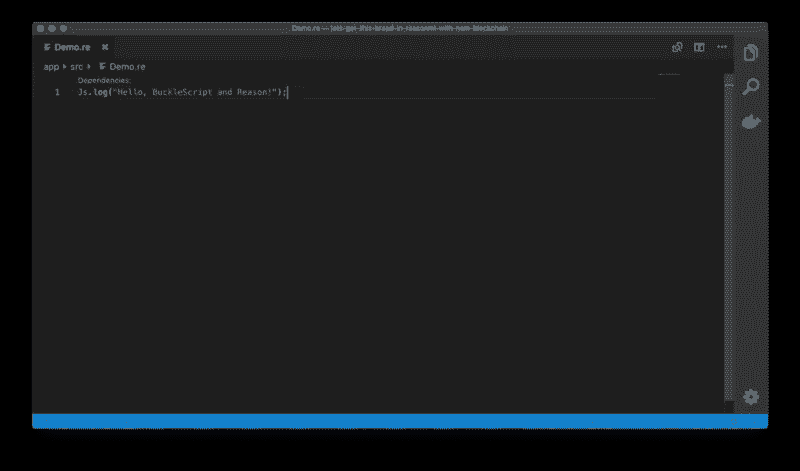**

**Our generated Demo script written in Reason, as shown in visual studio code editor.**

> **Demo.re 是一个文件，它是使用 bsb -init 为我们生成的，Demo.bs.js 也是一样，但是被编译成了 javascript。**

**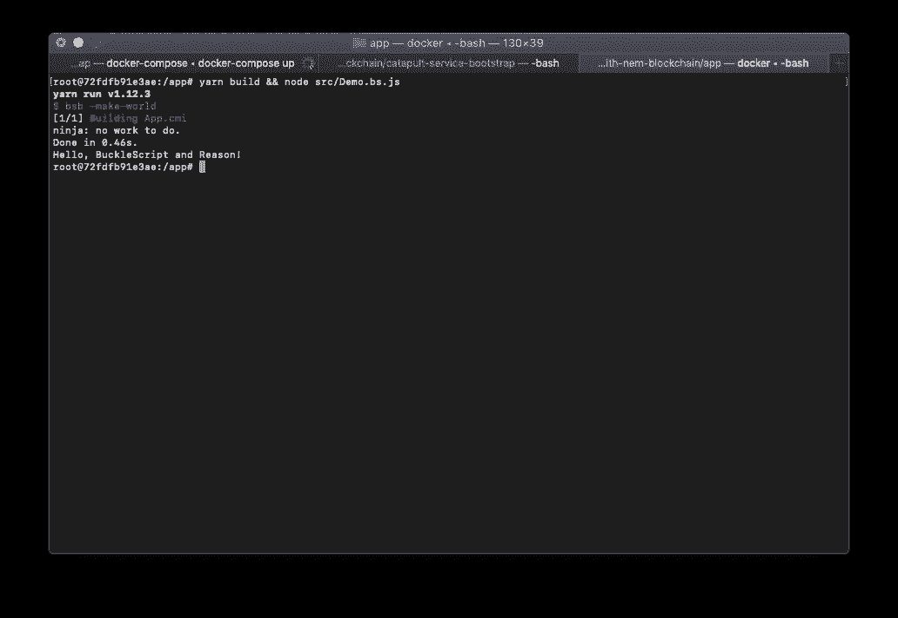**

**Compile & run using node, as any other javascript file.**

# **我们去买面包吧**

**我们的设置工作正常，我们可以进入有趣的部分(据称🤔).**

**第一个练习，将使用 sdk 和 cli 在 NEM 区块链上创建一个新帐户。**

**在我们的 docker 环境中，安装 nem2-sdk。**

**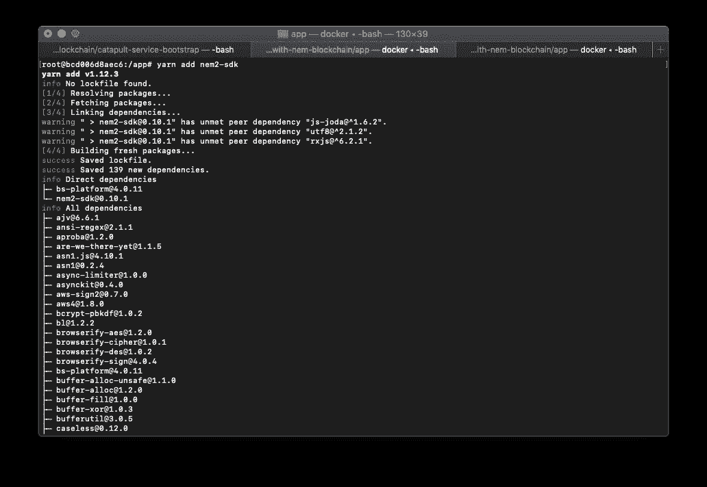**

## **生成新帐户— SDK**

**我们的演示项目包含一个名为 Demo.re 的文件，我们可以删除它。相反，让我们在 src/中创建一个名为 generateNewAccount.re 的新文件。我们将编写一些 ReasonML 代码，这些代码将使用 NEM2-SDK 与我们之前设置的 Catapult 堆栈进行对话。ReasonML 使我们能够编写类型安全的函数代码，它可以与 javascript(浏览器和节点)顺利地互操作。**

**我们希望创建一个 NEM 账户/钱包，这是区块链的一个基本身份模块，使我们能够使用所有酷的 NEM 功能，如智能资产交易或多签名交易。我们将得到一个私钥、公钥和一个地址。**

**让我们先验证文件是否编译和执行，然后我们将遍历它的内容。**

**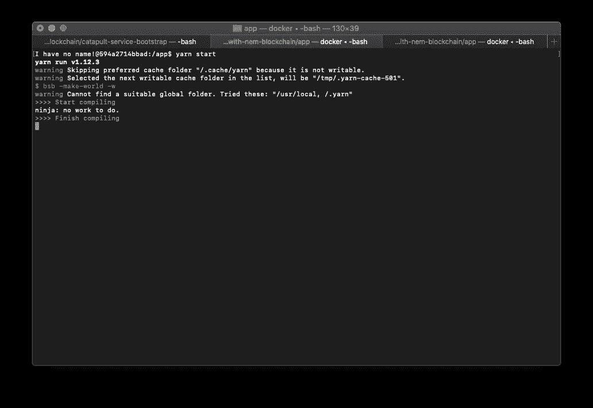**

**Output of yarn start, if everything went fine.**

**现在，一个新的文件出现了，generateNewAccount.bs.js。这实际上是我们编译的 javascript 输出，感谢 bucklescript 编译器。让我们快速看一下:**

**很眼熟吧？它是做什么的？**

1.  **导入 SDK，**
2.  **提取 MIJIN_TEST 的 typescript 枚举值**
3.  **如果正确指定了测试网络，请使用 SDK 的 Account 类来创建新帐户**

**现在可以使用 node 执行输出脚本。**

**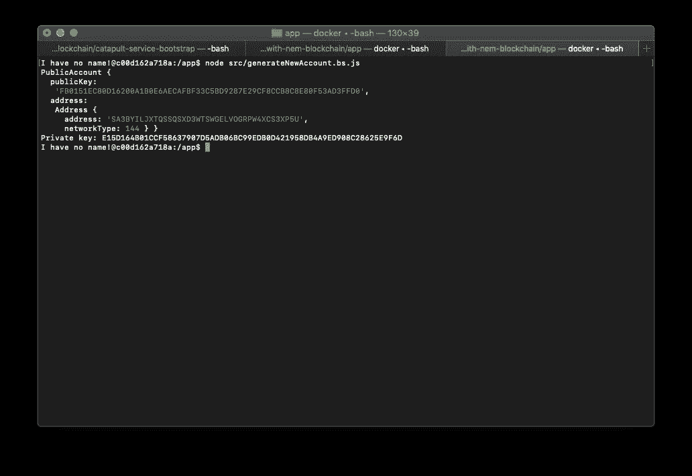**

**We have a public/private key pair, with NEM address as well.**

## **生成新帐户— CLI**

**到目前为止，我们已经能够创建一个新的 NEM 帐户，使用提供的 SDK，具有自定义的 ReasonML 绑定。现在，让我们尝试使用 NEM CLI 获得相同的结果。**

**我们的 docker 映像已经包含 nem2-cli，所以让我们使用它。**

> **如果您的 catapult 服务没有运行，您可以使用下面的命令重新启动它们。**

**Run this outside of the reason-bread docker container, we’ve done it in the getting started section as well, feel free to scroll up back to it!**

**现在，我们将使用 cli 生成一个新帐户，并将其保存到 CLI 的配置文件列表中。或多或少是一样的，就像我们的代码以前做的那样。确保在 run-in-docker.sh 中运行以下命令，因为您需要访问安装在那里的 nem2-cli。**

**下面的命令将询问您某些信息，我们将使用与我们的 Reason 示例中相同的网络类型，而 NEM2 节点 URL 将会改变(如下所示)，这是因为 REST 节点在一个单独的容器中运行，而不是在我们的 run-in-docker.sh 中运行，所以本质上这归结为 docker 网络，您可以在这里了解更多关于[的信息。](https://docs.docker.com/v17.09/engine/userguide/networking/)**

**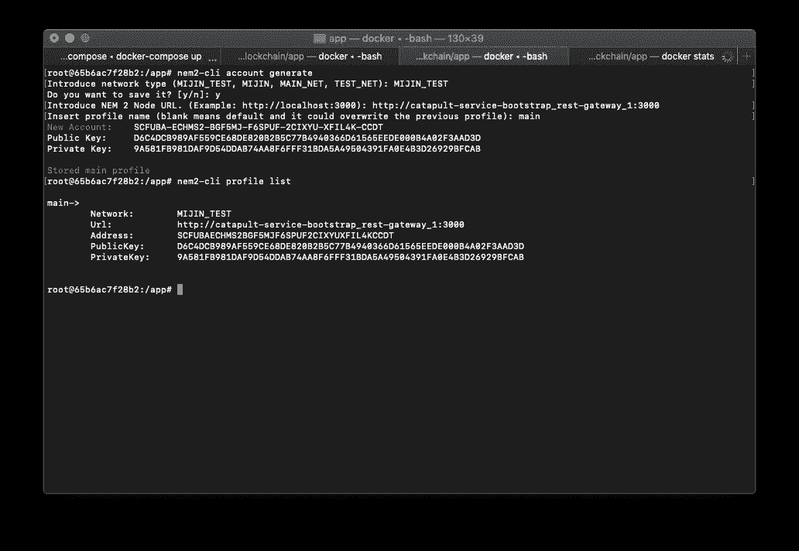**

**You can verify if your account was generated & saved successfully, by listing the existing profiles.**

## **使用合理生成的私钥**

**如果您愿意，可以使用程序生成的帐户(使用我们的原因代码)填充 CLI 的配置文件列表。**

**这很简单:**

**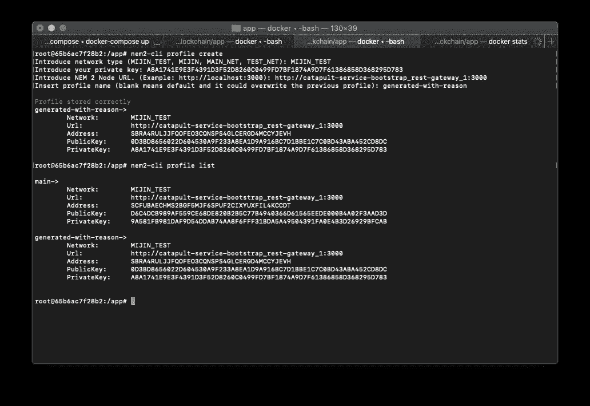**

**New profile appears at the bottom**

**恭喜你，你已经成功创建了两个(或更多？)NEM 账户，你现在可以用它来探索 NEM 区块链的其余部分。有大量的可用文档，你可以在这个链接找到它[。](https://nemtech.github.io/getting-started/training.html)**

# **下一步是什么？**

**在后续文章中，我们将探讨 [NEM2 水龙头](https://github.com/44uk/nem2-faucet)、马赛克和多重签名事务。这将允许我们交易我们的定制面包🥖(马赛克/智能资产)，用于 xem(虚拟货币)和区块链上的其他账户。**

# ****本系列第二部**可以在这里找到[。](/@matej.sima/nem-blockchain-faucet-and-transactions-using-reasonml-lets-get-this-bread-pt-2-36e5d06aaf99)**

***Special thanks to* [*István Deák*](https://medium.com/u/aab89e02a346?source=post_page-----8c8b540ed522--------------------------------) *&* [*Matus Rajsky*](https://medium.com/u/86809c5af59e?source=post_page-----8c8b540ed522--------------------------------) *from NEM Foundation and* [*Matej Nemček ⚡ 孔子*](https://medium.com/u/15bb61921cf3?source=post_page-----8c8b540ed522--------------------------------) *from* [*ProgressBar*](https://www.progressbar.sk) *for organizing an amazing NEM workshop!***