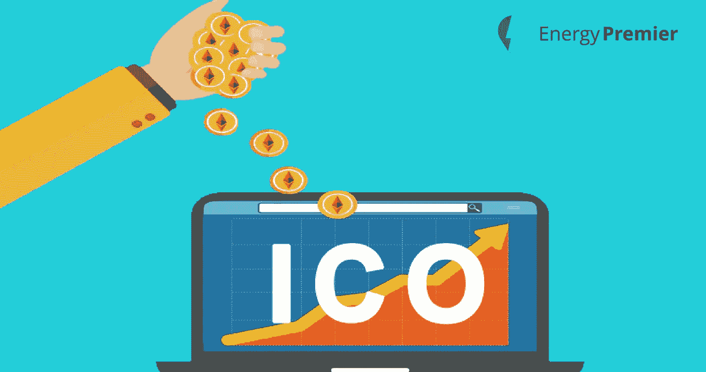
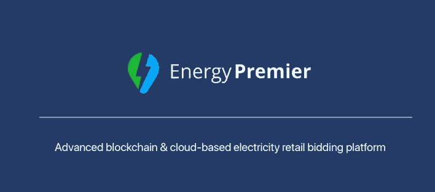

# 你应该参加 ICOs 的理由

> 原文：<https://medium.com/hackernoon/reasons-why-you-should-participate-in-icos-b0ef07328394>

得益于 2009 年比特币的发展，大量的加密货币和代币被建立起来。目前，在区块链世界大约有 1500 个代币，而且这个数字还在继续增加。每一个建立的代币之后都是初始硬币发行(ICO)的过程。这是一个创业公司为不同的加密货币筹集资金的过程，并试图吸引尽可能多的参与者。

在区块链技术的帮助下，ico 似乎改变了为有前途的新项目筹集资金的规则。他们获得了许多不同的人和公司的关注。到目前为止，已经有 30 多个 ico 获得了超过 10 亿美元的资金。我们相信这一趋势将持续下去，2018 年将成为 ico 和区块链项目更大的一年。

然而，仍然有人对这一新趋势持怀疑态度。但是，我们相信参与 ICO 项目有很多好处。因此，我们分享一些你应该加入和参与一些 ICO 项目的理由:

## **这是一个双赢的局面**

ICO 被认为是企业家和参与者的双赢局面。企业家为他们的项目筹集资金，同时参与者在短期内获得利润。

## **价格上涨的可能性很大**

当有人开始一个 ICO 时，价格被定在最低。然而，它们在未来会增加，这取决于有多少人会加入到那个项目中来。当你参与 ICO，购买加密货币，可以肯定你的投资会增值。当在交换平台中建立特定令牌时，它将被暴露给许多参与者和交易者。这种风险将导致价格上涨。

## **参与者获得折扣价**

为了提高知名度，吸引尽可能多的参与者，企业家们在开始一个 ICO 项目时会给销售额打折。为了让许多人注册并参与他们的项目，他们需要给他们一些回报。这就是参与者如何获得折扣价格并享受 ICO 项目的所有好处。值得一提的是，参与者只能在 ICO 期间获得折扣价，而不能在 ICO 结束时获得。

## **您的贡献将很快得到回报**

ICO 的过程并不需要太多时间，一般最多 1 个月。当你加入某个 ICO 时，你贡献了一定数量的钱，并获得了可以通过各种平台进行交易的代币。当 ICO 结束时，代币的价格将开始增加，您的贡献将很快得到回报，您将获得比开始时更高价值的代币。

> [Energy Premier](https://medium.com/u/e338af49a57a?source=post_page-----b0ef07328394--------------------------------) 认识到 ico 的重要性和优势。这就是为什么我们建立了一个 ICO，目前由售前人员跟进。

Energy Premier 是一家总部位于区块链的**电力交易平台，通过利用 EPC token 智能合同，使用户能够以更快、更安全和更便宜的方式进行电力交易。**我们的使命是在区块链技术的帮助下，创造一个只需 30 分钟就能完成电力招标的地方。**区块链技术的使用使得 Energy Premier 成为完全值得信赖和可靠的地方。**区块链不仅能确保发送给接收者的令牌在几秒钟内送达，无需任何第三方，还能通过智能合约提供安全性，从而消除潜在的欺诈。

Energy Premier 预售目前正在进行中，ICO 将于 9 月 21 日开始。我们想分享一些你应该加入我们 ICO 的理由:

*   我们有一个活跃的产品，有领先的用户
*   EPC token 是电力交易中最安全的数字硬币
*   我们正在以一种对消费者/供应商更加友好的方式颠覆和创新当前的市场模式
*   我们有专业的区块链专家团队
*   我们允许进入电力零售部门
*   除了石油，能源零售是一个相对稳定的行业，销售每个人都需要的产品——电力，没有风险市场波动——也提供了 EPC 令牌的稳定性

你可以亲眼看到我们所说的一切都是真的——在**[**https://energypremier.com/en**](https://energypremier.com/en)**发现我们的平台，在[**https://tokensale.energypremier.com**/](https://tokensale.energypremier.com/)参与我们的预售或 ICO！****

********