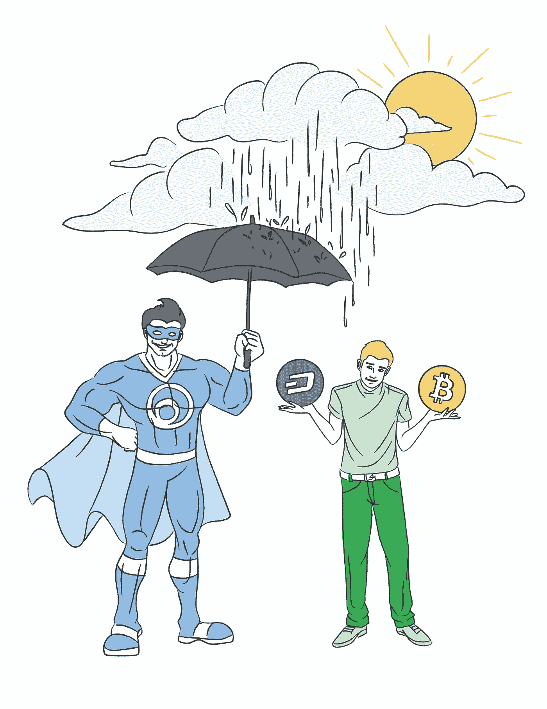

# 加密货币的再平衡做得对吗

> 原文：<https://medium.com/hackernoon/rebalancing-cryptocurrency-done-right-the-samsa-way-53adf1234944>

# 被动投资有多种形式

当谈到执行适当的交易策略并与投资[加密货币](https://hackernoon.com/tagged/cryptocurrency)的行动计划保持一致时，许多人很方便地认为这样做的正确方法就是加密社区所称的**【霍德林】**。对于那些偏离了经常令人困惑的密码迷因圈子的人来说，这只是一个微妙的参考和提醒，让他们抓住你拥有的任何硬币。不买不卖。霍德勒的心态很简单，拿着你的包，让波动结束，同时耐心等待你应得的兰博基尼。

霍德林主要被用来提醒**不要被吓跑，当市场形势变得艰难的时候**卖掉你的硬币，就像在我写这篇文章的时候一样。尽管出于“lol's”的目的故意拼错了一个常见的四个字母的单词，但这实际上是对真正相信[区块链](https://hackernoon.com/tagged/blockchain)的人的一个好消息。

Investors can get impatient watching the slow gains in their portfolios. Staying hands off can be easier said than done, but it is one of the keys to consistently winning.

被动地控制和排除市场噪音肯定有好处。在任何投资中，避免对价格大幅波动做出下意识的高买低卖反应，是获得长期重大回报的关键之一。毕竟，在股票市场上，日交易者在历史上吃过亏，比被动投资者获得的回报少得多。据 Investopedia 报道，

> “尽管指数化有着良好的记录，许多投资者并不满足于所谓的平均回报。即使他们知道少数积极管理的基金跑赢了市场，他们还是愿意尝试。ETF(和指数基金)提供了完美的工具。”

上面引用的 ETF 和指数基金仍然被认为是加密货币的海市蜃楼，因为许多人仍然认为日间交易是投资于波动性如此之大的资产类别时真正致富的唯一途径。然而，这是一种误解，即加密指数基金是不可行的，也没有办法存在。它们实际上是非常真实的现象，像 Lvl.co 这样的网站因为提供免费或低价的投资而迅速流行起来。

# 什么是再平衡？

像 [Level](http://lvl.co/?r=CxEGyn1x) 这样的被动投资平台允许加密货币交易者和投资者选择一种分配策略，通过算法“重新洗牌”他们的投资组合，以便根据他们设置的**参数**保持平衡。让我们先来看看一个未受影响和未再平衡的投资组合。假设一年前的今天，你第一次投资加密货币，购买了五种不同硬币的同等份额，你的余额如下所示:

*   *100 美元比特币(20%)——3420 美元 BTC/美元价格*
*   *$100 以太币(20%)——298 以太币/美元价格*
*   *$100 纹波(20%)——0.19 XRP/美元价格*
*   *$100 比特币现金(20%)——304 BCH/美元价格*
*   *$100 破折号(20%)——204 破折号/美元价格*
*   ***【500 美元组合总价值***

正如你们许多人所知，加密货币的一年感觉像是永恒，在 365 天的时间框架内，很多事情都可能发生变化，例如比特币在一场前所未有的牛市中爆发，价值略高于 19700 美元。在从那时到现在的这段时间里，比特币明显达到了一年前价格的大约 7.5 倍*的高点，而 Ripple 的价值在 2018 年 1 月初一度达到了 2017 年 8 月 9 日最初价值 0.19 美元的 18 倍*。也就是说，如果你从现在到那时根本不碰你的硬币，你今天的余额将如下所示(为简单起见，数字四舍五入):**

*   ***$193 比特币(24.3%)——6602 BTC/美元价格***
*   ***:124 美元以太币(15.6%)——369 美元以太币/美元价格***
*   ***$184 波动(23.1%)——0.35 美元 XRP/美元价格***
*   ***$204 比特币现金(25.6%)——619 BCH/美元价格***
*   ***$91 破折号(11.4%)——185 破折号/美元价格***
*   ***796 美元的总投资组合价值***

***有趣的东西。通过加密货币在 2017 年底的大幅上涨和 2018 年 1 月到现在的小幅下跌，这一投资组合配置未受影响，将为你带来+59%的丰厚回报。恭喜你。但是，看看你持有的所有股票的百分比变化了多少。你持有的 Dash 股票价值从你投资组合的 1/5 下降到接近 1/9，因为市场把它压低了。与此同时，在过去的一年里，你的其他硬币都有不同程度的上涨。***

***无论你现在对 Dash 的立场是什么，一般的投资策略表明，如果这些硬币的所有内在价值保持不变，我们应该**买入**更多 Dash，**卖出**一些更高的赢家，如比特币、Ripple 和比特币现金，假设它们从长远来看会持平。随着这些资产的重新平衡，我们可以通过在高点卖出、低点买入获得比+59%更高的回报，同时保持更均匀的硬币价差。保持我们最初投资的每枚硬币的 20%，意味着卖出我们的最高点，买入我们的最低点，以保持我们对这个概念的信念。***

******

***[Lvl.co](http://lvl.co/?r=CxEGyn1x) offers traders the ability to keep their portfolio allocations protected and stabilized at the portion you would like to keep it pegged to. One coin’s allocation in a portfolio won’t diminish just because it has been outgained by another. [Level](http://lvl.co/?r=CxEGyn1x) automatically buys more of lower performing coins in order to capitalize when the markets turn!***

***在加密货币这样一个不稳定的资产类别中，重要的是要知道，随着时间的推移，两个硬币之间的分离不一定意味着一个硬币现在只是一个更有希望拥有的硬币。这可能只是短期甚至长期的价值差异。与比特币现金相比，Dash 可能已经落后了，但十年后它的价值仍然不到比特币现金的三分之一吗？也许吧，但它也可能超越比特币现金，让它望尘莫及。这就是你的研究发挥作用的地方，你可以据此提出长期战略。***

***在后一种情况下，Dash 可能会超过比特币现金，你可能会回过头来责怪自己没有在 Dash 便宜的时候买入更多的 Dash。像 [Level](http://lvl.co/?r=CxEGyn1x) 这样的算法交易平台可以很容易地帮你做到这一点。你一年前的最初计划是在两种代币上保持均匀的百分比分配，因为你平等地相信这两种代币。为什么你对 Dash 的信念现在只值你投资组合的 1/9，而比特币现在只值 1/4，仅仅是因为市场决定了它们在这两个方向的价值？这是[级](http://lvl.co/?r=CxEGyn1x)已经成功解决的问题。***

******

***A year long timeframe of how [Level’s](http://lvl.co/?r=CxEGyn1x) Equal Protocol Index (SEPR) performed against Bitcoin.***

# ***那么 Samsa 是怎么做的呢？***

***Samsa 会为你处理上述情况，并定期调整你的持股比例，使你的投资组合平均分配在 20%。如果一项加密资产的价值上升， [Samsa](http://samsa.ai?utm_medium=partner&utm_source=medium&utm_campaign=rebalancing+cryptocurrency+done+right&utm_content=hackernoon) 将这些利润投入到一枚落后的硬币中。一旦它赶上来，最初落后者的利润就被投入到新的落后硬币中。冲洗并重复。而且这一切都是自动完成的，这样你就可以“设置好就忘了”。对于没有时间不断重新配置的忙碌投资者来说，这绝对是一种奢侈，而且几乎没有人有时间以硬币价值上下波动的速度来优化配置。***

***这一革命性的交易平台允许交易者按照自己的意愿分配投资策略，他们可以使用推荐的具有良好记录的指数基金，如 [Samsa 的 Equal Protocols (SEPR)](https://www.samsa.ai/markets/indexes/SEPR) 。或者，交易者可以使用他们想要交易的硬币，以及重新平衡的频率(例如，2 小时、4 小时、1 天等)，根据他们自己的偏好定制他们的分配。)***

***[Samsa](http://samsa.ai?utm_medium=partner&utm_source=hackernoon&utm_campaign=rebalancing+cryptocurrency+done+right) 使用复杂的算法定期买卖您的加密资产，以维持您自己指定的硬币分配，无论是通过 [Samsa 的](http://samsa.ai?utm_medium=partner&utm_source=medium&utm_campaign=rebalancing+cryptocurrency+done+right&utm_content=hackernoon)建议指数基金，还是通过您自己的自定义分配。据首席执行官克里斯·斯劳特称，***

> ***“再平衡是重新调整资产组合权重的过程。再平衡包括定期购买或出售投资组合中的资产，以维持资产配置的原始预期水平。***
> 
> ***例如，假设一个原始目标[资产配置](https://www.investopedia.com/terms/a/assetallocation.asp)是 50%股票和 50%债券。如果股票在此期间表现良好，它可能会将投资组合中的股票权重提高到 70%。然后，投资者可能决定卖出一些股票，买入债券，以使投资组合回到最初的 50/50 目标配置。***
> 
> ***“再平衡”，作为一个术语，意味着资产的平均分配；但是，不要求 50/50 的股票和债券分割。相反，重新平衡投资组合需要将资产重新配置到一个确定的构成中。无论目标分配是 50/50、70/30 还是 40/60，这都适用。"***

# ***被动投资——生存之道，然后繁荣***

***成为加密货币的被动投资者意味着什么？交易者如何从通过算法技术为他们交易的更合理的策略中受益，而他们仍然保持被动并享受他们的生活？每个人都喜欢用加密货币创造巨大回报，几乎所有人都希望以最少的精力和时间消耗来实现这一点。***

***像 [Level 的](http://lvl.co/?r=CxEGyn1x)这样的突破性想法正在证明，并非所有的被动投资策略都是平等的，除了在几周、几个月或几年内不碰你的宝贵资产，你还可以在长期持有你的代币的同时做更多。***

******

***Keeping your tokens is easy to do when you can use an automatic rebalancing platform like [Samsa.ai](http://samsa.ai?utm_medium=partner&utm_source=medium&utm_campaign=rebalancing+cryptocurrency+done+right&utm_content=hackernoon)***

***我们很容易变得自满，让投资组合中的赢家在你的投资组合中逐渐占据越来越大的份额，而看着输家变得越来越不突出。然而，假设你的任何资产都没有发生根本变化，重要的是要明白那些亏损的资产仍然有很大的机会赶上赢家。事实上，你的输家往往比你的赢家更有机会获得更高的收益。因此，无论你在做什么样的投资，重新平衡赢家和输家，以保持他们在你的投资组合中的适当权重分配，并利用市场的涨跌是有帮助的。***

***利用各种硬币的峰值和谷值，不断洗牌以优化你想要的策略，这对**击败竞争对手**至关重要。不要自己不停地监控图表，寻找完美的进场点，希望你的限价单被执行，让像[Lvl.co](http://lvl.co/?r=CxEGyn1x)这样的再平衡平台为你工作，几乎不需要任何费用。在坚持你的投资策略的同时，最大化你的收益和最小化你的损失是一个非常受欢迎的组合，现在终于可以实现了。***

******我在*** [***水平***](http://lvl.co/?r=CxEGyn1x) ***写了深入的加密货币分析，用于加密的被动投资工具。参见我们在做的***[***Lvl.co***](http://lvl.co/?r=CxEGyn1x)***以及参见我们的其他分析在*** [***我们的杂志***](https://medium.com/samsa-ai?utm_medium=partner&utm_source=hackernoon&utm_campaign=samsa_publication) ***。如果你喜欢你所看到的，给这篇文章 50 个掌声！如果你讨厌它，就用 49 表示你的不满。******

***本文及相关内容仅供参考。这不应被视为投资建议，你应该咨询财务顾问，并在进行任何投资之前进行自己的研究和尽职调查。在引用证券或商品时，仅用于说明目的，并不意味着对证券或商品分类的任何立场。就提供或讨论的* [*级*](http://lvl.co/?r=CxEGyn1x) *服务而言，这些服务仅可用于* [*级*](http://lvl.co/?r=CxEGyn1x) *白名单资产。***