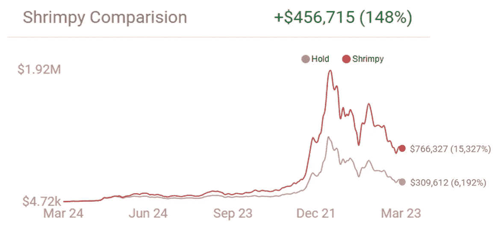
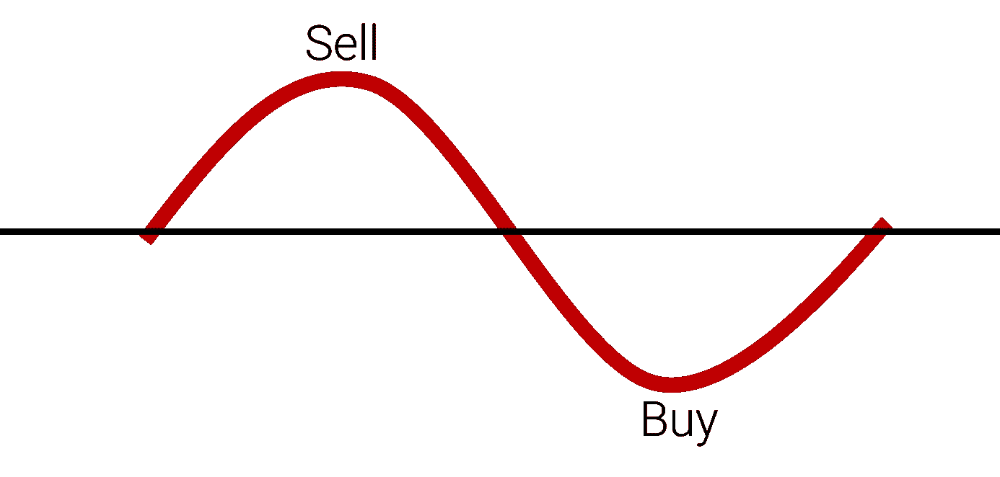

# 再平衡是秘密的乐土

> 原文：<https://medium.com/hackernoon/rebalancing-is-the-crypto-promised-land-6cc37264a4a3>

每个人都知道重新平衡投资组合意味着什么。不幸的是，再平衡在加密领域仍然不受欢迎。这篇文章的目的是提醒加密投资者，重新平衡是必不可少的，尤其是在加密市场。如果你想了解更多简单的再平衡策略，看看我们之前的文章:

 [## 加密货币的投资组合再平衡

### 投资组合再平衡是投资者使用了几十年的策略。首先，投资者必须确定如何…

medium.com](/@ShrimpyApp/portfolio-rebalancing-for-cryptocurrency-7a129a968ff4) 

## 提升性能

买入并持有就像过山车一样。你在某一点上了车，你唯一的选择就是沿着车走，直到你下车。随着市场的波动，这意味着持有者没有利用他们的收益。进去的硬币数量就是出来的硬币数量，不管它们是通过什么途径达到最终价值的。再平衡是不同的。通过重新平衡，你的投资能够利用市场的快速变化来增加收益。你不再只是随波逐流，而是开始意识到再投资于其他硬币的收益。

This is an actual performance comparison between Buy & Hold and rebalancing. It’s clear that rebalancing outperforms Buy & Hold by an astonishing percentage.

为了展示这种提高的性能，我们创建了一个使用真实市场数据的回溯测试工具。只需选择你投资组合中的硬币，看看如果你重新平衡而不是回避，你会做得多好。点击下面的链接，尝试不同的投资组合:

[https://www.shrimpy.io/backtest](https://www.shrimpy.io/backtest)

根据我们的详细分析，再平衡比 HODL 高出 64%的中值。税后，这代表了所有可能的加密货币投资组合的 92%。你可以在这里看到其余的分析:

 [## 再平衡与 HODL:技术分析

### 这项研究的目的是描绘一幅公平的画面，说明再平衡作为一种策略如何符合霍德林。为了…

medium.com](/@ShrimpyApp/rebalance-vs-hodl-a-technical-analysis-6f341b0db9cd) 

## 降低风险

当一枚硬币的价值急剧上升时，你的投资组合中会有更大一部分被这种单一资产所消耗。这给你的投资组合带来了风险。如果这一项资产崩盘，那么你的投资组合价值将损失很大一部分。相反，如果你通过再平衡来重新分配收益，你最终也会重新分配风险。因此，当同样的资产价值下降时，它对投资组合总价值的影响就会减少。

## 低买高卖

“低买高卖”是最著名的投资法则之一。这是一个简单得可笑的策略，以至于它几乎忽略了实际完成起来是多么的困难。毕竟，如果很容易，我们都会很富有。对吗？嗯，也许不是。遵守这个简单的规则，再平衡是一个非常简单的方法。让我们假设你持有的总价值停滞不前。当一枚硬币在再平衡期间升值时，它会被卖出(高价卖出)，交易给那个时期的输家(低价买入)。如果硬币继续循环，再平衡将继续利用这些波动来增加你持有的价值。

## 市场稳定。

加密和易变已经携手并进。你几乎不能提到加密而不提到波动性。告诉某人他们应该考虑投资加密货币，几乎总是会接着说“但这是一个动荡的市场，所以这不是投资建议。”嗯，不需要永远都是这样。再平衡实际上是一种提高市场稳定性的策略。如果有足够多的人在重新平衡，当一枚硬币的价值开始上升时，人们会开始抛售这枚硬币，使其价值回落。同样，当一枚硬币价值下跌时，那些重新平衡的人会通过购买硬币并使价格回升来纠正下跌。这意味着市场向两个方向移动的速度都将放缓，因为价值的变化需要更大的市场力量来推动资产的价格。

## 低努力策略

密码市场被复杂性所困扰。甚至像购买特定硬币这样简单的事情也需要大量的时间和精力。你需要从从菲亚特购买一枚硬币开始，将硬币从一个交易所转移到另一个交易所，为你的投资组合确定最佳策略，并随着时间的推移保持多样化的投资组合。对于普通人来说，这是一项艰巨的任务，甚至阻止他们开始他们的加密之旅。再平衡处于针对这些难题的独特位置。再平衡是一种不需要投资者额外努力的策略，尤其是当通过自动化过程的工具来执行时。

# 用 Shrimpy 重新平衡

Shrimpy 是一个为我们的用户执行所有重新平衡的应用程序。您可以随时跟踪您的投资，选择定制的再平衡期，快速分配多样化的投资组合，等等。它完全免费使用，并不断更新新功能。今天就试试吧，让我们知道你希望我们下一步开发什么！

别忘了查看一下 [Shrimpy 网站](https://www.shrimpy.io/)，在 [Twitter](https://twitter.com/ShrimpyApp) 和[脸书](https://www.facebook.com/ShrimpyApp)上关注我们的更新，并在[Telegram](https://t.me/ShrimpyGroup)&[Discord](https://discord.gg/gXyy95y)上向我们令人惊叹的活跃社区提问。

留下你的评论，让我们知道你的平衡经验！

*捕虾队*