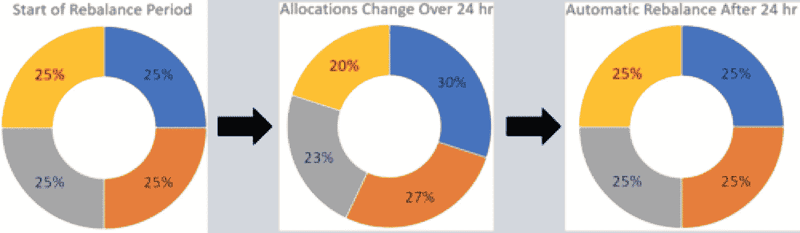
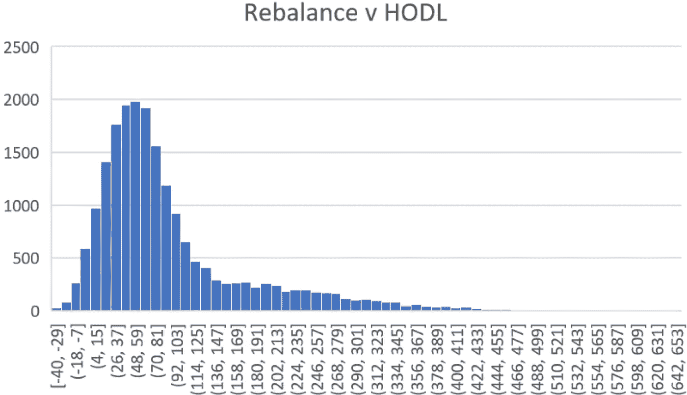
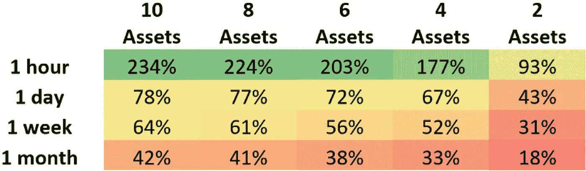

# 再平衡与 HODL——哪种策略能带来更高的加密产品组合回报？

> 原文：<https://medium.com/hackernoon/rebalancing-vs-hodl-which-strategy-drives-higher-crypto-portfolio-returns-2a332f72e4f3>

投资组合再平衡是投资者使用了几十年的策略。许多人在照看他们的[加密](https://hackernoon.com/tagged/crypto)投资组合时都采用这种方法。本文比较了重新平衡与保持的表现。

# 入门指南

从再平衡策略开始，投资者必须首先确定他们的投资组合中有多少资产要分配给每种资产。在加密货币的情况下，每项资产都是一枚硬币。这些分配只是每个硬币在组合投资组合总价值中所占的百分比。当到了重新平衡投资组合的时候，硬币被交易，使得每种资产的价值再次等于最初指定的百分比。

*定期再平衡是一种常见的投资策略，根据固定的时间间隔对投资组合进行再平衡。*

Rebalance of Crypto Portfolio

‍Figure 1:这张图片直观地展示了当权重相等的投资组合重新平衡时会发生什么。

# Shrimpy.io 分析

为了比较重新平衡与保持相比的表现，我们分析了 20，000 多次回溯测试。借助从加密货币交易所收集的数据，这项研究能够描绘出一幅公平的画面，说明再平衡作为一种策略如何累积到持有。

Figure 2

图 2:x 轴是重新平衡而不是持有的投资组合的增长百分比。y 轴是落入每个百分比范围内的回测次数。我们观察到所有回溯测试的平均性能为 64%。

上述结果包括加密市场的总体表现数据，并展示了再平衡对投资组合的影响。

图 3

图 3:通过投资组合规模(2-10 个资产)和再平衡周期(1 小时-1 个月)来分离回溯测试，显示了大型投资组合频繁再平衡的优势。网格中的每个值都是该投资组合规模和再平衡频率的 1000 次回溯测试的中值绩效增长。值为 18 意味着该组的中值表现比买入并持有好 18%。

我们能够从这些结果中发现一些有趣的结论。

我们注意到性能和更短的再平衡周期之间的正相关关系。总体而言，投资组合的结果往往会随着再平衡间隔的缩短而改善。我们的结果表明，与所有其他重新平衡时间段相比，每小时自动重新平衡是迄今为止最成功的策略。

我们还发现，业绩与投资组合的多样性直接相关。随着投资组合变得更加多样化，它们的整体投资组合表现也趋于改善。

# 税收影响(特定于美国)

政府将加密到加密交易视为“应税”事件。这对于高交易量的交易者来说可能会有问题，因为手动追踪数百笔交易中正确报告资本利得所需的所有数据是不可能的。如果你不熟悉美国是如何对待税收加密的，请阅读我们的文章 [**这里**](https://www.cryptotrader.tax/blog/the-traders-guide-to-cryptocurrency-taxes) 。

您可以使用[和**密码交易器。Tax**](https://www.cryptotrader.tax/) 自动化加密报税流程。

# 使用 Shrimpy.io 自动重新平衡

客观上，主动定期再平衡是比 hodling(买入并持有)更好的投资策略。

作为一项完全免费的服务，Shrimpy 不仅具有投资组合跟踪功能，还让用户只需简单的几个步骤就可以自动化他们的整个加密货币投资组合策略。用户所要做的就是在他们的投资组合中选择他们想要的资产和配置。一旦连接到 exchange 帐户，Shrimpy 就会为其用户处理其余的事情。

本文由 [**Shrimpy.io.**](https://www.shrimpy.io/) 提供

今天就点击 [**这里**](https://www.shrimpy.io/) 报名吧。在这里观看 [**Shrimpy Demo**](https://www.shrimpy.io/demo) 。

*-捕虾队*

*原载于*[*www . cryptotrader . tax*](https://www.cryptotrader.tax/blog/rebalancing-vs-hodl-crypto-portfolio-returns)*。*