# 重启 GDS

> 原文：<https://medium.com/hackernoon/rebooting-gds-96b1595096fa>

最近有很多关于重启 GDS(政府数字服务)的传言。不要误解我，GDS 犯了错误，但有些确实是我的错。在撰写[“少花钱更好”](https://ntouk.files.wordpress.com/2015/06/better-for-less-1.pdf)的论文时，我做了一个可怕的假设，关于地图绘制以及人们对它的了解程度。事后看来，我应该把地图放进那篇论文里，而不是把它留在背景里。因此，为了避免再犯同样的错误，我想扩展一下重启 GDS 的问题，并处理一下新上任的高管(首席信息官、首席执行官等)的情况。

你可能会感到的第一件事是有点恐慌。谁让我负责的？我知道，在组织上打上你的印记、创造将推动公司走向成功的战略，是一种诱惑，但我要请你沉住气。泰坦尼克号可能要沉了，我们必须在摆弄甲板椅或规划新航线之前堵住这个巨大的大洞。为了开始这一旅程，我将向您介绍战略周期。

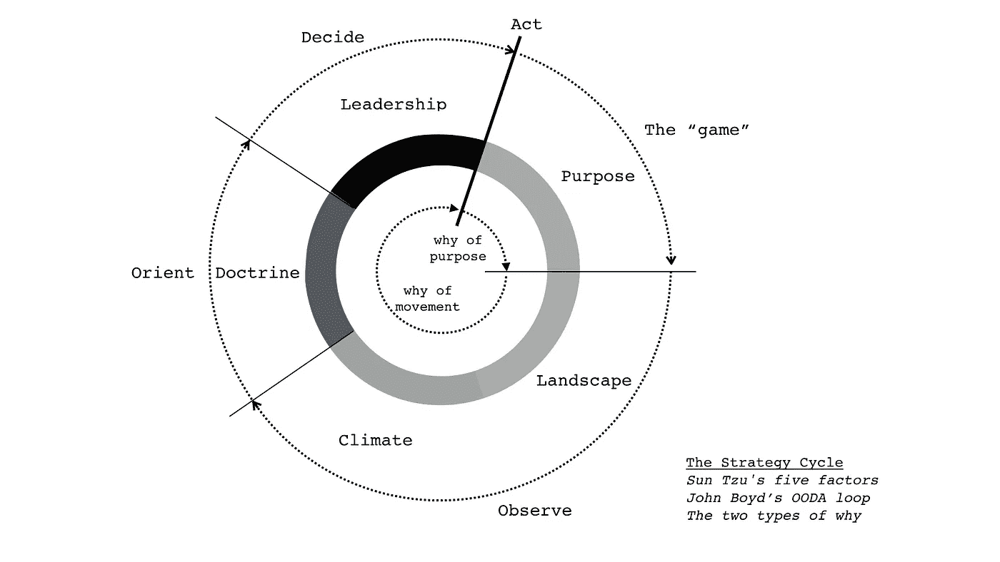

该图的组成部分如下

1)有一个**目的**，一个道德上的命令。

2) **观察**你所处的环境以及影响它的气候模式(在商业领域，我们称之为经济模式)。这些模式对于预测变化很有用。

3) **运用基本原则(即所谓的原则)让你的组织适应环境。**

4) **决定**你将在哪里攻击市场，按照你喜欢的方式玩游戏，然后**行动**。这被统称为领导力。

这是一个**循环**——每次你或其他人行动时，它都会改变你的目的、场景、你需要行动的地方等等。

我假设你没有你的商业地图。你可能有像业务流程图、系统图、思维导图和许多其他叫做地图的东西，但这些都不是真正的地图。很有可能，你从未见过商业地图，也对环境视而不见。不过没关系，其他人几乎都是一样的处境。

当谈到使用战略周期时，那么在这些早期阶段，我们将跳过气候模式、预期、游戏性、领导力和所有这些好东西。相反，我们将专注于教义以及如何阻止组织主动伤害自己。我们要堵住泰坦尼克号！

怎么会？好吧，我们只是要循环添加教义。

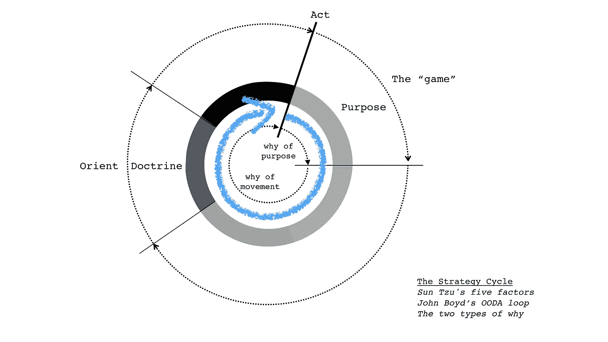

有四十种模式(即原则)组成学说。这些原则对任何组织都是普遍适用的，但并不是所有的原则都是一样的，也就是说，有些原则比其他原则更重要。因此，我提供了一个原则的分阶段实现，我们将从第一阶段的几个原则开始(用蓝色标记)。这些原则是*挑战假设*、*了解你的用户*和*了解你的用户需求*。

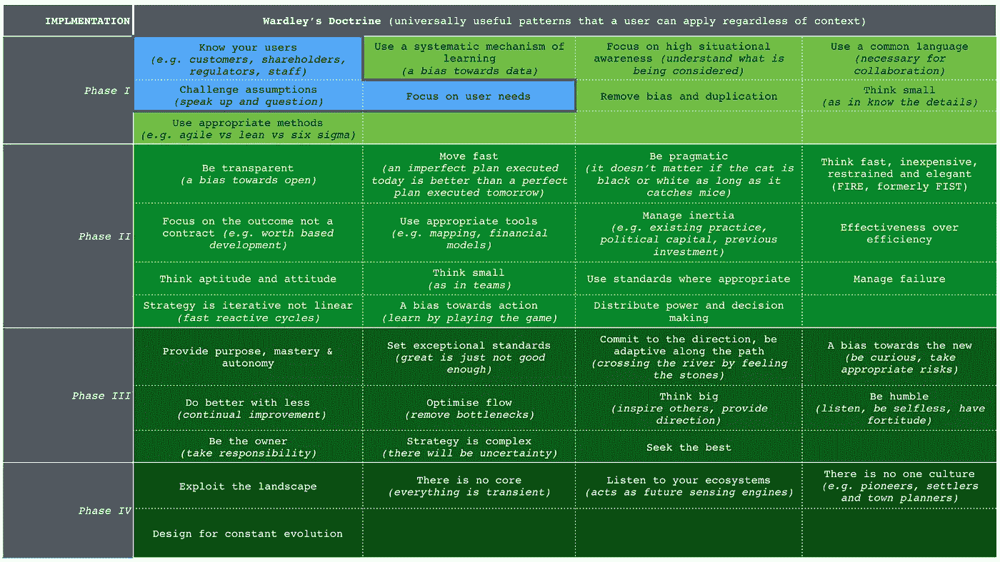

但是如何在组织中引入挑战呢？挑战不是已经存在了吗？为什么要挑战？

好的，对于大多数组织来说，你有无数的委员会——全球架构小组、商业战略论坛、政策委员会等等。他们通常充满善意的人，但通常没有太多实际的挑战，沟通几乎总是次优的。如果组织有任何规模，它会有很多浪费，失败的努力，偏见和重复，但没有人能真正告诉你这个问题有多糟糕。当大多数高管偶然发现这一点时，他们通常会进行评估。

盘点一大笔遗产(不管是不是)通常是一项令人望而生畏的任务，我们试图解决的问题不是“我们拥有什么”，而是“以后不要做傻事”。因此，我们真的不需要知道我们有多少浪费，我们只是想要少一些。这就是为什么我们要围绕循环添加学说进行迭代。没有大爆炸的方法，只有许多小步骤。

首先，我们将介绍一个将成为组织未来战略基石的团队。那个组是**支出控制组。**

## **挑战沙滩头**

支出控制的目的只是挑战我们正在做的事情。重要的是要记住，它并不控制预算。这些预算属于其他部门或业务单位。支出控制简单地说，如果我们要在某件事情上花费超过 2.5 万英镑，那么这件事情就必须呈现给我们，并接受一点挑战。

首先，支出控制应该简单地问一问——谁是用户，他们有什么需求，我们用什么标准来衡量这些需求？你甚至可以通过四处张贴“用户需要什么？”的海报来强化这一点或者按照 Liam Maxwell(前英国政府首席技术官)的说法，把它贴在手机背面

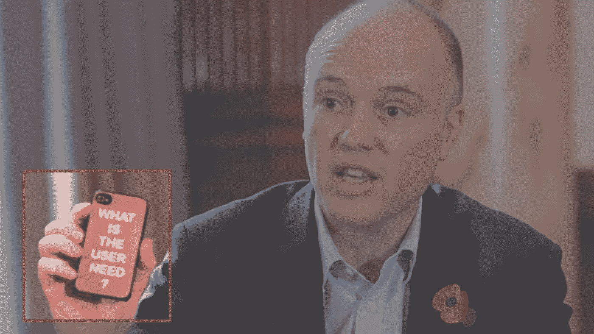

谁是用户，他们的需求是什么，我们用什么标准来衡量这些需求——每个人都这样做吗？你会惊讶的。据我上次统计，不到 20%的组织能够清楚地识别他们的用户，能够描述他们的用户需求的就更少了。你可能很幸运，在那些特殊的组织中，但你可能不是。

那么，支出控制是如何工作的呢？嗯，一个项目负责人带着一个他们有 10 万美元预算的项目出现在支出控制中心。支出控制询问谁是用户，他们的需求是什么，我们将如何衡量？回应往往可以是“我也不知道，只是个 100K”。

好吧，支出控制的工作就是要求项目负责人去发现。但是请记住，项目负责人也是预算的持有者，所以他们可以简单地忽略支出控制，理由是“这是浪费我的时间”。你会惊讶地发现，有多少人试图获得支出控制的例外，因为他们认为自己太重要了，不能在基本问题上受到质疑。

让我们假设项目负责人决定忽略支出控制，并继续工作。他们可能会成功，但项目所有者的问题是项目何时失败。这是个问题，因为有书面记录表明他们拒绝回答最基本的问题。这是挑战的另一面——你需要提出问题并审查发生了什么。

在后台发生的事情是，支出控制正在构建我们可能正在做的事情(进入支出控制的项目)、我们服务的用户、他们的需求以及我们如何衡量成功的画面。它还建立了一个项目所有者倾听、接受挑战、在项目中取得成功并理解他们的用户的图像。这些都是好东西。

在某个时候，可能是流程开始后的六个月或一年，那么支出控制需要与失败的项目负责人摊牌。你需要强调的是，人们不能在不了解用户、他们的需求和一些基本衡量标准的情况下继续做事情。这种摊牌很少是令人舒服的，但你需要推动接受挑战的想法没有例外。一旦你到了那里，挑战的滩头已经建立，然后我们就可以开始加速了。

## **引入意识。**

在这一阶段，我们将扩展支出控制以询问更多问题。我们将超越简单的用户和他们的需求，而是开始研究构建一个项目需要什么。我用蓝色标出了我们要研究的第一阶段的扩展原则。

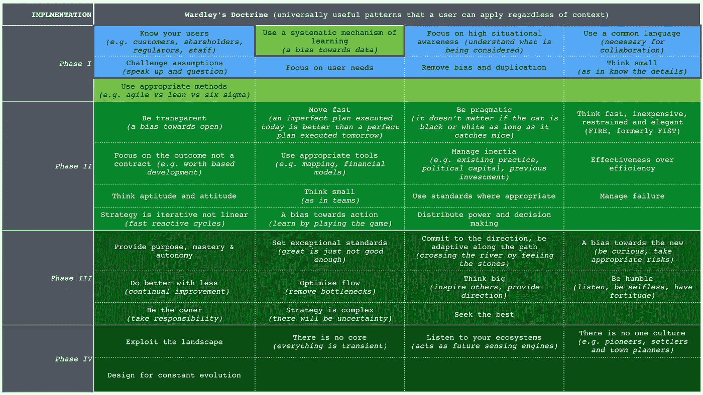

支出控制部门首先应该向人们索要的是一张地图。这是一个相当简单的练习——你从用户和他们的需求开始，然后找出实现这些的组件。你通过一系列的需求来做到这一点，比如这个需要那个需要那个等等。地图的微妙之处在于，你还需要写下组件是如何进化的。有一本关于这个的[全书，所以我不会在这里重复，但为了给你一些安慰，所有的地图都是不完美的。事实上，它们必须是有用的。所以不要担心做出完美的地图，这不是重点。](http://medium.com/wardleymaps)

举例来说，我提供了一张非常简单的茶叶店地图。

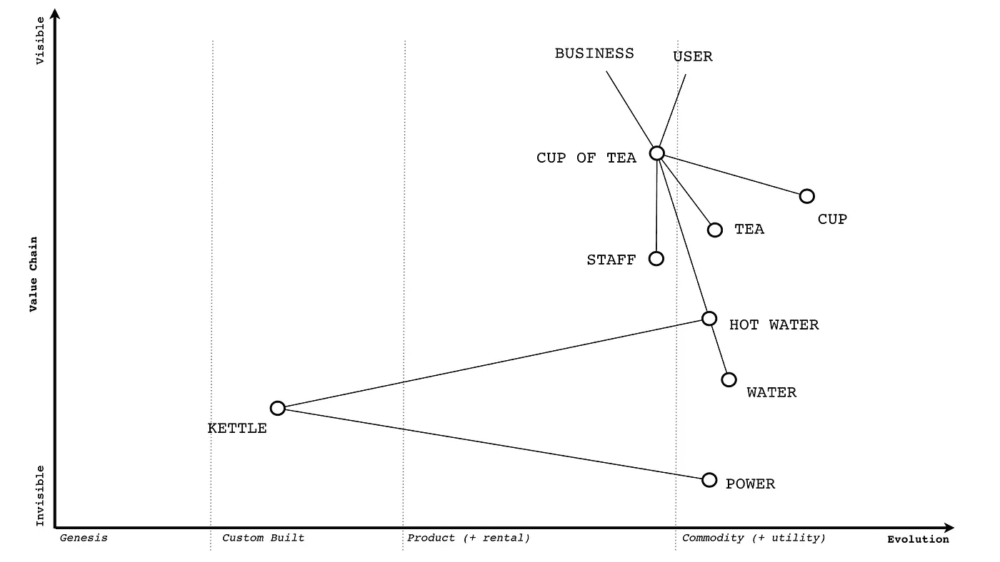

这张地图远非一张完美的茶叶店地图，然而我们的目标不是完美，而是允许挑战。因此，我们可以注意到，从家具到付款方式，这张地图遗漏了很多要素。通过与他人分享任何一张地图，我们经常可以找到被遗漏的基本东西。我们还可以挑战我们正在做的事情，即我们为什么要定制水壶？

这些地图实际上是资本地图(包括流量和存量)。因此，我们可以在地图上添加指标。每条线路都是资本的双向交换，即用户获得物理流量(一杯茶)以换取金融流量(支付一杯茶的钱)。资本本身可以是物质的、金融的、社会的、风险的、信息的——各种各样的东西。是的，我们还可以据此建立损益表和现金流。

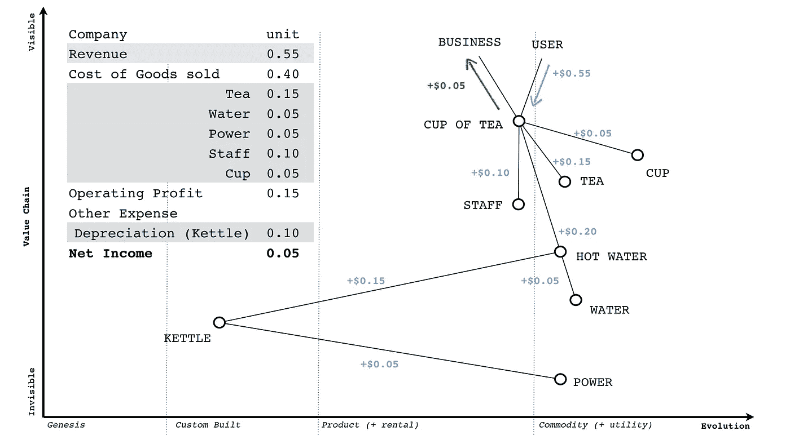

我们现在问谁是用户，他们的需求是什么，我们将如何衡量这一点，涉及哪些组件，资金流向哪里，以及整个行业面临的挑战。随着我们获得更多的地图，我们甚至可以发现地图之间的重复，即我们正在两次构建相同的东西。我在政府中发现的最糟糕的重复是 118 次。我在私营部门发现的最糟糕的例子是，一家金融公司成功地将同样的事情重复了 1000 多次。请记住，这不是因为人们愚蠢，而是因为次优的沟通。人们只是没有意识到他们正在这样做。

为了清楚起见，让我们重复这些步骤。

第一步 — *关注用户需求*这意味着你也需要识别用户。

**第二步** — *了解细节*，也就是说，构建这个东西涉及到什么。这使得其他人可以提出质疑，找到缺失的部分，并创建一个可以与他人交流的共同形象。

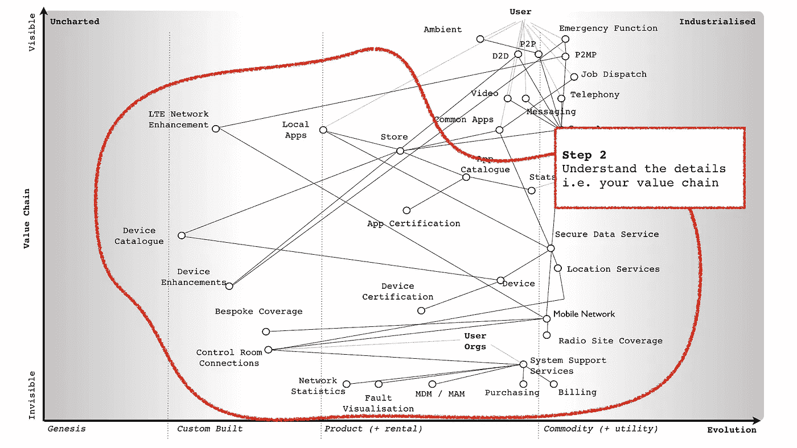

**第三步** — *减少重复*。当我们有几幅地图时，我们通常会很快发现重复。总的来说，根据我的经验，我认为大多数组织 90%以上的损益都是浪费。这是一个比人们意识到的大得多的问题，我真的对那些处理这个问题的组织感到惊讶。

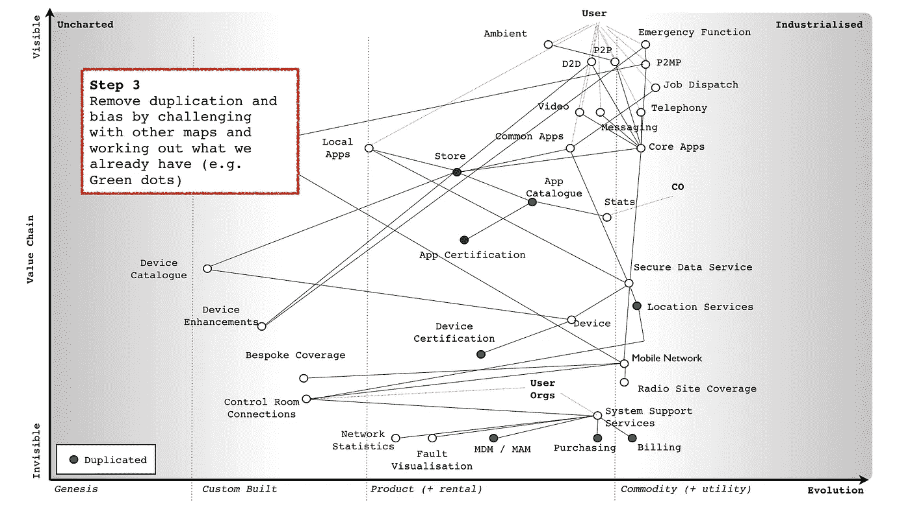

**第四步** — *减少偏差*。我无法告诉你我遇到过多少次组织定制商品，因为这非常普遍。有人希望投资机器人技术(提供了可爱的商业案例来展示 12 个月内资本投资的投资回报),以提高某些工作流程的效率，这些问题只是因为他们在定制某种商品而出现的。在这种情况下，项目是定制的机架，问题是标准服务器不适合他们的定制机架，需要人们移除机箱、钻孔和添加新的板。“提议的解决方案”是用机器人代替人，以消除工作流程中的瓶颈。实际的解决方案是停止定制机架，开始使用标准机架。这种事情太普遍了，据我所知，在大型组织中这是常态。

因此，使用地图来挑战和提问——我们为什么要定制这个东西？

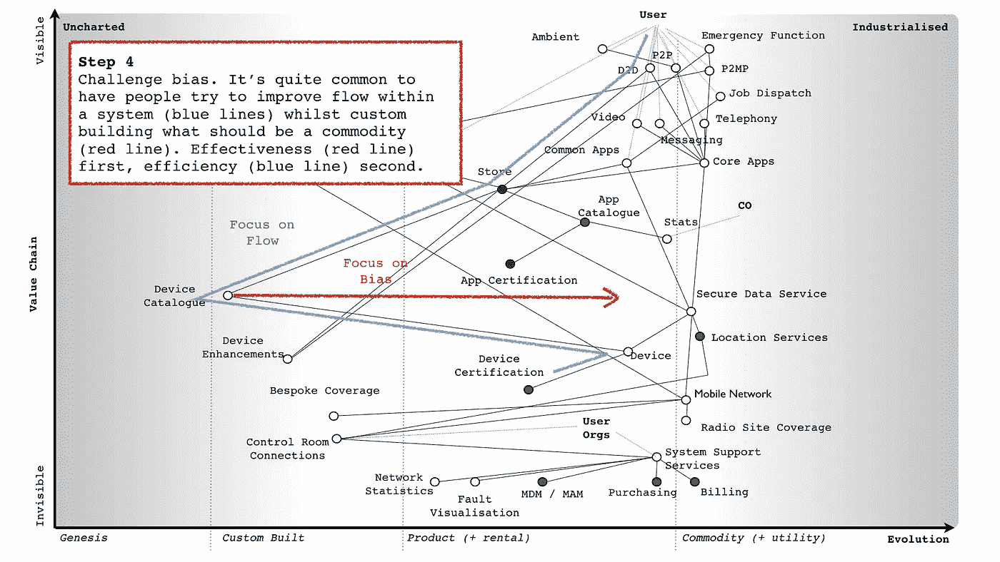

在这一点上，你希望再给变革六个月或一年的时间，让其融入组织。从用户需求到所涉及的组件，到复制，到偏见以及我们把钱花在哪里，支出控制应该在更广泛的范围内具有挑战性。

虽然制作地图的过程相当快——几个小时左右——但这也是“支出控制”可以帮助他人的事情。但预计会有阻力。每个人都喜欢谈论挑战的重要性，但实际上没有人喜欢被挑战。会有很多例外的要求，为什么这个或那个项目太复杂而不能通过这个过程，以及许多其他的借口。

不要灰心。在某些情况下，通过向他人展示他们正在构建的东西也是由他人构建的，支出控制将能够真正帮助他人。这将使人们能够将精力集中在重要的事情上，摆脱共同的(无聊的)或甚至在多个地图上识别机会，以构建共同的服务。你会发现支出控制有它的拥护者。

但是总有一些人认为他们太重要了。只要记得记录给出的建议，那些忽视建议的项目，以及项目的最终结果。建立证据基础。恐怕在人们接受挑战并不是一个坏主意之前，你可能还需要面对一些失败的项目。

幕后发生的事情是，你现在也在构建一个你正在竞争的景观的视图。所有这些地图都是相连的，是一个更广阔的景观的一部分，你开始看到这个景观和你的庄园。

## **完成一期**

在这个阶段，虽然事情应该会变得更好，但是你仍然会有很多失败的项目。在你真正开始这部分旅程之前，你需要建立证据基础和信任，这部分旅程是关于完成第一阶段(以蓝色突出显示)。

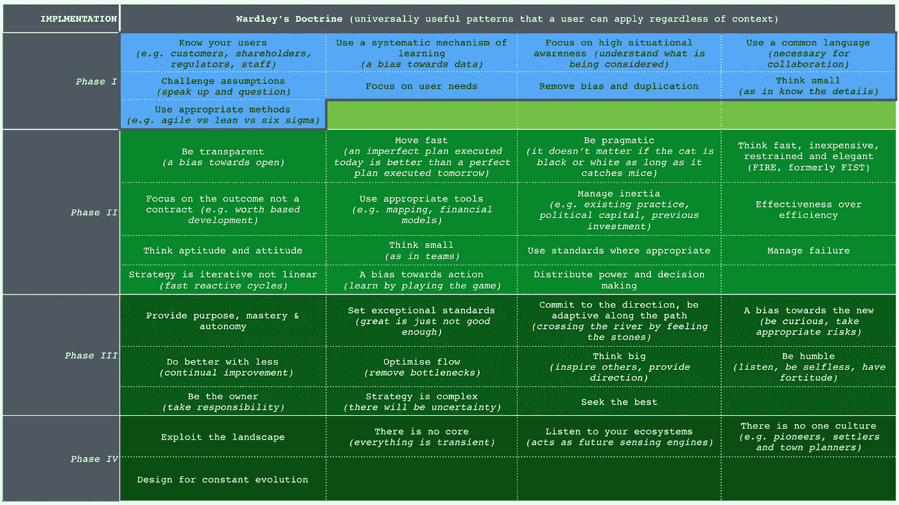

首先，我们必须开始分解项目。仅仅因为我们有一张地图，并不能阻止人们试图在一些类似死星的项目外包给他们友好的 SI 来构建整个地图。你需要引入一些想法，比如火(快速、廉价、克制、优雅——见丹·沃德中校)和约束。我们需要做的是打破僵局。

第五步*——签订小合同。*

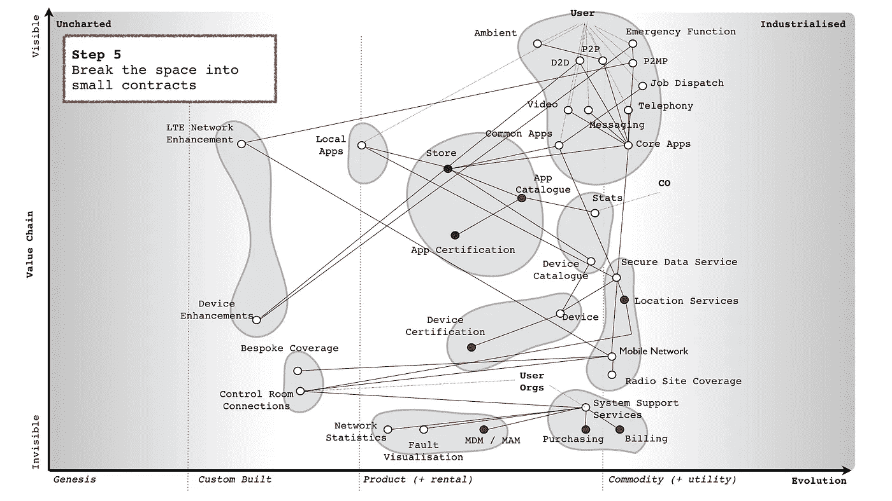

你会听到反对的呼声，因为这让地形变得更加复杂。项目所有者会抱怨说，他们现在要管理多个合同以及它们之间的接口。请注意，这些接口已经存在，无论如何通过试图隐藏在大合同中来假装它们不存在，都不会让它们消失。打破小合同是至关重要的，因为这意味着我们现在可以应用适当的方法。

**第六步** — *运用合适的方法。*

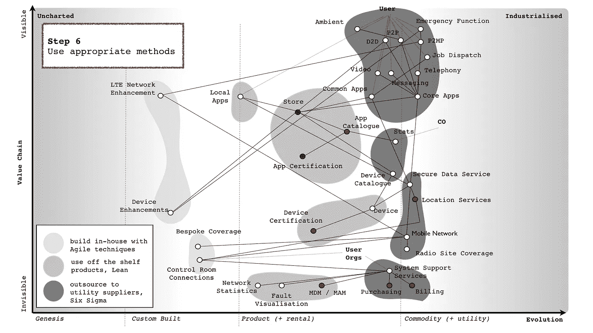

您可能没有意识到这一点，或者发现这一点可能会有点震惊，但是对于项目管理来说，没有比采购更神奇的通用方法了。13 年来，我一直在使用地图来应用适当的方法，但我仍然惊讶地发现有人不知道这一点。对于任何大型系统，您都需要同时应用多种方法。因此，你会倾向于将右边那些更工业化的组件外包出去，而用敏捷技术构建左边那些未知的和不确定的组件。您还将在地图上使用不同的购买机制。我所看到的绝大多数大规模的失败都来自于技术的误用，而且几乎所有的失败都可以在项目开始之前就被预测到。

典型的失败是有人拿了一个像上面这样的项目，然后把它全部外包给一个大合同。为了模拟这一点，我在下面的地图中将所有“迷你合同”标记为外包。如果你看一下地图，你会发现左侧的组件处于未知空间，即新奇、新颖和不断变化的空间。我们实际上无法指定它们，因为它们在不断变化。因此，将它们与右边可以指定的组件放在一个契约中，总是会导致过多的变更控制成本超支。人们总是争辩说，下一次我们需要更好地指定它，但是我们有一个词来形容这些人——它叫做“错误”。解决方法是使用适当的方法。

**第 7 步** — *了解背景*即什么在哪里起作用。

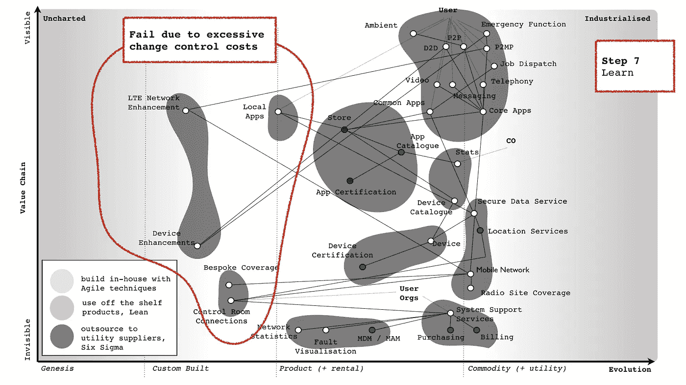

你会发现这会引起更多的反抗。有多少次，有人对我大喊敏捷、精益或六适马在任何地方都管用，但其他技术不行，这种情况多得数不清。他们不是在所有地方都工作。他们都有自己的背景。

顺便说一句，像使用不适当的方法(如上所示)这样的错误是我们学习地图模式的方式，也就是说，我们知道有适当的方法。这是关于地图的一件大事——它不仅是为了挑战和交流，也是为了学习。你有一张地图，你对它采取一些行动，然后观察发生了什么，如果你幸运的话，你会发现一个新的模式。

这种学习可以从一个项目传递到另一个项目。帮助和建议项目负责人如何管理他们的环境是支出控制真正发挥作用的地方。支出控制已经走上了成为每个组织都需要的智能功能的道路。但是，让我们不要被未来冲昏头脑。在这个阶段，你已经完成了第一阶段的所有原则，应该通过支出控制将其嵌入到组织中。你面临着来自用户、用户需求、组件、我们如何对待它们、我们在哪里花钱等多个方面的挑战。你一直在学习环境和什么方法在哪里起作用，消除重复和偏见，希望变得更健康和更精简。

你应该已经开始你的旅程几年了。我们还有几个阶段的理论要走，我们距离创建基于适应性细胞的组织结构(使用多种文化来应对进化)还有数年时间，但我们比以前更好了。我们还需要 5 到 10 年的时间，才能有效地预测变化，利用地图来定位前景，并学会如何操纵市场来制定战略。

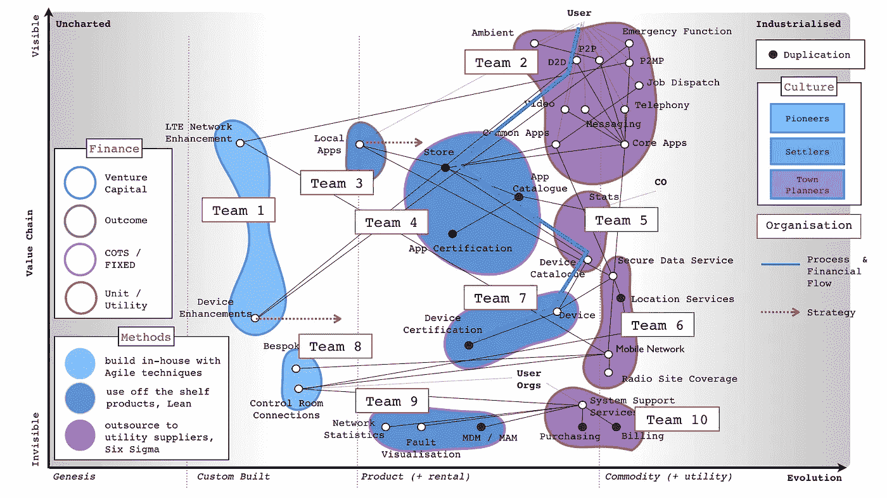

我知道很多人相当热切地希望他们需要建立这个*“基于人工智能的区块链数字生态系统平台”*的东西，但这真的没关系。重要的是我们已经开始了了解我们环境的旅程，我们正在学习。稍后，你将能够绕过那些没有的人，尽管他们有大量的现金、工程师或优势。与红帽和微软相比，用了 18 个月(从 2008 年到 2010 年)和不到 50 万美元接管了 Ubuntu 云。地图是强大的武器。

一开始，我确实说过在组织变革和战略上要沉住气，因为诚实的事实是，大多数人都不知道如何做到这一点——这几乎完全是随机的、盲目的运气、从空气中挑选出来的迷因和直觉。你之所以感到恐慌，是因为你不知道该怎么办。好消息是，大多数高管也不知道。

与其瞎磕磕绊绊，不如迈出第一步，因为测绘本身就是一个旅程。如果你的组织没有类似支出控制的东西，不要惊慌，这是正常的。这也可能是你的个人优势，因为你一定会赢得一些快速的胜利，也就是说，你会发现那些 6000 万英镑的项目可以用 80 万英镑建造。当然，你会在政治方面受到一些严重的阻碍。

如果你坚持不懈，那么你最终会达到可以玩那些更高级的游戏，但要从这些基础开始。经常有人问我应该为地图设定什么样的目标？根据私营部门的经验法则，当您完成第一阶段的理论时，您可能应该设定一个可证明的延伸目标，将 P&L 的浪费减少到大约 50%或更低，即 P&L 费用中的浪费不到 50%。很明显，有些球员已经远远超过其他人。在政府中，浪费往往会更少，因为有预先存在的挑战机制，如 MPA(重大项目管理局)，NAO(国家审计署)和 PAC(公共账户委员会)，但即使在这样的空间，也有可能节省数十亿美元。这是一条经验法则，因为很少有人真正了解重复、偏见、误用技术、不相关的用户需求或设计糟糕的合同的规模。人家会问你能省多少？有什么证据支持这一点？但是没有人能够回答到底存在多少浪费。你必须在前进的过程中发现基线。

谈到重新启动 GDS 的最初问题，我怎么强调重视和加倍控制支出的重要性都不为过。对我自己来说，下一次我参与写一篇“少花钱多办事”的论文时，我会确保添加地图。前面和中间。

*原载于 2018 年 10 月 30 日*[*【blog.gardeviance.org】*](https://blog.gardeviance.org/2018/10/rebooting-gds.html)*。*