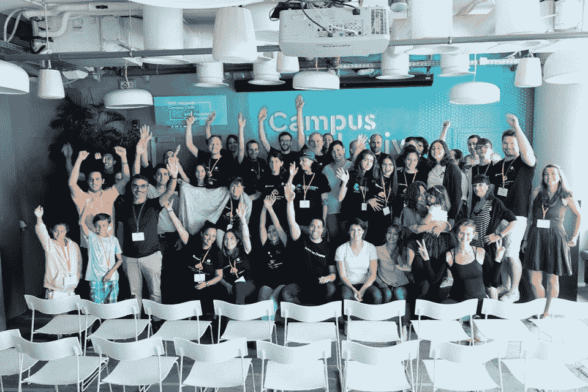
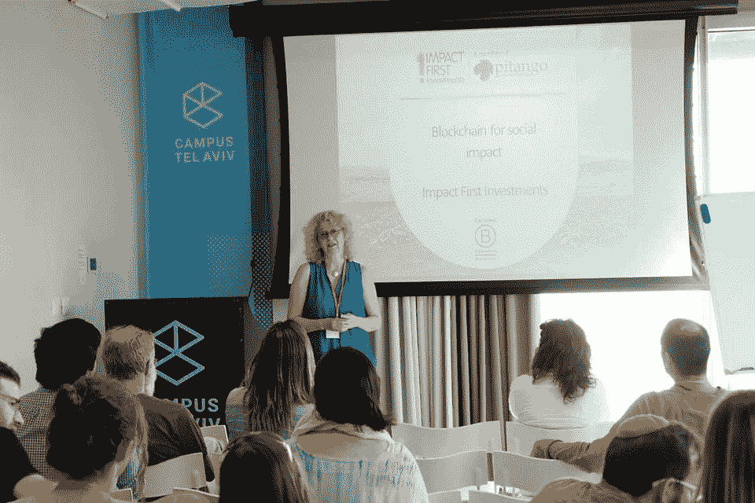
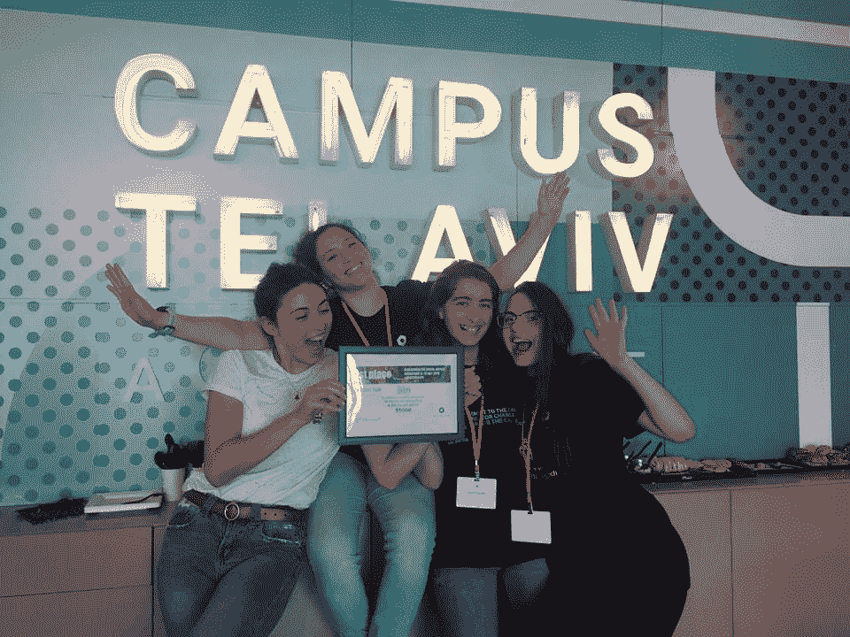
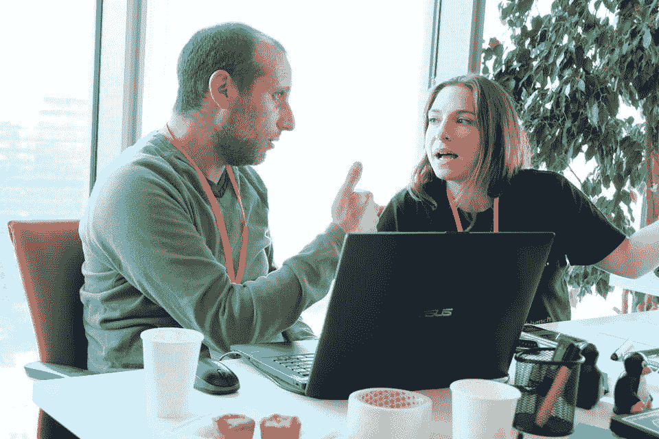

# 回顾:区块链以色列的黑客马拉松

> 原文：<https://medium.com/hackernoon/recap-blockchain-israels-hackathon-bbe0b077a48>

区块链能拯救世界吗？肯定有很多人这么想。我的朋友 Yael Rozencwajg 就是其中之一，他是以色列区块链公司的首席执行官。最近 [Blockchain Israel](http://blockchainisrael.org/) 在特拉维夫举办了“[block chain for Social Impact](http://blockchainisrael.org/blockchainforsocialimpact/)”黑客马拉松，参与者被要求解决一个将区块链技术应用于现实世界的问题。区块链功能的选项有 [IBM 和 Linux 的 Hyperledger Fabric](https://www.hyperledger.org/projects/fabric) 或[微软的 Azure + Workbench](https://azure.microsoft.com/en-us/blog/ethereum-blockchain-as-a-service-now-on-azure/) 。

根据与会者 David Suter 的说法，黑客马拉松的参与者有 30 个小时的时间来设计一个智能合同系统，要么使用 Hyperledger，要么使用 Workbench，这可以归结为许可或无许可。

获胜的队伍是一群高中年龄的年轻女性，有些刚毕业，正等待开始服兵役。他们 10 天前刚刚见过面。他们获胜的想法与提供真实的测试结果有关，这可以应用于企业和学校。

区块链黑客马拉松是一个令人兴奋的概念，因为它允许新的想法进入生态系统。区块链技术往往令人望而生畏，即使它不像大多数人认为的那样复杂或新颖。

[教育](http://blockchainisrael.org/education)是区块链以色列的主要使命之一。人们的想法是，有很多问题可以用区块链技术解决，这些解决方案可以让每个人过上更好的生活。通过将来自行业和社区的人们聚集在一起，为了一个共同的目标，黑客马拉松利用多样性为日常问题提供基于区块链的解决方案。

区块链技术可以解决许多尚待解决的问题。我期待着下一次区块链以色列黑客马拉松，看看会有什么解决方案。

照片由 [Yael Rozencwajg](https://www.linkedin.com/in/yaelrozencwajg/) 和 [David Suter](/@MrDavidSuter) 提供