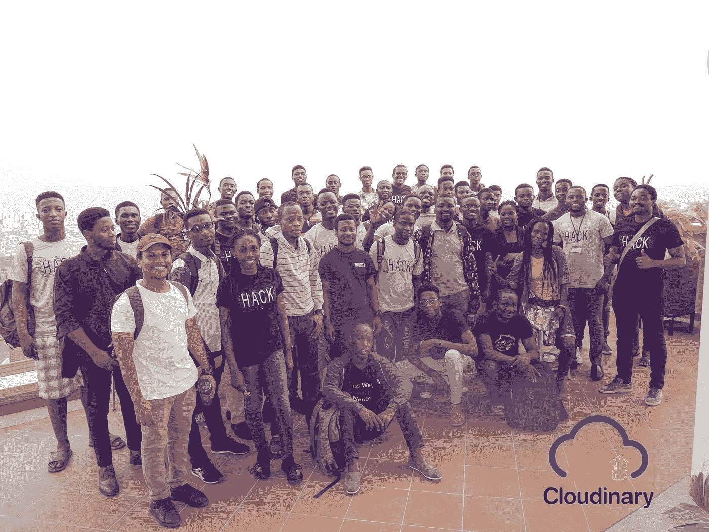
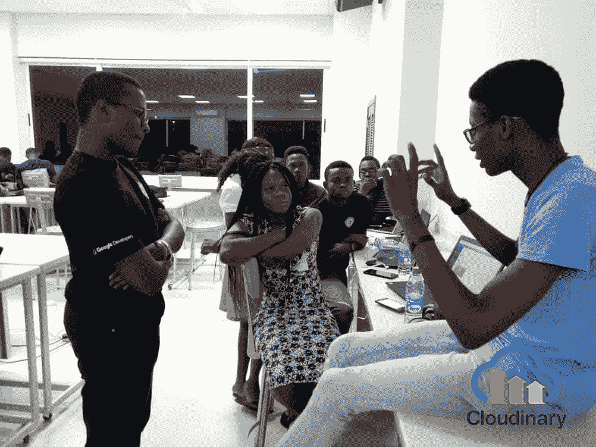
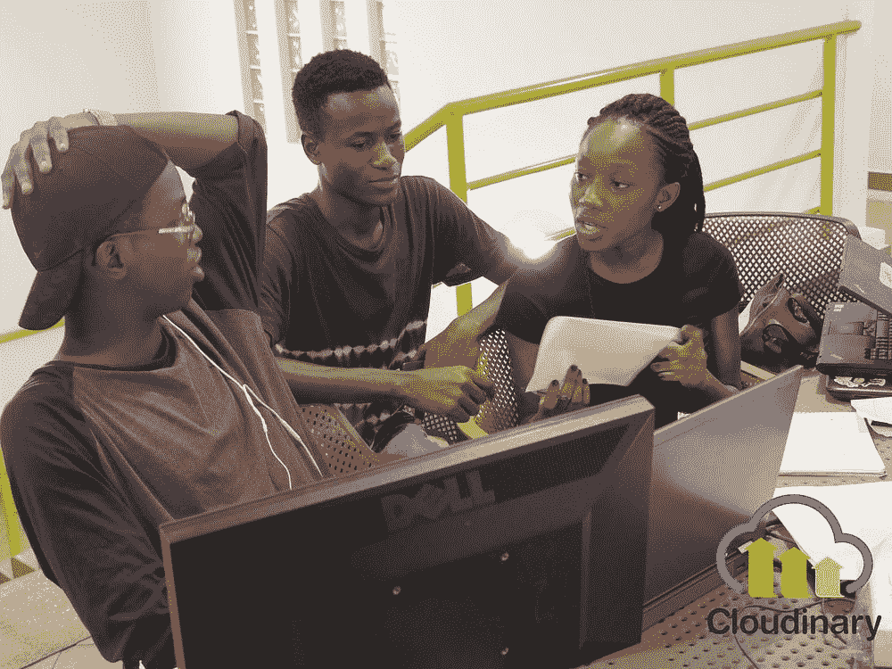
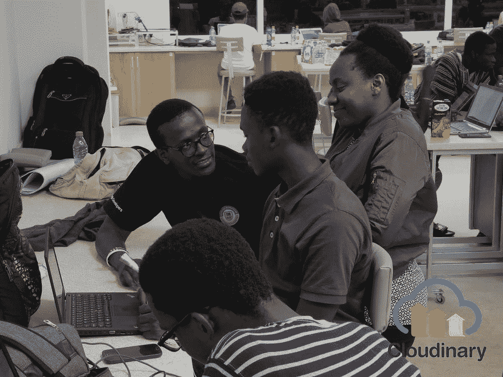
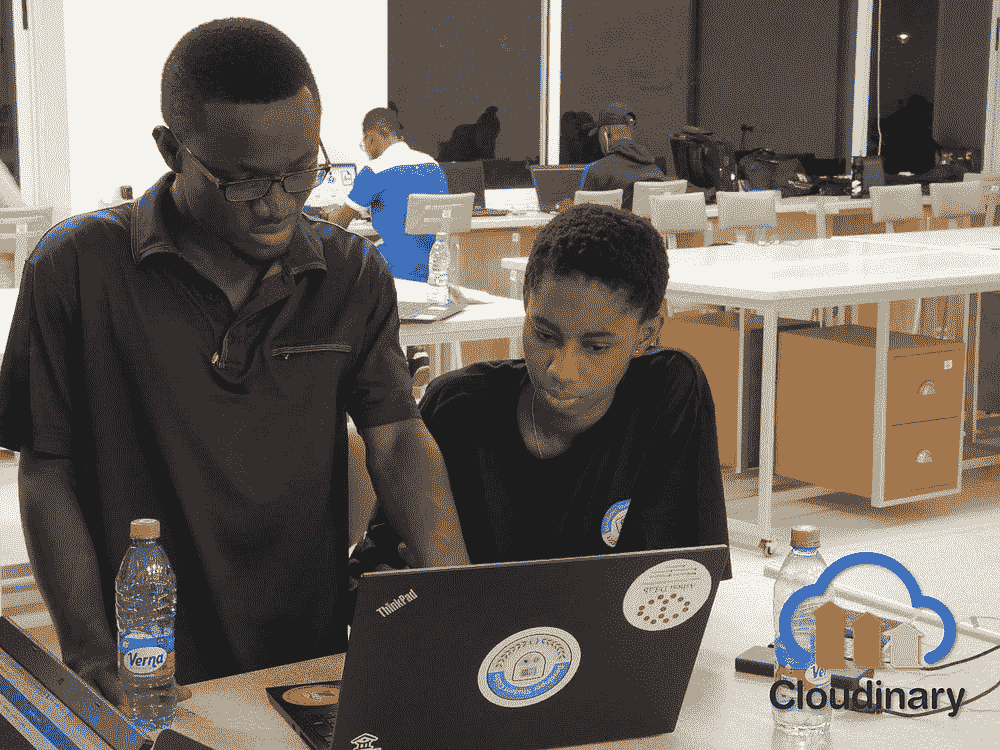
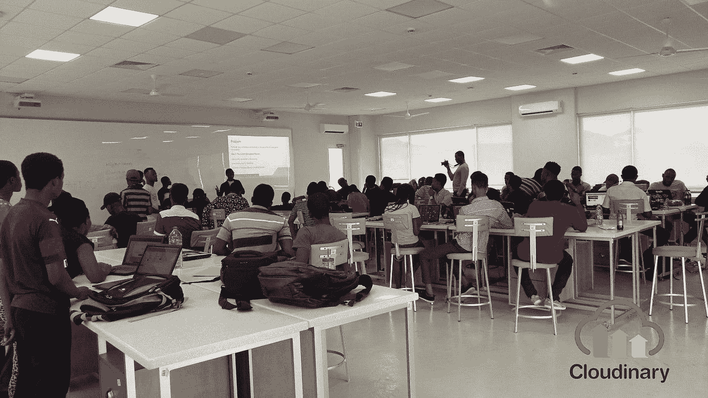
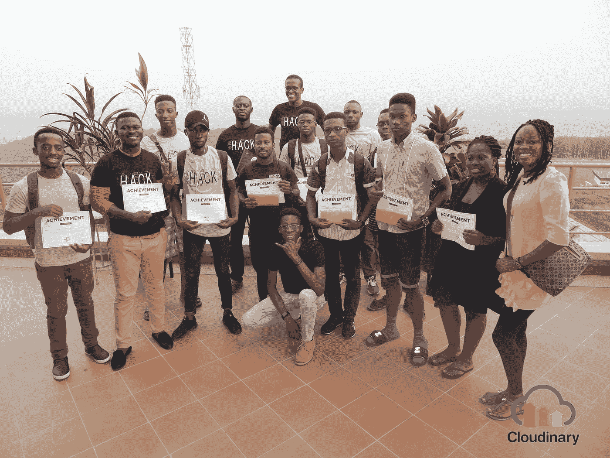

# Hack-API 黑客马拉松概述

> 原文：<https://medium.com/hackernoon/recap-of-hack-apis-hackathon-2299dccb8b99>

## Cloudinary 赞助了在加纳 Ashesi 大学举办的黑客马拉松。

Hack-APIs Hackathon

2018 年 11 月 30 日和 12 月 1 日，谷歌开发者学生俱乐部 Ashesi 在加纳 Ashesi 大学举办了 Hack-API[黑客马拉松](https://hackernoon.com/tagged/hackathon)。该活动由 [Cloudinary](https://cloudinary.com/) 赞助，由 15 个团队组成，其成员是来自 Ashesi 和加纳其他大学的本科生。我们的目标是创造一个环境，让竞争团队，不管他们的技能如何，都可以 24 小时聚在一起，在此期间，他们可以集思广益，用现实世界的 API 构建应用程序。第一名、第二名和第三名的奖金分别是 gh₵1000 英镑、GH₵ 600 英镑和 GH₵ 400 英镑。

一名 [Cloudinary](https://hackernoon.com/tagged/cloudinary) 代表*【我自己】*出席了黑客马拉松，指导团队并向他们展示如何在开发中使用我们的 API 以及如何提交他们完成的项目。演示结束后，团队在认真编写代码之前开始讨论。

Mentoring and Helping Teams develop their ideas

Teams working together

获胜者是—

**第一名:《Dzifa:面向任务的图片编辑对话系统》**

通过利用神经语言编程(NLP)和 Cloudinary APIs，该团队构建了一个聊天机器人，它接受图片和文本命令，如“将图像转换为灰度”，处理这些命令，然后将编辑后的图片返回给用户。该应用程序理解用户的意图，按照 [Cloudinary 的图像转换 API](https://cloudinary.com/documentation/image_transformations) 的指示操作图像。

**第二名:“MyTutor:一个为高年级学生提供按需辅导的在线教室”**

第二名的获胜者建立了一个在线教室，高中高年级学生可以在这里按需接受有目的、负担得起的辅导。这样做的目的是教学生他们落后的或者在正常上课时不理解的教学大纲部分。另一个功能是让这些学生的父母能够监控他们孩子的进步和成绩。这款应用通过 Cloudinary 的 API 在平台上上传、提供和操作图像和视频。

**第三名:“Phronesis:一个在线校园市场”**

第三名的获胜者开发了一个应用程序，大学生可以用它找到在他们学校校园内运营的企业。目的是提高这些企业的意识，让人们更容易找到某些产品和服务。像 MyTutor 一样，这个应用程序通过 Cloudinary 的 API 在整个平台上上传、提供和操作图像。

Teams Presenting their submissions

同样值得注意的还有另外两个团队项目:

**“儿童安全(Childsafe):一个 Chrome 扩展，可以让儿童安全浏览”**

除了用 Cloudinary API 存储图像，Android 应用程序 Childsafe 还通过亚马逊 Rekognition AI Moderation 插件过滤掉浏览器中的成人内容。这款应用具有浏览器扩展功能，可以在儿童浏览互联网时抓取图像，并将这些图像发送到 Laravel API。然后，该 API 将它们存储在 Cloudinary 上，并用 Rekognition AI Moderation 交叉检查它们，确保图像不包含裸体或露骨的内容。如果 Rekognition 检测到不需要的图像，Laravel API 会通知可信任的监护人或责任伙伴，他们可以通过儿童安全查看这些图像的查看时间和来源。

**“转录器:一款记笔记、转录视频的 App”**

Transcriber 使用 NLP 将录制的语音翻译成文本，然后将文本作为 Word 文档保存到 Cloudinary 媒体库。

Judges and the winning teams

在黑客马拉松结束时，我们这些来自 Cloudinary 的导师鼓励学生们保持热情之火的燃烧。我们希望这一事件能成为一种催化剂，促使他们继续开发健壮、直观、有用的应用程序，为全世界服务。💥