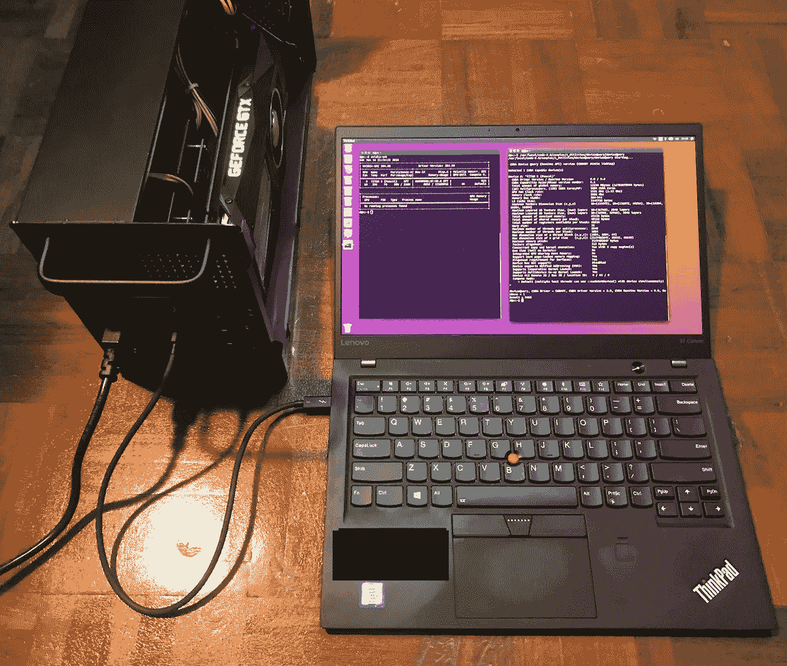
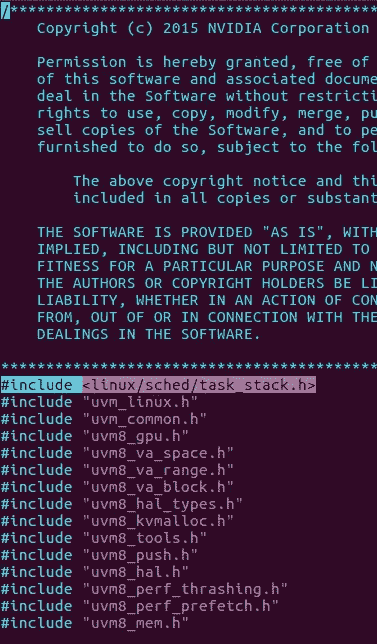
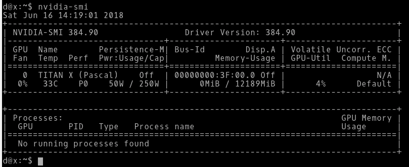
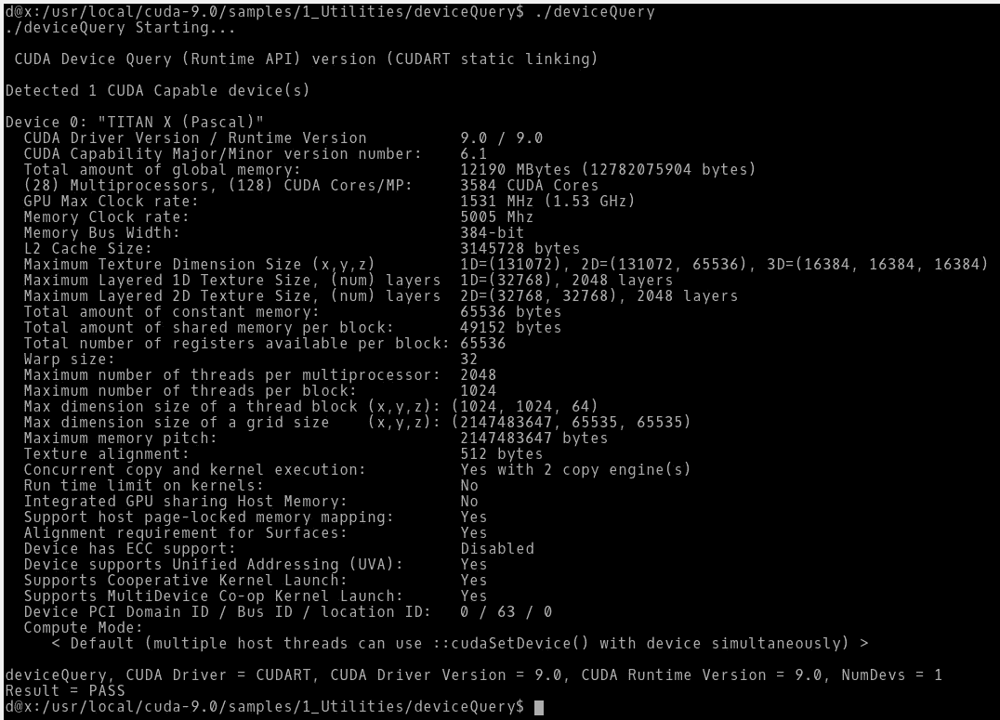
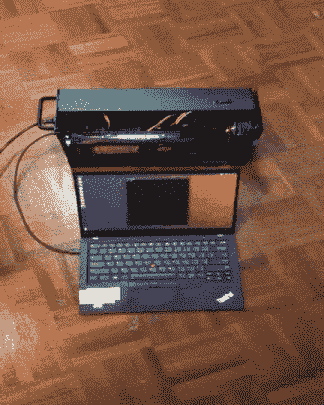

# 诀窍:Nvidia Titan X 作为 Ubuntu 笔记本电脑上的外部 GPU

> 原文：<https://medium.com/hackernoon/recipe-nvidia-titan-x-as-external-gpu-on-ubuntu-laptop-9df2dfc02fc6>



Fresh Titan X wrapped in a modern Akitio Node served on a delicate 5th Generation Lenovo X1 Carbon. Garnished with fresh Ubuntu and a sprinkling of Thunderbolt 3.

没有 [下面是一个屏幕截图，突出显示了添加的行:](https://medium.com/u/150ba9053090#include <linux>”。这一行告诉 C 编译器包含一个 linux 头文件。如果没有这一行，安装程序(稍后)进行的编译将会失败。</linux></p><p id=)

[](https://medium.com/u/150ba9053090#include <linux>”。这一行告诉 C 编译器包含一个 linux 头文件。如果没有这一行，安装程序(稍后)进行的编译将会失败。</linux></p><p id=)

[Add “#include <linux/sched/task_stack.h>” to NVIDIA-Linux-x86_64–384.90/kernel/nvidia-uvm/uvm8_va_block.c](https://medium.com/u/150ba9053090#include <linux>”。这一行告诉 C 编译器包含一个 linux 头文件。如果没有这一行，安装程序(稍后)进行的编译将会失败。</linux></p><p id=)

[*“vim”和“nano”是可以在终端中使用的编辑器。在这个阶段花费比你想象的更长的时间是可以的，特别是如果你是新手的话。*](https://medium.com/u/150ba9053090#include <linux>”。这一行告诉 C 编译器包含一个 linux 头文件。如果没有这一行，安装程序(稍后)进行的编译将会失败。</linux></p><p id=)

[完成后，让我们返回到这个归档文件的根目录，并启动安装程序。](https://medium.com/u/150ba9053090#include <linux>”。这一行告诉 C 编译器包含一个 linux 头文件。如果没有这一行，安装程序(稍后)进行的编译将会失败。</linux></p><p id=)

```
$ cd /path/to/NVIDIA-Linux-x86_64–384.90
$ sudo nvidia-installer --no-opengl-files
```

[当 GPU 仅用于计算时，Nvidia 推荐使用`--no-opengl-files`,就像我的用例。](https://medium.com/u/150ba9053090#include <linux>”。这一行告诉 C 编译器包含一个 linux 头文件。如果没有这一行，安装程序(稍后)进行的编译将会失败。</linux></p><p id=)

[*注意:对于那些希望不安装* `*--no-opengl-files*` *的人，我没有试过这个。*](https://medium.com/u/150ba9053090#include <linux>”。这一行告诉 C 编译器包含一个 linux 头文件。如果没有这一行，安装程序(稍后)进行的编译将会失败。</linux></p><p id=)

[安装程序将提示您一些选项。下面是我的选择:
——预装脚本失败？回答:继续。
——DKMS？答案:否
- 32 位？回答:是的。*回答否不应该导致安装中断*
-配置 X？答案:否*如果 GPU 只是为了计算，就不要回答是。*](https://medium.com/u/150ba9053090#include <linux>”。这一行告诉 C 编译器包含一个 linux 头文件。如果没有这一行，安装程序(稍后)进行的编译将会失败。</linux></p><p id=)

[安装完成后，让我们检查一下安装是否顺利:](https://medium.com/u/150ba9053090#include <linux>”。这一行告诉 C 编译器包含一个 linux 头文件。如果没有这一行，安装程序(稍后)进行的编译将会失败。</linux></p><p id=)

```
$ modprobe nvidia
$ nvidia-smi
```

[`nvidia-smi`应该打印出这样的内容:](https://medium.com/u/150ba9053090#include <linux>”。这一行告诉 C 编译器包含一个 linux 头文件。如果没有这一行，安装程序(稍后)进行的编译将会失败。</linux></p><p id=)

[](https://medium.com/u/150ba9053090#include <linux>”。这一行告诉 C 编译器包含一个 linux 头文件。如果没有这一行，安装程序(稍后)进行的编译将会失败。</linux></p><p id=)

[Output of nvidia-smi](https://medium.com/u/150ba9053090#include <linux>”。这一行告诉 C 编译器包含一个 linux 头文件。如果没有这一行，安装程序(稍后)进行的编译将会失败。</linux></p><p id=)

[重新启动:](https://medium.com/u/150ba9053090#include <linux>”。这一行告诉 C 编译器包含一个 linux 头文件。如果没有这一行，安装程序(稍后)进行的编译将会失败。</linux></p><p id=)

```
$ reboot
```

[对于阿基提欧节点，每次登录，你都必须做两件事，GPU 才能使用:
(I)`$ sudo sh -c 'echo 1 > /sys/bus/thunderbolt/devices/0-3/authorized'`
(ii)`$ modprobe nvidia` *Psst..创建一个脚本在登录时自动完成这些工作。*](https://medium.com/u/150ba9053090#include <linux>”。这一行告诉 C 编译器包含一个 linux 头文件。如果没有这一行，安装程序(稍后)进行的编译将会失败。</linux></p><p id=)

[恭喜你。您已经成功安装了 Nvidia 驱动程序。Ubuntu 现在可以读取你的泰坦 x 了](https://medium.com/u/150ba9053090#include <linux>”。这一行告诉 C 编译器包含一个 linux 头文件。如果没有这一行，安装程序(稍后)进行的编译将会失败。</linux></p><p id=)

## [安装 CUDA(可选)](https://medium.com/u/150ba9053090#include <linux>”。这一行告诉 C 编译器包含一个 linux 头文件。如果没有这一行，安装程序(稍后)进行的编译将会失败。</linux></p><p id=)

[CUDA 对于在 GPU 上进行任务计算可能会很方便。](https://medium.com/u/150ba9053090#include <linux>”。这一行告诉 C 编译器包含一个 linux 头文件。如果没有这一行，安装程序(稍后)进行的编译将会失败。</linux></p><p id=)

[下载](https://medium.com/u/150ba9053090#include <linux>”。这一行告诉 C 编译器包含一个 linux 头文件。如果没有这一行，安装程序(稍后)进行的编译将会失败。</linux></p><p id=)[cuda _ 9 . 0 . 176 _ 384.81 _ Linux . run](https://developer.nvidia.com/compute/cuda/9.0/Prod/local_installers/cuda_9.0.176_384.81_linux-run)。

让操作系统识别泰坦 X:

```
$ sudo sh -c 'echo 1 > /sys/bus/thunderbolt/devices/0-3/authorized'
$ modprobe nvidia
$ nvidia-smi
```

如果你还没有做的话，把暴发户*列入黑名单。本文前面部分的详细信息。*

停止照明。`$ sudo service lightdm stop`。细节在前面部分。

删除运行级别。`$ sudo init 3`。细节在前面部分。

```
$ cd /path/to/cuda_9.0.176_384.81_linux.run
$ chmod +x cuda_9.0.176_384.81_linux.run
$ sudo cuda_9.0.176_384.81_linux.run
```

安装程序将提示您一些选项。下面是我的选择:
——许可协议？按“q”一次可快速滚动到结尾。输入“接受”接受。
-安装 Nvidia 驱动？不。因为我们之前已经做过了。
-安装 cuda 9.0 工具包？是的。
-安装工具包的位置？默认
-安装符号链接？是
-安装样品？是
-样品位置？默认。

在安装即将结束时，您可能会看到一条消息，提示“警告安装不完整…需要至少 384.00 版本的驱动程序才能使用 CUDA 9.0 功能。”这是 ***而不是*** 的一个问题。我们很好。

检查安装:

```
$ cd /usr/local/cuda-9.0/samples/1_Utilities/deviceQuery
$ sudo make all
$ ./deviceQuery
```

*deviceQuery* 应该打印出这样的内容:



output of deviceQuery

# 然后…我们结束了！恭喜你走到这一步。



Hurray

*思考内容:
一些涉及远程访问的机器和相对较大的对象的工作流仍然感觉很自然。例如，对训练过的神经网络进行定量基准测试。eGPU +笔记本电脑设置可能不会改善您的工作流程。*