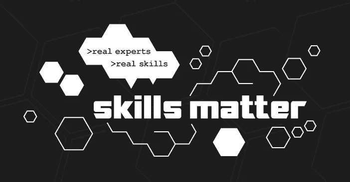
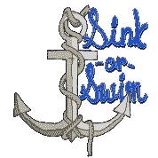

# 科技面试中的危险信号

> 原文：<https://medium.com/hackernoon/red-flags-in-interviews-7430d28b86b5>

# 介绍

这是我们在一集 [FetaReport](http://www.fetareport.gr) 中讨论的记录，有许多修改。虽然原始内容是希腊语，但我们认为向国际观众发布我们的内容可能会很好。如果您认为这样的内容会让您感兴趣，即使带有滑稽的口音，请联系我们或在这里留下评论，以便我们对您的反馈做出反应，并开始用英语录制或更多地写博客。

需要注意的是，没有完美的工作。对一个人来说，构成[红旗](https://hackernoon.com/tagged/red-flag)的东西，可能对另一个人来说是绿旗。此外，一个人想从工作中得到什么取决于个性、生活方式、人生阶段(例如:单身、已婚、成家)，或者一言以蔽之:环境。

考虑到这一点，一个“我们整天工作”的信号对于一个有家室的男人来说可能是一个危险信号，但是对于一个渴望获得经验的初学者来说却是一个“哇，会学到很多东西”的信号。

希望这篇文章能让你对下一次找工作有所准备，或者至少让你开心。

# 人

我们中的一个是软件工程师，一个做数字营销，第三个
成员在设计行业。

# 大量的前期工作

第一个危险信号:当一家公司在面试过程的早期要求你做很多工作，这样你就可以继续申请了。

在数字营销领域，有些公司会要求面试官完成一些小任务，最多花 0.5 到 1 个小时。

在设计行业，我们会遇到非常模糊的概要，很容易需要整个团队来实现它们，同样，在 IT 领域，我们被要求从头开始制作整个应用程序。

通常招聘人员倾向于消极进取，说"*你看起来很棒，很适合我们公司*"，然后是臭名昭著的"*但是*，" *…先做这件事，不会超过 10 个小时，*"好像有人可以凭空出现 10 个小时。

和设计界的人讨论这个，已经被当做行业的“*祸害*提出来了。一位内部人士匿名透露，公司这样做的主要目的与其说是检查候选人是否合适，不如说是检查这个人是否愿意给他们 10 个小时或一个周末的时间来接受公司的面试。另一个目的与其说是测试候选人，不如说是阻止他们同时申请其他公司。

在 IT 领域有一些历史。许多年前，在印度的许多大学毕业生中做过一项研究。结果发现，这些毕业生中有很大一部分(大约 40%)不能用任何编程语言实现一个小 FizzBuzz 算法。

参考，请看 FizBuzz 视频:

为了解决这个问题，这些测试被发明出来，许多公司提供“测试即服务”，其目的是过滤掉 40%的候选人(参见[为什么程序员不能..程序？](https://blog.codinghorror.com/why-cant-programmers-program/))。

这种方法的延伸是一些小任务，看看人们在文化上是否适合他们未来的团队。例如，说明中有一些模糊的地方，候选人会要求澄清吗？做他们认为最好的事，然后继续前进？两者都有？还是因为不确定就什么都不做？以上都是适当的反应，在不同的团队和文化中是不可接受的。一些公司还会邀请你到他们的公司工作一天，以验证你的能力并了解你的方法。一个降级版本是 10 小时“测试”。

除了每年对每个人都一样的通用测试，公司也可能调整他们的“创造性测试”来应对他们积极面对的问题。对于他们来说，这是一个获得廉价(即免费)洞察他们当前正在处理的问题的好方法。以“面试测试”的形式。这有额外的好处，他们不必为候选人提供的解决方案或见解付费。典型的输赢场景。

对于这些行业的人来说，尤其是在几年后，拥有展示他们工作的作品集或各种资料库是很常见的。然而，这种水平的过去的工作经常被忽视，候选人仍然被要求为公司执行时间密集型任务和测试。

**更新**:发现另一种命名方式叫做
“试镜”:[https://HBR . org/2018/07/what-do-if-a-employer-quest-you-to-do-a-job-audition](https://hbr.org/2018/07/what-to-do-if-an-employer-asks-you-to-do-a-job-audition)

# 快节奏的环境

通常在工作描述中被称为“快节奏的环境”。一些替代方案是“我们动作很快*”，或者我们“努力工作*、*、**、*玩*、**、*、*”——尽管很少或从不伴随来自“我们*、**、*、*、**、*、*。**

*最近，我们中的一些人听到电话另一端的人说“*……我们的员工每天呆的时间更长，不是因为有人强迫他们，而是因为他们(真的)想……*”。为了完成任务或个人原因，甚至是个人发展，我们都会时不时地在办公室呆上更长时间。当公司提到(1)每个人(2)总是呆到很晚时，这就是危险信号。(3)永久地。*

*这可能是试图掩盖有问题的项目管理或完全缺乏管理。我们中的一个人被告知，有些日子他不得不呆得更久，因为一些客户在美国的海外，所以不得不在深夜与他们打电话。他最终改变了工作时间，从早上 8:00 开始工作，而不是合同规定的 9:00 开始工作，并推迟下班时间。那段时间主要是在等待其他团队交付工作负载，因为团队之间缺乏协调。没有人想插手改革或重组事情。*

*当提到这一点时，管理层声称“我们在面试中通知过你，有时你可能不得不加班”。因此，通过使用这种“任意条款”，该系统被滥用，而“熬夜”的需要被用作掩盖其他更明显的沟通和管理问题的拐杖。*

# *一个团队的领导者——负责所有事情*

**

*一些角色在讨论的第一步就开始招聘领导职位，甚至在第一次通话中，就清楚地表明这个人将"*领导*"一个只由他们自己组成的团队。在这种情况下,“领导者”意味着一个人将负责团队的所有职能。*

*在一个案例中，一家公司正在为一名 UX 设计师做广告，但也想让同一个人来做他们的广告宣传横幅，将两种功能融合为一个职位，因为…有创意。基本原理是，该公司正在进入这一领域，UX 人应该做的事情并没有被他们完全理解，他们也没有将这一职能纳入他们的结构和工作流程。因此，UI/UX 人员将负责做“旧的”事情，而公司将走向成熟。*

*另一种方式是说，公司目前正在扩张，因为候选人将在早期就在那里，首先，后来他们将“*围绕他们*建立一个团队”。这可以被视为引诱高层的一种方式:“我们希望一个人对所有事情负责”是一个难以下咽的药丸，而在后台负责所有事情，而我们正在围绕你建立一个团队听起来像是一个公平的交易。与此同时，你将拥有“开发主管”的头衔，因为这些头衔很便宜。*

*根据过去的经验，我们中的一个人被录用了，他发现自己是团队中职位最高的。后来，随着公司的发展，他被提升为经理，并围绕他组建了一个团队。采访中没有讨论这一点，当然也没有承诺，这是随着团队和公司的扩张而自然发生的。这个职位没有被宣传为管理职位，因此这是一个很好的职业转移，如果同一个人正在面试管理职位，他会希望与团队见面或影响团队的[招聘](https://hackernoon.com/tagged/hiring)决定。*

*另一名成员有着不同的经历:他被某个地方聘用，并承诺有一个围绕他建立的团队。作为开发人员/架构师，他尽了最大努力，但当扩张的时候，他看到一个项目被外包，而不是有人向他汇报。后来人们加入后，他们直接向首席技术官报告，而不是他，因为他们应该履行不同的职能。在某个时候，他被告知管理层已经找到了一个伟大的开发人员，这在他们的脑海中是罕见的，他们不想失去他，因为他是一个没有经过证明的记录的经理，至少在特定的公司内。*

*虽然上述论点对公司来说可能有意义，但对这个人来说肯定没有意义:这个人没有在其他组织中担任过对他来说更直截了当的职位，比如公布一个严格负责技术的职位。然后，他努力工作，没有报酬，因为最终会有管理上的提升。*

# *谜题狂热*

**

*谜题与 IT 领域的关系最为密切。在几个面试场景中，候选人被要求解决一个又一个难题。*

*有算法难题，如最短路径，双向链表。一般来说，学术界有时会将这些主题作为操作系统如何工作或编程语言编译和执行的一部分来讲授。这类谜题的问题在于，它们对应届毕业生非常有利。有时是下意识的，有时是有意的。*

*当一家公司被指控年龄歧视时，这种意图显而易见。他们的回答是“每个人都可以加入，我们有一个公正的面试过程”。虽然这在理论上是正确的，而且工作说明不限于特定的年龄范围。提问的问题包括与毕业生思维更相关(即“新鲜”)的练习和谜题。这是一个聪明而微妙的方法，通过年龄来区分候选人，因为最近的毕业生将更有能力解决这些难题。*

*英国法律不允许你根据性别、种族、年龄等选择候选人。这就是为什么通过我们的简历分享个人信息，如性别、种族甚至照片，会受到反对的主要原因之一。考虑到这一点，如果你因为某个特定的原因想只雇佣年轻的毕业生，你可以通过主要询问谜题来做到这一点。当然，这也适用于“大龄”毕业生；在 29 岁的成熟年龄获得理学硕士学位后，我们中的一个人能够通过所有这些测试。但当同一个人离开学术界几年后，他们很难回答这些问题，因为这些算法的细节已经脱离了他们的记忆。*

*更新(发布后):这种行为可以归因于除了过滤掉候选人之外的其他方式，即使这是最终结果。可以归结为面试者选择不当。可能是一名开发人员被要求协助招聘，然后对面试过程了解不多，只是在网上搜索，并使用出现的第一个结果作为“聪明编程面试问题”。另一个原因可能是大公司带着一种“趋势”和从众心理来接受这些难题；“如果谷歌这样做，我们也应该这样做”。*

# ***现在就做——一小时后***

**

*这是“智力狂热”和“提前工作”的精神产物，你最终会做一些无论如何都要在一小时内完成的在线测试。*

*这种方法的问题在于不同的人对严格的截止日期的反应。由于以前的经历，我们中的一个人会有下意识的反应，比如在开始任务前询问分配一个小时的理由。现实生活中有多少日常任务需要在一小时内完成？如果一个人完成了一半会怎么样？*

*在其中一些在线配置中，任务可以在大约 20 到 30 分钟内轻松完成，其余的可以用于保证、解决偶然问题或缓冲。在其他一些情况下，它被配置为接近一个小时的不间断编码，有利于那些在过去解决了非常类似的练习或难题的人。*

*一些公司将其视为一种压力测试，以验证人们在严格的约束下如何工作。和以前一样，随大流的可能性总是存在的:如果其他人都做这些测试，我们也应该把它们整合到我们的面试过程中。*

*然而，这并不是说这些测试是绝对的。好的公司会对你在一小时内的工作质量进行审查。即使你无法解决问题，他们也会对你的基本原理、方法和解决问题的方式感兴趣。然而，有些公司的招聘方式要么非常死板，要么非常粗糙:对这些公司来说，不管采用什么方式，解决问题都是重中之重。如果你错过了目标，哪怕只差几分钟，你就失败了。*

# *你将了解这个领域*

*断断续续有人建议，通过在公司工作，一个人将“*学会领域*”。例如，在为银行工作时，你将学习金融市场如何运作的来龙去脉，类似地，在构建博彩软件时，博彩行业是如何运作的，等等。*

*这通常是一个好主意，也是预料中会发生的事情。当它被用来掩盖公司缺乏程序、适当的项目管理或基础设施时，就会出现问题。*

*一个可能的原因是，如果该公司没有任何实质性的东西在这方面提供。举个例子，一家公司在卫生部门运营，因此员工应该与医生进行大量互动。在这种情况下，他们将通过每天与从业者的互动来学习医疗空间是如何工作的。这可能意味着，而且我们以前有很多这方面的经验，没有项目管理，没有负责质量保证的人，没有其他角色，所以个人除了他们的典型职责之外，还要做需求收集、客户支持、客户服务和项目管理的混合工作。*

*一个很好的总结方法是，在这些地方，你不会走出你的舒适区，拓展你的技能，你宁愿做与你的职业完全无关的事情。公司不会从你目前的专业水平提升你，更像是一步“走出去”。这一切在历史上被称为“了解领域”。*

# *技能并不重要*

**

*Well… the opposite*

*在这种情况下，评估候选人的技能，他们目前和未来的轨迹退居其次。“技能不重要”的方法与候选人的个性、标准、属性、爱好以及他们如何与他们即将加入的团队保持一致有着更大的关系。*

*换句话说，检查受访者是否是一个好“小伙子/小姑娘”，而不是一个潜在的好员工。*

*我们中的一个人接受了一家公司的面试，这家公司正在为养狗的人开发一个应用程序。办公室里挤满了狗狗、pupper 海报和其他与狗狗相关的物品。采访进行得很顺利，直到导演问了一个问题:“你喜欢狗吗？”。这位候选人从未真正养过狗，他回答说“我想他们还不错”。他可以立即看到何导演眼中的轻蔑，采访被缩短了，并承诺“*未来跟进*”这从未发生。*

# *没有职业发展*

*我在一个招聘平台上与一些公司交谈时发现了这一点:有些公司表现非常好，比如赢得了一份大合同，或者进入了下一轮融资。这通常是个好消息，祝贺他们的团队实现了这一目标。*

*在他们旅程的这一阶段，他们希望有许多人帮助他们的产品起飞或参与让他们进入下一阶段，如帮助他们扩大规模。*

*在与他们交谈时，似乎没有任何线索表明过了这个阶段，潜在的员工会发生什么。一个曾经加入他们行列的人，在经历了“血汗泪”期之后，会如何进化？所有人都知道，在他们的产品成熟后，他们甚至可能会裁员，这样那些付出努力的人就会离开。*

*这些职位适合那些开始职业生涯的人，他们将接触到许多不同的经验，或者是那些想要这些知识来经营自己公司的人。但一般来说，这种提供是不对称的，因为雇主希望雇员做“额外的”工作，但最终却没有任何补偿。*

# *围绕 Rick 构建项目/部门*

**

*另一个危险信号是“围绕 Rick 构建的项目”。Rick 是一个化名，基于我们解雇了我们的顶尖人才。我们做过的最好的决定”和回应:“[你解雇了你的顶尖人才。希望你开心](https://startupsventurecapital.com/you-fired-your-top-talent-i-hope-youre-happy-cf57c41183dd)”。它描述的是围绕一个人构建的项目，有时是整个部门，为了便于讨论，我们称他为 Rick。*

*这些设置的一个问题是，当 Rick 因为任何原因离开时，即使他病了几天，所有东西都会崩溃，或者变得残废，无法运行。当 Rick 在度假或出于任何原因不在办公室时，他仍然回复电子邮件或参加聊天室。*

*如果 Rick 喜欢一种特定的方法，那么每个人都必须使用这种方法，这同样适用于设计方法、编程语言等等。其他员工不得不听首席女歌手的话。*

*发生这种情况的一个原因是，在过去的某个时候，Rick 建立了某种工作的东西，或者是同一公司中唯一一个这样做的成员。从那一刻起，所有的一切都被固定下来，瑞克是这个传统的守护者。*

*这表现在面试中，通常开放式的问题都是为了看你是否准确地回答了那个人想听到的问题。其他时候，它被准确地提出来:“*我们使用我们的首席开发人员构建的内部平台*”。独立于那个人是否做了正确的、错误的事情，这就是事情应该如何运作，他应该完全控制。他们发现，贫穷或许多时候不那么贫穷的灵魂和所有的项目都在他的肩膀上。*

*另一个发现这一点的方法是通过会见处于不同面试阶段的人，这些人都在“里克的”部门呆了最多 1 或 2 年。出于一个“神奇”的原因，之后它们往往会消失。原因很容易猜测:他们要么想进化，要么不像瑞克的卫星那样工作。*

# *做公司的里克*

**

*上述风险情况的一种变化是，当一家公司想雇用你，这样你就会成为他们的风险:只需获得他们当前和未来的所有项目，每天工作 48 小时，让每个人都依赖你。*

# *成败在此一举*

**

*[https://www.spreadshirt.com/sink+or+swim+maritime+anchor+and+rope+men-s+premium+t-shirt-D12681047?sellable=14578944](https://www.spreadshirt.com/sink+or+swim+maritime+anchor+and+rope+men-s+premium+t-shirt-D12681047?sellable=14578944)*

*它指的是当你开始工作的时候，你必须自己解决所有的事情。你可能会看到一些常见的危险信号短语，如"*在第一天*提交生产代码"、"第一天的*影响"、"第一天*投入运营*"。这些短语充当没有任何适当的入职流程或没有解释公司基础设施如何工作的借口。**

*我们并不提倡与新员工牵手，而是从简单的事情开始，然后转向一个人无法自己推断的更严肃的事情。一些技术性的问题，比如:“我们使用吉拉来管理门票”，或者何时呼叫客户，何时呼叫，是否需要先联系某个特定的人？在会议中，当人们说话问问题时，打断他们可以吗？*

*这方面的一个例子是，一个没有任何入职培训的地方，当高层出现问题时，管理层会抱怨。有一次，一位客户在电子邮件中问了一些问题，营销人员会立即回复。然后，他们的经理告诉营销人员，他们应该在联系之前先问他们。关于问谁，什么时候问，什么时候不问，什么是好的，什么是不好的，有很多猜测；与工作或职业的细节无关的问题，而是如何在特定的组织中发挥作用的问题。*

*脸书有一个非常好的入职流程，当一个新员工开始工作时，他们会由一个已经在公司工作了一段时间的人来指导，这样所有与公司相关的事情都可以得到适当的解释。然后，随着新员工融入组织，作为“培训轮”的那个人逐渐越来越多地移动到后台。在其他地方，同样的事情也会发生，当他们分配一些很小的东西，比如“*改变按钮*的背景颜色”。通过完成一系列琐碎的任务，有时是清洁工作，甚至是清理积压的日志，人们可以了解系统，学习如何建立开发环境，等等。*

*当在不同地方询问为什么会发生这种情况时，“官方”的回答通常是资源不足，或者用一种更假礼貌的英语方式说，适当的入职是一种“*奢侈品*”。事实上，这更多的是糟糕管理的“味道”:当其他更合适的经理离开时，人们只是通过等待轮到自己成为经理，或者当公司扩张时，唯一的开发人员(实际上“围绕他们建立团队”的人)得到了晋升，这是一件好事，但没有任何关于新职位的培训或学习。其中一个功能性白痴给出了一个半自闭症的回答:“我没有入职，所以你也不应该”，忽略了不同的人有不同的需求，或者他在那里的时候人很少，基础设施很少，所以事情很容易猜测，虽然他入职了，但不是正式的。*

# *你会怎么做？
我们决定做一个关于这个主题的后续播客，但不知道什么时候。给我们发来你的意见、程序，以及一般的“你是怎么做到的”，或者你在接受采访时喜欢的东西。*

*一位[听众](https://www.reddit.com/r/greece/comments/8n7lht/κόκκινες_σημαίες_σε_συνεντεύξεις_τι_να_προσέχετε/dztto53)带着他的方法来了，我们大致翻译如下:*

> *我更喜欢的一种方式是给他们一个小问题，而不是难题，并要求他们提供解决方案。背后可能有算法，也可能没有。根据经验和能力，候选人将得出一个答案，无论最近是否教授过特定的知识。*

*—*

*我正在写一本名为《IT 原型》的书——这是一本给 IT 人士的“了解你自己”指南，也是一本给那些与他们互动的人的“了解你的朋友”指南。点击这里查看:[http://www.itarchetypes.com](http://www.itarchetypes.com)并订阅时事通讯，获取新章节的更新。*