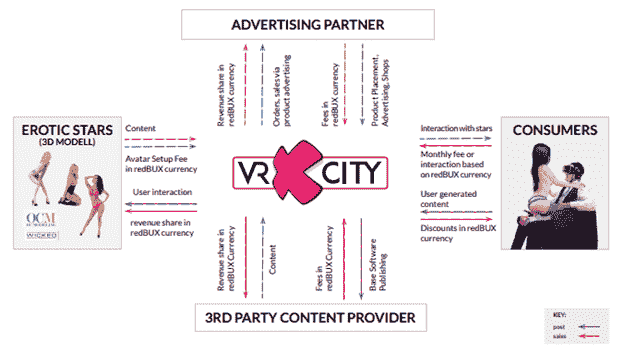
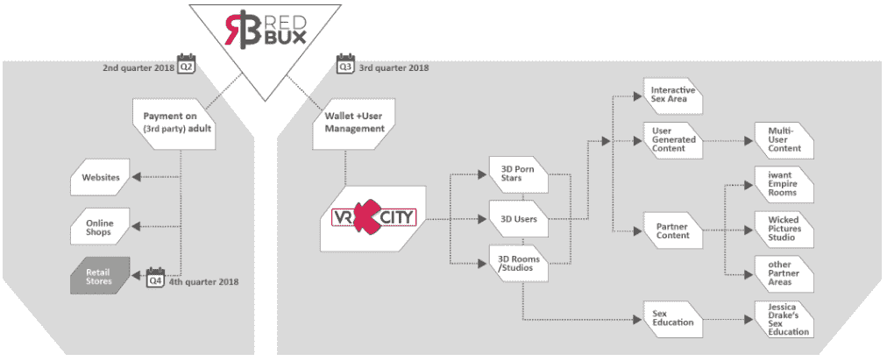
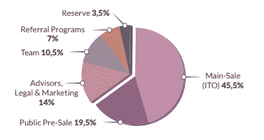
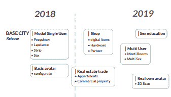

# redBUX ICO 评论

> 原文：<https://medium.com/hackernoon/redbux-ico-review-85e7c29e58f2>

Before reading this article, please read our disclaimer found at the bottom of the article or [here.](https://thebestoficos.com/disclaimer.html) This Paid Story is brought to you by Me.mento.

## 情色虚拟现实令牌

# 介绍

Me.mento 是一家总部位于德国柏林的公司。他们制作了 vrXcity，一个类似模拟人生的虚拟世界，用户可以在 VR 中与他们最喜欢的色情明星的人工智能，照片逼真的化身进行互动，他们可以用这些化身实现他们的任何和所有幻想。他们正在筹集资金，对 vrXcity 进行最后的润色，推出该产品，并在两年内将他们名册上的成人内容明星数量增加到 7000 多名。

他们的 ICO 目前正在进行中，他们正在筹集€1.3 亿英镑来换取他们的 redBUX 代币。该公司目前正以€100 的价格出售 10，000 辆雷德布克牌汽车(每辆€0.01 英镑)。公共预售期有 35%的折扣，将持续到 4 月 15 日，4 月 16 日之后折扣将降至 15%，4 月 30 日将进一步降至 5%。他们的网站可以在这里找到(**警告**:仅成人链接)。

他们将预售限制在 39 亿代币。一个野心勃勃的 ICO。我们预计在不久的将来，成人内容(和虚拟现实)会获得很大的发展势头。截至今天，该项目已经售出了大部分预售代币(超过 20 亿)。

# 这个想法

## 结合模拟人生和 VR 色情

这个 ICO 的特别之处在于，人们很容易相信这个产品可能会很大。他们已经证明，他们可以通过在这个领域引入大牌来吸引必要的合作伙伴，比如邪恶的图片和几个著名的成人明星。当想到 AR 和 VR 的应用时，几乎每个人都会自然而然地想到色情。vrXcity 是将模拟人生、虚拟现实和成人内容结合在一起的结果。

> 如果你能以任何你想要的方式互动会怎样？如果你想体验你最喜欢的色情明星，通过 BDSM，在月球上，或在宇宙飞船上？如果你可以成为任何你想成为的人呢？
> 
> — Sebastian Malm，redBUX 首席采购官

它是世界上第一个面向成年人的交互式 VR 色情平台。用户可以与他们最喜欢的成年明星(以及最终通过弹出式商店和信息亭“扫描”进来的业余模特)的完全动画、人工智能化身互动。他们声称在质量和他们的前一家公司已经生成的 3D 模型库上领先竞争对手两年。

该公司自 2014 年开始运营，最初专注于为 Wicked Pictures & JOYclub 等公司制作色情演员的 3D 打印模型，后来转向制作 3D 数字化身。

> “开始 3D 打印的想法来自于这样一个事实，即它允许令人难以置信的大量定制。我们有必要的设备来扫描和创建色情明星的模型。向虚拟现实的过渡变得清晰”
> — Sebastian Malm，redBUX 的首席采购官

## 背景:虚拟现实和色情业的市场规模和人口统计

通过提供 VR/AR 和色情行业的规模背景来丰富 vrXcity 的解释是有用的。

***色情:*** 。全球色情市场是娱乐业最大的市场之一，年销售额约为 1000 亿美元。更进一步来说，美国色情业的利润比好莱坞电影大 50%，比 NFL 和 NBA 加起来还要大。在保守的瑞士，25%的互联网用户消费色情内容，而在德国，12.5%的互联网流量流向色情内容。不用说，尽管有着禁忌的地位，成人娱乐业是巨大的，值得追求。

***虚拟现实/现实:*** 国际数据公司(IDC)预计 2016 年虚拟现实市场规模为 52 亿美元，预计到 2022 年将增长至 1620 亿美元，CAGR 增长率分别为 85.4%(现实)& 44.5%(虚拟现实)。虚拟现实用户的主要人口统计数据是 40 岁以下的男性，这与色情行业的人口统计数据非常吻合。同样值得一提的是，该行业的增长率预计也将是科技和娱乐行业中最大的。像谷歌这样的公司在过去 3 年里已经在虚拟现实技术上投入了数千亿美元。

在过去的几十年里，色情在娱乐技术产业中扮演了重要的角色。它在 20 世纪 90 年代 VHS 超过 Betamax(技术上更胜一筹)和蓝光超过 HD DVD(2000 年代中期)的成功中发挥了重要作用。Me.mento 认为，通过将色情体验从被动(图片和视频)转变为互动(虚拟现实)，色情将在虚拟现实作为娱乐媒体的采用中发挥类似的重要作用。

> “性就是互相交流。cam girl 热潮表明，人们希望进行互动，但用户和 cam girl 之间仍有很大的障碍，你无法真正互动。”
> — Sebastian Malm，redBUX 首席采购官

vrXcity 将是一个虚拟世界中的数字市场，包括:色情明星(通过照片级模型)、消费者、广告合作伙伴和第三方内容提供商。请参见下图，了解各方将如何与 vrXcity 互动的高级概述。

Figure 1\. High Level Overview of vrXcity Platform. Image from Page7 of redBUX white paper found [here](https://ico.redbux.io/resources/WhitePaper_redBUX_en.pdf)

***情色明星——***成年明星和业余爱好者可以在 me.mento 的任何一个扫描中心创建自己的 3D 模型，然后人工智能被用来“激活”化身，允许用户与栩栩如生的角色互动。

色情明星可以租用自己的工作室，这是 vrXcity 世界中的一个虚拟商店，在那里他们可以为他们的粉丝提供特殊服务。他们可以根据用户的喜好定制自己的工作室，甚至可以为内衣或性玩具等各种产品做广告。

色情明星只需要在扫描网站上一次性创建他们的头像，就可以获得长期的收入流。一旦创建，数字化身可以与客户全天候互动。这些与用户的关系由数字合同管理，付款使用 redBUX 令牌作为货币自动排序。

***消费者—*** 色情占全球互联网流量的 7.65%。色情内容增长最快的部分是网络摄像头/直播节目，这表明市场需要更个性化的内容。vrXcity 提供了个性化的体验，但重要的是，它还允许用户做更多的事情，而不仅仅是被动地观看。这让他们可以像生活一样与他们喜爱的色情明星互动。

像色情明星一样，消费者也可以在这个虚拟世界出租工作室，并根据他们的需要和需求设计房间。他们甚至可以对现实生活中的伴侣进行身体扫描，享受与他们在一起的未实现的性幻想。他们甚至可以和朋友一起组织换妻派对，并通过他们活动的入场费来赚取 redBUX。

vrXcity 还将有一个名为 Free Style Studio 的功能，用户可以在这里设计他们的幻想体验，甚至可以选择他们的梦想伴侣，包括选择身体尺寸，罩杯尺寸，眼睛和头发颜色。进入 Free Style Studio 需要支付额外的费用，费用取决于实现愿望所需的计算机工作量、序列的长度以及用户选择的星星。

使用区块链将允许用户享受一个简单、安全和匿名的系统，最大限度地减少他们在虚拟世界中支付商品和服务时的分心。

**图二。vrXcity 中 redBUX 的使用案例**

Image caption: Image from company ICO page found [here](https://ico.redbux.io/)

***品牌/广告商—*** 品牌可以利用色情明星的受众，并且可以在不需要明星亲自到场的情况下制作广告。不再局限于 2D 图片或视频，产品可以通过演示进行广告宣传，并可以当场购买。性玩具是一种与成人内容一起销售的常见产品，在 vrXcity 中，性玩具可以由他们最喜欢的色情演员演示。网络女孩也可以对他们的粉丝施加影响，以获得数字或实物礼物。广告商也可以在虚拟世界的户外建筑上投放广告。

***外部内容提供商—*** 第三方软件开发商将能够与 vrXcity 互动，并能够使用 redBUX 作为安全和匿名支付选项来发布 3D 色情游戏、360 度视频和其他内容。Me.mento 将收取初始服务费和第三方提供商销售收入的一小部分。

# 令牌——第一个成人内容令牌

redBUX 声称是一种公用事业令牌，它基于标准的 ERC-20 以太坊智能合约。消费者、色情明星、广告商和第三方内容提供商可以用代币买卖商品和服务。他们也可以在交易所买卖代币。

新用户必须在交易所购买 redBUX 才能与虚拟世界互动。vrXcity 之外的合作伙伴，如 Wicked Pictures 和 iwantEmpire，也将接受 redBUX 作为其内容和网络摄像头频道的付费，从而增加对 redBUX 的需求，提高交易量。

> 激发我们创作 ICO 的原因有三个:
> 
> 1.我们需要一个好的支付解决方案，因为这个行业的支付非常受限。
> 2。不需要复杂的协议和文书工作就能给色情业者发放许可证和支付报酬，这对于这个行业来说是极其受限的。利用加密货币为客户提供的网络效应。
> - Sebastian Malm，redBUX 的首席采购官

me.mento 的团队声称他们拥有可以创建真实人物的照片级 3D 化身的技术。目前还不清楚这些头像在发布时是否真的像照片一样逼真，或者像白皮书中看到的那样具有良好的 3D 渲染质量。他们依赖第三方 VR/AR 耳机，如 Oculus 或即将推出的 Magic Leap，以及辅助工具，如触觉响应设备，让用户体验他们的虚拟世界。

他们还提到化身将是人工智能的，但没有讨论在这方面的进展。他们可能需要在内部开发这种能力，他们还需要找到一种方法来捕捉真实人物的个性，并将其传递给他们的角色，以提供出色的用户体验。

区块链技术允许 vrXcity 的所有利益相关者之间的无缝支付生态系统，包括消费者、成人明星、广告商和第三方内容提供商。无论用户身在何处，简单的购买和其他交易都易于验证、确认和实施。

> “德国在网上支付方面非常严格，我们必须制定有价值的步骤，以便为用户提供更好的整体体验，特别是在虚拟现实体验中，你不能只放信用卡，那样会破坏体验”
> — Sebastian Malm，redBUX 首席采购官

虽然可以理解 me.mento 将他们的努力集中在开发虚拟世界本身而不是构建复杂的虚拟现实硬件上，但应该注意的是，这可能会使提供无缝用户体验变得具有挑战性，因为有许多虚拟现实解决方案，所有这些都可能会给用户体验带来轻微的变化。

# ICO

他们的 ICO 目前正在进行中。预售从 3 月 22 日开始，到 4 月 15 日结束。在此期间，该公司向 redBUX 的购买者提供 35%的奖金。估计价格将是€0.01 减去 35%的折扣。大拍卖将从 4 月 16 日开始，持续到 5 月 15 日。最低购买要求是价值 100€雷德布克代币。

Me.mento 将从有上限的 20B 供应中发行 13B redBUX。未售出的 redBUX 代币将在代币出售后被烧毁。白皮书解释说，他们将从预售中筹集€1.3 亿英镑、€3900 万英镑(39 亿英镑)和€9100 万英镑(91 亿英镑)的主要销售收入。您可以使用法定货币(欧元和美元)或加密货币(瑞士联邦理工学院、BTC、BCH & LTC) [在此](https://ico.redbux.io/)购买代币。除了美国、中国、新加坡、韩国、越南、伊朗、朝鲜、叙利亚、苏丹&古巴以外，所有国家的公民都可以参与销售。

下面的饼图显示了令牌供应将如何分配:

**图三。redBUX 令牌分发**

Image Caption: Image found on page 14 of redBUX white paper found [here](https://ico.redbux.io/resources/WhitePaper_redBUX_en.pdf)

截至 2018 年 3 月 26 日，他们已售出 3.9 亿枚代币中的 2，020，286，982 枚，约占预售总量的 52%。

***资金申请:***ICO 的资金将用于完成 vrXcity 原型，完成内部产品测试，然后进行私有&公测。根据 beta 测试者的反馈，该产品将准备全面推出 MVP 级别的功能，包括 900 多名成人明星的 3D 化身，以及享受西洋镜，艳舞，脱衣舞和交互式虚拟现实性爱的能力。然而，其他功能，如访问数字商店，多用户功能，如群交，扫描自己进入虚拟世界的能力，以及更多身临其境体验的交互式硬件，要到 2020 年才能实现。请参见下面的资金使用明细，以及在首次发布时将发布的功能。

**图 4。资金使用**

图片说明:在 redBUX 白皮书第 16 页找到的图片在此处找到

**图 5。将于 2020 年前发布的特性**

Image Caption: Pg 18 of redBUX white paper found [here](https://ico.redbux.io/resources/WhitePaper_redBUX_en.pdf)

# 牵引力

根据白皮书，该团队即将完成 vrXcity 的 alpha 版本，应该很快就会开始测试。他们希望在 2018 年夏季发布该产品之前及时完成 alpha 和 beta 测试。这个产品需要大量的开发工作，所以这本身就是一个令人印象深刻的壮举。尚不清楚该团队如何将人工智能融入该产品的第一个版本，如果有的话。白皮书本可以对产品的这一部分做更多的解释。

该团队在与 900 多名成人电影演员建立许可协议方面取得了令人印象深刻的进展，其中包括像德克萨斯帕蒂(23.8 万 facebook 粉丝)和杰西卡·德里克(27.5 万 Instagram 粉丝)这样的明星。他们还与 7000 多家 camgirls 和 150 多家零售店达成协议，这些零售店将在 vrXcity 上宣传他们的产品，并从 100 多家拥有大量受众的合作伙伴网站接收社交推送。

# 组

Me.mento 拥有一个强大的创始团队，拥有交付虚拟现实产品所需的商业和技术经验。围绕 me.mento 团队的唯一不清楚的能力是，他们是否能够建立人工智能人才，以创建能够通过类似人类的交互提供良好用户体验的化身。

me.mento 的首席执行官托拜厄斯普拉特(Tobias Platte)曾在德意志银行领导营销工作，经营一家国际广告公司以及几家初创公司。塞巴斯蒂安·马尔姆(Sebastian Malm)是该公司的首席产品官，他在游戏设计和用户体验方面有着深厚的经验，这种经验将是我的巨大财富。该团队发展迅速，在 R&D 有 14 名团队成员，4 名概念和游戏设计，12 名动画，21 名角色艺术，还有 9 名开发 vrXcity 的虚拟环境。

他们有强有力的顾问来帮助促进合作伙伴关系和协议，他们将需要建立一个良好的发布足够的内容基础。优秀战略顾问的例子包括史蒂夫·奥伦斯坦，Wicked Pictures 的创始人，以及区块链专家蒂尔·冯·阿宁和安德烈亚斯·拉约·克尼普。

# 结论

与市场上的许多 ico 相比，这款产品是最容易想象的产品之一，如果执行得当，它会有非常强劲的需求。这几乎不需要解释，人们天生就知道这样的产品有多大，这仅仅是因为色情行业有多大，以及通过使其互动可以改善多少体验。未来的功能，如能够创建重要他人的头像，也非常有趣，可能会导致我们现在体验的关系发生重大变化。

围绕该项目的技术进展存在一些模糊之处，尤其是围绕白皮书中发现的人工智能声明。可能是他们外包了产品的这一部分，白皮书只是不清楚，或者 vrXcity 的 AI 组件不会在最初的产品中发布。强大的用户体验将是他们赢得客户的必要条件。质量的门槛很高，如果团队不能提供逼真的虚拟形象，或与这些虚拟形象进行愉快的人类互动，那么采用可能会被一群早期采用者所限制。

该团队在与业内一些最大的公司结盟方面表现出了强大的牵引力，与 900 多名成人明星和 7，000 多名网络摄像机女孩签订了许可协议。来自 Wicked Pictures 和成人明星& camgirls 等合作伙伴的潜在营销推动可能会使这个项目取得成功，因为他们可以发布一款引人注目的产品。

想帮忙吗？

在 Bountey 上支持我们！[https://www.bountey.com/bestoficos](https://www.bountey.com/bestoficos)

想在 ICOs 中保持最新？

在 https://thebestoficos.com[拜访我们](https://thebestoficos.com/)

有一个有趣的故事？

给我们在 info@bestoficos.com 写信

# 放弃

本网站及其包含的信息无意成为投资、金融、技术、税务或法律建议的来源。本网站不能代替专业建议和独立的事实验证。在没有首先评估你自己的个人财务状况，也没有咨询财务专家的情况下，千万不要使用这个网站上的想法和策略。本网站的所有内容仅供参考，按“原样”提供，不保证完整性、准确性、及时性或使用本网站所获得的结果。这只是一个存根，您对本网站的访问和使用取决于您对全部免责声明的接受和遵守。免责声明适用于所有希望访问或使用本网站的访问者、用户和其他人。