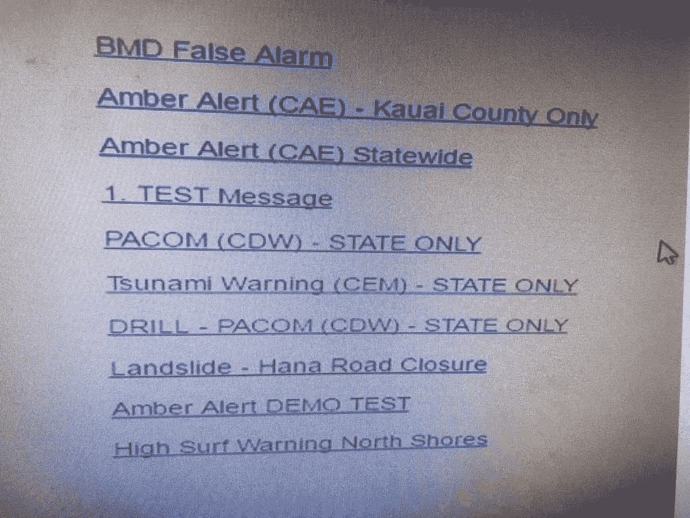
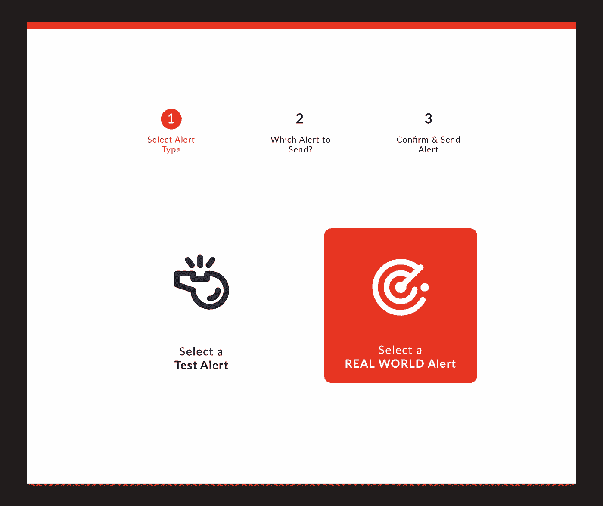
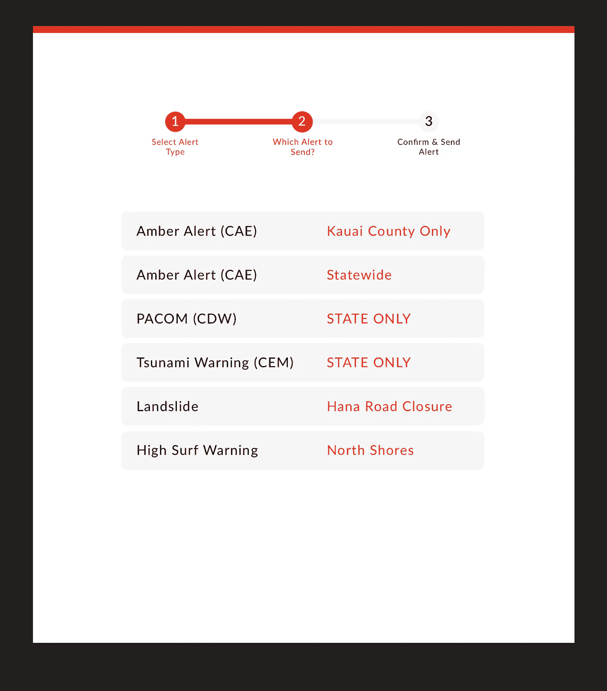
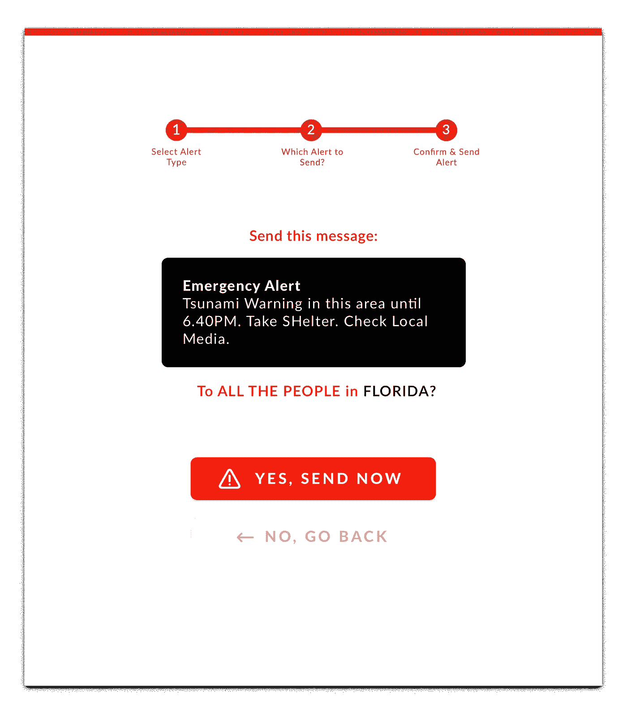

# 在户外重新设计夏威夷紧急警报系统的界面

> 原文：<https://medium.com/hackernoon/redesigning-hawaiis-emergy-alert-interface-in-the-open-91c6318a7045>

火奴鲁鲁民事巡逻队设法得到了一个系统截图，该系统被用来意外启动错误的紧急警报。这是一个绝对的谜，为什么这样一个高影响力的任务有一个绝对可怕的界面:

作为一名 UI 设计师，我对这些类型的界面的出现感到震惊和尴尬。不好的界面会对人造成伤害。

所以我决定花一晚上的时间重新设计紧急警报系统的用户界面，在那里决定发送警报。

这是我的建议:

1.  与其将如此重要的行动隐藏在下拉菜单中，不如在界面中有一个清晰的行动号召来启动发送警报的过程:

2.既然决定发送警报，关键是我们要仔细指导用户完成整个过程，减少任何人为错误的机会。首先，我们将测试和演习警报与真实世界的紧急情况分开:

3.既然用户已经慎重决定发送测试或真实世界紧急警报，我们显示选项:

4.最后，在确认和发送任何警报之前，让我们先预览一下确切的消息&弄清楚接收者是谁。用户可以返回并进行更改，或者确认并发送消息。

作为一名界面设计师，我的目标通常是在用户和他们的目标之间移除尽可能多的步骤。但是在这样的界面中，人为错误会导致重大问题，关键是要关注清晰度。

这是“完美的设计”吗？

号码

这是在一个晚上完成的，没有用户测试或反馈循环。有很多方法可以改进它，但这只是一个开始。

所以…对于所有的紧急警报系统，请随意复制，主要是:**改进**任何这些提议的想法，并使它们成为你界面的一部分。

让我们用设计让世界变得更美好。

首席设计师@ [http://Fairpixels.pro](http://Fairpixels.pro)