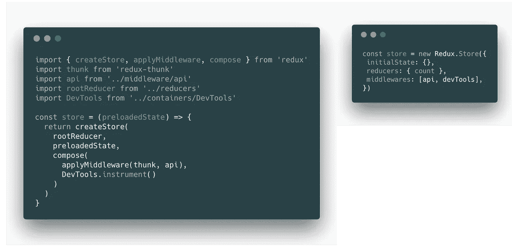

# 重新设计 Redux

> 原文：<https://medium.com/hackernoon/redesigning-redux-b2baee8b8a38>

现在国家管理不应该是一个已经解决的问题吗？直觉上，开发人员似乎知道一个隐藏的事实:状态管理似乎比它需要的更难。在本文中，我们将探讨一些你可能一直在问自己的问题:

*   状态管理需要库吗？
*   Redux 的人气是实至名归吗？为什么或为什么不？
*   我们能做出更好的状态管理解决方案吗？如果有，如何实现？

# 国家管理需要图书馆吗？

做前端开发者不仅仅是移动像素；开发的真正艺术是知道在哪里存储状态。简而言之:很复杂，但没那么复杂。

让我们来看看使用基于组件的视图框架/库(如 React)时的选项:

## 1.组件状态

存在于单个组件内部的状态。在 React 中，认为`state`用`setState`更新了。

## 2.相对状态

状态从父代传递给子代。在 React 中，认为`props`作为属性传递给了一个子组件。

## 3.提供状态

状态保存在根**提供者**中，并由组件树中某处的**消费者**访问，而不考虑邻近性。在反应过来的时候，想起了`context API`。

许多状态属于视图，因为它反映了 UI。但是反映底层数据和逻辑的所有其他代码呢？

将所有内容都放在视图中会导致不良的 ***关注点分离:*** 它将您与 javascript 视图库捆绑在一起，使代码更难测试，并且可能是最大的烦恼:您必须不断地思考和重新调整您存储状态的位置。

由于设计的变化，状态管理变得很复杂，而且通常很难判断哪个组件需要哪个状态。最直接的选择是只提供根组件的所有状态，此时，您最好选择下一个选项。

## 4.外部状态

状态可以移动到视图库之外。然后，库可以使用提供者/消费者模式“连接”以保持同步。

也许最流行的状态管理库是 Redux。在过去的两年里，它越来越受欢迎。那么，为什么这么喜欢一个简单的库呢？

*Redux 的性能更高吗？*不会。每处理一个新动作，速度都会变慢。

*Redux 更简单吗？*肯定不是。

简单就是纯 javascript:

那么为什么不是每个人都使用`global.state = {}`？

# 为什么是 Redux？

实际上，Redux 与 TJ 的根对象是一样的——只是包装在一个实用程序管道中。

The Redux Store Pipeline

在 Redux 中，不能直接修改状态。只有一种方法:**将**和**动作**发送到最终更新状态的管道中。

管道沿线有两套监听器:**中间件** & **订阅**。中间件是可以监听传入的动作的函数，支持诸如“logger”、“devtools”或“syncWithServer”监听器之类的工具。订阅是用于广播这些状态变化的功能。

最后，**reducer**更新函数，将状态变化分解成更小、更模块化和更易管理的块。

> 对于开发来说，Redux 实际上可能比用一个全局对象作为状态更简单。

可以把 Redux 想象成一个带有前/后更新挂钩的全局对象，以及“减少”下一个状态的简化方法。

# 但是 Redux 是不是太复杂了？

是的。有几个不可否认的迹象表明 API 需要改进；这些可以用下面的等式来总结:

考虑用`time_saved`代表你开发自己的解决方案所花费的时间，而`time_invested`相当于阅读文档、学习教程和研究不熟悉的概念所花费的时间。

Redux 本质上是一个简单的小型库，具有陡峭的学习曲线。对于每一个克服了 Redux 并受益于它的深入函数式编程的开发人员来说，都有另一个潜在的开发人员迷失了，他们认为“这不适合我，我要回到 jQuery”。

使用 jQuery 不需要理解什么是“comonad ”,也不一定需要理解函数组合来处理状态管理。

*任何库的目的都是通过抽象让更复杂的东西* ***看起来*** *简单。*

澄清一下，我的意图并不是要折磨丹·阿布拉莫夫。Redux 变得太受欢迎，在其婴儿期太早。

*   如何重构一个已经被数百万开发者使用的库？
*   你如何证明发布影响全球无数项目的突破性变化是正当的？

你不能。但是你可以通过广泛的文档、教育视频和社区拓展来提供惊人的支持。丹·阿布拉莫夫赢得了比赛。

或者也许有别的方法。

# 重新设计 Redux

我认为 Redux 值得重写。我有 7 个需要改进的地方。

## 1.设置

让我们看看左边的[真实世界](https://github.com/reactjs/redux/blob/master/examples/real-world/src/store/configureStore.dev.js) Redux 示例的基本设置。

很多开发商都在这里停了下来，在刚刚迈出第一步之后，茫然地望向深渊。什么是 ***铛*** ？ ***作曲*** ？一个函数连 ***都能做到*** 那样吗？

考虑一下 Redux 是否基于配置而不是组合。设置可能看起来更像右边的例子。

## 2.简化的减速器

Redux 中的 Reducers 可以使用一个开关，远离我们已经习惯的不必要的冗长开关语句。

假设一个缩减器在动作类型上匹配，我们可以反转参数，使得每个缩减器都是一个接受状态和动作的纯函数。也许更简单，我们可以标准化动作，只传入状态和有效载荷。

## 4.异步/等待超时

***Thunks*** 常用于在 Redux 中创建异步动作。在许多方面，thunk 的工作方式看起来更像是一个聪明的黑客，而不是官方推荐的解决方案。请跟随我:

1.  你调度一个动作，它实际上是一个函数而不是预期的对象。
2.  Thunk 中间件检查每个动作，看它是否是一个函数。
3.  如果是这样，中间件调用该函数并传递对一些存储方法的访问:dispatch 和 getState。

真的吗？将一个简单的动作动态类型化为一个对象、函数，甚至是一个承诺，这难道不是一种不好的做法吗？

就像右边的例子，我们就不能异步/等待吗？

## 5.两种行动

仔细想想，实际上有两种行为:

1.  ***减速器动作*** :触发减速器，改变状态。
2.  ***效果动作*** :触发一个异步动作。这可能会调用 Reducer 操作，但是异步函数不会直接改变任何状态。

与上述“thunks”的用法相比，区分这两种类型的动作会更有帮助，更少混淆。

## 6.没有更多的动作类型作为变量

为什么区别对待动作创建者和减少者是标准做法？一个可以离开另一个而存在吗？改变一个不影响另一个吗？

> 行动创造者和减少者是一枚硬币的两面。

`const ACTION_ONE = 'ACTION_ONE'`是动作创造者和还原者分离的多余副作用。将两者视为一体，就不再需要导出类型字符串的大文件。

## 7.作为行动创造者的减少者

将 Redux 的元素按照它们的用途分组，您可能会得到一个更简单的模式。

从减速器中自动确定动作创建者是可能的。毕竟，在这个场景中**还原者可以成为动作创造者**。

使用基本的命名约定，以下内容是可预测的:

1.  如果减速器的名称为“增量”，则类型为“增量”。更好的是，我们把它命名为:“计数/增量”。
2.  每个动作都通过一个“有效载荷”键传递数据。

现在，从`count.increment`开始，我们可以从 reducer 中生成 action creator。

# 好消息:我们可以有一个更好的 Redux

这些痛点就是我们创造[复赛](https://github.com/rematch/rematch)的原因。

Rematch 是 Redux 的一个包装器，它提供了一个更简单的 API，而没有损失任何可配置性。

Rematch: The Redux Framework

请参见下面的完整复赛示例:

过去几个月我一直在生产中使用 Rematch。作为证明，我会说:

> 我从来没有花这么少的时间思考国家管理。

Redux 不会消失，也不应该消失。拥抱 Redux 背后的简单模式，减少学习曲线、样板文件和认知开销。

试试[复赛](https://github.com/rematch/rematch)，看你爱不爱。
给我们一颗星星，让别人知道你做了什么。