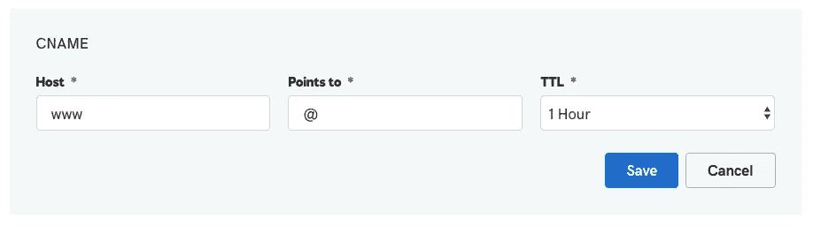

# 将域的所有变体重定向到 https 版本

> 原文：<https://medium.com/hackernoon/redirecting-all-variants-of-your-domain-to-https-version-1db5f8b37418>


当你终于要对你的网站上的某些东西做出改变并且你不能再推迟它的时候，你怎么做？当谷歌开始处罚。

我一直在推迟为我的网站[https://www.bitfolio.org/](https://www.bitfolio.org/)设置 https，但是自从谷歌开始处罚没有 https 的网站[和谷歌 chrome 开始显示所有 https 网站的不安全图标，我想终于为我的网站设置了 SSL 证书。](https://ahrefs.com/blog/http-vs-https-for-seo/)


Chrome says Not Secure

[Lets Encrypt](https://letsencrypt.org/) 在成本和安装简易性方面都是救星。唯一的缺点是每三个月需要更新一次。一旦完成设置，您可以检查[https://www.ssllabs.com/ssltest/analyze.html?d=bitfolio.org&最新](https://www.ssllabs.com/ssltest/analyze.html?d=bitfolio.org&latest)以确保其正确实施。

一旦这样做了，我想这应该是一件容易的事。但是令我惊讶的是，即使在 Drupal 中工作了几年之后，我仍然不完全了解完整的设置。我总是把这个部分交给我的系统管理员。我花了一些时间才弄明白，我发现的博客并没有真正的帮助。所以我想到这里把它组合起来。

假设我有一个域 example.com，我想重定向这个域的所有变化到 https 版本。

可以有六种变奏
`example.com``[www.example.com](http://www.example.com`)``[http://example.com](http://example.com`)``[http://www.example.com](http://www.example.com`)``[https://example.com](https://example.com`)``[https://www.example.com](https://www.example.com`)`。

我想确保所有这些变化都重定向到`[https://www.example.com](https://www.example.com`)`。

`example.com`是你的域名`[www.example.com](http://www.example.com`)`的裸版。转到您的域提供商并添加一个指向您的服务器 IP 的名称。


Add A name

添加一个 C 名称，将 www 版本也指向同一个 IP。



Add a C Name

假设您正在运行 Apache(所有服务器都有类似的设置),请转到您的虚拟主机，并确保添加 Servername 和 ServerAlias

```
<VirtualHost *:80> 
 ServerName example.com
 ServerAlias [www.example.com](http://www.example.com)
```

这将确保您的服务器监听裸域和普通域，并将它们指向您的代码文件夹以供执行。

现在转到你的`.htaccess`文件

确保您有以下代码。

```
RewriteEngine on

 # Set “protossl” to “s” if we were accessed via [https://](/). This is used later
 # if you enable “www.” stripping or enforcement, in order to ensure that
 # you don’t bounce between http and https.
 RewriteRule ^ — [E=protossl]
 RewriteCond %{HTTPS} on
 RewriteRule ^ — [E=protossl:s]
```

如果您使用 https 访问过，这段代码将设置一个名为`protossl`的标志。这将确保您不会进入评论中提到的 http 和 https 之间的无限重定向。

注释掉所有其他与 http 和 https 重定向相关的设置。然后添加以下内容

```
 #
 # Rewrite http(s)://example.com to [https://www.example.com](https://www.example.com)
 #
 RewriteCond “%{HTTP_HOST}” “!^www\.” [NC]
 RewriteCond “%{HTTP_HOST}” “!^$”
 RewriteRule ^ https://www.%{HTTP_HOST}%{REQUEST_URI} [L,R=301]

 #
 # Rewrite [http://www.example.com](http://www.example.com) to [https://www.example.com](https://www.example.com)
 #
 RewriteCond %{HTTPS} off
 RewriteRule ^ https://%{HTTP_HOST}%{REQUEST_URI} [L,R=301]
```

这段代码由[https://www.drupal.org/u/mdrescher](https://www.drupal.org/u/mdrescher)在
[上提供 https://www . Drupal . org/forum/support/post-installation/2018-04-15/forcing-to-https # comment-12723535](https://www.drupal.org/forum/support/post-installation/2018-04-15/forcing-to-https#comment-12723535)查看他关于为什么需要两种不同规则的评论。

这些改变将确保所有六个变体`example.com`、`[www.example.com](http://www.example.com`)`、`[http://example.com](http://example.com`)`、`[http://www.example.com](http://www.example.com`)`、`[https://example.com](https://example.com`)`、`[https://www.example.com](https://www.example.com`)`都被重定向到`[https://www.example.com](https://www.example.com`)`

希望它能为即将搬到`https`的人节省时间。`https`对整体互联网有好处。请在本周末抽出时间将您的网站迁移到`https`。

这一节是根据伊利亚的评论增加的。

# Rewrite http(s)://example.com to [https://www.example.com](https://www.example.com)
#
#RewriteCond “%{HTTP_HOST}” “!^www\.” [NC]
#RewriteCond “%{HTTP_HOST}” “!^$”
#RewriteRule ^ https://www.%{HTTP_HOST}%{REQUEST_URI} [L,R=301]

#
# Rewrite [http://www.example.com](http://www.example.com) to [https://www.example.com](https://www.example.com)
#
RewriteCond %{HTTPS} off
RewriteRule ^ https://%{HTTP_HOST}%{REQUEST_URI} [L,R=301]

虽然这可以确保您总是被重定向到 https 版本并且启用了 HSTS，但是它认为 www 和裸版本是不同的。我仍在检查是否有办法解决这个问题。如果你已经明白了这一点，请评论。