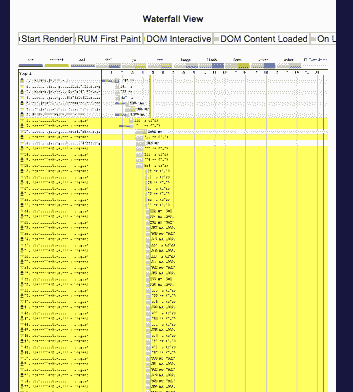
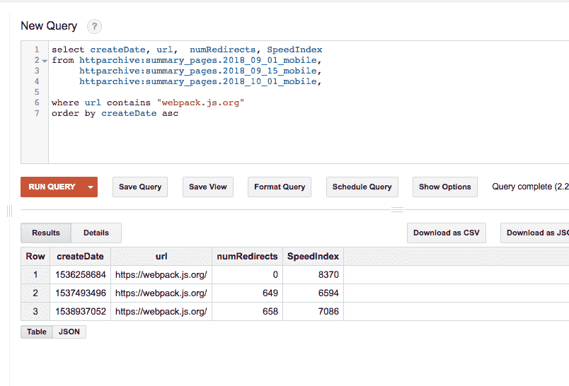
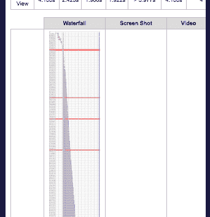

# 重定向，以及它们对性能的影响，或者一个(看似微小的)第三方变化如何影响一个流行的 JavaScript Bundler 的网站性能

> 原文：<https://medium.com/hackernoon/redirects-and-their-effect-on-performance-or-how-a-seemingly-minor-third-party-change-affected-1ce78dfc24a1>

当服务器重定向请求时，浏览器必须对文件进行第二次请求，增加(至少)一次额外的往返行程，并延迟向最终用户交付内容。

有一天，当我闲坐着的时候，我想知道“一个页面上重定向的最大数量是多少？”HTTP 存档来拯救。在 summary_pages 表中，有一个 numRedirects 字段。在 BigQuery 中快速搜索，我发现了一个包含超过 1100 个重定向的页面:

> 在 WebPageTest 中，黄线表示请求了重定向。我数(好的..对“302”进行关键字搜索，找到了 1，187 个重定向。在一页上…都指向 Gravatar 的空白头像。[*#性能*](https://twitter.com/hashtag/perfmatters?src=hash&ref_src=twsrc%5Etfw)*[*pic.twitter.com/SCqzG6rQEG*](https://t.co/SCqzG6rQEG)*
> 
> **—道格·西拉斯🇧🇪(@ dougsillars)*[*2018 年 10 月 23 日*](https://twitter.com/dougsillars/status/1054761605257486336?ref_src=twsrc%5Etfw)*

*当然，它正在对 Gravatar 的默认图像进行一些奇怪的拒绝服务攻击——所有 1100 个重定向(好吧，我看过的所有重定向——我很快就厌倦了)都指向 Gravatar 骨架图像，这有点奇怪。*

# *意想不到的网站*

*当我继续搜索有大量重定向的网站列表时，我在前 10 名中看到了一个熟悉的名字。我发现 web pack([https://webpack.js.org](https://webpack.js.org/))的主页上有超过 600 个重定向。*

*Webpack 是 JavaScript 的捆绑工具，有很多方法可以帮助优化内容的交付(参见 [**用 webpack 进行 Web 性能优化**](https://developers.google.com/web/fundamentals/performance/webpack/) )。由于这个原因，我很惊讶在这个页面上看到这么多重定向！不幸的是，用 WebPageTest 进行的快速测试证实了这一点，并且还显示 302 重定向没有被缓存，回访也遭受了同样的 600+ 302 重定向惩罚。*

**

*我会把完整的瀑布粘贴到这个帖子里，但是你会一直滚动，过一会儿就放弃我要说的话。如果你很好奇，可以在这里看到测试结果:[https://www . web page test . org/result/181023 _ JP _ b 9476 f 132 f 954277 f 10 ab 45938 be 4702/](https://www.webpagetest.org/result/181023_JP_b9476f132f954277f10ab45938be4702/)*

# *诊断*

*这是怎么回事？Webpack 很幸运有很多赞助商，他们在自己的网页上列出了很多赞助商。每张图片都会导致一个重定向:*

*每个请求:*

*[https://opencollective.com/proxy/images/](https://opencollective.com/proxy/images/)？< id >*

*已重定向至:*

*https://images.opencollective.com/proxy/images/[？< id >](https://images.opencollective.com/proxy/images/)*

> **并且重定向没有被缓存:**
> 
> **缓存控制:私有，最大年龄=0，无存储，无缓存，必须重新验证，后检查=0，预检查=0**

*这意味着相同的重定向发生在随后的访问中。webpack 页面是开源的，我四处挖掘，发现了一个对 https://opencollective.com/api/groups/webpack/backers 的 API 调用*

*这将返回一个包含所有支持者的(非常大的)JSON 文件，包括他们图像的 URL。这就是重定向的来源。*

*因此，我们发现了一个顶级工具的网站，其第三方 API 添加了数百个额外的请求来加载网页。*

# *进一步挖掘*

*我们可以解决这个问题！在 Opencollective Github repo 中，我发现在 Opencollective 上的 9/17 commit 中对图像子域进行了更改。这里没有邪恶，只是一个简单的迁移。这可能是罪魁祸首吗？幸运的是，有了 HTTP 存档，我们就有了历史数据！*

**

*查看 2018 年 9 月 1 日的 HTTPArchive，webpack.js.org 有 0 个重定向，但在 2018 年 9 月 15 日的 HTTP 存档爬网上有 649 个重定向。*

*我的直觉是 9/17 提交导致了这个问题，所以这让我担心我的猜测是不正确的。在每次 HTTP 归档运行中测试了超过 120 万个网页，它们不可能在一天内全部运行。对 webpack.js.org 的测试在 UNIX 时间 1537493496 运行，即 2018 年 9 月 21 日，即推送后 4 天。好吧，我就这么定了。*

# *提交缺陷和解决方案*

*我在 opencollective GitHub repo 上提出了一个问题:*

*[https://github . com/open collective/open collective-images/issues/10](https://github.com/opencollective/opencollective-images/issues/10)*

*上周已经解决了。现在 webpack.js.org 主页又有了 0 个重定向，允许所有这些图片在一个请求中加载！*

*[https://www . web page test . org/result/181108 _ 98 _ 7f 290d 38486 AC 8 ce 6505 ad 553 C4 ab e9/](https://www.webpagetest.org/result/181108_98_7f290d38486ac8ce6505ad553c4abea9/)*

**

# *结论:*

*重定向增加了传递内容的额外往返行程，从而延迟了页面加载并降低了性能。有时，您的网站所依赖的第三方的变化会导致您的网站性能发生灾难性的变化，因此定期测试对于快速发现这些问题至关重要。*

*像 HTTP Archive 和 WebPageTest 这样的工具对于帮助查明问题是必不可少的，应该成为您的工具集的一部分来识别问题。*

**原载于 2018 年 11 月 14 日*[*【dougsillars.com】*](https://dougsillars.com/2018/11/14/redirects-and-their-effect-on-performance-or-how-a-seemingly-minor-third-party-change-affected-the-website-performance-of-a-popular-javascript-bundler/)*。**