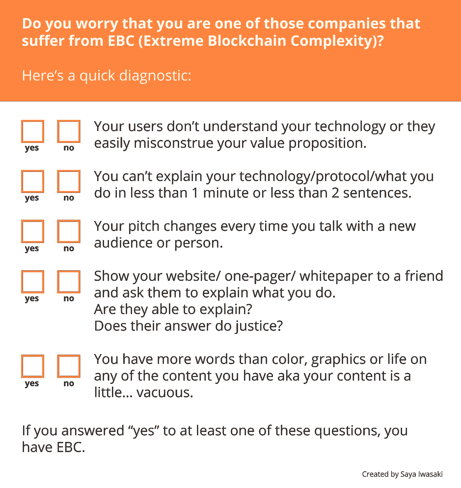
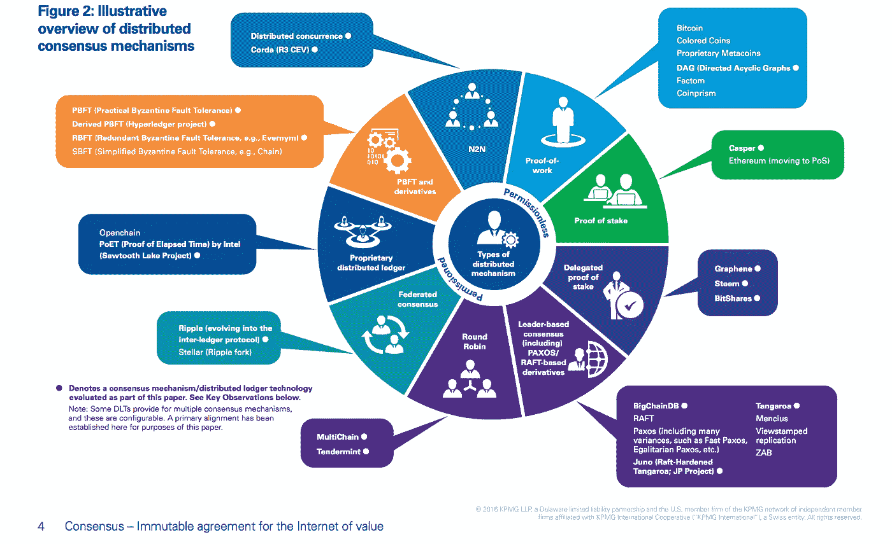
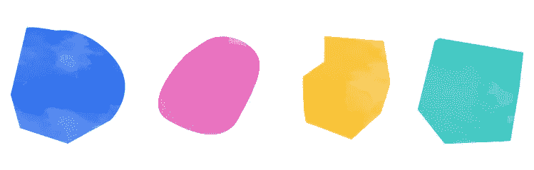
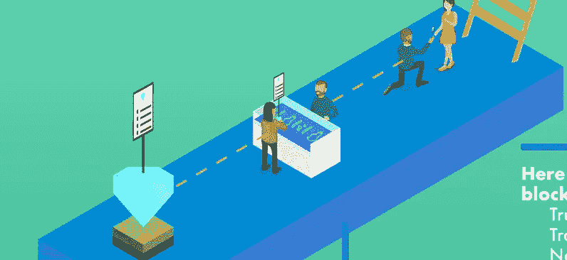
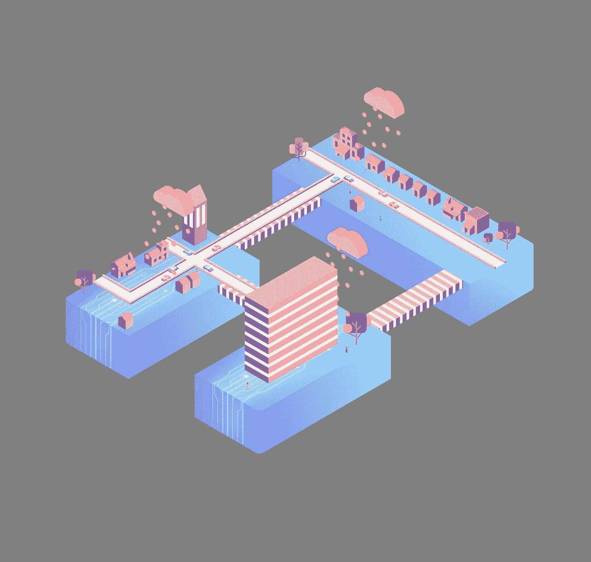
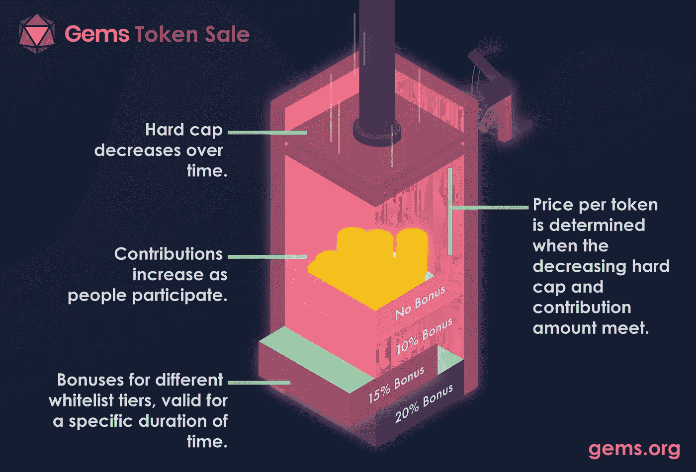

# 你的加密公司遭受“极端区块链复杂性”的困扰吗？

> 原文：<https://medium.com/hackernoon/reduce-extreme-blockchain-complexity-35b8f833a123>

## 将您的区块链协议、白皮书和代币销售综合成视觉图形，让每个人的生活变得更简单。

我遇到过不少区块链公司，他们提出了一个惊人的想法，但无法让他们的信息感动社区，因为这很难理解。

可用性将决定你公司的成功，所以为什么不投资让人们尽可能容易地采用你呢？

# 快速试验

# 有解决的办法！

使用视觉效果是一种有效的方法，可以防止你的公司工作的混乱和模糊。

## 使用视觉效果的好处

这里有 4 个好处。总的来说，使用视觉材料将有助于人们了解你在提供什么以及你的技术是如何运作的。

这有助于减少误解，混乱，甚至可能 FUD。

“Brevity is the soul of wit!” — [Bo Ren](https://medium.com/u/24a83c367299?source=post_page-----35b8f833a123--------------------------------) (recalling her English teacher’s lesson)

## 让人们保持兴趣

人们会受到鼓舞，对你的工作做更多的研究。他们真正感兴趣的是你的技术，而不是你的代币价值。白皮书很重要，但是它们太密集了！

为什么不添加视觉效果，使用让内容更容易理解的语言呢？

Great job, [KPMG](https://assets.kpmg.com/content/dam/kpmg/pdf/2016/06/kpmg-blockchain-consensus-mechanism.pdf)!

## 降低学习曲线

使用视觉效果减少了技术术语，因此让人们更容易加入你的社区。

## 轻松分享好东西

“一图胜千言。”在真正活跃的电报聊天中(大约~10K 到 50K)，每秒至少有一条消息。传达信息而又不会过多阅读的图像将有助于快速准确地回答问题。这是一种在不同媒体平台上高效、快速地传递信息的方式。

## 吸引合适的投资者

尽可能简洁地传递清晰的信息，会引起正确的投资者和用户的共鸣。这意味着你得到的投资者和用户可能实际上非常关心你的技术和你的成功，而不是赚快钱。这尤其适用于需要稳定实用令牌的加密公司。

# 你能做什么？

*   了解你的协议、你的系统、你的愿景和你公司的一切细节。
*   连接所有重要的点。
*   想想你的最终目标是什么。你想把人们推向哪里？你想让他们做什么？是什么阻止他们到达那里？

了解了这一点，你就可以设计有助于人们理解你的行动号召的内容。

# 以下是需要记住的三个要点:

## 展示大局。

通过帮助人们想象这个系统以及它是如何工作的，你给了他们一个快速浏览的基本信息。

Showing how blockchain works in the diamond industry.

## 让它看起来不错。

设计必须有吸引力，品牌，也真的令人兴奋地看着。糟糕的美学会让你的图形看起来不那么吸引人，而目标是让它看起来更吸引人。

(one piece of a protocol explanation)

## 平衡文本和图像。

有时候，图像并不能解释一切。考虑一下如何组织文本，使其简洁但有解释性，并适应图像。

A graphic done for [Gems.org](http://www.gems.org) that balances visuals and text.

# “那太难了！”

[Ping 我](http://www.sayaiwasaki.com/about)！我将帮助你把这些难懂的高层次概念转化成简单的信息图表、视觉效果和解释。

这样做**让每个人的生活更轻松，并帮助在区块链从事重要工作的公司扩大他们的社区，加速他们的影响。**下面是我的[个人原因](/@sayaiwasaki/designing-blockchain-equitably-55420e2951f5)。

感谢阅读！

访问[构建区块链](http://www.medium.com/buildingblockchain)和我的[网站](http://www.sayaiwasaki.com)可以看到我的一些解释，或者直接伸出手来我们多聊聊！

*除非另有说明，所有图形均由赛亚裙岩崎设计。标题原图由* [*艾米尔·塞甘*](https://unsplash.com/photos/R9OueKOtGGU?utm_source=unsplash&utm_medium=referral&utm_content=creditCopyText) *上*[*Unsplash*](https://unsplash.com/?utm_source=unsplash&utm_medium=referral&utm_content=creditCopyText)*。感谢* [*博仁*](https://medium.com/u/24a83c367299?source=post_page-----35b8f833a123--------------------------------) *和* [*马修锁*](https://medium.com/u/c6bc3527efb1?source=post_page-----35b8f833a123--------------------------------) *对这首曲子的点评。*