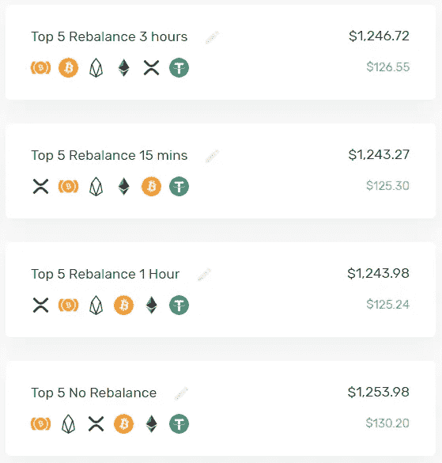

# 通过一个简单的技巧降低您的加密产品组合的风险——将菲亚特视为资产

> 原文：<https://medium.com/hackernoon/reduce-your-crypto-portfolios-risk-exposure-with-one-simple-trick-fiat-as-an-asset-43c501e9c363>

Photo by [Alice Pasqual](https://unsplash.com/photos/Olki5QpHxts?utm_source=unsplash&utm_medium=referral&utm_content=creditCopyText) on [Unsplash](https://unsplash.com/search/photos/money?utm_source=unsplash&utm_medium=referral&utm_content=creditCopyText)

***要注意的事情:*** *你应该知道我专业知识的局限性。首先，每个人都有不同的投资策略和哲学。其次，我在 2017 年 7 月之前没有金融或投资方面的工作经验。*

*在这里，我作为一名密码爱好者发言，自 2017 年 7 月以来，我经历了密码市场的高潮和低谷。我相信在牛市中赚钱很容易，但是一个好的交易者/投资者在牛市和熊市中都赚钱。*

*下面列出的策略首先是在熊市中减少损失。其次，在牛市中实现回报，最后，确保在市场中的长期生存。*

# 这篇文章是针对那些只投资加密货币的散户投资者的。

# 加密货币中的不同资产类别

当我们投资加密货币时，让我们首先建立不同的资产类别。他们每个人在投资组合中都有不同的目的。

1.  命令
2.  比特币
3.  替代硬币
4.  基于股息的硬币

我将在后续文章中讨论如何创建全天候加密资产分配。在本文中，我们将关注加密资产投资组合中最重要的资产类别: **FIAT**

Photo by [Christine Roy](https://unsplash.com/photos/ir5MHI6rPg0?utm_source=unsplash&utm_medium=referral&utm_content=creditCopyText) on [Unsplash](https://unsplash.com/search/photos/cash?utm_source=unsplash&utm_medium=referral&utm_content=creditCopyText)

为什么菲亚特如此重要？**它是唯一不会贬值的加密资产类别。**显然，当我们考虑通货膨胀/通货紧缩时，这并不完全是无损失的。但在加密市场，这肯定是因为最终目标是获得更多的菲亚特。

稳定的抗崩溃资产配置应该是这样的:

拥有 40%的菲亚特或 stablecoins 将确保你的投资组合能够抵御任何不可预测或随机的崩溃，这正是比特币广为人知的地方。

任何人想到的第一个想法都是，“如果我们有这样的配置，我们将获得更低的收益。”因此，我们可能需要部署不同的再平衡策略。

> 规则 1:永远不要赔钱规则 2:永远不要忘记规则 1
> 
> ~沃伦·巴菲特

# 基于增长和回撤的再平衡

> “我认为，首先你应该有一个战略资产配置组合，该组合假设你不知道未来会发生什么。”~雷伊·达里奥

基于加密的再平衡是**根据资产的增长和回撤水平重新调整投资组合中资产的权重。**加密货币市场不同于传统市场，因为大多数加密资产都与比特币的美元价值和投资者持有比特币的潜在性质挂钩。因此，需要一种不同的再平衡方法。

传统上，投资组合应该在什么时候进行再平衡是有期限的。例如，每 6 个月或每年。这种再平衡技术不是设定一段时间**，**，而是在资产达到设定的增长或损失量时出售资产。

波动可能是好事，也可能是坏事。对那些勇敢但有技能的人来说很好，对没受过教育和害怕的人来说很糟糕。我们可以从约翰·特雷恩的话中学到很多— ***对于知道自己在做什么的投资者来说，波动创造机会。***

# **战略再平衡**

这最终取决于个人投资者的直觉、专业知识和技能。

[https://howmuch.net/articles/bitcoin-all-major-crashes](https://howmuch.net/articles/bitcoin-all-major-crashes)

上图向我们展示了比特币崩溃的频率和程度。在接近底部的位置对投资组合进行战略性再平衡将是理想的。

目前，比特币和 Altcoin 都在一起发展。当比特币和替代币明显分离时，这种策略可能(或者应该)改变。但是现在，让我们把注意力集中在主要目标上。

**回撤时再平衡** 在两大巨头之间再平衡:菲亚特&比特币。将菲亚特始终保持在 40%。

对于崩盘，我的建议是，当比特币从之前的波动高点**下跌**-30%**-70%**时，进行回撤再平衡。

在牛市中，当**比特币从之前的再平衡价格上涨 50%时，进行再平衡。**随后，**80%后或视比特币涨幅有多疯狂。**

对于 altcoin 部分，它需要更多的解释，因此，我将在另一篇文章中讨论这一点。

为了说明这个投资组合的表现，我想出了一个故事:

*免责声明:这个故事没有考虑替代硬币。*

**例子**

> 杰克和汤姆只有一万美元可以投资。
> 
> 杰克用 10000 美元买了 1 个比特币，还有 10000 美元可以投资。
> 
> Tom 希望保持 60/40 的加密与加密比率，因此:
> 
> 他用 **6000 美元，还剩 4000 美元资本，用 1 万美元买了 0.6 个比特币。**
> 
> *****如果比特币从 1 万美元涨到 1.5 万美元，上涨 50%会发生什么？*****
> 
> **杰克有一个 BTC，现在价值 15，000 美元(+50%)
> 他的总投资组合上升了 5%或 5，000 美元，现在价值 15，000 美元**
> 
> ****汤姆有 0.6 BTC，现在价值 9，000 美元(+50%)
> 还剩 4，000 美元资本，他的总投资组合只增加了 30%或 3，000 美元，现在价值 13，000 美元****

******在这个例子中，杰克会比汤姆多赚 2000 美元。但是最终，这两种方法都有所收获。******

********现在让我们看看当市场不好的时候会发生什么********

> ****同样的场景:杰克和汤姆只有 10，000 美元可以投资。****
> 
> ****杰克用 10，000 美元和**、10，000 美元和**
> 买了 1 辆 BTC，没有资本投资。****
> 
> ****汤姆用 10000 美元买了 0.6 BTC，剩下 4000 美元资本。****
> 
> *******如果比特币从 10000 美元跌到 5000 美元下跌 50%，会发生什么？*******
> 
> ****杰克拥有 1 辆 BTC，现在价值 5000 美元，用 0 美元买了这辆车，他的总投资组合下跌了 5%或 5000 美元，现在价值 5000 美元****
> 
> ****汤姆有 0.6 BTC，现在价值 3，000 美元 T21，但由于有 4，000 美元在场外，他的总投资组合只下降了 30%或 3，000 美元，现在价值 7，000 美元****

****在这个例子中，汤姆比杰克多存了 2000 美元。****

****这里有一些额外的东西****

> ****行情不好:**比特币从 10000 美元跌到 5000 美元跌 50%？******
> 
> ****汤姆拥有 0.6 BTC，现在价值 3000 美元，还剩 4000 美元资本，他的总投资组合只下降了 30%，即 3000 美元，现在价值 7000 美元****
> 
> ****请记住，杰克没有剩余的资本来购买或做任何事情。但汤姆决定重新平衡他的投资组合，以保持 60/40 的加密与法定比率，比特币的价格为 5000 美元。****
> 
> ****汤姆将拥有 0.84 美元的 BTC，现在价值 4200 美元，T42 还有 2800 美元的资本。****
> 
> ****如果杰克想要收支平衡，**比特币必须从 5000 美元翻一番(2 倍)或增加 100%** 到 10000 美元，才能使他的 10000 美元投资收支平衡。****
> 
> ****对汤姆来说，比特币只需上涨 40%至 7000 美元，就能实现 10000 美元投资的盈亏平衡。****

****换句话说，与杰克相比，汤姆在市场上不需要太多的努力就能达到盈亏平衡。从长远来看，这就是我们如何使用防守战术来最终取得胜利。****

****当杰克收支平衡时，比特币回到 10，000 美元，汤姆将看到他的投资组合增长到 11，200 美元或增加 12%(1，200 美元)。****

****当然，市场不是那么容易预测的，这也是为什么有时候我们需要去除情绪因素，在适当的时候重新平衡。****

******如果行情好，你还是会盈利的！如果市场不好，你会挺过来的！******

# ****输入[投资组合。IO](https://portfolio.io/)****

********

****[https://portfolio.io/](https://portfolio.io/)****

****目前正在开发的一个很棒的工具是 Portfolio.io。由它的首席运营官提供的独家先睹为快， [Bob Bogaert](https://www.linkedin.com/in/bob-bogaert-93b89429/) 展示了一个令人难以置信的承诺，即一个点击按钮就能重新平衡的平台。****

********

****这个功能可以真正改变我们看待加密组合的方式。再平衡是华尔街和大型对冲基金使用的一种众所周知的方法，不应被低估。****

********

****该平台仍处于测试阶段，但目前看来前景看好。这是一个我个人很想尝试的项目。****

****现在就去他们的网站注册吧！https://portfolio.io/
T3****

******我希望这篇文章有助于激发形成更多策略的想法。请在下面分享你的想法和策略！:)******

****— — — — — — — — — — — — — — — — — — — — — — — — — — — — — — —****

*******免责声明—*** *从长远来看，这种策略会降低你的预期回报，只应在试图缓和对市场波动的情绪反应时使用。我强烈建议根据你自己的风险偏好，研究其他能提供更好结果的技术或策略。*****

****— — — — — — — — — — — — — — — — — — — — — — — — — — — — — — —****

****请随时查看我对 7 月份比特币的分析和预测。****

**** [## 比特币价格分析——7 月展望

### 让我首先说，这些仅仅是我自己的研究和观察。我的研究不是财务建议，只是…

hackernoon.com](https://hackernoon.com/bitcoin-price-analysis-july-month-outlook-a27d9e71cd08) 

在 [Medium](/@iliyazaki) 上关注我，以获得我即将发表的文章的即时更新，在这些文章中，我讨论了围绕加密货币、一般投资和技术分析的主题。

 [## 加密货币:散户投资者应该知道的(第一部分)

### 声明:本文中分享的观点是基于我个人对加密货币领域的理解…

hackernoon.com](https://hackernoon.com/cryptocurrencies-what-retail-investors-should-know-part-1-f81738d5b8) 

也请在其他社交媒体平台上关注我:
[Twitter](https://twitter.com/IZCrypto)
[Youtube](https://www.youtube.com/channel/UCrq04Mv5pAhKCilZROQ2jjg?)

— — — — — — — — — — — — — — — — — — — — — — — — — — — — — — —

Iliya Zaki 是 Moonwhale Ventures 的营销和社区经理。

Moonwhale Ventures 是一家咨询公司，为公司、中小企业或上市公司的[区块链](https://hackernoon.com/tagged/blockchain)应用提供咨询，以提高价值链的效率，并通过 ICCO STO(令牌化)为业务扩张提供新的创新融资方式。

*   更多信息请访问我们的网站—[http://moonwhale.io/](http://moonwhale.io/)
*   在我们的各种社交媒体平台上关注我们。—
    [insta gram](https://www.instagram.com/moonwhalebv/)
    [Twitter](https://twitter.com/MoonwhaleBV)
    [LinkedIn](https://www.linkedin.com/company/moonwhalebv)
*   加入我们的电报全球集团—[**https://t.me/moonwhaler**](https://t.me/moonwhaler)****