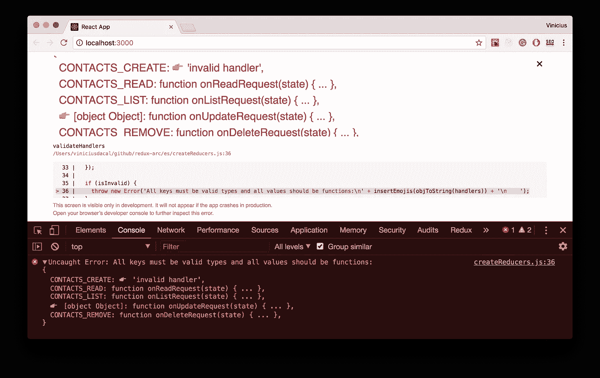

# 用 Arc 减少 Redux 应用程序中的样板文件

> 原文：<https://medium.com/hackernoon/reducing-boilerplate-in-redux-apps-with-arc-d9550434470e>


Redux 太牛逼了！但是人们经常抱怨在使用它的时候要写多少样板文件。这个问题的一部分，是因为他们觉得定义*常量*、*动作创建者*和大*缩减者*是徒劳的，也因为他们不清楚如何组织他们的项目，甚至不知道如何正确处理异步请求。在这篇文章中，我们将讨论这些问题，并提出一些解决方法。

# 关于 Redux Arc

Arc 是一个微小且经过良好测试的库，可以帮助你在日常工作中使用 Redux 提高效率。它具有抽象*动作类型*、*动作创建者*、*减少者*的实用程序，并且它还具有管理*异步请求*的优雅方式。另外值得一提的是，在生产中用了快一年，没有后悔过一天！

首先，让我们谈谈创造行动！

# 关于创建动作的过程

当我们在谈论 *Redux* 的时候，通常，我们要创建一个新特性的第一步是:创建 ***动作类型*** 和 ***动作创建者*** 。

假设我们正在创建一个联系人应用程序，我们必须实现的第一个功能是创建一个联系人。类型为的**和动作为**的创建者**看起来是这样的:**

然后，您导入*动作类型*以在您的 reducer 中使用，并导入*动作创建器*以在您的组件中使用。

上面的代码很好，但是不太可能只有一个**创建**特性。在现实世界中，你至少会有一个 [*CRUD*](https://pt.wikipedia.org/wiki/CRUD) 。那么，让我们来看看它的代码:

上面的代码非常简单，但是正如你所看到的，感觉我们在重复代码。如果在 Contacts CRUD 中有这种感觉，想象一下在一个有几十个模块的应用程序中。

如果你熟悉*干*，你就知道我们应该避免代码重复。你可能会说我们没有重复代码，因为每个创建者都有自己的“业务逻辑”,并且正在创建不同类型的操作，但是我不敢苟同。如果你真的注意，你可以看到模式:

*   正如我们正在遵循 [***通量标准动作***](https://github.com/redux-utilities/flux-standard-action) 规范一样，每次我们想用我们的动作发送一个内容时，我们都应该把它保存在`action.payload`中。任何额外的元信息，应归入`action.meta`。如果我们的动作指示一个错误，`action.error`应该为真，`action.payload`应该包含实际的错误。
*   我们总是用相同的名字定义动作**类型**和**创建者**，唯一的区别是一个是大写的，另一个是小写的。

知道了第一种模式，我们可以试着规范化我们的创建者，稍微改变他们来使用固定的参数:`payload`和`meta`。

让我们以**创建**动作为例，不使用`name`、`email`和`phone`作为参数，我们可以只使用`payload`:

关于第二种模式，动作类型可以基于创建者的名字生成。

既然我们可以规范化我们的**创建者**，并且我们知道**类型**可以基于**创建者**的名字生成，那么完全有可能创建一个工厂，给定一个配置，它为我们生成**创建者**和**类型**。

一个带有生成创建者和类型的简单 api 的工厂会非常方便，对吗？这正是你在 Arc 的`createActions`上看到的:

> 点击“运行”查看`createActions`生成的输出

函数`createActions`期望一个名称空间作为第一个参数，一个动作定义对象作为第二个参数。

对于动作定义对象，每个**键**应该是创建者名称，每个**值**可以是具有`payload`、`meta`和`error`默认值的对象，或者如果您不想要任何默认值，可以是`null`。

结果将是一个对象，包含每个动作的**创建者**和**类型**。

## 类型

上述配置中的类型如下所示:

```
{
  CREATE: 'CONTACTS_CREATE',
  READ:   'CONTACTS_READ',
  UPDATE: 'CONTACTS_UPDATE',
  REMOVE: 'CONTACTS_REMOVE',
}
```

> 注意:我们在配置中提供的名称空间被用来作为动作类型值的前缀，以避免在应用程序**中有两个同名的不同动作。**

基于上面的对象，只要你想使用类型**创建**，你就可以导入**类型**对象并如下使用它:

## 创造者

基于我们的 CRUD 配置，creators 对象将类似于此:

```
const creators = {
  **create**: function (payload, meta, error) {...},
  **read**:   function (payload, meta, error) {...},
  **update**: function (payload, meta, error) {...},
  **remove**: function (payload, meta, error) {...},
};
```

Creators 使用`payload`、`meta`和`error`参数创建动作。它们都是可选的，因此，您可以随意省略它们。

看看我们将如何使用我们的 **create** creator:

creators 只生成动作，因此，每当您想要调度一个动作时，您必须将它与 Redux store 中的 **dispatch** 方法结合使用，正如我们将在下面看到的。

# 在组件中使用动作创建器

我们最常使用 creators 的地方是在连接到商店的组件内部。

当你必须在一个组件中使用 arc 生成的 creators 时，没有什么秘密可言。看一下这个例子:

正如你在上面的例子中看到的，我们刚刚在 **mapDispatchToProps** 中定义了一个 **create** 方法，以访问 **dispatch** 方法。然后，在我们的组件中，我们可以通过道具访问**创建**。

```
this.props.create(formValues);
```

# 创建减速器

正如您已经知道的，我们将在我们的**减速器**中重用生成的**类型**。但是，这也是我们必须讨论的关于减速器的其他内容。

当我们调度一个动作时，Redux 调用所有的应用程序 reducer，然后，在 reducer 内部，我们必须检查调度的动作对给定的 reducer 是否有意义。

我见过很多人使用开关盒来处理这种情况，你将动作**类型**与你的**盒**相匹配，你可以使用`default case`返回到先前的状态。问题是 switch cases 不能很好地扩展，并且您可能最终需要维护痛苦的代码。

我也见过很多人使用多个 if，包括我，但是这种方法与 switch case 的方法有类似的问题。

使用这两种方法，您最终会在同一个地方处理匹配逻辑和状态变化。这种方式很难每次专注于一小段代码。

考虑到这一点，我们在 *Arc* 中创建了一个`createReducers`函数，它接受一个**初始状态**和一个**处理程序**对象，其键是动作类型，值是每个动作的处理程序。看看下面的例子:

这种方法的主要思想是为每一种动作设置一个处理程序。这样你就可以每次专注于一小块代码，而不是一个 100 行的函数。与 if 和开关情况相比，它还具有更好的性能，因为它使用短路验证。其代码如下所示:

如您所见，代码中没有魔法，我们所做的只是验证给定动作是否有处理程序。如果我们这样做了，我们就称之为提供`state`和`action`，如果我们没有，我们就返回先前的`state`。不同之处在于，您已经对其进行了抽象和测试，并额外进行了验证，以减少您在提供无效操作类型或无效处理程序时的调试时间:



# 创建异步请求

Arc 也有一个很好的支持来帮助你处理异步请求，因为它最初就是被设计来做这个的。我计划在另一篇文章中探讨这个话题，但是如果你对此感兴趣，看看文档，看看你如何使用它:[redux-arc.js.org/#async-actions](http://redux-arc.js.org/#async-actions)。

# 概述

*   函数`createAction`接受一个配置并返回**类型**和**创建者。**
*   您可以导入**类型**并配合`createReducers`使用。
*   `createReducers`让你把你的减压器变成小搬运器。
*   您可以在您的组件内部或任何您需要分派动作的地方导入并使用**创建器**。

# 有用的链接

*   [在还原弧](https://github.com/redux-arc/redux-arc-demo)中接触积垢。
*   redux-arc.js.org。
*   [Gitub 库](https://github.com/viniciusdacal/redux-arc)。

# 结论

除了减少样板文件并允许您优雅地拆分代码，`createReducers`和`createActions`都是关于通过编程实现的配置。这使我们能够运行验证来帮助您进行调试，也使您能够专注于真正计量的内容。

你不想仅仅因为犯了一个打字错误就花时间写样板文件或调试整个应用程序。

您希望尽可能更好、更快地实现功能和修复错误，而不失去灵活性，我们希望帮助您做到这一点！

非常欢迎任何反馈和贡献。请随意在 github 上打开一个问题来问我更多关于它的问题。

你喜欢这本书吗？

️❤️通过给我们和 sharing️️️️ ❤️一个赞来帮助我们传播信息

🖖别忘了关注我，我会通知你未来的帖子！🖖