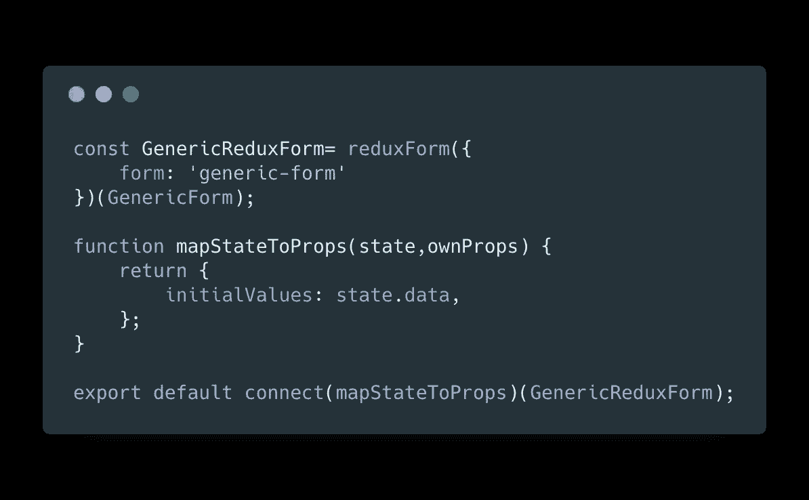
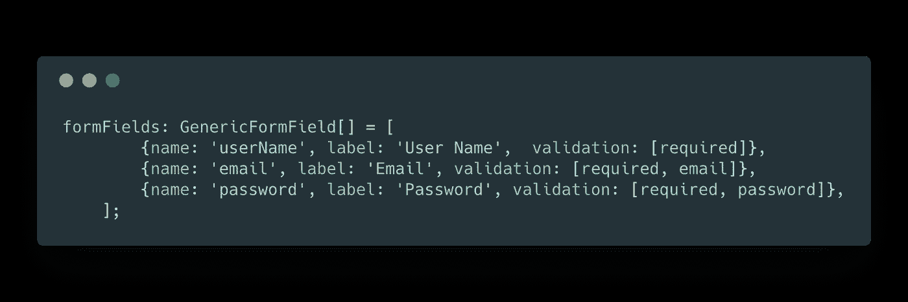
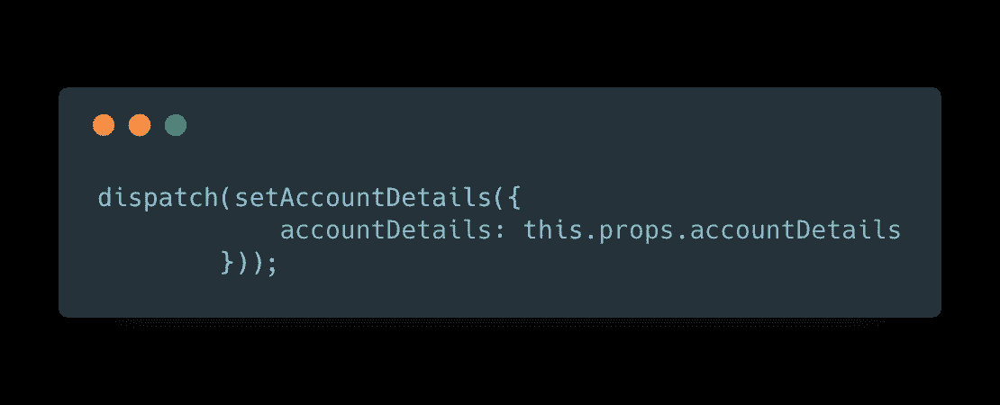
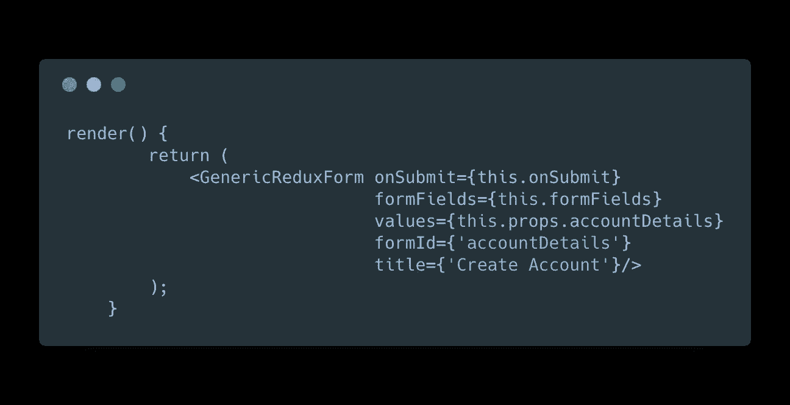
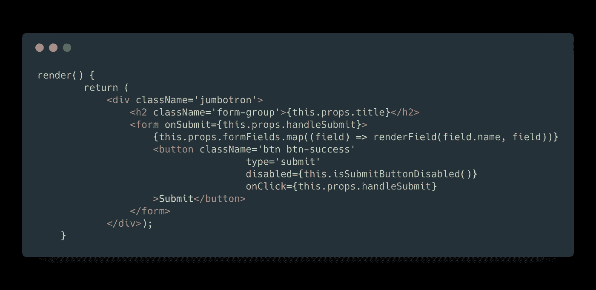
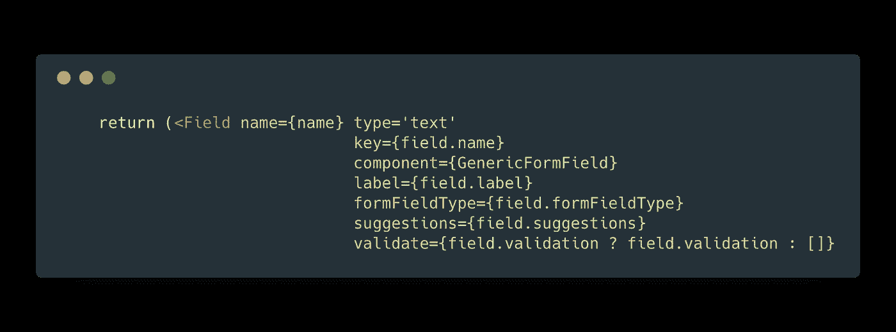
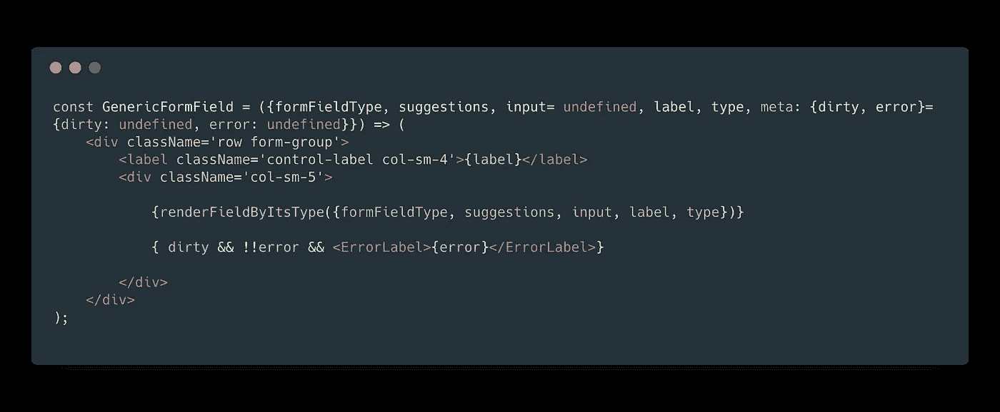
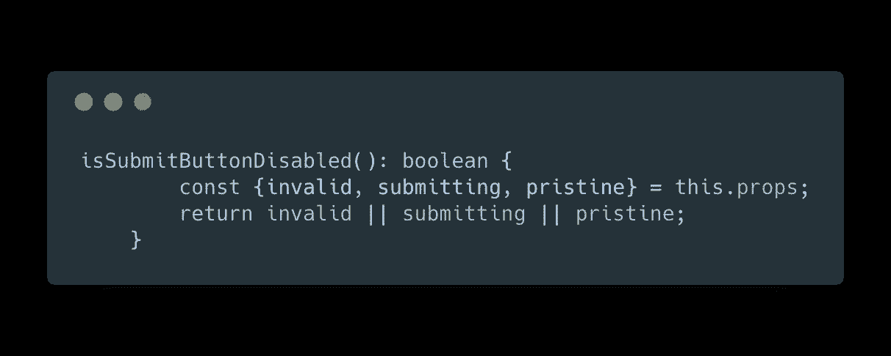
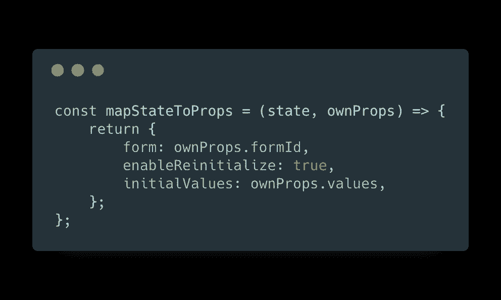
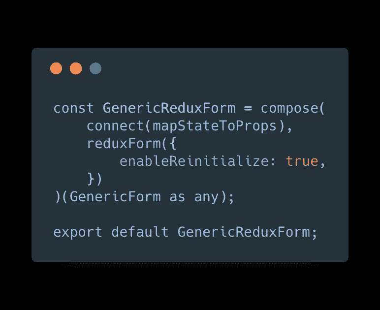

# 反应还原-形式变得容易

> 原文：<https://medium.com/hackernoon/redux-form-made-easy-345060c6a700>

学习如何编写一个保持 redux-form 复杂性的通用组件，知道只获取描述字段的 JSON，并呈现一个匹配的 redux-form。创建一个表单从来没有这么简单和干净。

Photo by [Toa Heftiba](https://unsplash.com/photos/Q5Uf3B8Ej7A?utm_source=unsplash&utm_medium=referral&utm_content=creditCopyText) on [Unsplash](https://unsplash.com/search/photos/relax?utm_source=unsplash&utm_medium=referral&utm_content=creditCopyText)

# 问题是:

[Redux-form](https://redux-form.com) 是一个用于呈现 [react](https://hackernoon.com/tagged/react) 表单的流行库。

正如 github 存储库页面中更好地描述的那样:

> 使用 react-redux 在 [Redux](https://hackernoon.com/tagged/redux) 存储中保持表单状态的高阶组件

如果你在例子中挖掘更多，你会发现它真的是一个强大的工具，可以给你任何字段的元数据，它的错误，警告，状态(原始，肮脏，感动)，字段数组等等。

但是，redux 格式仍然有一些复杂性。

例如，当您希望表单由状态中的值初始化时，您应该这样做:

此外，当应用程序中有许多表单组件时，您需要一种方法来为所有表单强制执行一些一致的行为，例如:对于无效和原始的表单，submit 按钮被禁用。任何形式都不能重复这一逻辑。您需要一些通用组件来保存表单生成。

## 解决方案

编写一个组件，它将获得表单字段描述和值的 JSON 输入。它可以只通过这个输入生成一个表单。该组件将使用 redux-form，但这将是内部的，而不是外部的组件。

## 优势:

1.  所有形式的一致行为
2.  快速表单开发时间
3.  没有重复形式的样板文件
4.  代码重用
5.  易于改变的形式库在未来，改变只是在较低的包装组件。不是所有其他形式的组件。

# 让我们看看一些代码

下面是一个简单的注册页面的例子，它使用了包含 redux form 的包装器组件

首先，创建表单字段描述数组，它描述任何字段的名称、标签和验证函数。(您还可以定义一个字段类型:复选框、下拉框等)

实现提交功能:

如果你这样做了，大部分工作就完成了。现在只需呈现 redux-form 包装器组件，它在这里调用`GenericReduxForm`并传递提交回调、字段、值、表单 ID(需要在整个应用程序中是唯一的),以及一个标题(如果您希望表单显示一些漂亮的标题)。

你建立了一个表单，仅由 JSON 数据，一个超级强大的表单，包含验证，提交按钮，和 redux-state 在里面。

下面是`GenericReduxForm`的样子:

渲染功能:

现在，更深入地，渲染字段函数，使用 redux-form 组件`Field`，它可以得到一个自定义组件来渲染，在我的例子中是`GenericFormField`

现场渲染本身(`GenericFormField)`):

当提交按钮被禁用时。

这里，最复杂的事情是:定义 redux-form props。

创建 redux-form，并将其连接到商店

现在，目标实现了，表单可以快速完成，实现不可知，表单库可以更改，但周围的所有组件都可以继续存在，没有任何变化，最大的好处是创建表单真的如此简单和干净。只是 json，价值观和它。

## 更多精彩即将上演:

1.  FieldArray
2.  在 github 中创建一个库，并将其部署到 NPM