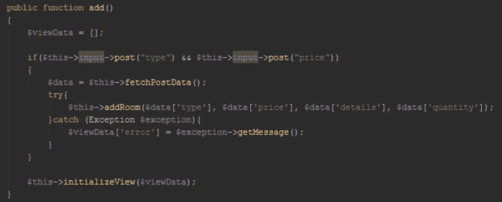

# 重构您的 PHP 遗留代码(真实项目示例)

> 原文：<https://medium.com/hackernoon/refactor-your-php-legacy-code-real-projects-examples-da9edf03ff4b>

image from osnews.com

优秀的开发人员是由他们代码的质量来定义的。在软件行业，写好代码意味着节省可能投资在测试、更新、扩展或修复 bug 上的钱。在本文中，我将向您展示一些技术和想法的真实例子，它们将帮助您清理遗留代码，并对其进行重构，使其更加健壮和模块化。这些技术不仅能帮助你重构旧代码，还能给你一些好主意，告诉你如何从现在开始编写干净的代码。

# 什么是重构，我们为什么需要重构？

重构指的是帮助你写出干净代码的技术和步骤。这对其他开发人员来说很重要，他们将能够阅读、扩展和重用代码，而不需要编辑太多。

接下来的几行将向您展示一些重构遗留代码并使其变得更好的例子。

# 永远不要重构没有单元测试的产品代码

我的第一个建议是永远不要开始重构遗留代码，因为它没有适当的单元测试。我想原因是显而易见的:你最终会得到难以修复的坏功能，因为你不知道是什么坏了。因此，如果你需要重构它，首先从测试开始。确保你要重构的部分被测试覆盖。检查 [PHPUnit 代码覆盖率分析](https://phpunit.readthedocs.io/en/7.1/code-coverage-analysis.html)。

# 从代码的最深处开始重构

看下一张图。这是我在 Github 上找到的一个酒店[管理](https://hackernoon.com/tagged/management)系统的真实项目。这是一个真正的开源项目，所以封闭的源代码可能是最糟糕的。

example: refactoring deepest points first

正如你在这个方法中看到的，有三个红色标记的级别。最深的一点应该是第一个 if 条件内部嵌套的 if/else 语句。通常，最深刻的一点是关注一个更容易重构的逻辑。

# 通过将方法分成更小的方法或配置文件/DB 表来缩短方法

也许，在这种情况下，我们可以将它提取为一个私有方法，如下所示:

make your functions shorter

下一个最深的点将是获取 post 数据和加载视图。现在，在重构其他部分之后，看看 add()方法。它更加清晰、易读和可测试。

example: refactoring deepest points first

# 在 if 语句中始终使用{}

大多数[编程](https://hackernoon.com/tagged/programming)语言支持单行 if 语句，一些开发人员使用它是因为它简单，然而，它不可读，并且很容易引起问题，因为只有一个空行就可能破坏条件并开始崩溃。看看这两个例子的区别:

example: use curly braces

# 不要使用神奇的数字或神奇的字符串:

在下一个示例中，您会注意到如果房间数超过 250，它会返回一条错误消息。在这种情况下，250 被认为是一个神奇的数字。如果你不是编写它的开发者，你将很难理解它代表了什么。

example: magic numbers

为了重构这个方法，我们可以算出 250 是房间的最大数量。因此，我们可以将其提取到变量$maxAvailableRooms 中，而不是硬编码。现在，对其他开发者来说，更容易理解。

example: fix magic numbers

# 如果不需要，请不要使用 else 语句:

在同一个函数 availablerooms()中，您会注意到 if 语句，在该语句中，我们可以很容易地去掉 else 部分，而逻辑仍然是相同的。

example: ignore else statement

# 为你的方法、变量和测试使用有意义的名字

在下面的例子中，你可以看到有两个来自酒店管理系统的方法，叫做“index()和 room_m()”。对我来说，我不能确定他们的目的是什么。我想如果他们的名字是描述性的，会更容易理解。

example: bad methods names

# 使用你的编程语言的最大能力

许多开发人员没有使用他们所使用的编程语言的全部功能。这些特性中的许多可以节省您的大量精力，并使您的代码更加健壮。看一下下面的例子，注意通过使用类型提示，用更少的代码实现同样的结果是多么容易。

**我想以几个更好的编码技巧来结束我的演讲:**

*   使用新的数组形式[ ]代替旧的数组形式()。
*   除非不检查数据类型很重要，否则使用===运算符代替==运算符。
*   给公共方法起一个简短的描述性名称总是一个好主意。私有方法可以有更长的名字，因为它们的作用域有限。
*   只对实现接口的方法使用一般名称，例如 add()，对单个类方法 addUser()或 addDocument()使用描述性名称。
*   从类中移除不用的方法。
*   对返回布尔值 ex: isAdmin($user)，hasPermission($user)的函数使用前缀 is/has。
*   总是在类方法和属性中使用访问修饰符。
*   小心界面污染:只使用用户可以公开使用的方法。
*   组织公共方法位于顶部的类方法。
*   始终将单一责任概念应用到您的班级中。

 [## 写干净的代码，用现实生活中的例子摆脱代码的味道

### 代码气味是一组常见的标志，表明你的代码不够好，需要重构…

codebur.io](https://codeburst.io/write-clean-code-and-get-rid-of-code-smells-aea271f30318) 

> **更多阅读:** - [软件架构—架构与设计的区别](/@maladdinsayed/software-architecture-the-difference-between-architecture-and-design-7936abdd5830)-[软件架构:用 AWS 架构你的应用](/@maladdinsayed/software-architecture-architect-your-application-with-aws-52d938603a32)
> - [用现实生活中的例子写出干净的代码，摆脱代码气味](/@maladdinsayed/write-clean-code-and-get-rid-of-code-smells-aea271f30318)