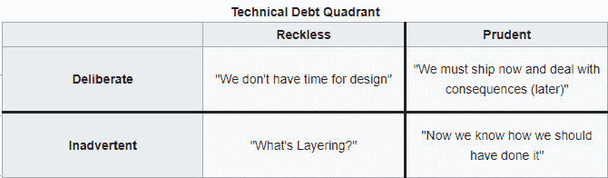
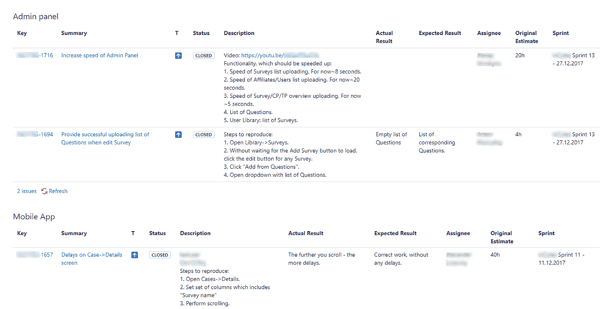

# 面向企业所有者的重构:理解它并正确地完成它

> 原文：<https://medium.com/hackernoon/refactoring-for-business-owners-understand-it-and-do-it-right-a48b591b612b>

你花了几个月的时间来打造你的产品，把它推向市场，在社交媒体上推广它，获得你的第一批 100 名付费用户。当开发团队给你发来关于… [重构](https://hackernoon.com/tagged/refactoring)的电子邮件时，你已经在计划新的杀手级特性了？真的吗？

不要这么快拒绝他们。重构经常被误解和低估。但如果你明智地接近它，它肯定会有回报。

我们 [Belitsoft](https://belitsoft.com/) 作为[软件开发](https://hackernoon.com/tagged/software-development)供应商，几乎每个月都会处理类似的情况。在本文中，我们将解释重构的概念，如何判断你的项目是否需要重构，并给出如何最好地处理重构的建议。

## **什么是重构？**

与普遍的观点相反，**重构与重写质量差的代码**没有任何关系。一个专业的软件开发公司总是会交付扎实的工作。此外，他们将用测试来覆盖它，并使用现代微服务架构来提高应用程序的整体质量。

既然我们已经解决了这个问题，下面就让我们来看看这个主题的定义工作的作者是如何定义重构的:

> *“在不改变软件可观察行为的情况下，对软件内部结构进行的更改，使其更容易理解，修改成本更低，*”m . Fowler，K. Beck 等人。

简而言之，重构意味着做一些小的改变，这些改变不会影响代码的工作方式，但是会使代码更容易理解和清晰。作为一个有益的副作用，优化可能会提高你的应用程序的性能。

**可伸缩性**——这是重构改进最多的方面。如果一个软件产品在成长，它必须精简它的代码库。否则，为新用户添加新功能并进行优化将成为一个漫长、缓慢且成本高昂的过程。

**重构类似于刷牙。虽然这需要一些时间和金钱，但与收益相比，成本可以忽略不计。如果你想在紧急情况发生时避免过高的费用，这是一项应该持续进行的预防性工作。我们不质疑是否需要刷牙，那为什么要区别对待我们的项目呢？**

## **为什么你不能在当前的预算和时间内写出干净的代码？**

主要有三个原因。

1.  **需求不明确**。一开始，产品所有者和开发人员都无法预测他们的软件将如何随时间发展。团队在信息真空中尽可能地工作，但是他们不能为所有事情准备代码。彻底的业务分析和编写详细的需求文档可能需要几个月甚至几年的时间。只有少数客户有这么多时间。
2.  **时间限制。**一个创业团队需要快速发布他们的产品，在现实世界中进行测试，并开始接收用户反馈。成功还远未确定，所以在完美的代码上花费时间和金钱是没有意义的。快速解决方案比完美的解决方案更有价值。
3.  **不同的经历和编码风格。项目团队通常由不同经验水平的开发人员组成。从财务角度来看，这是一个合理的决定——简单的任务应该由不太昂贵的初级开发人员来完成，而高级程序员则专注于更复杂的问题。此外，不同的编码者实现特性的方式也不同。这造成了不一致性，也使得代码更难阅读。**

所有这些原因产生了所谓的“技术债务”如果不加检查，它会拖累你的产品，并耗费你的金钱。

Source: wikipedia

谨慎故意的技术债务是最好的情况，这意味着公司有意识地优先考虑速度而不是代码可读性，并打算以后“偿还债务”。

## **那么它对我的产品有什么影响呢？**

*   由于项目需要额外的功能，越来越多的新人将加入团队。他们每个人都需要时间来熟悉代码库。作为产品所有者，您将为此付出代价。挖掘未经提炼的代码需要相当长的时间，因此成本也很高。
*   随着应用程序的开发，代码将变得更加复杂。每个新功能都需要更多的时间来实现、集成和测试。重构有助于减轻这种情况。

## 如何知道我的产品是否需要重构？

如果您的产品已经从 MVP 阶段过渡，并且需要新的特性，您应该为重构安排一些开发时间。但是，如果您不打算在发布后开发您的产品，您可以让它保持原样。

提前润色代码通常是一个糟糕的决定。这可能会拖团队的后腿，吞噬更重要的事情所需的预算，并将团队的注意力从解决用户的需求上转移开。

从开发的角度来看，Code Climate 的 Bryan Helmkamp 创造了一套很好的标记[告诉你去做。](https://codeclimate.com/blog/when-is-it-time-to-refactor/)

1.  **重构加速当前任务**。如果你能做一些事来获得直接的回报，为什么要把它放到明天/下周/永远不做呢？理解某种改变现在是否会有回报需要一些技巧，但是有经验的程序员通常可以做出正确的决定。
2.  **又快又简单**。就像第一点一样，如果有一个快速的改变可以让代码更整洁，那就去做吧。
3.  **三振出局规则**:如果某个代码片段给你的团队带来了三次麻烦，是时候做些工作让它变得更简单了。这样，开发人员将改进那些实际上使他们变慢的东西。
4.  你正在制造一个可能需要一天以上才能解决的问题。如果以后重构它需要相当长的时间，当你有机会的时候你可以回头再做。但是如果将来清理代码需要一整天或者更长时间，最好现在就做。技术债往往会累积利息。

## **为什么我的供应商没有告诉我重构？**

假设您的项目确实需要重构，有两个主要原因。

*   第一个——他们实际上正在进行重构，但从未向你提及。它的时间和预算可以作为其他任务的一部分记录下来。有时团队不通知客户，因为他们不想用技术问题来烦他们，因为这是一个问题。有时客户非常不合作，所以他们做他们需要做的事情，而不必争论。
*   第二个——他们不在乎，只要资金源源不断，他们很乐意给你越来越高的估值。最终，成本变得令人望而却步，客户决定转向另一家供应商。但到那时，每个人都会建议从头开始重写系统，因为这样既便宜又容易。不要自掘坟墓，如果你有疑问，就去问。

对客户开诚布公对于建立健康的长期工作关系至关重要。所以理想情况下，所有的工作都应该得到客户的认可。

## **重构最佳实践**

有很多方法可以确保你在重构上的投资获得最大回报。

1.  **代码可读性的持续改进**。随着团队的成长，这变得尤其重要，因为新成员可以更快地变得富有成效。这是在每个 sprint 的过程中完成的，并且非常容易，不会影响生产进度。
2.  **“技术债务”积压**。需要更多时间来改进的特性被放在那里，这样产品所有者和团队可以衡量债务的大小，并选择合适的时间来处理它。
3.  **《重构周》**。每 2-3 次冲刺，在客户的同意下，开发人员花一周时间集中精力清除“技术债务积压”上的未决问题。
4.  **单元测试**。有时客户担心代码的变化会破坏一些特性。为了避免这种情况，需要一套自动化的单元测试来防止任何令人不快的意外。

Technical debt backlog

## **那么我应该让他们重构我的产品吗？**

是的，如果你想留着它。不，如果你不想扩大产品规模，或者如果你想遵循 4 点启动计划。

Source: South Park

保护你的投资，花一些钱在维护上。毕竟，像脸书、谷歌和 Instagram 这样的大公司正在这么做。