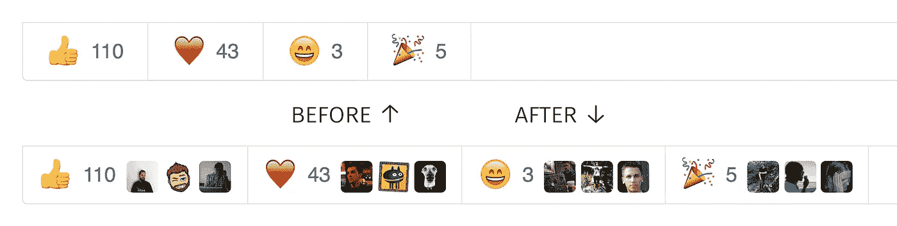
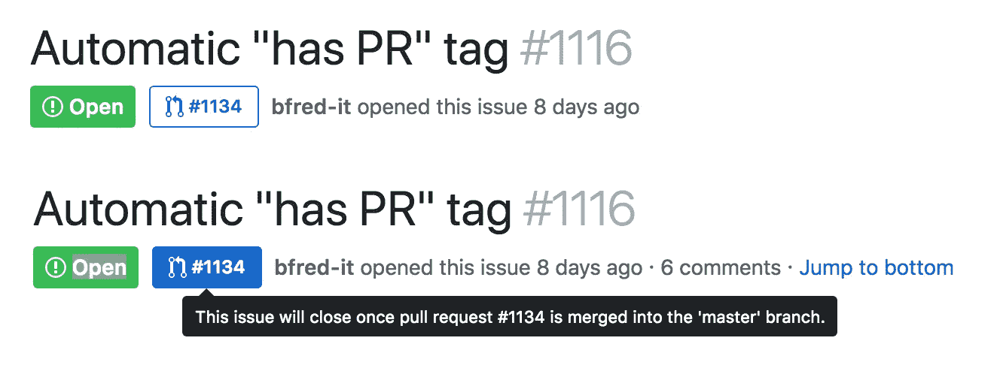
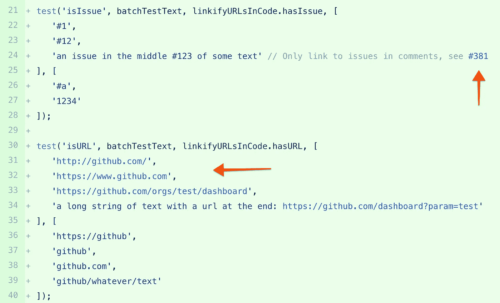
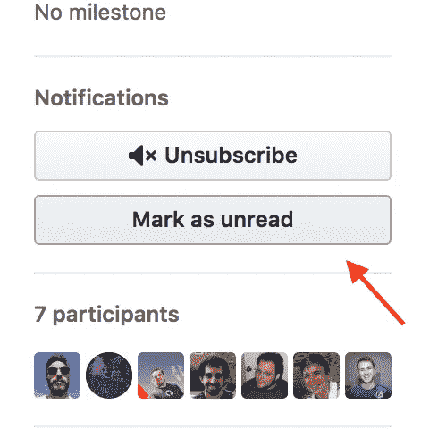
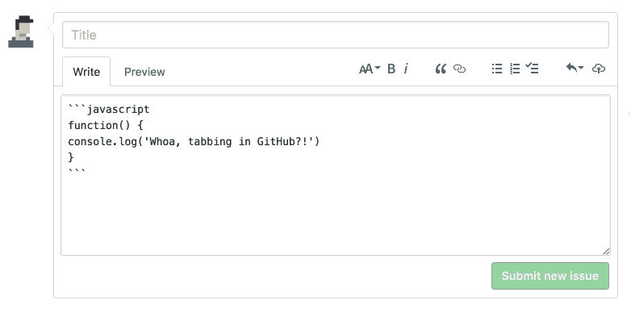

# 精制 GitHub: GitHub 的“Edge”版本

> 原文：<https://medium.com/hackernoon/refined-github-githubs-edge-version-e392e2dc332b>

[Refined GitHub](https://github.com/sindresorhus/refined-github) 是一个浏览器扩展，通过大量的用户体验改进来改善 [GitHub](https://hackernoon.com/tagged/github) 的体验。它添加了一些你甚至不知道自己有过的烦恼，一旦你了解了这个扩展，你就不想再回去了。

几个月前，我开始使用扩展，它是*坏蛋*。由受人尊敬的开发者 [@sindresorhus](https://github.com/sindresorhus) 启动的这个[扩展](https://hackernoon.com/tagged/extension)修复了我们在 GitHub 上遇到的许多小问题。这些改进执行得如此之好，以至于该公司也开始效仿并实施其中的一些改进。

正因为如此，这个扩展让你感觉像是在使用 GitHub Edge。这是你熟悉和喜爱的 GitHub，但体验更好。⚡

对我来说，扩展已经表现得很完美了，它一直在不断改进。我对此很感兴趣，我想你也会的。

以下是迄今为止我最喜欢的功能列表:

# 1.反应化身

查看对某个问题、拉动式请求或评论做出反应的人的头像。比单纯的看到一个无面者好太多了(懂吗？)号！

# 2.在问题和 PR 中显示关闭 PR 的链接

可以在问题和 PR 中的显著位置看到关闭已查看问题的 PR 链接。没有更多的搜索评论历史，以找到公关提及。

# 3.链接代码、注释和标题中的 URL 和问题/PR 参考

类似于 GitHub 在 markdown 中“链接”URL 和问题和 PR 引用的方式，它会从您的代码和问题标题中自动创建到 URL、问题或 PR 的链接。

# 4.将问题和请求标记为未读

向您的通知中添加问题或提取请求。稍后查看评论时需要提醒吗？这是你的解决方案。

# 5.在文本区域中使用 tab 键添加缩进

向文本区域添加带制表符的缩进。在 GitHub 注释中编写代码块变得轻而易举。

# 多看多投稿

如果 Refined GitHub 只改变了一两件事，我不认为它会增加足够的价值来引人注目。但是，当您将这些改进打包在一起时，它会显著提高 UX。

除了我提到的那些，还有一堆其他生活质量的改善，我没有提到。要查看其余功能或帮助开发，请查看 GitHub 项目报告。

我敢打赌，这些变化将非常适合您当前的工作流程，以至于您会忘记什么是 GitHub，什么是 extension 添加的！所以试一试，让我知道你的想法。

感谢阅读，也感谢精致的 GitHub 团队！