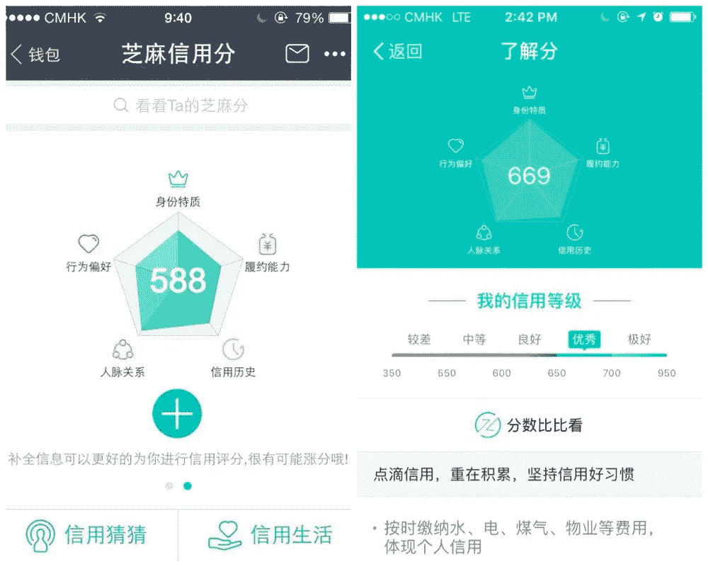

# 反思黑镜——我们正在向中国全国排名的公民分数俯冲吗？

> 原文：<https://medium.com/hackernoon/reflecting-black-mirror-are-we-nosediving-towards-chinas-nationally-ranked-citizen-score-d8f6e5477417>

在过去的几年里，中国人的购物方式发生了迅速的变化。2018 年，大多数生活在中国主要城市的人现在使用智能手机支付几乎所有的购物。来自[腾讯](https://en.wikipedia.org/wiki/Tencent)的[微信](https://web.wechat.com/)和来自[阿里巴巴](https://en.wikipedia.org/wiki/Alibaba_Group)的[支付宝](https://intl.alipay.com/)形式的数字钱包是中国可用的主要无现金支付选择，并在各种各样的情况下使用，包括在餐馆、购物中心、街头小贩、市场支付，甚至作为向街头艺人[捐款的一种方式，街头艺人](https://www.nytimes.com/2017/07/16/business/china-cash-smartphone-payments.html)竖起展示二维码的广告牌，以便路人可以在移动中快速扫描并支付。这项技术正在帮助小企业主和市场摊贩通过使用二维码而不是昂贵的读卡器来降低成本。

2017 年 8 月 9 日，在中国北京一个市场的海鲜摊位上，可以看到通过微信和支付宝进行移动支付的二维码。图片来源:nationmultimedia.com

从表面上看，中国发生的无现金革命似乎是一个很好的例子，说明了技术如何能够提供更多便利，让我们更好地控制我们的财务，为我们提供易于阅读的报告，突出显示我们购买的东西和购买频率。但是，我不禁想起了我们在最近关于大数据的[灵感会议](http://www.bromfordlab.com/lab-diary/2017/11/20/inspiration-session-data-the-new-gold-rush?rq=gold%20rush) *结束时得出的结论——“大数据无疑可以成为一股向善的力量，但问题是我们能否相信自己能够利用它带来的智能做正确的事情？”*

早在 2015 年，阿里巴巴的子公司蚂蚁金服推出了自己的信用评级系统，填补了中国信贷市场的空白。[芝麻信用](https://en.wikipedia.org/wiki/Sesame_Credit)评分服务(在中国以外被称为芝麻信用)与支付宝相连，并使用五类用户数据来计算信用评分:*使用支付宝进行的购买、个人信息、账单的及时支付、信用卡的及时支付以及支付宝上的朋友数量*。用户可以很容易地通过支付宝应用程序看到他们做得有多好，并被鼓励与家人和朋友分享他们的分数，甚至发布在社交媒体上。

支付宝信用评分屏幕。图片来源:qz.com

该系统的工作原理是授予用户 350 到 950 之间的信用评分。分数越高，用户享受的优惠就越多。这导致一些分数较低的人觉得自己是 T4 数字下层阶级的一员。评分为 550 分的“差”用户发现自己在预订酒店或租赁自行车时不得不支付更高的押金，而评分较高的用户可能会遇到相反的情况。它可能与我们在西方的信用评级系统没有太大的不同，甚至可能更加用户友好和容易获得，但产生分数的算法仍然是一个公司秘密，当你记住你的分数不仅仅由你自己做的事情决定，还受到你社交圈内的人的影响，以及中国最大的婚介公司 Baihe.com 已经将芝麻信用数据用作其服务的一部分时，最初看起来似乎是 [Monzo](https://monzo.com/) 风格的客户价值，突然开始呈现出更黑暗的奥威尔式色彩。

鼓励用户在社交媒体上分享他们的支付宝信用评分。图片来源:techinasia.com

早在 2014 年，中国政府在国务院规划文件中概述了一项雄心勃勃的计划，即到 2020 年引入政府强制的社会信用体系。政府的 SCS 似乎与已经在运行的 WePay 和支付宝评级相当独立，虽然还不完全清楚政府将如何对其公民进行评分，以及将使用哪些指标，但最近 [Wired 的一篇文章](http://www.wired.co.uk/article/chinese-government-social-credit-score-privacy-invasion)表明，强制性的“信任分数”将不仅仅基于财务状况，还将侧重于奖励整个社会的“诚信”，基本上成为一个全国性的跟踪系统，对个人、企业甚至政府官员的声誉进行评级。

当构成《黑镜》等电视节目叙事的推测性的、不久的将来的场景开始渗透到我们的日常生活中时，我们也许不应该太惊讶。批判性设计和设计虚构毕竟是基于对当前行为和趋势的直接观察，这使得这种挑衅有可能发生。但这可能是因为中国拟议的社会信用体系的蓝图与《俯冲》(黑镜第一集第三季)如此相似，以至于很难不通过奥威尔过滤器的色彩来看待中国的计划。

俯冲，ep1 Se3，黑镜——Lacie 生活在一个她所做的一切都被评级的世界，每个人都有分数——Lacie 目前的分数是 4.2 分(满分 5 分)。图片来源:nerdist.com

首先值得考虑的是那些使暴跌成为如此引人注目的挑衅的社会观察。在过去十年左右的时间里，我们对彼此的看法也在迅速演变。我们不再仅仅依靠观察肢体语言来无意识地判断一个人的性格。谷歌允许我们窥视彼此精心策划的生活，根据 Instagram 图片做出判断，查看 Strava 活动，在 Linkedin 上权衡职业决策或评论 Twitter 评论的语气。这可能不是国家赞助的，但我们大多数人都在运行自己的社会信用系统，每天发布自己的分数。虽然它可能不会以中国提议的方式发生，但世界各国政府也在努力让大数据为他们服务。在英国，HMRC 创造了他们自己的名为 Connect 的社交网络分析软件数据挖掘计算机，所以当我们继续将更多的生活转移到网上时，无论我们住在哪里，我们都会对中国发生的事情感兴趣。我们有能力从公开分享的大量数据中收集知识，也有能力通过我们与服务提供商签订的协议收集知识，因此我们都必须关注投机性设计，以便给我们偶尔敲响警钟，帮助我们确保我们最终拥有我们想要的未来。

[评论](http://www.bromfordlab.com/labblogcontent/2018/1/23/reflecting-black-mirror-are-we-nosediving-towards-chinas-nationally-ranked-citizen-score#comments-outer-wrapper)

【www.bromfordlab.com】最初发表于**。**