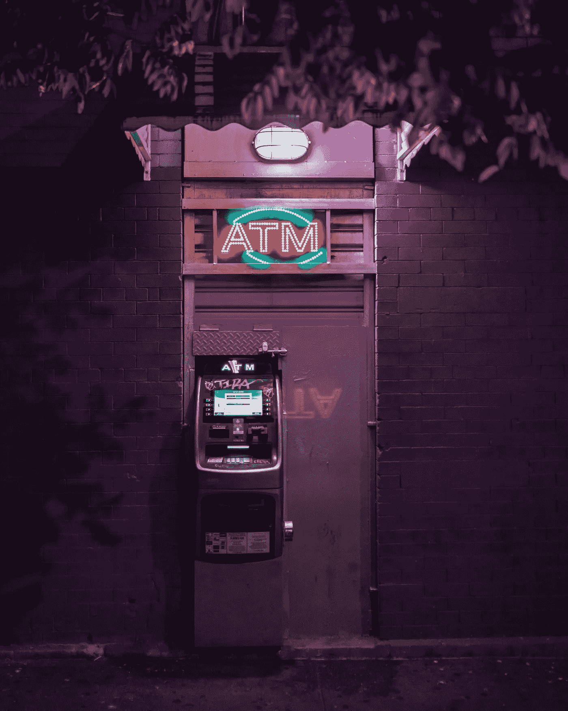

# 监管是分权的敌人

> 原文：<https://medium.com/hackernoon/regulation-is-the-enemy-of-decentralization-5a00470791ad>

Traders use decentralized exchanges to mask their identity.

去中心化是最好的均衡器？

你可能已经读过很多关于通过区块链技术去中心化将如何改变世界的文章。当比特币的价格从 2011 年的每枚不到 1 美元，到去年 12 月的每枚接近 2 万美元时，比特币成为一种轰动，公众的讨论首次正式开始。比特币的背后是区块链，这项技术引入了一种理念，即一个系统可以去中心化，任何人，包括比特币的发明者中本聪和政府，都不能对比特币产生任何影响。

那是什么呢？关于比特币还有更好的、[更有力的描述，但要点是:比特币是一种运行在由数万台服务器组成的网络上的数字货币，这些服务器计算一种特殊的哈希密钥，允许匿名在线交易方之间的交易永久、不变地完成和记录。这些交易被公开记录在比特币的区块链上，任何想看的人都可以看到目前存在的比特币及其持有的数字地址。](http://nymag.com/selectall/2017/12/what-is-bitcoin-a-guide-for-the-confused.html)

整个过程允许互不认识的各方交换支付，在这种情况下是比特币，而不必依赖第三方。这是一个优雅的解决方案，解决了以前在线交易中的双重花费问题:如果有人给我发送了一个数字资产，我如何知道他们没有制作它的数字副本并保留它？因此，你怎么能为数字资产创造稀缺性，从而帮助它保持价值呢？比特币是(第一个)答案。

随着比特币的成功和区块链的承诺，去中心化系统的想法也激励了成千上万的企业家使用区块链创建新的应用程序。2015 年发布的以太坊区块链让创建新的去中心化应用程序的过程变得更加容易，它是用一种名为 Solidity 的编程语言构建的，支持智能合同创建。

使用以太坊，任何人都可以制作自己的分散式应用程序、自己的令牌、自己的治理和网络协议。排队加速增长。2017 年 11 月推出的 Crypto Kitties 等公司已经产生了[数万笔交易](http://www.businessinsider.com/cryptokitties-blockchain-beanie-babies-transactions-plummet-2018-6)，即使 Crypto Kitties 除了作为收藏品之外没有其他价值。

真正的分散式应用程序的主要优点和主要问题是，它们的存在没有任何一个人或一方来控制它。当然，特定区块链应用程序的创建者可以对其进行更新，称为 forks，其中区块链上以前的块仍用旧代码编写，但新块是用新代码创建的。

然而，这些分叉本质上是可选的，需要一致通过。如果一组用户决定不采用更新，它会创建一个硬分叉，其中区块链被复制到两个独立的迭代中，每个迭代都以自己独立的方式进行。这就是[比特币现金](http://fortune.com/2017/08/07/bitcoin-cash-bch-hard-fork-blockchain-usd-coinbase/)的释放方式。

去中心化的想法对市场非常有吸引力，因为它以不可信的方式解决现实世界的问题。分散式系统可以在不要求用户信任看门人、仲裁者或任何人的情况下解决困境(尽管它确实需要对系统所基于的软件代码的信任，特别是对非工程师而言，以及对该系统的治理框架的信任)。

**谁在乎平等？我要赚钱**

这一切都很好，直到我们开始讨论处理证券交易的应用程序，这在美国是由证券交易委员会(SEC)监管的。几乎每个国家都有某种形式的金融监管机构承担这一职责。

这些监管机构中的大多数现在都以某种方式对 ico 施加了一些控制和投资者保护，尽管采取何种形式[因国家而异](http://fintechnews.sg/18525/blockchain/the-state-of-ico-regulation-around-the-world-an-update/)。在美国，SEC 将几乎所有代币都定义为证券，因此任何 ICO 以及通过该 ICO 发行的代币都符合联邦证券法，比特币和以太坊是迄今为止该规则的两个值得注意的例外。在中国，ico 是完全禁止的。

如今，自称交易所并交易通过 ico 发行的加密货币和代币的网站不受监管。证券法没有实施任何保护措施。在许多情况下，这些交易所还要求投资者将加密货币存放在交易所的托管下，以便在平台上进行交易。这一决定带来的灾难性后果是，交易所可能会被黑客攻击，投资者可能会血本无归。许多加密货币交易所已经发生了这种情况，这在新闻中有很好的记录。

**分散交易所**

As ATMs replaced bank tellers, decentralized exchanges hope to replace institutional exchanges, but the issue is not that simple.

由于目前加密交易所的安全问题，区块链行业决定试验分散式交易所，其中没有一家公司或网站持有客户的加密货币。相反，投资者可以直接从他们的钱包进行交易，并快速安全地将他们的加密货币兑换成其他货币或其他钱包。

流行的去中心化区块链协议之一是 0x，在最近的一篇 TechCrunch 文章中，它被描述为一个[加密 Craigslist](https://techcrunch.com/2018/07/16/0x/) ，因为该平台“连接交易者，而无需持有令牌”0x(读作 zero-x)的问题在于，它没有考虑到过去 12 个月中大多数 ico 发行的是安全令牌而不是实用令牌。

在美国，只有经纪自营商和注册交易所可以为投资者交易证券。投资者可以直接去找其他投资者进行交易，只要没有其他人因为找到投资者或进行交易而获得报酬。但是等等，0x 不正是:一个连接投资者和其他投资者的协议，所以是无偿的吗？

0x 协议本身可能符合法规，但有许多公司正在使用 0x 协议，它们是营利性企业，无论是作为做市商还是作为投资者的接口。SEC 意识到这一点只是时间问题，它会调查分散的交易所，最终发现它们在没有注册为经纪自营商的情况下交易证券，除了参与交易的投资者之外，还有人从这些交易中获利。

除了这些担忧，还有另一个问题:分散式交易所的运营是否能遵守 SEC 的规定。看待这个问题的最佳方式是分析一些所需的规则:

*   **规则 144** :该规则规定，一个与公司有关联的人，无论是作为高管还是 20%以上的股东，在三个月内不能交易超过所有已发行股票的 1%或前四个日历周计算的平均周交易量。如果分散的交易所不识别在交易所交易的人并监控交易量，他们怎么知道这些信息呢？即使一个分散的系统能够识别投资者，它又如何限制一位高管的交易呢？
*   清洗交易(Wash trading):另类交易系统必须有一个监督程序，以避免投资者操纵市场。洗盘交易，或称“画胶带”,是指一个投资者不断地在自己之间(或者可能是一个勾结的小团体)进行交易，目的是吸引其他被这种虚假的流动性外表所吸引的投资者。最近，[北海巨妖被指控](https://thenextweb.com/hardfork/2018/06/29/tether-kraken-market-manipulation/)允许这种行为与系绳交易。
*   **拉高和抛售:**这种经典方案通过一大群投资者共同行动，在非常短的时间内大量购买特定的加密货币，并人为提高价格，从而拉高加密货币的价格。人们希望，不知情的投资者也会受到价格突然上涨的吸引而加入进来，但很快就会发现，价格飙升并没有真正的需求。当投资者以商定的价格提前卖出时，这些投资者就会损失他们的钱。受监管的交易所和经纪自营商被要求监控异常定价，如果出现异常交易激增，或者调查显示 Telegram 或 Discorde 上有一个泵在精心策划，就停止交易。

分散式交易所在设计时并没有为上述规则所要求的对投资者交易的控制水平提供便利的网关(这只是其中的一部分)。事实上，分散交易所的概念就是不要采取这些措施，因为这些措施成本高昂，需要合规团队，这意味着要收取费用来弥补这些支出。大多数分散式交易所都是由一小群工程师管理的，在许多情况下，他们都是在自己家里远程工作。他们保持低成本，这种低费用也吸引了平台上的交易者。如果我是一个交易者，为什么要经历 KYC(了解你的客户)的麻烦，在一个收取 5%费用的平台上交易，而我可以立即在一个分散的交易所开始交易，而且是免费的？

它使分散协议在吸引交易者方面具有不公平的市场优势，但当监管机构打来电话时，这些促进证券交易的分散市场会发现，随着它们因违反证券法而一个接一个地被关闭，这些被落在后面的经纪自营商和 ATS 将拥有自己的交易市场。

如果你喜欢你所读的内容，请鼓掌并给我一个媒体跟进。