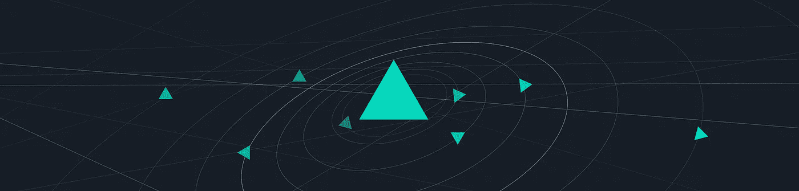

# 法规更新:如何解读关于交易数字资产的潜在非法在线平台的声明？

> 原文：<https://medium.com/hackernoon/regulation-update-how-to-interpret-the-statement-on-potentially-unlawful-online-platforms-for-f769a2af5670>

**来源:** [SEC 公开声明](https://www.sec.gov/news/public-statement/enforcement-tm-statement-potentially-unlawful-online-platforms-trading?utm_content=buffer400eb&utm_medium=social&utm_source=twitter.com&utm_campaign=buffer)

**免责声明**:以下文章不代表 IoTeX 观点。本文表达的观点和意见是作者的观点和意见，不一定反映美国政府任何机构的官方政策或立场。

# 密码市场一瞥

密码市场今早暴跌。

**比特币**:9766.483 美元-8.88%
**以太坊**:742.21547 美元-8.82%
**莱特币**:180.35349 美元-8.11%
**时间戳**10:40AM PST via world coin index

**影响整体密码市场的负面消息** 1。币安疑似被黑
2。MtGox 受托人为菲亚特抛售比特币

在密码世界里，事情发展得很快。如果你还不了解你所在州的加密法规，请在这里阅读。

# 我们将为您解析 SEC 发布的公开声明。

# **我们的立场:**中立。

证交会承诺，他们将在 2 月初的参议院听证会上概述他们将监管哪些领域的加密交易，他们做到了。

# 让我们投入进去吧！

# 第 1 部分:导言

许多这样的平台提供了一种交易资产的机制，这种机制符合联邦证券法中“证券”的定义。如果一个平台提供作为证券的数字资产的交易，并按照联邦证券法的定义作为“交易所”运营，那么该平台必须在 SEC 注册为国家证券交易所，否则可以免于注册。”

如果你想把 crypto 作为一种证券来营销，想把自己作为一个交易所来营销，那么你需要在 SEC 注册。这与我们过去两个月听到的没有太大的不同。

**SEC 的使命声明:**“保护投资者，防范欺诈和操纵交易行为。”

想法:我们受够了。保护消费者是良好商业行为的重要组成部分。

# 第 2 部分:投资者使用在线交易平台的注意事项(针对消费者)

这部分是给消费者的，是加密交易教育计划的一部分。

**关键要点:**

1.  确保你使用的交易所没有给你一个错误的印象，即他们受到监管或符合美国证券交易委员会的标准。
2.  即使他们使用“严格的标准”，这些交易所中的大多数也不会受到 SEC 的审查。
3.  不要假设交易协议符合美国证券交易委员会注册的国家证券交易所的标准。
4.  即使交易所告诉你，他们“提供带有最新报价的订单簿，询问价格和系统上的执行数据”，他们也可能没有 SEC 批准的交易所那样的完整性。

这有点像 SEC 的说法“嘿，消费者，我已经告诉过你，你正把自己置于这些不受监管的加密交易的风险之中。如果你继续这样做，我会认为你明白你所冒的风险。”

他们列出了一长串投资者在跳上加密列车之前应该问自己的问题。如果你真的想最小化你的投资风险，你应该使用他们网站上列出的工具客观地评估你正在使用的交易所。

SEC 列举了几个链接，供消费者检查他们使用的交易所是 [SEC 注册的国家证券交易所](https://www.sec.gov/fast-answers/divisionsmarketregmrexchangesshtml.html)还是[替代交易系统](https://www.sec.gov/foia/docs/atslist.htm) (ATS)。

# 第 3 部分:运营在线交易平台的市场参与者的考虑事项(交易所)

1.  **加入我们，否则你就出局:**这是对美国交易所的警告，你要么在 SEC 注册，要么在注册豁免的情况下运营。
2.  如果你打算作为一个行业进行自我监管，那么自律组织(SRO)必须有规则和程序来管理和约束其成员和与其成员相关的人员。你可能会问什么是 SRO？SRO 就像一个专业组织，就像土木工程师的 ASCE 或医生的医学委员会。他们就像是商业中的民间监管者。
3.  **ATS 不再豁免**:作为 ATS 运营的公司不再不受监管要求的约束。ATS 必须在 SEC 注册为经纪交易商，并在 SRO 注册为会员。需要填一份表格。ATS 将遵守联邦证券法。
4.  **数字钱包不再被豁免**:数字钱包虽然不是 SEC 定义的严格意义上的交易所，但只要数字资产被定义为证券，也将受到监管，并且基于钱包的公司可能需要遵守“联邦证券法下的其他注册要求，包括经纪交易商、转账代理或清算机构注册等。”

SEC 非常严肃地打击加密诈骗。他们甚至列出了他们对 Jon E. Montroll & Bifunder，REcoin Group Foundation，LLC 等人，PlexCorps 等人和 AriseBank 等人采取的各种执法行动，以此表明他们是认真的。

# 点击这里阅读我们之前关于虚拟货币参议院听证会的帖子。

# 关于 IoTeX

IoTeX 致力于打造下一代面向物联网的区块链平台。尖端的区块链区块链架构将解决与物联网 DApps 和生态系统增长相关的可扩展性、隐私性、隔离性和可开发性问题。通过将象征性激励与我们充满活力的全球社区相结合，我们相信我们可以众包顶级行业和社区人才，以推动区块链 3.0 的发展。

【https://iotex.io/telegram】电报:[T5](https://iotex.io/telegram)

*推特:*[*https://twitter.com/iotex_io*](https://twitter.com/iotex_io)