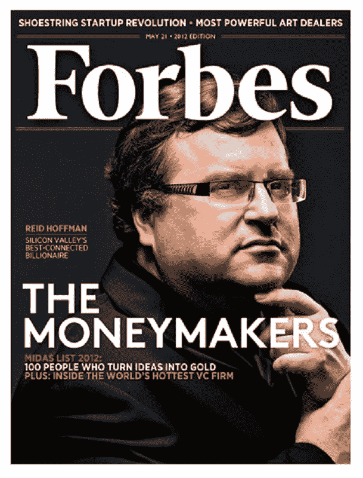

# 领英的雷德·霍夫曼

> 原文：<https://medium.com/hackernoon/reid-hoffman-of-linkedin-b7402d7df009>

文本摘要:

雷德·霍夫曼是一名企业家和风险投资家，最出名的是他创办了 LinkedIn 网站，该网站允许用户在职业发展过程中跟踪业务联系。在这次采访中，了解他成为一名学者以改善世界的目标是如何被互联网的诱惑所吸引，以及他在创业公司的工作如何对社会产生了更大的影响。

这篇采访最初是由来自 [MeowEssay](https://meowessay.com/) 的罗伯特·戴尔撰写的

**公共知识分子**
当雷德·霍夫曼从斯坦福大学毕业时，他的目标是改变世界。他认为他可以通过成为一名公共知识分子来做到这一点。当时，他以为那是为《纽约书评》或《大西洋月刊》等杂志写文章的人。“我本想成为一名学者，”他说，“我去了牛津。然后我意识到作为一个学者的问题是你写的书会有 50 个人阅读。我想在一个更广阔的舞台上参与，因为公共知识分子激励我的是，无论作为个人还是作为社会，你对我们是谁以及我们应该是谁持有一种看法。”

大约也是在这个时候，在 90 年代初，计算机开始变得普遍，人们开始使用这个叫做万维网的新事物。霍夫曼认识到软件和在线服务作为媒体平台的重要性，并意识到“你可以去创造真正有价值的媒体对象，这些媒体对象将对社会产生更深刻的变革影响——在那里你举起镜头，帮助人们进化到他们应该成为的人或他们想要成为的人。”他知道自己对社会的影响会因互联网的力量而放大许多倍，因此他决定走这条路，开始创业生涯，这将给他一个更大的舞台来表达自己的观点。

**创业公司**

1993 年秋天在牛津大学完成进一步的研究后，他去找一些风险投资家寻求资金来启动他的创业生涯。当他们问他的工作经历时，他告诉他们他在 PARC 施乐公司实习过，他们说，“不，不，不。你的工作经历是什么？之前有没有运过[软件](https://hackernoon.com/tagged/software)？”他不好意思地回答道，“哦，呃…不，还没有。”风投们告诉他去找一份真正的工作，一旦他学会了一些东西，就回来找他们。

霍夫曼接受了他们的建议，去了苹果电脑公司、电子世界(苹果的在线服务)和富士通公司工作。他认为网络不仅仅会成为这一代人的主要媒体变革，还会成为未来几代人的主要变革，因为它“为人们表达自己创造了新的可能性。”

1997 年，在积累了一些经验后，他创建了自己的第一家创业公司 SocialNet。该网站专注于在线约会，将人们与和他们有相似兴趣的人配对，无论是寻找一段认真的关系还是一起打网球的伙伴。SocialNet 从未真正起飞，最终与董事会在未来方向上的分歧迫使霍夫曼离开了公司，但在许多方面，这个想法太超前了。回顾公司的衰落，霍夫曼说，他应该专注于一个单一的类别，例如约会，并做得很好，而不是如此雄心勃勃，试图涵盖这么多的话题。

他学到的另一个重要教训是不要像产品经理一样思考。“大多数人倾向于(从产品的角度)思考。他们有一个他们认为会改变世界的产品，他们想象它。融资策略比产品策略更关键。产品战略很重要，但基本上，如果你不能获得足够的资本来启动你的业务，通常是资本的连续流入，你的业务就会失败，它就会消失，因为一美元盈利和一美元不盈利的区别是永生和死亡。”许多企业家的梦想是“创建这些可能有机会永生的组织，成为一个自我维持的实体”，而要做到这一点，你必须有一个融资策略。他希望自己告诉了 SocialNet 的投资者，互联网上的每个人都将加入该网站，并筹集了 5000 万美元，而他们只筹集了一点点资金，并试图证明一种具体的商业模式——“这种模式，”霍夫曼补充道，“比那时好得多。”

在他的第一次创业中，霍夫曼也学到了“风险投资就像(基于婚姻的)两次 PowerPoint 演示和一顿晚餐。你必须非常小心你到底要和谁结婚，这是双向的。”你必须意识到这是否是一种可操作的合作关系，以及它的效果如何？因为如果没有的话，那就该是彼此断绝关系的时候了。

在网络空间，来自零售的经验同样适用，但不是位置、位置、位置，而是分配、分配、分配。“基本上，只有当你拥有某种形式的自然分布(病毒式传播)时，消费者互联网创业才会成功。有很多不同的病毒机制可以工作，这既有艺术也有科学，但如果你没有一个自然的分布，你的消费互联网就不会工作。结束了。”

当他离开 SocialNet 时，这些是他带去帮助他的朋友彼得·泰尔的一些经验，他是 Paypal 的首席执行官和联合创始人，当时他负责公司的运营和所有外部事务。回顾过去，他用 Thiel 的话来描述他在 SocialNet 学到的东西，“(Thiel 说，他)一生中从未学到这么多东西，除了从 2 岁到 3 岁之间。你第一次创业就是这样。就像，“哦，我的上帝！"就像从消防水管里喝水是一个过于温和的比喻."

**LinkedIn**

当易贝在 2002 年以 15 亿美元收购 PayPal 时，Hoffman 突然发现自己在考虑如何发展自己的职业生涯。“当时就像是，我是休假还是做这个职业社交的事情，我对 LinkedIn 如何改变世界的愿景？因为我个人所做的每一件事都有一个理念，那就是不仅要有一个好的经济实体和好的企业(在它背后)，还要有一件改变世界的事情，让人们的生活有所不同。”最后，他决定做 LinkedIn，所以他没有休假，而是在 2002 年末召集了一小群人，开始编写代码，并在 2003 年 5 月推出了。

收购 PayPal 后，霍夫曼变得非常富有，之后他可以做很多事情，那么是什么驱使他创建另一家创业公司呢？他回答说，“对我来说，PayPal 给我的是时间自由。我用 PayPal 赚了足够多的钱，可以随心所欲地去旅行，去看电影，买房子，做所有普通中产阶级渴望做的事情。激励我的是改变世界的大项目。我想了想，然后说好吧，我有兴趣写书吗？或者我更有兴趣做一些更具组织规模的事情，我意识到(这是)对我来说真正重要的事情……我有这个想法已经酝酿了几年，我实际上相信 LinkedIn 将对整个世界产生一些真正重要的影响，我认为这是一个非常可行的业务，所以我将这样做并得到部署，因为互联网的部分主题是它本质上是人民的权力。”

霍夫曼的信念是，随着数百万人在线参与，互联网已经成为一个民主的景观，使人们能够拥有尽可能最好的生活，他希望 LinkedIn 继续推广这一传统，就像 PayPal 一样，让个人能够“成为一名商人(通过将他们的小招牌挂在网上并接受付款)”，这一过程曾经是为商业银行认可的企业保留的。“(在)LinkedIn，每个专业人士都可以在网上挂一个招牌，他们可以说自己对什么样的业务感兴趣，然后他们可以找到其他专业人士，要么是他们已经认识的，要么是他们想要认识的，以便与他们联系并建立业务。”

霍夫曼认为这是世界的未来的原因之一是，每个个体都有能力成为自己的企业。“你已经知道了，人们每 3 到 4 年就会换一次工作……每个人都要对他们如何发展自己的小企业负责。你需要什么样的东西？你需要新客户，你如何获得新客户？是那些了解你和信任你的人。口碑推荐真的很重要，当你在寻找东西时，你需要能够与其他人联系，要么是帮助你解决问题的专家，要么是与公司的内部关系……这些都涉及到在网上拥有一套个人资料并参与其中，这就是 LinkedIn 的意义所在。”寻找员工的最大挑战之一是找到适合这份工作的人，霍夫曼认为 LinkedIn 可以解决这个问题。“这是单个因素的失败(雇佣某人或找到某人为其工作)，”他说，“如果你没有找到合适的人，这是非常糟糕的消息。你如何解决这个问题？你使用可信的推荐，并与人交谈。”例如，如果你需要雇用一名翻译，你不会随便雇用谁，你会问别人是否知道谁适合这份工作，并依赖他们的推荐。“使用 6 度参考和信任是导航和建立这些关键关系的一种方式，这就是我们所做的事情。”

**商业模式**

霍夫曼估计，我们今天在 LinkedIn 上看到的大约 80%的内容在他创建之前就已经在他的脑海中形成了，但他不希望人们认为事情总是规划得如此整齐。“我们刚开始时没有的想法的细微差别。大多数好的消费者互联网想法都是从吸引市场开始的，然后你再去解决其他的事情。我告诉企业家和投资者的一件事是，尤其是如果你在消费互联网领域，我还没有看到 A 轮融资商业模式成为公司结束时的商业模式。每当有人说我有一个商业模式时，结果通常会与你的预测略有不同，或者大相径庭。”这些话在 LinkedIn 的案例中被证明是正确的。最初人们认为，一旦网站的用户群增长，他们就可以开始对某些类型的使用向参与者收费。然而，他们逐渐意识到大众产品应该总是免费的。

霍夫曼希望尽可能多的人加入并使用 LinkedIn，即使他们目前的业务需求并不强烈，而且他们只是用它来完成简单的任务，如雇用员工、找工作或使用它进行证明人调查。他们认为所有这些服务都应该免费提供。霍夫曼解释道:“当人们认真使用它的时候，就向他们收费，如果你是一名招聘经理，发布一份工作清单，那就要花一些钱。如果你是一个商业开发人员，正在寻找与公司的内部联系，你需要大规模地做这件事——这需要一些成本。网络的一个有趣的特点是，大多数成功的东西都有大量的免费成分，它们要么完全免费，要么许多丰富的基本内容都是免费的。”

**目标市场**

LinkedIn 面临的最大挑战之一是了解他们的主要客户群主要在 27 或 28 岁以上。霍夫曼解释说，“实际上不是大学生或高中生(利用我们)。他们还没有一个专业网络来帮助他们找到工作或管理他们的职业生涯。这些都是你离开大学后开始构建的东西。有趣的是，(所有这些像脸书这样的社交网络)得到了所有这些强大的加速器，因为高中生和大学生有很多空闲时间，他们并不真正关心他们的联系的价值。”另一方面，LinkedIn 的增长速度要慢得多，但更稳定，“因为一旦(用户)超过 30 岁，他们的生活中就有 3 个属性。他们介于结婚生子和想要一段认真的感情(这占据了他们大部分的时间)之间。第二件事是他们有足够多的朋友。不是他们不愿意认识新朋友，而是他们有足够的朋友。第三，他们的职业开始变得重要。我该如何买房，(退休，成家，送孩子上大学)？你的职业生涯开始出现一个转折点，下一步你要做的事情会真正发生变化，所以 LinkedIn 必须说服他们，我们是有价值的。不像脸书，那是‘哇！一个和我的朋友一起玩的地方，我有很多很多的空闲时间，因为这就是人们在他们生命的那些周期中所做的事情。“向我证明你是有价值的。”(这就是为什么)在这样的人口结构中成长确实是一个挑战。"

**传播消息**

“在消费互联网中，产品为王。你必须得到对网民有价值的东西，这样才值得他们花时间和精力。想想有多少成千上万的网址在那里。你的普通消费者互联网被正在发生的所有这些事情淹没了，所以它必须是有价值的东西，这是关键的事情。”公共关系也是一种非常有用的传播方式，如果你能让其他人写你的网站，那就更好了，因为消费者喜欢经过良好编辑过滤的内容。霍夫曼提醒我们，“最终，你不能仅靠公关来推动分销战略。它必须以某种方式独立存在，这是你必须解决的问题。我认为，普通的专业人士还没有意识到(LinkedIn)在如何加速和管理你的职业生涯中可以发挥的核心作用，这是我们现在努力的事情之一，就是让他们的功能和易用性发挥出来，这样(人们)就可以看到(好处)。”

**联网**

即使 LinkedIn 的社交网络规模如此之大，并且拥有忠实的用户粉丝，这在他们和竞争对手之间形成了一条巨大的护城河，霍夫曼承认，仍有一些事情给他带来不确定性。“让我担心的主要问题是与主流用户沟通。以网络这个词为例。对大多数人来说，网络是一种模糊的负面含义，因为它意味着人们会说‘能给我一张你的名片吗？“你能帮我吗，”而不是“我们能互相帮助吗？”“为了解决这个问题，LinkedIn 旨在让用户互相帮助，而不是让社交者利用他人为自己谋利。”推荐人应该是我根据我对你的了解，根据我说‘哦，他是一个好人，他工作努力，他值得信赖，他值得尊敬，他勤奋，他是我的一个亲密朋友，帮我一个忙’的能力，把你推荐给某人。你认为聪明有趣的人，他们交往的人中聪明有趣的比例要高得多。所以，同样的原则也适用于 LinkedIn。"

当用户访问其他人的个人资料时，他们可以找到关系和模式，并且在他们个人资料的首页上，他们可以通过查看人们对他们的所有正面评论来进行前台推荐，并且通过与个人的联系，双方都知道他们可以进行背景推荐，并找出该人是否有任何负面推荐。

**Web 2.0**

自 20 世纪 90 年代以来，随着技术的进步，创业的动力有所改变吗？霍夫曼承认，“推出一个东西比以前便宜多了。”有更便宜的设备，有像 Linux、开源软件这样的选择，还有以前没有的搜索引擎，但是，另一方面，有更多的入口。(而且)如果你有 1000 人花 10 万美元或 20 万美元去做广告，能筹集 500 万美元并有效部署的人将拥有巨大的竞争优势。”

霍夫曼给企业家的一条建议是“做一些有巨大收益的事情。这将是同样数量的血、汗、泪和其他一切，因为一个小的上升和巨大的上升，所以专注于一些可以变得非常非常大的东西，因为无论如何你基本上都要把血倒进桶里，所以答案是，“是的，现在(推出)更便宜了，并因此有了新的规则，但它并没有消除旧的规则。”"

**结束**

霍夫曼认为，“企业家精神的一部分是预测未来，并让未来变得更近。我意识到，从某种意义上来说，未来每个人都将在网上拥有个人资料。我希望 LinkedIn 将改变世界的方式是，你拥有一个完整的用户网络，让人们相互联系，相互支持，并能够相互访问。(我们的)5 万英尺公民使命是让好人更强大，让虐待他人的人更弱小。整个想法是，如果我们在一个关系网中，你可以很容易地找到我，找到其他说我好或不好的人，那么我们应该让这个世界变得更好，因为那些尊重他人、值得尊敬、遵守协议的人，当有人检查他们时，他们会发现，“哦，酷，我会和这个人做生意，”而那些食言、误导他人的人，我们可以检查他们，并说，“哦，我们不会和这些人做生意。”这就是 LinkedIn 试图改变世界的方式，我希望我们能尽快实现这一目标。"