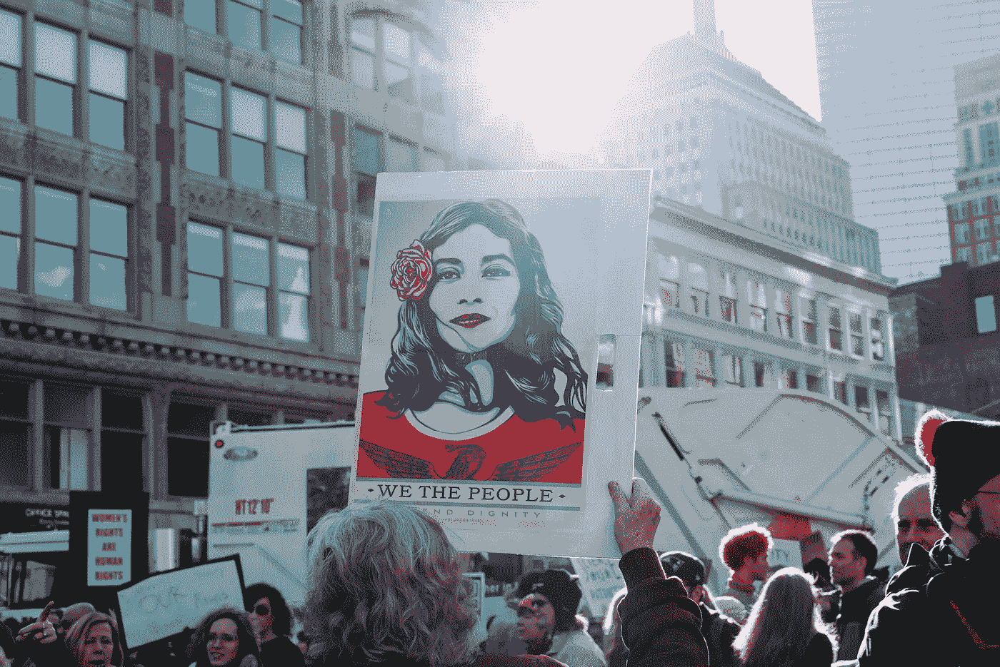
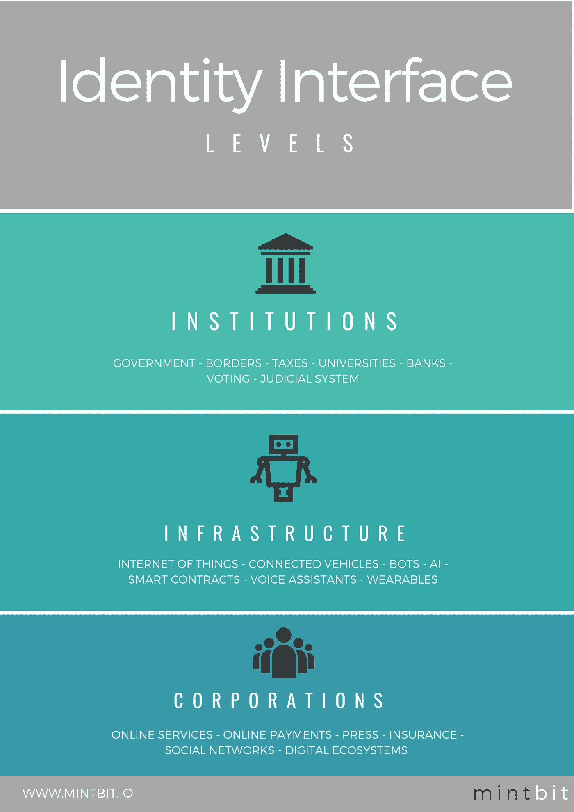
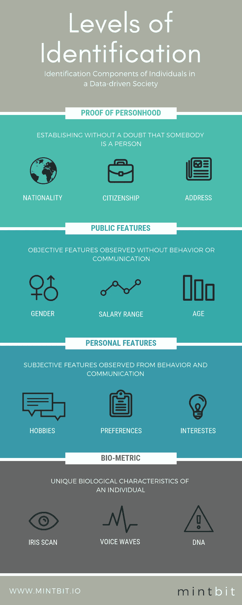
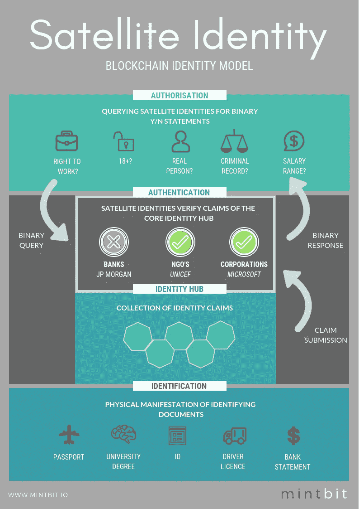

# 用区块链重塑身份

> 原文：<https://medium.com/hackernoon/reimagining-identity-with-blockchain-ab2663bbb04e>

与互联网类似，区块链技术是不区分行业的。然而，就像互联网应用在政府和游戏中的不同一样，区块链的创新原则也有不同的表达方式。区块链解锁潜力巨大的领域之一就是 ***身份*** *。*

Credit: Alice Donovan Rouse

# 身份是互动的基本资产

*想听 Spotify？使用脸书登录。*想出国旅游？别忘了你的护照。*想租个新家？*获取地址证明。*想读一段文字？* Face-ID。**

在我们这个数据驱动的社会中，我们以无数不同的方式使用身份识别。**坦白说，身份已经变得有点乱了。**

在 [MintBit](http://www.mintbit.io) 中，我们定义了当今社会中的三种身份接口。

# 身份界面

Credit: MintBit

每天，我们的交互界面都在机构、基础设施和企业之间分离。与服务或产品相关联的每个许可都取决于某些信息的提供和接受。有时是人完成验证过程，有时是机器。

这些新的互动形式既方便又受欢迎。在你自己的时间里完成网上报税。用网上签证申请代替去大使馆。如果你暂时忘记了，一个优步司机会在凌晨 2 点知道你住在哪里。

对许多公司来说，数据是不断赠送的礼物。更多数据；更好的模型。本质上，你的行为被抽象为数据点的集合。尤瓦尔·诺亚·哈拉里有句名言:*“数字革命威胁着我们所有人的非个性化。”*

也可能很烦人。忘记您的政府登录信息，导致迟交税款被罚款。谷歌的自动更正功能热情地预先填写航班信息，导致机场为更正你的名字而收取额外费用。在国外停止工作的银行卡，因为他们没有意识到你自由奔放的表弟喜欢到处走动。

然而，身份上的不幸也是非常危险的。身份盗窃可能导致再也没有资格申请信用卡。永远买不起房子。更糟的是。

你知道谁知道你是谁吗？你知道每天有多少算法根据你过去的行为做出决定吗？你知道现在谁能接触到你的护照数据吗？

现在考虑一下这个。谁首先提供你的护照？政府。一个稳定的政府不是必然的。政府可以腐败。政府可以变得无赖。政府甚至会崩溃。

如果你失去了自我，你会怎么样？

对许多叙利亚难民来说，这不是一个假设性的问题。

难民无法证明自己的身份。事实上，超过 20 亿人没有证件，使他们的经济和身体处于危险之中。没有正式身份，不算。你谁也不是。这些人，带着希望和梦想，化为数字。没有证件，没有前途。甚至连基本的人权，如申请食物和住所援助都变得困难。

值得庆幸的是，像吉米·斯诺克这样的技术专家，T2 Tykn T3 的联合创始人，面对这样的不公正不会无动于衷。

> 解决这个问题是我们的命根子。我的共同创始人 Tey 在荷兰成为难民，因为他的出生证在海湾战争中被销毁；他是隐形的。与此同时，我们意识到，我们不能只是去采煤工作面，并开始分发身份。这就是我们与非政府组织和政府合作的原因。我们希望他们能够更好地帮助人们。

让我们解开我们制造的这个混乱。

# **等级鉴定**

Credit: MintBit

身份认证级别是我们开发的一个内部工具，用于分析数据驱动型社会中个人的身份识别组件是什么样的，如果它落入坏人之手，将根据灾难级别进行排序。

仔细观察今天的数字生态系统会发现各种奇怪的情况。

*‘登录脸书/推特/电子邮件’*(oauth 2 为发起者)**不**证明人格。它将您各自的帐户锚定为一个参考点(如果您愿意，也可以称之为代理)，以附加一个配置文件。例如，如果你提供了一个假的名字、照片或国籍，它就不能明确地确定你就是你。

我们都见识过这种推理失误的后果。假新闻。假追随者。网络诈骗。向不存在的人营销。或者另一种选择:向确实存在、但不知道自己的身份被窃取的人营销。

2017 年，美国有 1600 万人成为身份欺诈的受害者。同年，Equifax 遭到黑客攻击。超过 1.4 亿美国居民的个人信息暴露在黑客面前，面临风险。这超过了半个国家。

DNA 测试现在非常流行。这里先说清楚。像 23andMe 这样的公司肯定*在*向第三方公司、研究机构和非营利组织出售你的数据。可能*不是*你的基因数据，而是用于研究的去识别、聚合数据，如果你同意的话。这是他们商业模式的一部分。

很明显，今天的情况已经不理想了。当身份交互接口*人物:基础设施*变得更加突出时，情况就更糟了。

机器绝对交易。如果算法输入不正确，结果可能是灾难性的。但是我们可能完全错了——T4 Civic 公司首席执行官兼联合创始人 Vinny Lingham 强调了这一点。

> 现在，我们生活在一个人们已经失去对个人信息控制的时代——黑客、身份盗窃、冒名顶替都太常见了。但是想象一下一个安全、可信的数字身份，你可以从你的移动设备访问它，用生物识别技术保护它，无论你去哪里，从通过机场安检到开银行账户，它都被接受。区块链技术开启了这些机会，改变了我们对分享信息，特别是分享和保护我们个人信息的看法。这就是为什么 Civic 正在领导 Identity.com 的开发，这是一个分散的生态系统，将使世界各地的人们更容易获得安全、可信的身份验证。

今天，当你填表时，问题需要绝对的信息。你几岁了？你挣多少钱？你在这个系统中的声誉得分是多少？你住在哪里？

有趣的是，询问者真正需要知道的是:这个 18 岁以上的人能买得起他们表示感兴趣的车吗？

我们需要考虑不同的身份模型。进入区块链。

# 基于区块链的卫星身份

Credit: KLM

我们为下一代互联网 Web 3.0 提出了一个以用户为中心的自我主权身份应用。

## 区块链给身份带来很多好处

*   身份是历史量化的。现在很容易添加一个定性层，用社会资本增加虚拟身份。
*   按需身份验证。
*   将金融和商业服务的机会带给数百万以前可能被剥夺的人。
*   个人数据隐私。
*   **改善人员:界面沟通**，显著影响智慧城市解决方案。
*   你的身份不能被夺走。
*   你不仅仅受一个身份权威的支配。
*   虚拟身份允许我们将数据点组合成完全独特的信息；产生了**新的商业模式。**

充满激情的团队正在努力实现这一愿景，例如班曲的创始人兼首席执行官 Ashish Gadnis。

> “区块链的身份已经是旧闻了。区块链的真正价值在于其无与伦比的能力，为当今世界上生活在极端贫困中的数十亿人创造和确保经济身份。(区块链的)完全可追踪、透明的交易让没有银行账户的人能够正式参与全球经济，同时拥有自己的信息并将其货币化。这确实是一个革命性的机会。班曲通过身份传递尊严。”

## 区块链卫星身份是如何工作的？

共有四层:

*   **实体文件:**您现在用来识别身份的文件，如护照或驾驶执照。
*   **身份中心:**关于你的身份的声明集合，例如声明你已经超过 18 岁，并且拥有有效的驾驶执照。
*   **卫星身份:**第三方验证身份。想象一下，道路运输管理局证实你确实获得了驾驶执照，并且该文件仍然有效。
*   **第三方:**加利福尼亚的一家租赁公司可以用一个二元问题来查询由道路运输管理局核实的卫星身份:这个人此刻是否拥有在美国有效的驾驶执照？这个问题是在智能合同中提出的(更多关于区块链工具箱[这里](https://hackernoon.com/reimagining-mobility-with-blockchain-e5ad483f85f2))。作为响应，道路运输管理局确认或拒绝该询问。

TLDR:把虚拟身份放在区块链上。通过智能合约访问它们。

在**授权域**卫星身份允许做事情。你能做什么而不是你是谁。你不希望在交易中尽可能使用你的身份。在**认证域**中，可信方担保您的身份。你的个人**身份中枢**受到私钥的保护，将你的身份声明绑定到你对这些声明的证明上。**标识域**是那些声明的物理表现。

卫星身份可以有多种表达方式。例如，您的“医疗保健 A 类卫星身份”由 1)您自己的公钥和 NHS(英国公共医疗保健)私钥签署。当您的保险公司查询这个特定的卫星身份时，NHS 检查 a)保险公司是否对所请求的信息知情，如果是，b)根据核实或拒绝的身份声明做出响应。这是一种相对廉价的加密操作。

**智能合同将接受**的某些问题，例如:你是否年满 18 岁。**它会拒绝的某些问题**，比如你的宗教是什么？

想象一下，美国邮政服务部署他们自己的声明发布者合同，提供关于身份的邮政地址的可验证声明。任何需要验证地址的合同都可以在允许交互之前简单地查找由美国邮政服务合同发出的声明。

**分类账将保存交易历史，这样我们就能最终控制谁了解我们，谁在何时问了什么。**我们的情况会更好，身份提供商仍然可以通过这种模式获利。

Evernym 的产品副总裁詹姆斯·莫纳汉有不同的说法:

> “在多源自我主权身份模式中，个人和机构比在传统身份系统中处于更加平等的地位。个人仍然依靠值得信赖的机构颁发的证书来证明自己的事情，但她可以控制自己分享多少以及从她的哪些关系中分享，这是在隐私方面迈出的重要一步。同样，使用身份证明的机构可以验证其来源和完整性，而无需联系发行者，这开辟了一个全新的使用案例领域。”

## 赢家:银行

**管理私钥是很多责任。**

理想情况下，私钥由受监管的机构管理，如果出现问题，您可以对其进行法律追索。对于值得信赖的托管人来说，这是一个巨大的机会。

银行将是你储存身份的地方，而不是你的钱。你可以把钱存放在任何地方，但身份很重要。

他们可以通过向合作伙伴提供个人数据即服务来获得收入。当用户在银行或电信公司开户时，就会创建一个身份中心。它的私钥可以安全地存储在用户的手机、信用卡或其他设备中。然后，提供商使用来自身份中心的公钥创建附属身份。

## 捐助者

Credit: PixaSquare

*   **房地产:**购房者的数字身份可以通过个人信用评分来增强。这将包括收入、个人贷款偿还历史、社交媒体档案等因素。一份包含房产全部细节的智能合同，连同买家的卫星身份，可以在区块链上为潜在的金融家进行拍卖。买方选择最好的报价，金融家因承担风险而获得回报。在要约被接受之前，只有判断信誉所必需的那些要素才会被披露。
*   **零售:**在网上购物时，我们可以通过更多的定性和定量信息(客户背书、交易历史等)来丰富传统的身份识别数据，从而证明我们的可信度。).

Credit: Monika Grabkowska

*   **食品供应链:**食物链中的数字身份，来源和安全性不再由官方中间人来验证，而是由供应链中的参与者来验证。一个简单的条形码，以及与之相关的区块链信息，将揭示产品的完整和验证的轨迹。
*   **医疗保健:**患者同意是医疗保健的基本原则之一。患者有权决定他们的护理和治疗，并享有隐私权。但是在今天的网络架构中，同意和隐私并没有得到优化。
*   政治:当国会议员知道他们在听真正的选民说话时，他们会听得更仔细。他们怎么知道大量愤怒的推文是否真的来自他们选区的选民？

## 采用挑战

一个受信任的实体需要建立一些合法的、可执行的规则和政策，以保证其正常工作。他们需要让普通人能够轻松安全地使用，他们需要说服足够多的人和服务提供商采用并信任 ID，同时找到经济上可行的商业模式。

**一些机构处于独特的地位，可以一次性解决所有这些先有鸡还是先有蛋的问题**，并将这个伟大的想法付诸实施——首先是我们面向公民的政府机构。

# 身份是你最有价值的财产

随着世界变得更加互联和数字化，我们认为的“真实”和“虚拟”身份之间的界限开始模糊，物理界限正在消失。

在物理世界中，我们身份的分散性和临时性是显而易见的。

Credit: Oliver Sjöström

奇怪的是，你用同样的信息来证明你已经到了可以在酒吧喝酒的年龄。**目前的过度征收是因为缺乏更好的制度。**

在现实世界中，人们从各种来源收集和管理身份凭证，包括政府、金融机构、学校、企业、家人、同事和朋友。他们自己也主张信息。这些不同的证书有不同的用途。人们收集它们，并在各种背景下展示它们。当出示时，凭证验证者可以自由决定是否信任该凭证。

在网上，身份不是那样的。传统上，在线身份是单一来源的，是为特定目的而构建的。在网上，各种所谓的“身份提供商”使用用户名和密码对人们进行身份认证，并提供一组固定的、通常有限的身份交易主体属性。来自这些系统的身份信息通常在特定的有限环境中使用。社交登录使其可以跨环境使用，但共享的信息种类有限，而且其来源往往难以确定。这些身份系统不具备互操作性，因此很难将一个身份系统的属性与另一个身份系统的属性结合起来。因此，在线身份是一维的，价值有限。

# 基于区块链的身份解锁去中心化

如果不重新想象身份，去中心化的应用程序将永远无法达到规模，因为没有与之交互的模型。

数字身份允许存储大量个人信息，但也为资产转移提供了重要的链接，无论这些资产是人、动物、有形资产还是无形资产等。换句话说，数字身份是一个功能性的分散系统的门户，并在整个数据社会中导航。

可以说，去中心化的身份甚至可以释放普遍的基本收入。但那是以后的事了。

## 区块链并没有让身份变得容易。它使之成为可能。

*应该有的信息有没有丢失？在评论里告诉我们吧！*

*非常感谢所有做出贡献的人。特别是戴夫·伯奇***，他仍然是这个领域的开拓者。**

****阿尔温·斯密特****(*[*@ arwensmit*](https://twitter.com/ArwenSmit)*)是 MintBit 的 CEO(*[*www . mint bit . io*](http://www.mintbit.io)*)。想要更多见解？订阅每月* ***区块链字节*** *简讯* [*此处*](http://eepurl.com/ge9jNX) *或关注我们 Twitter 上的*[*@ mint bit _*](https://twitter.com/mintbit_)*。**