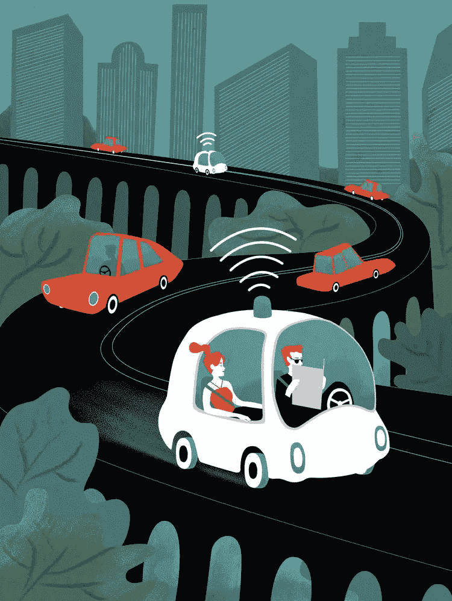
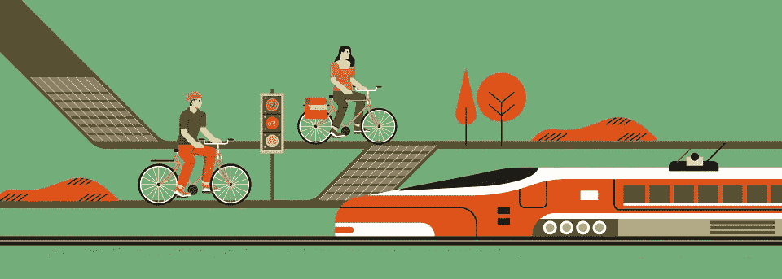
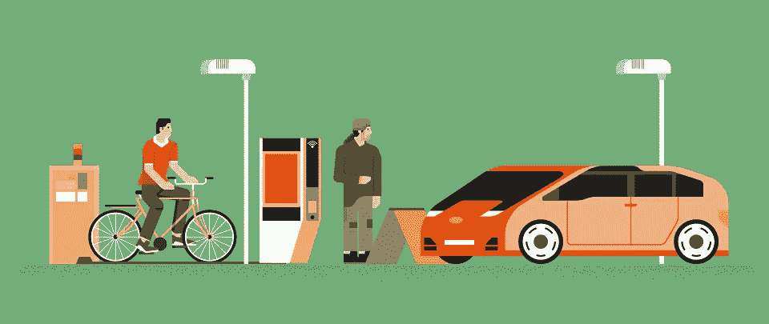
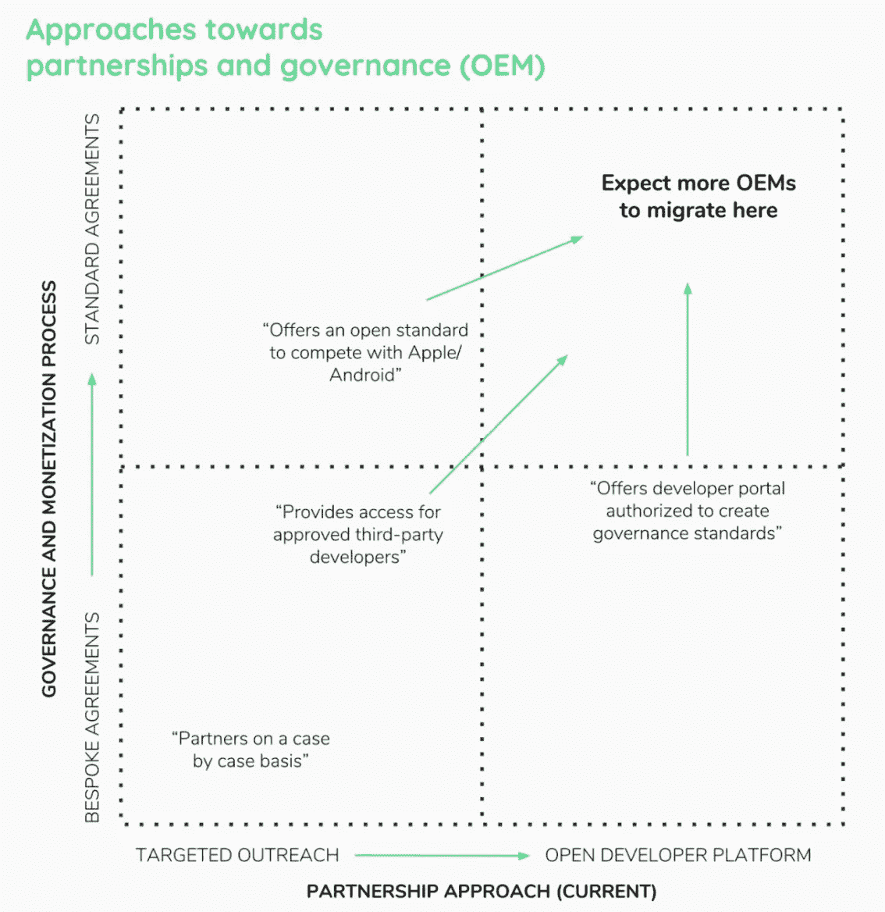

# 用区块链重塑移动性

> 原文：<https://medium.com/hackernoon/reimagining-mobility-with-blockchain-e5ad483f85f2>

与互联网类似，区块链技术是不区分行业的。然而，类似于互联网应用在医疗保健和汽车领域的不同，区块链的创新原则也有不同的表达方式。区块链应用越来越广泛的领域之一是移动性。

区块链是一个工具包。解决方案需要一个问题。当解决你的移动挑战时，考虑这个:**区块链是唯一有资格解决这个问题的吗？**

思想领袖认为区块链将提升移动游戏。
InMotion Ventures[的 Alex Smout】评论道:](https://www.inmotionventures.com/)

> “汽车和移动行业的快速变化带来了许多问题，这些问题得益于区块链的独特优势。
> 
> 我们看到高价值资产交易和共享的增长，同时“可信”中间人的去中介化，这意味着透明度和信任至关重要。智能互联汽车需要平衡安全性和数据控制需求与市场对连接和数据访问的需求。现在，原始设备制造商、服务提供商和城市第一次不得不在开放标准上合作，以提供安全、可持续的服务。
> 
> 这些趋势，以及其他几十种趋势，意味着移动行业已经在以区块链为核心催生合法的投资机会，尽管目前技术存在局限性。"

# 区块链工具包

## 智能合同

智能合约将信任提升到前所未有的水平。本协议仅在双方满足所有要求后生效。笔和纸合同往往是在两方或多方之间，可能是个人或机构。然而，智能合约是代码，因此它们可以是人对人、人对机器和机器对人，从而打开价值创造的新维度。

## 秘密资产

将一系列特征编码到企业内部流动的“价值储存”中的能力，将一维产品或服务提升到了交互式平台、网络或生态系统。通过为特定用例设计加密资产，你可以刺激预期行为，动员你的社区为你的业务增值。

## 可信分类帐

存储在不可变的分散式分类账上的透明交易记录在低信任度环境中直觉上最有价值。这使得核实声明成为可能，如车队中的汽车数量或司机的跟踪记录。

# 区块链可以解决哪些移动性挑战？

根据《明日之旅》的创始人克里斯·科比的说法，有不少。

> “今天，移动性高度集中于过于复杂的服务层，这些服务层会造成浪费，并经常向消费者提供次优产品——区块链有可能瓦解这个市场。
> 
> 我认为区块链在三个方面影响了移动性。首先，创建一个非集中和分散拥有的共享接入工具网络。第二，通过一个令牌化的市场来管理这个网络，让一个可信的社区来执行维护和移动任务。最后，创建一个信任网络，让消费者使用经过验证的数字身份访问共享车辆。"

移动性正在从一个有围墙的花园演变成一个相互联系的关系网。这跟区块链有什么关系？我们将首先探索区块链如何孤立地应用于车辆，然后我们将它放在一个越来越广泛的背景下，直到我们到达智能城市。

正如 [Philipp Sandner](https://medium.com/u/fb810e5f73b7?source=post_page-----e5ad483f85f2--------------------------------) 在[这篇](/@philippsandner/analysis-of-blockchain-technology-in-the-mobility-sector-1078e429615f)文章中提出的，我们的区块链工具包可以应用于四个核心领域:**多方流程**、**单一来源真相**、**缺失信任**和**开放生态系统**。

# **单车**

## 用例

*   **绝对信息**—这可能是汽车自身收集的信息，如总里程、重量或年龄。或者，这可能是其他人在汽车上收集的信息，比如车辆状况、车间访问和维修。有助于转售价值的一切。
*   **保险** —使用绝对信息重新计算风险保费，并通过解决事故情况来核实索赔。
*   部分所有权——汽车拥有量在下降，因为有了现代移动服务，拥有汽车的需求减少了。随着移动服务的发展，汽车拥有量减少，问题是:*谁将拥有提供移动服务的汽车？*
*   **付款**——如果我们考虑一辆处于暴晒中的汽车，它可能会向谁付款？本身。

## **区块链值得吗？**

简单地说，区块链分类账是交易的日志。第一个问题是:你需要一个共享的、一致的数据库吗？绝对信息和保险用例将从单一信息源中受益。但是，这对于常规数据库也是可能的。

我们的下一个要求是不要修改或删除记录。这增强了数据源的可信度，从而使基于区块链的解决方案更有趣。

**不止一个作者需要更新数据吗？**是的，这些用例将受益于多方协作。我们正在慢慢取得进展。

**现在，所有的作家都可信吗？**你能扔多远就扔多远。移动行业因缺乏信任而臭名昭著。让我们考虑一个半分散的共识机制来验证账本上的输入，比如授权证明。由“现实世界”法律合同、受信任方或节点支持，当这些方之间达成一定程度的协议时，获得分类帐写入权限。就像代议制民主，但是有民选代表，没有人民。

那只是账本。回到我们的保险用例。保险可以通过智能合同变得智能。条款可能会被某些触发器激活，例如不安全的路线或未经验证的驾驶员。

智能合约有更多的应用。**令人困惑的是，“自有汽车”是由多个股东(机构和个人都有！).它被称为自主车，因为它可以自己“思考”。它可以通过智能合同进行自己的交易和计费。成本和收入的差额然后在股东之间分配，由分类账核实。**

车辆也可以支付自己的账户来解锁临时车辆功能。想想巡航控制等软件功能或电动汽车电池加速增强等硬件功能。众所周知，特斯拉延长了一些佛罗里达州车辆的行驶里程，以帮助司机躲避飓风厄玛。

**有趣的是，我们已经看到，即使在孤立地考虑一个单一的车辆时，也不要忽视区块链的好处。**

# 车辆—基础设施

## 用例

*   **绝对信息** —这可能是汽车收集的基础设施信息，如充电效率、路况、天气或空气质量。
*   **支付**——第一个不需要人类的互动交通工具是支付。

## 区块链值得吗？

每当一方与另一方(可能是人或机器)交互时，第一个问题是:**这一方是谁，他们被允许提出他们正在提出的请求吗？**识别请求者和被请求者的可信度是**认证**的任务。

许梅尔斯一家开着他们租来的宝马 6 进行了一次舒适的欧洲公路旅行。在租赁汽车时，宝马核实了父母(购买者)的身份，进而核实了车辆的临时所有者。当在法国遇到收费公路时，我们的许梅尔斯一家毫不在意地轻松通过。在引擎盖下，收费基础设施请求车辆的身份，读取 BMW 6 认证印章(*4-载客量，中等污染，低道路影响*)，计算过路费，从许梅尔斯夫妇那里获得【仅 与费用提取相关的信息，并执行支付。许梅尔斯宝马 6 加密资产帐户随后看到巴黎-波尔多收费公路的费用扣除。**机器对机器的通信在需要知道的基础上蓬勃发展。**

这不是虚构的。IOTA 基金会目前正致力于电动汽车充电站的车辆支付——更多[请点击](https://blog.goodaudience.com/mobility-pilots-on-the-blockchain-lessons-learnt-3f99d0146d6e)。

当考虑是否值得在分类账上存储绝对信息时，频率是我们的关键标准。有些数据，如交通数据，只有在实时跟踪时才有用。对于这种数据类型，地方议会最好使用传统的数据库。

如果我们考虑一个用例，比如网格分布，我们会发现一个低信任环境需求中的多方协作。此外，加密资产可以用作创建开放生态系统的工具，进一步减少客户采用的障碍。

大众 IT 集团的 Benjamin Sinram 和 Nicolai Bartkowiak[表示](https://www.volkswagenag.com/en/news/stories/2018/08/putting-blockchains-on-the-road.html?utm_campaign=Revue%20newsletter&utm_medium=Newsletter&utm_source=CryptoDash%20Newsletter):

> “从维护、物流和数字应用到防篡改里程表读数等专业解决方案，区块链在大众集团的应用潜力巨大。谈到自动驾驶汽车，区块链技术也提供了很多机会。它可以比其他技术更好地保护汽车免受黑客攻击，并有助于加油站或洗车店的自动支付。”

当你应该使用区块链的时候不使用它和当你不应该使用区块链一样危险。区块链是唯一有资格解决这一挑战的国家吗？

# **车辆—人员**

## **用例**

*   **绝对信息** —考虑车辆收集的关于其驾驶员和乘客的信息:加速速度、驾驶时间(即公共汽车驾驶员)、乘客数量或驾驶执照持有情况。
*   **数据所有权** — *谁拥有与车内个人直接相关的数据？*
*   **拼车/叫车**——当你可以定制你的虚拟身份来解锁所需服务的许可时，拼车、叫车和按需用车之间的界限变得模糊。我们将看到同一辆车的不同使用案例，不同的人在一天的不同时间使用不同的服务。
*   **车辆融资** — *租赁等金融结构能去风险吗？*

## 区块链值得吗？

个人将会并且需要控制可识别的数据。你的身份是你拥有的最有价值的东西。虚拟身份，如 BMW 示例，将在参与服务时充当验证身份代理。

当有人使用 P2P 叫车服务时，你需要知道什么？让我们把它剥开。假设这个人需要超过 18 岁，没有犯罪记录，拥有足够的服务资金，平均评分为 3/5 星。如果一个可信的第三方可以担保这一信息，理论上这将满足服务的利用。当服务需要更复杂的信息时，会调整所请求的变量。例如，身份可以通过社会资本来增强。

我们问:租赁等金融结构能去风险吗？部分原因。可验证的社会资本对担保期望的行为大有帮助。可以收回使用特定服务的许可。解锁系统可以停用。尽职调查可以简化。在这种情况下，区块链的有用性很大程度上取决于解决方案的构建。

谈到支付，来自 [DOVU](https://www.dovu.io/) 的 Max Lomuscio 强调，移动行业的令牌化也可以…

> “……激励为整个公民群体增加价值的具体行动(安全驾驶、环保驾驶……)。利用无许可技术，这些令牌奖励可以在不同的移动服务之间自由流动，以促进开放和扩展的 MaaS 生态系统”。

将区块链应用到人和车辆之间的关系比应用到机器之间的关系更容易。后者需要一个完美的解决方案，否则就有机器失控的风险。第一种允许更细粒度的介绍，在实现新用例时尝试一下。

# 车辆-车辆

## 用例

*   **绝对信息** —这可能包括车辆在其他车辆上收集的信息，如交通堵塞、事故检测或不稳定驾驶模式的早期预警信号。
*   **自主车队** — *我们的“自主汽车”构想是否会大规模应用？*
*   **支付** —我们可以想象车辆需要与其他车辆进行通信和协商的用例。

## 区块链值得吗？

由于其实时性，这种类型的绝对信息并不完全符合区块链分类账。然而，它可以作为智能合同或其他车辆提示的触发器，即在交通繁忙的情况下增加通行费。

关键是要记住，当我们谈论无人驾驶汽车时，我们不仅仅是在谈论汽车。区块链将利用单一来源、基于使用的支付系统，加快车主、运营商和第三方服务提供商之间自动执行的交易。

甚至在车辆中:车辆支付认证也发挥了作用。同样，请求方是否有权提出请求？几辆车以很近的距离并排行驶。通过相关车辆的通信和传感器数据的实时交换来确保安全性。另一个例子是协商通行权，当一辆车，如去医院的救护车，需要优先于另一辆车，如通勤的平民。

**如果我们设想未来的移动是共享的，区块链就不能被排除在对话之外。**

# 智能城市

我们已经确定了拼图的不同部分，但是如何完成拼图呢？

1.  基于区块链的身份(针对机器和个人！)将是大规模开启移动服务的关键拼图。
2.  当您可以自定义虚拟身份来解锁所需服务的权限时，移动服务之间的界限就变得模糊了。我们将看到同一辆车的不同使用案例，由不同的人在一天的不同时间用于不同的服务目的。
3.  如果我们设想未来的移动性是共享的，区块链不能被排除在对话之外。
4.  机器对机器的通信在需要知道的基础上蓬勃发展。
5.  价值是以不同的方式创造的，因此价值需要以不同的方式提取和衡量。
6.  期待原始设备制造商和其他移动参与者向标准协议|开放开发者平台象限迈进。当前的创新方法不会持续下去。

Image: Xapix

# 一起

移动行业已经走上了颠覆之路。这种转变可能要归功于行业参与者的共同努力、专业知识和前瞻性思维。

一个这样的例子是 [MOBI](https://twitter.com/mobi_connect?lang=en) (移动开放区块链倡议)，一个由区块链和移动行业领导者组成的财团，他们共同努力实现这项技术的潜力。 [IOTA](https://www.iota.org/) 基金会移动和汽车业务负责人[亚里沙·马斯](https://twitter.com/AlisaMaas?lang=en)强调了这种合作关系的重要性。

> “IOTA 的边缘技术提供了无限的机会，但转化为真正的商业价值是由行业推动的，并将随着时间的推移而发展。
> 
> 这就是为什么 IOTA 基金会与行业在用例、概念验证和试点方面合作，以进一步开发 IOTA 技术，同时促进在新所有权模式、电子移动性和集中式平台等颠覆性领域创建智能商业模式和增值服务。"

同样，来自大众集团 IT 部门的 Sinram 和 Bartkowiak(如本文[所述)不仅研究具体的应用，还在该组织中建立了一个由近 300 名员工组成的网络，涵盖所有品牌，他们就这一主题交换意见，并每年多次会面。](https://www.volkswagenag.com/en/news/stories/2018/08/putting-blockchains-on-the-road.html?utm_campaign=Revue%20newsletter&utm_medium=Newsletter&utm_source=CryptoDash%20Newsletter)

> “我们不同品牌之间的联系使我们能够非常高效地工作。氛围是开放的，我们很乐意接纳来自任何部门的感兴趣的个人。”

**这就是区块链生态系统的美妙之处:它汇集了来自不同公司、部门和背景的最聪明的头脑，以重新想象整个行业。**

**——**

*尽管我们讨论了许多用例，但这个列表并不全面。你在做什么？我们错过了什么吗？我们希望收到您的来信。*

***阿尔温·斯密特****(*[*@ arwensmit*](https://twitter.com/ArwenSmit)*)是 MintBit 的 CEO(*[*www . mint bit . io*](http://www.mintbit.io)*)。想要更多见解？订阅每月* ***区块链字节*** *简讯* [*此处*](http://eepurl.com/ge9jNX) *或关注我们 Twitter 上的*[*@ mint bit _*](https://twitter.com/mintbit_)*。*