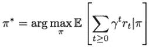

# 强化学习和监督学习:一个简单的比较

> 原文：<https://medium.com/hackernoon/reinforcement-learning-and-supervised-learning-a-brief-comparison-1b6d68c45ffa>

M 机器[学习的 ost 初学者](https://hackernoon.com/tagged/learning)从学习分类、回归等监督学习技术开始。然而，机器学习中最重要的范例之一是[强化](https://hackernoon.com/tagged/reinforcement)学习(RL)，它能够处理许多具有挑战性的任务。一个例子是围棋，它是由一个 RL 代理人玩的，这个代理人设法打败了世界上最好的棋手。

许多人听说过 RL，但实际上并不知道它与监督学习有什么不同。他们对这两种范式以及它们共存的原因感到困惑。这篇文章旨在澄清差异，并介绍深度学习如何融入其中。

让我们从最重要的问题开始:我们为什么要关心 RL？

## 为什么首先是 RL？

监督学习可以解决许多有趣的问题，从分类图像到翻译文本。现在让我们看看像玩游戏或教一个机器人肢体抓取物体这样的问题。为什么我们不能用监督学习来恰当地做到这一点？

考虑下围棋的情况。假设我们有一个数据集，其中包含了人类下的所有围棋的历史。然后，我们可以使用游戏状态作为输入 *X* ，并使用该状态的最优移动作为输出标签 *Y* 。理论上，这听起来不错，但在实践中会出现一些问题。

1.像这样的数据集并不存在于我们关心的所有领域

2.创建这样的数据集可能是昂贵且不可行的

3.该方法学习模仿人类专家，而不是实际学习可能的最佳策略

RL 来拯救我们了。直觉上，RL 试图通过**试错**来学习动作。我们通过对行动进行取样，然后观察哪一个导致我们想要的结果，来学习最佳策略。与受监督的方法相反，我们不是从一个标签，而是从一个被称为**奖励**的延时标签中学习这个最优行动。这个标量值告诉我们无论我们做了什么，结果是好是坏。因此，RL 的目标是采取行动以**最大化奖励**。

## 问题的正式定义是什么？

在数学上，RL 问题可以被视为**马尔可夫决策过程**。这个过程是无记忆的，所以我们所关心的一切都是通过当前状态知道的。RL 设置可以如下图所示:

Source: CS 294 Deep Reinforcement Learning (UC Berkeley)

在一个环境中有一个代理人采取行动，并反过来接受奖励。让我们简单回顾一下监督学习任务，以澄清两者的区别。

在监督学习中，给定一堆输入数据 *X* 和标签 *Y* ，我们正在学习一个函数 *f: X → Y* ，该函数将 *X* (例如图像)映射到 *Y* (例如类别标签)。如果训练过程收敛，该函数将能够根据新的输入数据以一定的精度预测 *Y* 。

现在让我们继续 RL 设置，它是由 5 元组 *(S,A,P,R,𝛾).)定义的*我们得到一组状态 *S* 和一组动作 *A* 。 *P* 是状态转移概率。奖励是一个值，它告诉我们在我们想要优化的目标方面做得有多好。它由一个奖励函数 *R: S×A → R* 给出。我们一会儿会去𝛾。

任务是学习一个从状态映射到动作的函数 *π: S → A* 。该功能称为**策略功能**。现在的目标是找到一个最佳的政策，最大化预期的回报。这也叫做**控制问题**。

围棋游戏可以用这种方法按以下方式建模:

**状态**:所有部件的位置

**动作**:玩家放下棋子的地方

**奖励**:如果玩家在游戏结束时获胜，奖励 1，否则奖励 0

## 我们如何解读奖励？

RL 中奖励的问题是，我们不知道哪个行为对结果有决定性的影响。是我们之前做的三个动作的移动还是当前的？我们称之为**信用分配问题**。

为了解决这个问题，引入贴现因子𝛾 ∈ (0，1)来计算最优策略π*。我们的优化问题是最大化**折扣**奖励的期望和。因此，可以通过计算该等式的结果来找到最佳策略:

The optimal policy function

直觉上，我们责怪每一个行为，假设它的影响对未来有指数衰减的影响。

为了学习最优策略，有不同的方法，例如策略梯度和 Q 学习。当策略梯度试图直接学习策略时，Q-学习是学习状态-动作对的函数。我将在以后的文章中详细解释这些算法。

## 我们为什么要在 RL 中使用深度学习？

在监督学习中，我们使用深度学习，因为手动设计图像或文本等非结构化数据的特征是不可行的。在 RL 中，我们使用深度学习很大程度上也是出于同样的原因。有了神经网络，RL 问题可以在不需要太多领域知识的情况下解决。

为了举例说明这一点，考虑乒乓游戏。在传统的学习中，我们需要从游戏位置中提取特征来获得有意义的信息。使用神经网络，我们可以将**原始游戏像素**输入算法，并让它创建数据的高级非线性表示。

为了做到这一点，我们构建了一个经过端到端训练的策略网络**，**，这意味着我们输入我们的游戏状态，然后得出我们可能采取的行动的概率分布。

如果我们以 Pong 为例，动作要么向上，要么向下。这是来自[学习如何玩乒乓](http://karpathy.github.io/2016/05/31/rl/)的示例设置:

Source: Andrej Karpathy’s blog

乍一看，这可能与典型的监督学习设置方式相同，例如用于图像分类。然而，提醒你自己，我们没有给每个游戏状态的标签，因此我们不能简单地训练这个网络。

## 结论

我希望这篇文章能让你对监督学习和 RL 之间的区别有一个更好的直觉。这两种方法都有其适当的位置，并且有许多成功的故事。在未来，我将更深入地解释 RL 系统是如何训练的。对于任何想了解更多的人，我附上了一些我个人认为有用的资源。

## 进一步阅读

[https://arxiv.org/abs/1701.07274](https://arxiv.org/abs/1701.07274)

[http://karpathy.github.io/2016/05/31/rl/](http://karpathy.github.io/2016/05/31/rl/)

[https://www.youtube.com/watch?v=lvoHnicueoE](https://www.youtube.com/watch?v=lvoHnicueoE)

[http://www0.cs.ucl.ac.uk/staff/d.silver/web/Teaching.html](http://www0.cs.ucl.ac.uk/staff/d.silver/web/Teaching.html)