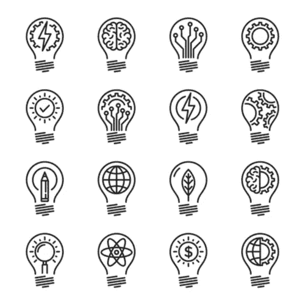

# 用技术重塑社会基础设施:综述

> 原文：<https://medium.com/hackernoon/reinventing-societal-infrastructure-with-technology-the-summary-99233a415462>

这是对“用技术重塑社会基础设施”的总结。完整版和稍加修改的版本将于 1 月底发布。欢迎反馈、问题和新想法。

**我们需要大的创新！**

“技术上能合理想象的，就能发明出来”，这话说得比没说更对。技术和新发明一直在塑造人类世界，并扰乱我们的生活和工作方式，然而我们才刚刚开始。清洁能源、食品技术、数字化、机器人、人工智能等领域的创新有可能防止气候变化、实现食物丰裕、重塑城市、团结人类并大幅提升人类能力。

社会中的巨大需求，如食物、健康、住房、交通、金融服务、娱乐等等，正被技术以一种“越来越容易为所有人所接受”的方式重新创造出来，这种情况还会继续下去。我们需要加大努力，利用技术加快无障碍化。许多社会的国内生产总值和商业相关的需求每天都在以一种真正创新和非制度化的方式被重新创造。大约 7 亿人拥有丰富的生活方式，无论是在环境、能源、住房、医疗保健、教育、食品方面，这是这个星球上 70 亿人想要的。技术是必要的，但不是充分的资源倍增器。这是唯一可以成倍增加资源的东西。技术将能够弥合这一差距，关键词是“非机构”改造不仅在增加创新方面是强大的，而且更重要的是对于可及性。

未来属于那些梦想家，他们想到这些不合理的可能性，他们不害怕失败的高概率，他们大胆地、彻底地冒险。他们愿意通过想象什么是可能的来改变世界。那么，重塑的下一步是什么？公共交通？建筑？建筑？医疗保健？食物？城市？通信？陪伴？金融体系？想象可能性，把它从不可能变成不可能，再变成可能，然后又从不可能变成可能，再变成可能。个体企业家和他们对愿景的热情(以及大量的好运气)给了不可能的现实一个机会。现在，许多，甚至大部分这些尝试都会失败，媒体会诋毁你的傲慢、自大、欺诈、幼稚等等。即便如此，当这些不可思议的尝试偶尔被“现有的现实、制度噪音(和恐惧)”擦肩而过时，它们将改变世界(希望大部分是好的)。未来是不可知的，但它是不可避免的，是可以创造的，所以我们需要伟大的企业家和技术专家来创造未来。

推动大型创新的几乎总是企业家，而不是机构

为什么非制度创新如此必要？回顾过去二十年，互联网颠覆了电信(美国电话电报公司拒绝采用互联网和移动电话)，亚马逊以沃尔玛无法想象的改变选择和成本结构的清晰愿景颠覆了沃尔玛。网飞，Youtube，脸书重塑了媒体，甚至选举和政治！Airbnb 改变了酒店，谷歌改变了图书馆和许多新老市场，优步接管了出租车服务，谷歌照片和 Instagram 重塑了我们捕捉瞬间的方式。你可以在这里看到照片。这些行业不是由大公司重新发明的，事实上是由技术进步和企业家能量驱动的思想力量。大多数商界人士将失败的风险降低到成功的后果对社会无关紧要的程度(但他们可以为股东赚钱，这是他们有义务做的)。相反，改变我们生活和工作方式的想法是那些原本失败概率更高的想法，但成功的后果是必然的。通过更高的可变性可以获得同样多的利润和更大的社会影响。正如我个人所说，我愿意失败，这给了我成功的能力，并以我微小的方式促成好的改变。在我看来，只有不可能才是重要的，我们只是不知道在大的变化和创新中哪个是不可能的！

这与非创始人领导的大型机构通常设立的激励机制正好相反。我们有现任者、机构和专家预测更多同样的“过去的推断”来预测未来的“世界观”。当涉及到大的变化或大的创新时，这些大多数都是错误的。我给你的赔率是，任何机构参与者都不会有大的创新。他们认为不可能不重要，而科技企业家认为平常不重要。不可能是创造下一个脸书、谷歌、苹果、优步或 Airbnb 的原因，当然，这是由企业家对不合理可能性的愿景驱动的。幸运的是，我提到的这些玩家中的大多数仍然受创始人愿景的驱动，并不像商学院教授教导学生的方式那样明智。这些创始人问“为什么不”和“为什么不尝试一下”,无论是 Alexa、AWS、太空、无人驾驶汽车、全球位置地图，还是没有键盘的手机。当新现象的风险较低时，大公司确实有助于扩大创新规模，并带来大量资本。但这是种子——例如，优步、特斯拉、谷歌和 Waymo 以及无人驾驶汽车将会用一种新的公共交通方式完全取代所有公共交通(这甚至在五年前对汽车或交通行业的任何人来说都是不可想象的)。

**超越企业家，需要什么？**轴的数量越多，即创新的维度越大，创新和实验的工具越好，想法试验的成本越低，变化的速度就越快。这意味着更有可能出现像亚马逊扰乱零售业或特斯拉或谷歌分别用电动和无人驾驶汽车改变交通运输这样的惊喜。那么，接下来的 20 年里，我们会遇到什么呢？这很难预测，但更容易推测。看起来，3D 制造、人工智能、生物学工具(尤其是基于物理学的新工具)、CRISPR 等生物学时尚及其可能的精密生物学和计算生物学的继任者，以及增加计算和带宽等传统的老方法，都可能形成一种汤，催化许多新的想法和反应。现在，再加上新型计算的潜力，如量子计算，这可能会加速人工智能，甚至超出我们最疯狂的想象。可能性变得真正不可预测。

为了让新的成为可能，你需要新的工具，一个有远见和坚持不懈的创始人，并向市场参与者布道。他们必须了解这一愿景的发展方向，他们需要确信自己需要前进并最终做出改变，尤其是如果是彻底的创新。

**看看社会的基础设施，什么可以被重新想象和改造？**

国内生产总值中的大多数非政府组成部分都可以通过企业家而不是政策/立法/监管方法来重新想象和改造，包括 1)交通和相关的城市服务 2)健康、疾病诊断和管理、药物研发 3)制造、建筑、建筑效率和城市 4)食品和农业 5)金融、保险和法律服务 6)能源 7)消费品、服务、教育、耐用品。

变化是会发生的，但在发生之前是不可信的。权威人士的回顾性预测是常见的，但在大的变化发生之前，人们看到的大多是怀疑。因此，我开始相信由近乎愚蠢、有些天真的企业家，以及那些不知道什么是不可能做到的人的创业精神所驱动的想法的力量。几乎没有任何重大变革是由人们认为有能力导致变革的机构推动的！

**推动社会创新的技术汤**

从根本上重新发明从来没有像今天这样可能。最近一系列新的技术发展给了我希望。今天看似合理和可见的驱动技术工具是:1)人工智能和大规模数据能力，2)机器人技术，3)增材制造和 3D 打印，4)生物技术(欧姆测量，CRISPR，基因合成，基因的精确控制，路径…)，5)计算设计，计算建模/模拟和计算机网络，6)社交连接和网络；分布式访问，8)软件吞噬世界，9)区块链，10)其他我肯定错过或低估的仍在发酵的新想法。“旧技术将继续成为创新的轴心，继续产生影响并带来好处，包括:软件、计算和云计算、互联网、传感器和相机、移动设备。

我的想法是，轴的数量(创新可能的维度)越多，创新和实验的工具越好，想法试验的成本越低，机会的速度就越快，出现像亚马逊、特斯拉或谷歌这样的惊喜的可能性就越大。

这很难预测，但更容易推测未来二十年可能会有什么新工具，不过，最好的改造似乎是可以想象的。今天，所有“已知”的轴形成了一个汤，催化了许多新的想法和反应。加上量子等新型计算的潜力，这可能会加速人工智能，甚至超出我们今天最疯狂的想象，是真正不可预测的。新的轴心肯定会出现，也许是复杂的广义量子计算、聚变能或分子组装。

**彻底改造交通运输**

关键驱动因素:无人驾驶技术、电动汽车、重新想象的公共交通、电池、专用自动驾驶公共交通车道、移动呼叫和调度解决方案。从公共交通到飞行汽车……这些都可以被重新发明。例如，我们可以在智能城市中拥有公共交通，通过巧妙的立法，按需点对点，比今天的固定路线更便宜，在大多数城市中，固定时间表的交通服务由电动汽车/豆荚车和无人驾驶技术实现。有了专用车道甚至无车城市，它将会更快、更便宜、更安全、更环保。如果车辆的行驶速度比现在的私家车多 10 倍，电池和电力将成为每乘客英里的主要成本。正如汽车改变了城市一样，电动和无人驾驶技术可能会再次改变城市。停车场和停车位可能会被公园或住宅取代，通勤车道可能会被无人驾驶车道或街道取代，通勤距离可能会扩大，住房可能会变得更便宜，环境污染会减少。无人驾驶汽车技术可能会扼杀内燃机，让石油行业陷入永久衰退。城市可以重新设计，以不同的方式工作，特别是如果一个人加入通信技术和空间效率和再利用范式。到 2010 年，5X 的汽车数量可能会下降，对钢铁、橡胶和塑料等自然资源的需求也会随之下降。没有汽车的城市(主要是在大多数地方，但不是所有地方)将会是一个不同的世界。

**重塑健康、疾病诊断和管理、药物研发**

关键驱动因素:用于全面理解医疗知识的人工智能，允许算法使用 1000 倍或更多数据的机器支持的新测量技术，发现医学新知识的新算法，基于更多数据的更好研究，使用人工智能的更多更好的药物发现，以及人工智能指导的机器人手术。美国可能有 100 万名医生，但有了人工智能系统，我们可以创造出一千万或几亿名医生的专业知识，让人类医生只做他们喜欢做的事情，即与患者互动，让健康变得更加个性化，更容易获得，更方便，成本更低。人工智能将比大多数人类医生做得更好的诊断、监测和随访，并补充人类护理的要素。

由于综合知识，我们将整体治疗患者，不会将他们的心脏病专家与他们的骨科医生或内分泌学家分开。医学比以往任何时候都要好，所以我们必须承认，在过去的几十年里，医学的每个方面都有所进步，但这并不意味着它已经尽善尽美了。我们将能够测量更多的变量(例如，每份血液样本数千或数十万个变量，或者从心电图中提取超出当今人类能力的精致特征)，并根据人类医生无法掌握的复杂性和知识做出决定，甚至为每个患者的当前状态指定药物剂量，在分子水平上监测疾病进展以及副作用。疾病将被及早发现(遗憾的是，大多数心脏病患者是从心脏病发作中得知自己的疾病，而不是在心脏病发作的 20 年前得知)，我们将从今天的疾病护理向医疗保健迈进。数据和人工智能技术密集型医疗保健可能会便宜得多，更容易获得，也更好。

**重塑制造业、建筑业、建筑、建筑效率和城市**

关键驱动因素:自动化建设、机器人交付、“变形金刚”式空间、共享和更高比例的再利用、建筑物和家具的 3D 打印、社交网络以及社区空间和关系的增加。建筑是我们城市景观的重要组成部分，也是资源的消耗大户。如果空间可以重新配置，我们需要一半的空间来舒适地生活？负担能力和可用性将会提高，大量人口的住房用地将会减少。此外，想象一下建筑像汽车一样制造，大大降低成本，或者下一代建筑在当地 3D 打印，用人工智能设计，重量是五分之一，因为有空气袋，绝缘性能更好？如果像横梁这样的结构元件需要更少的钢材，或者可以用[复合材料](http://arevolabs.com/)进行 3D 打印，因为所有结构不需要的不必要材料都可以用人工智能设计(创成式设计是一种方法)和 3D 打印来减去，会怎么样？如果我们可以在同一个平方英尺的空间里容纳两倍的人、两倍的服务，比如餐厅、健身房、书店和工作场所，会怎么样？

城市和城市生活可以更有效率，更可持续，而且成本大大降低，更加社区化。想象一个城市世界，我们需要更少的餐厅空间，因为机器人厨房、机器人送餐、为 Instacart 自助挑选迷你杂货店仓库，如用机器人送货订购、虚拟娱乐和聚会，更多的户外公园代替停车场，或房屋倍增空间，因为 AirBnB 这样的模型减少了对酒店房间的需求，提高了空间效率。我们喜欢节省空间的建筑，通过改造家具，这些建筑在晚上被重新用于无家可归者的住房或旅馆？我们对空间、城市、密度、效率、交通、公园的假设可能会以不可预测的方式改变。

**重塑食品和农业**

关键驱动因素:机器人技术、机器视觉和人工智能、消除大部分除草剂和杀虫剂的逐株植物护理、肉类替代品、用营养包装感觉的感觉技术、更好的土地利用、无人机和卫星成像、更好的种子和化学技术、微生物、精准农业。精准农业还意味着使用数据科学、航空成像、早期疾病检测等技术。用于成像和数据分析的人工智能的进一步发展，更容易和更频繁访问的卫星，生物技术，如增加的[微生物群落](http://bioconsortia.com/)，所有这些都有助于使用更少的化学物质，因为新的自动化除草和昆虫瞄准将大大减少农业的影响和土地使用。甚至可能对于专门的作物来说，垂直农场和数据科学引导的产量最大化加上机器人劳动力会真正改变产量或资源或使用的英亩数。当然，我们的人行道送货机器人会负责送货。创新的另一个方面是创造新的食物，如不含奶牛的牛肉、植物奶、不含鸡肉的鸡蛋，所有这些对环境的危害都要小得多。

**重塑金融、保险和法律服务**

关键驱动因素:取代人的功能和判断的人工智能技术、区块链、移动性、数据、软件自动化。虽然一些公司正在通过颠覆现有企业来改变银行、贷款、支付、投资以及消费者和小企业的规划，但其他公司正在创造全新的商业模式。基于算法的低成本金融服务现在已经成为可能。基于区块链的服务和软件合同，消除了管理费用和人力成本。对于许多保险和金融机构来说，这种商业模式已经变成了“小字行话。他们的利润是一种“金融税”，在我看来，远远超过了他们所提供服务的价值..人工智能和其他技术有可能取代许多假定的增值功能，因为这已经在股票交易和财务规划中得到证明？为什么不是在资本形成中？在我看来，所有金融交易的 10%(一个大胆的猜测)实际上为社会增加了价值，其余的都是为了金融机构的利益。行业的金融需求可以用更少的管理费用或交易税以一小部分成本得到满足，并且可以通过更客观的算法来更公平地完成。每天价值数万亿美元的投机和循环交易可以减少到最低限度！金融的许多(如果不是大部分)方面都可以被科技所取代，让金融服务变得更实惠、更容易获得。

**重塑能源服务**

关键驱动因素:科学人才和长期投资。今天，获得博士学位的最优秀的人才没有进入能源或清洁技术领域，这就造成了根本问题。人们意识到很难获得资金，因此，我们没有看到我希望看到的那么多创业努力。清洁技术是非常资本密集型的，虽然这个领域曾经有一段时间过于繁荣，但现在投资者对它不感兴趣了。像突破能源风险投资这样的组织正试图解决这个问题。有许多领域必须尝试重大突破:从核聚变到地热，更深钻井的线性成本而不是每英尺钻井的指数成本是所需的关键突破)、存储、新材料和制造、建筑材料、新农业和食品。

**重塑消费者服务，从零售、娱乐到老人护理再到送货服务**

关键驱动因素:移动、人工智能、互联网、通信、社交网络、语音和图像技术、传感器和相机、数据、大规模个性化制造。技术正在改变我们发现产品的方式，我们订购产品(杂货产品)的方式，我们购物的方式，我们找到适合自己的方式，以及个性化制造。供应链正在被重新发明，从 1 小时送货开始，从许多家庭几分钟内的虚拟茶水间，一直到完全重新发明的杂货店。钱包份额也在发生变化，从实物产品到技术支持的体验，通常是社区体验。3D 打印将允许我们按需打印物品，而人工智能将改变体验，使之真正个性化，无论是为每个人量身定制的家具还是独特的食物计划。最后，从送餐到亚马逊 Echo，机器人正在改变我们的互动方式。

**重塑教育**

关键驱动因素:人工智能个性化教育、开源内容、人工智能导师、移动和互联网创造了更多获取知识和教育的途径，AR/VR 改变了学生获取信息的方式。我最近问了一个简单的问题:[学文科是学生的错误吗](/@vkhosla/is-majoring-in-liberal-arts-a-mistake-for-students-fd9d20c8532e)？我认为，问题在于，当前的文科教育没有像 STEM 那样教授批判性思维和科学进步。现在，STEM 可能没有教授足够的文科——如何从科学和技术中创建真正的企业，以及如何最好地影响世界的应用。教育系统充满了机会，然而，这是一个充满挑战和复杂变化的行业。有了技术和新工具，教育的可及性和平等性将会改变，不管你想要什么样的教育风格或科目。这项任务的理想“导师”总是可以找到的。[人工智能导师](https://techcrunch.com/2012/01/15/teachers-or-algorithms/)将不仅允许更实惠或免费的全天候访问，而且他们将为每个人提供个性化的教育。或许，由于这种个性化，STEM 或文科等专业的概念将完全改变。

**重塑商业、网络、国防、政府服务**

无需过多阐述，值得指出的是，业务服务、资源使用和产品一直在发生变化，并将发生更多变化。无论是金融科技、消费品设计和生产、工业产品设计、药物研究或制造、材料设计、制造、备件、销售人工智能代理，还是客户支持代理，没有哪项业务会保持不变。技术将对所有这些产生影响，尽管我在这里关注的是个体企业家能够推动的事情，而不是政府或监管机构推动的变化，尽管这些往往是必要的追随者。太空和网络将通常由企业驱动，尽管后者将有许多国家行为者。关于网络服务，我建议你参考人工智能；因为正确的原因而令人害怕，但足以说明在防御性和进攻性网络工具和服务中将存在大量的创业机会。企业家需要推动这些领域的进一步创新，才能实现真正的创新。

**硅谷文化**

无论是华盛顿、华尔街还是硅谷，没有人真正知道什么是重要的，但硅谷做得非常非常好的是发明有趣的实验。例如，虽然你可能认为优步一团糟，但我认为优步在我们的交通概念中开创了机遇，从非常高端的豪华轿车服务开始，Airbnb 从 2008 年民主党全国代表大会期间在费城的房间和经纪房间开始。差不多一百年后，这个想法的种子最终比希尔顿酒店更重要。当这个世界认为他们知道什么是重要的时候；大众汽车或通用汽车对汽车创新很重要；事实是，它们在很大程度上与创新无关。重要的是不可能。

因为硅谷进行了如此多的实验，人们喜欢写关于失败的东西，傲慢，混乱，琐碎，欺诈或自我夸大的说法，无论是优步，Theranos，Juicero，Soylent，都会成为更好的头条新闻。这些同样的因素对于自我妄想的宏大或进化的创新是至关重要的。如果这些企业家有正常的预期，他们就不会尝试他们所做的事情。他们的失败和转向对社会有利或不利的行业是一个必然的副作用。大多数企业都不太可能失败，但少数企业(千分之一？万分之一？)作为游戏规则改变者出现，具有不成比例的巨大影响。正如马丁·路德·金所说，“人类的进步依赖于社会失调者”。乔治·萧伯纳说过，“通情达理的人使自己适应世界，不通情达理的人(他应该加上女人)使世界适应他们。”因此，人类的进步取决于不讲道理的男人或女人。

对硅谷来说，真正重要的不仅仅是听起来不太可能的实验，变得更加令人兴奋和健康的不是 IPO，而是硅谷试图创新的新领域的数量。例如，几年前，我们投资了这家汉堡包公司不可能食品，现在大概有四五十个博士和大概四五十个其他技术专家在致力于设计完美的汉堡包。为什么？创始人开始了它，因为我们星球上 30%到 50%的土地面积(直到埃隆·马斯克带我们去火星，这是我们拥有的唯一一个星球)都致力于畜牧业，他想要一种更环保的方式来生产肉类(除此之外，他还想避免其他做法，如虐待动物，不健康的食物，环境退化，食物链中的抗生素)。他想要几百万美元来做实验。他能做到吗？它现在已经成为一个强大的产品，今天是一个利基产品，但很明显，对于创始人来说，目标是取代所有的畜牧业(哦，在我看来，硅谷比其他任何地方都更受使命驱动，尽管你可以在这里找到大量严格的赚钱，甚至作弊，黑客赚钱的尝试)。

硅谷与其说是一个地方，不如说是一种心态和文化。在其他地方更难的是，当有人创新时，他们得不到周围的支持。在硅谷，我很抱歉地说，如果你在惠普或思科工作了 15 年，你就没有资格在创业界做任何重要的工作。在世界的其他地方，我在印度长大，人们会说“哇，你在通用电气或花旗银行工作！”这里“你在 GE 和思科工作了十五年？”再说一次，正是这种支持新想法或新测试工具的心态创造了重要的颠覆性创新。在这里，太多的经验可能是一个障碍。

**结论**

如果一个变革项目有 90%的失败机会，那么我们就有 10%的机会改变世界。太棒了。如果我们在这篇文章涵盖的许多不同领域各尝试十次，我们将真正改变世界。变革和创新将是技术驱动的，非制度的，让我们打破规则，激进的方法。这种非制度化的做事方式虽然不太容易预测，但更令人兴奋，而且可能是我们让 70 亿人过上他们都想要的生活方式的主要方式。机器和系统可以比人类更好地做医学。但这只是其中之一。或者大多数工作将被取代，或者聚变能源在我的有生之年成为可能，或者人工智能可以让工作成为大多数人的一种选择，如果他们想工作，他们就会工作，但不需要工作，因为我们将有足够的富足。想象可能！

正如 Yogi Berra 所说的“很难做出预测，尤其是对未来的预测”，但如果有答案的话，这种猜测比我能想到的任何其他预测都更有可能是正确的。这种重新发明将是混乱的、破坏性的、不可预测的，伴随着许多失败的尝试，但是失败并不重要；零星的成功将会。这种干扰对一些人来说会是暂时的痛苦，因为被干扰从来都不好玩。我们必须把事情做好，满足社会对技术的期望，以帮助实现平等、多样性等等。新技术也通过重新分配权力和财富以及加剧不平等来震撼世界。幸运的是，资本主义得到了民主的许可，选民将有能力纠正不平等现象。所有这些社会因素将变得紧迫和关键，以通过民主和受影响的人民实现这一转变。它在不太民主的社会中的影响更难预测。

> ***目录***
> 
> 我们需要大的创新！
> 
> [推动大型创新的是企业家，而不是机构](/@vkhosla/entrepreneurs-not-institutions-drive-big-innovation-c87323fccb8c)
> 
> [超越企业家，需要什么？](/@vkhosla/beyond-the-entrepreneur-what-does-it-take-c903dcf8bf2c)
> 
> [什么可以重新想象和再造？](https://hackernoon.com/what-can-be-reimagined-and-reinvented-6567cee2bccc)
> 
> [技术汤](/@vkhosla/the-technology-soup-df54c5d1f860)
> 
> [彻底改造交通运输](/@vkhosla/reinventing-transportation-64a39b1152dd)
> 
> [重塑健康，疾病诊断&管理，药物发现](/@vkhosla/reinventing-health-disease-diagnosis-management-drug-discovery-12e34052a8fb)
> 
> [重塑制造业、建筑业、建筑、建筑效率&城市](/@vkhosla/reinventing-manufacturing-construction-buildings-building-efficiency-893dc81208c9)
> 
> [重塑食物&农业](/@vkhosla/reinventing-food-agriculture-7aeb75f307a3)
> 
> [重塑金融、保险和法律服务](/@vkhosla/reinventing-financial-insurance-and-legal-services-2e72c1e92dc3)
> 
> [重塑能源服务](/@vkhosla/reinventing-energy-services-4a667754703a)
> 
> [重塑消费者服务、零售、娱乐、老年人护理、交付](/@vkhosla/reinventing-consumer-services-from-retailing-entertainment-to-elder-care-to-delivery-1146a339069a)
> 
> [重塑教育](/@vkhosla/reinventing-education-c52475b5b58c)
> 
> [重塑商业、网络、国防、政府服务](/@vkhosla/reinventing-business-cyber-defense-governmental-services-f42af4145d17)
> 
> [科斯拉风险投资公司现在有所作为](/@vkhosla/khosla-ventures-companies-making-a-difference-right-now-40fa361ef58f)
> 
> [硅谷文化](/@vkhosla/the-silicon-valley-culture-bdc86db0b524)
> 
> [结论](/@vkhosla/the-conclusion-86e6a4af9c8e)