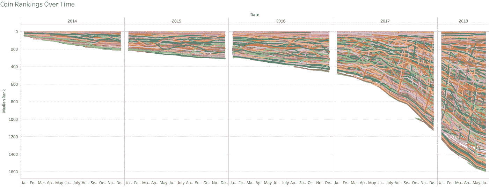
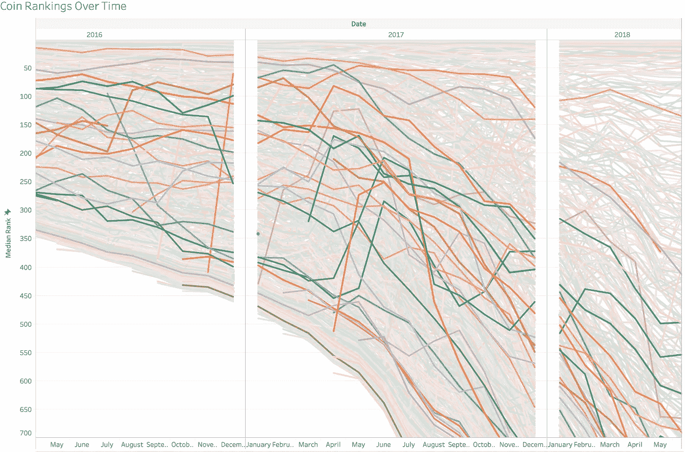
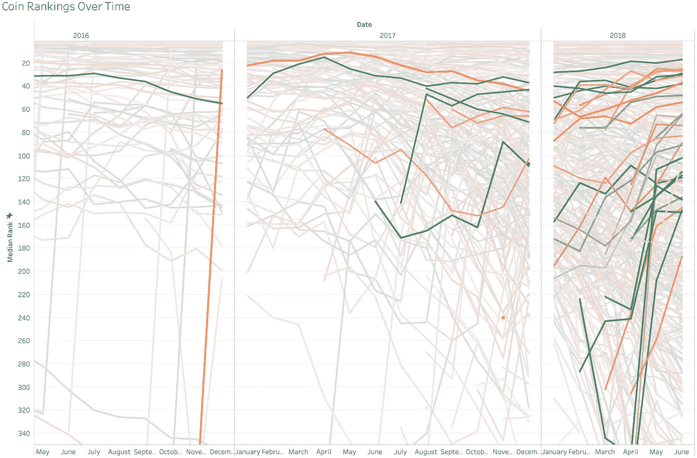
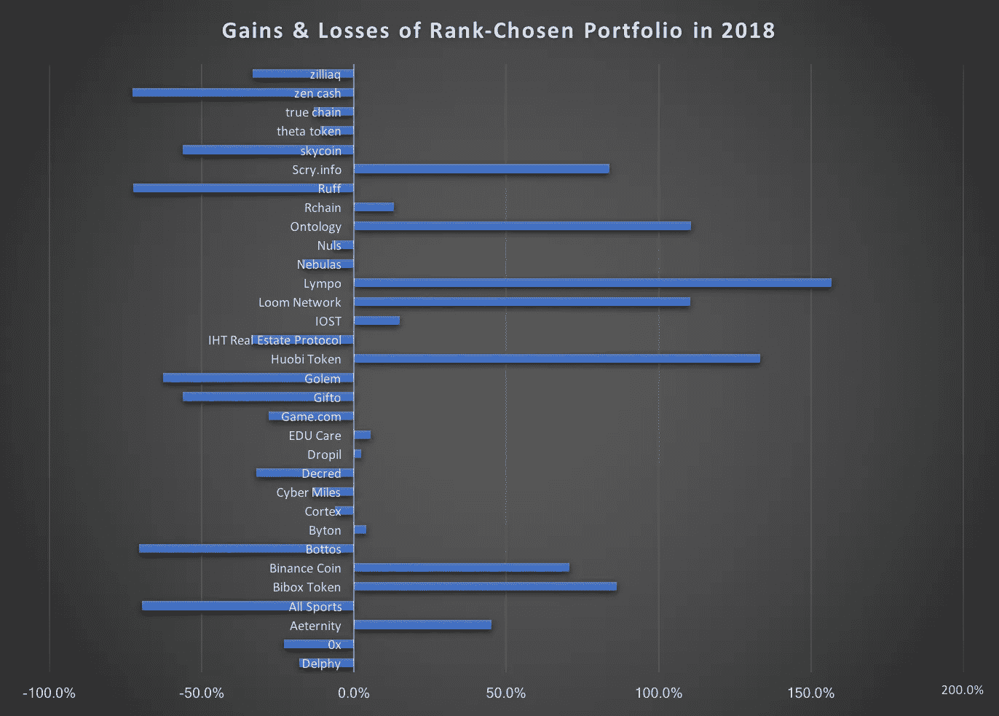
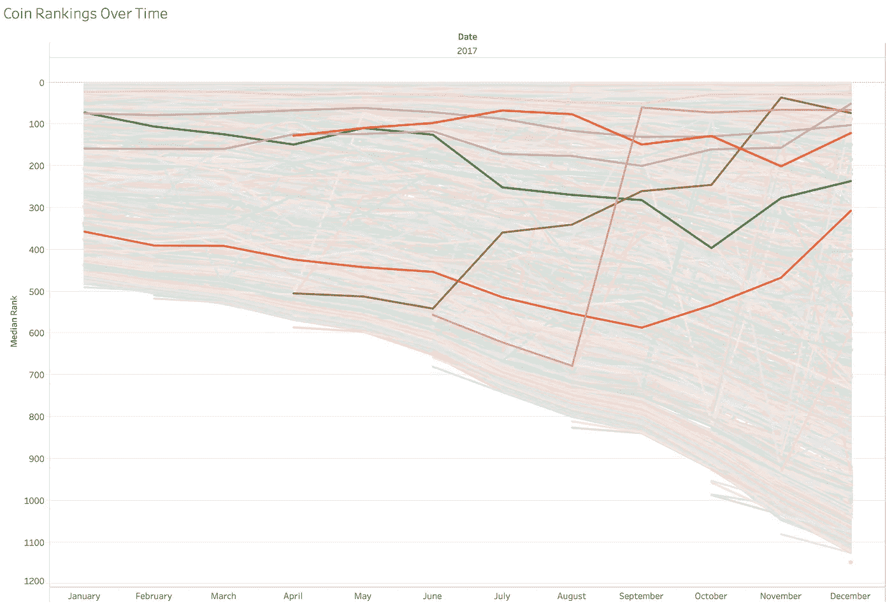
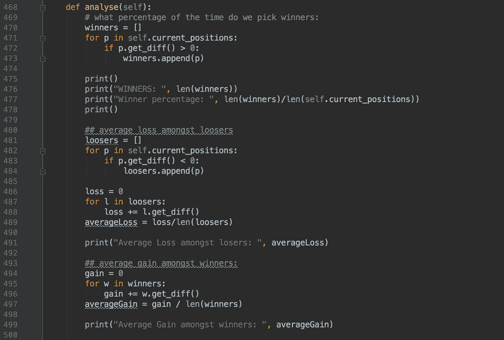

# 相对硬币排名作为投资策略

> 原文：<https://medium.com/hackernoon/relative-coin-rank-as-investment-strategy-d73136a36ce8>

## 建立一个成功的忽略价格的交易算法

在过去的几年里，我们目睹了许多硬币的起起落落。有时新项目似乎是凭空出现的，而另一些时候，一枚硬币稳步上升，直到被主流注意到。今天市场上有超过 1600 种硬币和代币，事情变得非常拥挤，很难了解足够多的信息来知道任何给定的硬币是否值得包含在我们的投资组合中。

反观股票和债券市场，在挑选硬币时需要考虑的金融信息非常少，往往感觉像是在抓救命稻草。最好的方法可能是了解每一个项目，它的团队，以及它的野心，以确定它未来的生存能力。在这种方法中，多元化不如适当的尽职调查重要。但是，即使对一个项目有很好的理解，也不一定表明它是意味着伟大还是注定失败。

还有别的办法吗？由于我的大部分努力都集中在复杂的价格分析上，结果却很一般，所以我决定从另一个角度来看这个问题。如果我们不看价格就能选出一个成功的密码组合，会怎么样？接下来是我对这个问题的初步研究，以及一个算法的简单实现，它利用了一个完全不同的数据:相对排名。令我惊讶的是，这实际上工作得很好。

**作为未来绩效指标的相对排名**

当我们想到等级时，它通常被用作一个硬币或另一个硬币的论据，但我没有看到任何量化和理解预测相对等级有多好的认真尝试。事实上，很少有好的数据驱动的对[投资](https://hackernoon.com/tagged/investment)策略的分析，而 [ShrimpyApp](https://medium.com/u/df23e4200890?source=post_page-----d73136a36ce8--------------------------------) 和其他几个是少数几个经过适当处理的统计数据的好来源。

相对排名的想法很简单:每枚硬币和代币都可以根据市值进行排名。这本身就没意思。然而，当我们随着时间的推移对所有硬币进行排名时，我们可以尝试找到那些相对于同行排名上升的硬币，并检测可能表明市场信心的一些潜在驱动因素的模式(或者可能是更世俗的事件，如开发商决定增加流通供应量)。



经过与超过 1600 枚硬币的历史数据集的艰苦搏斗，我们终于看到了相对排名随时间的发展。已经有一些有趣的观察:大多数硬币似乎会随着时间的推移而失去等级

2)前 10 个硬币的位置相对稳定

3)硬币的数量呈指数增长



为了更清楚地说明第一点，我们可以随机选择几个令牌，并看到，总的来说，随着时间的推移，它们的排名都在下降。

我发现大约有 40 种硬币与这种趋势相反，它们的排名明显上升，而且通常是大幅上升:



这些“获奖”代币中的绝大多数都非常年轻，在 2018 年或 2017 年底上市，但构建这些密码的投资组合确实是一个有利可图的举措。为了测试我们的假设，即相对排名上升对应于高于平均水平的投资回报率，我创建了一个由这些超额完成者组成的回溯测试投资组合，并发现我们在 2018 年 1 月至 7 月期间获得了约 4%的收益，而在这段时间，整体市场明显处于亏损状态，比特币下跌了约 60%。另一个需要考虑的是，我们在这种情况下的投资策略是简单的买入并持有，不包括再平衡或任何交易相关活动。



一个有趣的趋势是，交换代币表现相当不错。币安币、火币和 Bibox 币都大幅上涨，可能是因为这些硬币的债券性质，以及交易所将定期回购它们以稳定价格的事实。敬请关注即将到来的对这些特殊硬币的深入分析。

**临时问题**

上述投资组合在很大程度上依赖于后见之明。事实上，它提出的论点是相当同义反复的，即等级上升的硬币比等级下降的硬币表现更好。这本身并不是非常有用的信息。相反，我们需要一种机制，通过这种机制，我们可以在早期识别这些趋势，假设向上的排名趋势表示好的项目。这本身就是有争议的。

在我们上面的投资组合中，大多数上升趋势的硬币都是相对较新的，这让人怀疑它们实际上并不是因为它们的价值而上升，而是因为其他一些因素。例如，在 EOS 的案例中，ICO 分布在一整年中，逐渐增加了流通中的 ERC-20 代币的数量，因此由于市值增加，排名迅速上升。因此，排名的相应提高并不仅仅是一个绩效指标。

**排名趋势可以用来盈利吗？**

让我们只考虑 2017 年来手动建立趋势，并使用 2018 年作为测试案例。看看 2017 年排名上升的硬币项目，我们做笔记，然后在次年 1 月购买所有相关硬币。



使用这些和其他上升趋势的硬币，我们选择一个投资组合，并在 2018 年 1 月 1 日买入。可悲的是，结果是 75%的损失，相比之下，比特币的损失约为 55%，而同期以太坊的损失为 40%。诚然，泡沫破裂可能不是最好的测试数据集，但所选的投资组合在很大程度上没有继续获得排名。相反，在 ICOs 的下一波浪潮中，大多数硬币大幅下跌，并被其他更新的代币取代。

**图案**

据我所知，从排名数据中大致可以看出四种模式:

1)大致保持同一等级的硬币

2)等级不断上升的硬币

3)硬币在行列中不断落下

4)最初上升，然后以波浪式下跌的硬币

比特币几乎是唯一一个保持稳定排名第一的令牌，而 Ripple、以太坊、比特币现金和莱特币长期以来都大致保持在排名最靠前的附近。其他硬币就没这么幸运了。

如果我们只选择那些开始低于前 5 名、已经上升到前 50 名内的高度、并且从那时起再次下降到第 50 名以下的代币，则我们会看到 270 个硬币的列表。也就是说，有史以来每六种加密货币中就有一种，表现出最初排名上升，然后被遗忘的特征波形。

**顶币流动性小**

在目前排名前 50 位的所有硬币中，只有 35 种是在排名前 50 位以下开始的，这 35 种硬币中只有 4 种(Verge、Bytom、IOST 和 Nano)的中值排名大于 50，这意味着这些货币中有 92%的大部分时间都在阈值排名以上。从本质上讲，有一个脊状的排名结构，新的前 50 名硬币通常不会从下面上升，而是诞生在或接近冰山的顶端。

```
(‘Novacoin’, ‘ Start Rank: ‘, 6, ‘ End Rank: ‘, 567, ‘ Average Rank: ‘, 98.13365539452496, ‘ Median Rank: ‘, 36, ‘ Min Rank: ‘, 4)(‘Freicoin’, ‘ Start Rank: ‘, 8, ‘ End Rank: ‘, 1071, ‘ Average Rank: ‘, 243.55662514156285, ‘ Median Rank: ‘, 117.0, ‘ Min Rank: ‘, 5)(‘Mincoin’, ‘ Start Rank: ‘, 9, ‘ End Rank: ‘, 1211, ‘ Average Rank: ‘, 265.08640939597313, ‘ Median Rank: ‘, 165.0, ‘ Min Rank: ‘, 9)(‘Ixcoin’, ‘ Start Rank: ‘, 10, ‘ End Rank: ‘, 782, ‘ Average Rank: ‘, 150.83040272263187, ‘ Median Rank: ‘, 52, ‘ Min Rank: ‘, 9).
.
.
```

这种流动性的缺乏在最高层也同样存在。只有泰瑟、币安·柯恩和维查因的大部分时间都在 20 强俱乐部之外，只有 Stellar 和 EOS 来自半永久前 10 名之外，它们的中值排名都是 12。

**把所有这些放在一起**

事实证明，手工挑选代币并不是最优的，但是考虑到这些观察和模式，我们可以尝试构建一个简单的、基于规则的算法，如果代币的排名足够上升，就购买它，如果排名下降，就出售它。出于本测试的目的，该算法不应将价格视为决定性因素，因此只考虑排名。

除了回溯测试的开始和结束日期以及我们开始时的金额之外，我们主要关心三个变量，即在给定的时间段内，确定排名何时充分增加或减少的变量。我们把这三个变量分别叫做 UP_MOVE，DOWN_MOVE 和 DAYS。

如果我们将 _MOVE 设置为 100，将 DAYS 设置为 20，那么算法将搜索在 20 天内向上移动 100 个等级的所有硬币。向下运动也是如此。然后，该算法将在第 21 天购买该令牌，这意味着它不是依靠事后诸葛亮。尽管这是一个回溯测试，但该算法不知道哪种硬币最终会胜出，这意味着如果有实时市场数据，这种代码应该能够继续发挥作用。



UP_MOVE、DOWN_MOVE 和 DAYS 变量本身创建了一个巨大的搜索空间，在其中还没有找到最佳配置。我只是尝试了几种组合，并确定 100、100 和 15 似乎会返回相当好的结果。然而，这意味着该算法是更长期的，并且不能在短时间内使用。

测试首先从 2017 年 1 月 1 日至 2018 年 1 月 1 日构建的投资组合开始，起价为 1 万美元:

```
TEST PORTFOLIO:  2017-01-01  To  2018-01-01:
Start Amount:  10000
Total Profits:  434839.2122343267
Percentage Gain:  42.48392122343267
Investments Made:  95WINNERS:  56
Winner percentage:  0.5894736842105263Average Loss amongst losers:  -8.707790663503474
Average Gain amongst winners:  7770.894790706064Average Buy Ranking:  375.81052631578945
Average sell rank:  480.7684210526316('Eternity', '2017-01-27', 16771.8215025232, 'Buy Price: ', 0.001898, 'Sale Price:', 0.07810800000000001, 'Buy Rank:', 391, 'Sell Rank: ', 501, 'DIFF:', 1278.1805167072932)('Advanced Technology Coin', '2017-01-27', 18401.062837071957, 'Buy Price: ', 0.0024980000000000002, 'Sale Price:', 0.12250499999999999, 'Buy Rank:', 242, 'Sell Rank: ', 647, 'DIFF:', 2208.256347888494)('BitTokens', '2017-01-27', 9564.468688885734, 'Buy Price: ', 0.006662, 'Sale Price:', 0.27108699999999997, 'Buy Rank:', 390, 'Sell Rank: ', 426, 'DIFF:', 2529.08463305861)
.
.
.
```

正如我们所看到的，在选择的 95 个职位中，58%是赢家。这本身并不令人印象深刻，但考虑到输家通常只损失 8 美元，而赢家平均损失 7700 美元，我对这个比例相当满意。总的来说，我们实现了 4248%的增长。

2017 年，加密市场爆炸式增长，在同一时期，[加密货币](https://hackernoon.com/tagged/cryptocurrency)的总市值从 170 亿美元增加到 5650 亿美元；增长了 3223%。比特币上涨了微不足道的 1243%。取决于我们如何测量，我们的算法表现得相当好。如果我们用相同的变量设置测试其他几个时间段，我们也能获得好的结果:

```
TEST PORTFOLIO:  2016-01-01  To  2017-01-01 :
Start Amount:  10000
Total Profits:  248321.28874742566
Percentage Gain:  23.832128874742565
Investments Made:  25WINNERS:  18
Winner percentage:  0.72Average Loss amongst losers:  -118.37396571274549
Average Gain amongst winners:  13841.661472634161
```

2015 年:

```
TEST PORTFOLIO:  2015-01-01  To  2016-01-01 :
Start Amount:  10000
Total Profits:  2396744.694364711
Percentage Gain:  238.67446943647113
Investments Made:  105WINNERS:  50
Winner percentage:  0.47619047619047616Average Loss amongst losers:  -38.11501443323653
Average Gain amongst winners:  47976.05810288214Average Buy Ranking:  141.32380952380953
Average sell rank:  213.10476190476192
```

**进一步发展**

当试图从 1 月到 6 月运行时，该算法在 2018 年不购买任何代币，这可能是由于我的代码中的一些 bug 或错误，而不是市场，因为我们已经看到，当手动选择投资组合时，几个硬币在这个时间段大幅上涨。这里当然需要进一步的测试。

第二个最明显的问题是理想的变量设置。确定这可以是一项机器学习任务，或者我可以简单地每次用不同的设置循环算法，并记下最有利可图的 UP_MOVE、DOWN_MOVE 和 DAYS 变量，这本质上是机器学习设置要做的事情。然而，我还没有时间来建立这个功能。

总之，我认为我们已经展示了一些非常有趣的东西，即在不考虑价格的情况下，理论上构建优于市场的投资组合是可能的。或者说，只考虑价格对相对排名的影响。敬请关注更多内容。