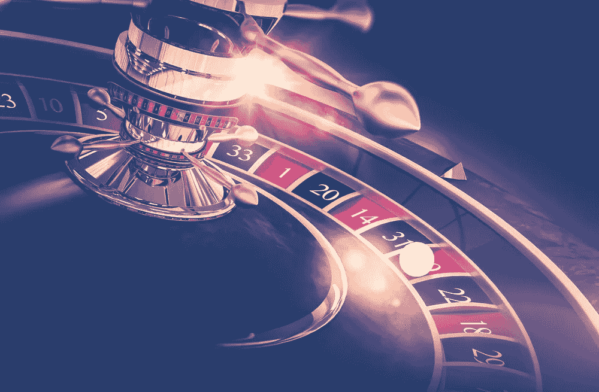

# 相对论轮盘赌

> 原文：<https://medium.com/hackernoon/relativity-roulette-448dd647934d>

如果你认为你的股票、货币或密码有价值，请三思。目前，你的安全、现金和代币允许你做的唯一一件事就是玩一个叫做相对论轮盘赌的游戏。

这个游戏是这样的:你和我以及我们的六个朋友组成一个圈。我们每个人都坐在打开的笔记本电脑前。我们中的一些人穿着像投资银行家一样的西装，而其他人穿着[大学运动衫和图案 t 恤](https://www.nytimes.com/2018/01/13/style/bitcoin-millionaires.html)。重要的是我们中的一个人拥有一个可膨胀的物体。可膨胀价值的对象是像股票或货币这样的东西:整个全球货币馅饼中仅有的两种不会过期也不会腐烂的证券。但是为了我们今天游戏的目的，让我们假设我们在玩一个气球。

作为游戏的开始，我把我的气球卖给你，换一些美元。轮到你的时候，你说服你右边的朋友，气球实际上比你刚刚支付的价格更值得*钱，你以更高的价格卖给她气球。当轮到她时，她以更高的价格把同样的气球卖给她右边的人——如此循环。*

我可能会在我们的循环结束时买回同一个气球，神奇的是，我们都从这个练习中获益。从表面上看，这个游戏似乎是无辜的。但在现实中，玩相对论轮盘赌很危险。

# 那是因为充气物品的内在价值为零。

它们不会过期——它们只是继续存在，只通过与其他相对价值的项目相关联来实现价值，比如美元。

我们这个世界上的物品只有在以下情况下才具有内在价值:( a)它们会过期，因为腐烂会把一件东西的价值侵蚀为零，或者(b)可以以已知的价格赎回。无论哪种方式，其价值在任何时候都是“内在”已知的，具有确定的退出点。

对于那些到期的项目，我们称之为[零和游戏](https://en.wikipedia.org/wiki/Zero-sum_game)。如果我们能够预测这种衰退何时结束——一件物品最终可能完全失去价值——我们就可以将时钟向前拨，计算出一件物品在其有限的生命周期内将会给其所有者带来多少价值。我们称之为“曲线”

时间是我们可以用来确定一个内在有价值的物体的价值的唯一常数，这意味着我们可以将它的价值直接与时间联系起来。我们可以评估一辆汽车的内在价值，因为我们可以确定它何时会衰变为一个单一的、毫无价值的分子。

然而，具有膨胀价值的物体永远不会腐烂。因此，它们只有通过在永无止境的循环中与其他可膨胀的价值相关联，才能保留价值。因此，在买卖具有可膨胀价值的物品时，你实际上并不是在买卖任何东西——你只是在玩相对论轮盘赌。

# 相对论轮盘赌的玩家们:当心。

相对论轮盘赌之所以如此危险，是因为我们站在圈子周围的气球(股票)的价值主张交易只与最初购买它的美元数量相关。这意味着它的价格只会越来越高，只会越来越大，产生一个不断膨胀的泡沫。

> 众所周知，泡沫不可避免地会破裂。

当这种情况发生时，整个团队都会失败。通常，他们会损失惨重。

玩相对论轮盘没有错。几十年来，人们一直通过股票市场来玩这个游戏。但是那些玩的人可能会被烧伤——尤其是那些在充气物的相对价值下降时还抓着它不放的人。

# **说到加密货币，相对论轮盘赌将继续成为所有者唯一可以玩的游戏，直到世界找到一种方法赋予他们的代币内在价值。**

在亚马逊和其他电子商务网站上，比特币看起来可能是一个可行的在线购买选择，价格以美元和比特币两种货币列出。然而，由于基础货币是以美元计价的，而比特币的上市价格一直在相对美元价值波动，事实是这只是另一种转换和货币流通的练习。以这种方式，加密货币将不会实现任何内在和/或效用价值，直到(a)它们自己成为基础货币，或(b)它们成为可兑换的法定货币(即:稳定的硬币)。

然而现在，这种现实并不存在。如今的硬币只是相对于其他硬币和其他货币升值，造成了更大的波动性和更大的不一致性。只要情况如此，它们的效用将仍然仅限于作为一种价值储存选择，其相对价值将乒乓球作为一种不稳定的视频游戏进行赌博。非常适合交易。对商业不利。

如果你是加密货币的所有者，重要的是你要意识到你正在玩的游戏的危险性。

如果你是，那就想尽一切办法:自担风险。