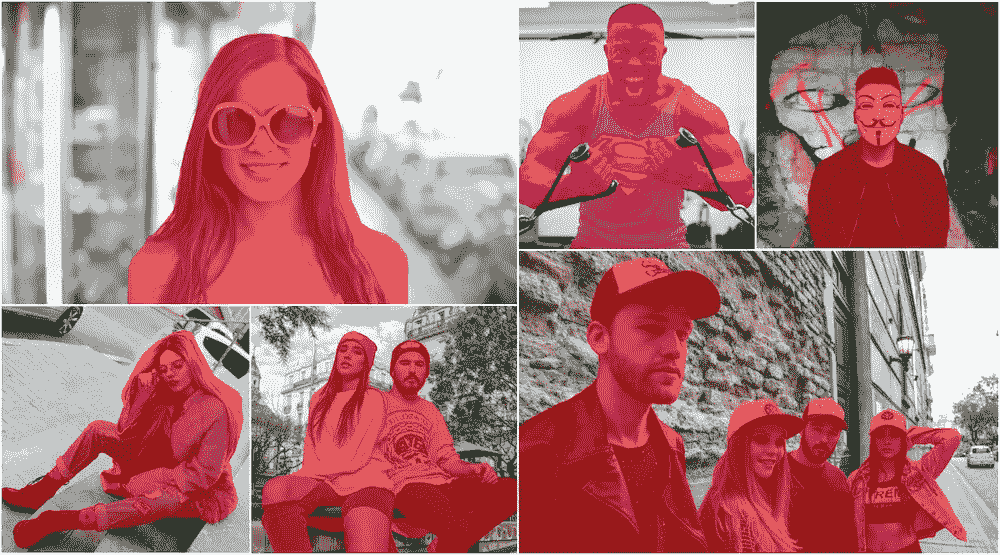

# 🎁发布“超级监管人”数据集，用于指导机器分割人类

> 原文：<https://medium.com/hackernoon/releasing-supervisely-person-dataset-for-teaching-machines-to-segment-humans-1f1fc1f28469>

你好，机器学习社区！

我们很自豪地宣布[监管](http://supervise.ly)人数据集*。*出于学术目的，它是公开的和免费的。

> 要让人工智能免费，我们不仅需要开源，还需要强大的开放数据运动。
> 
> — [吴恩达](https://medium.com/u/592ce2a67248?source=post_page-----1f1fc1f28469--------------------------------)

我们绝对同意他的观点。让我们扩展这个想法。有很多关于深度神经网络的语义切分任务的研究。但在大多数情况下，收集数据比开发和应用算法来运行数据要困难和昂贵得多。

这就是为什么我们还需要专门设计的平台来涵盖从开发训练数据集到训练和部署神经网络的整个 ML 工作流程。

Few examples from “Supervisely Person Dataset”

我们相信，我们的工作将帮助开发人员、研究人员和企业，不仅被视为又一个公共数据集，而且被视为一套创新的方法和工具，用于更快地创建大型训练数据集。

接下来，我们将介绍如何从头开始构建这个数据集的所有方面。在我们继续之前，让我给你看一些有趣的事实:

*   数据集由带有 **6884** 高质量注释人员实例的 **5711** 图像组成。
*   以下所有步骤都是在没有任何编码的监督下完成的
*   更重要的是，这些步骤是由我们内部的注释者执行的，根本没有机器学习(ML)的专业知识。数据科学家只是控制和管理这个过程。
*   注释团队由两名成员组成，整个过程只用了 4 天。

Supervisely 是包含数据科学智能的机器学习平台。它允许数据科学家专注于真正的创新，而将日常工作留给其他人(是的，训练众所周知的神经网络架构也是一项日常工作)。

## 要解决的问题

在许多现实世界的应用中，人物分割是分析图像中的人物的关键任务:动作识别、自动驾驶汽车、视频监控、移动应用等等。

我们在 DeepSystems 对这一领域进行了内部研究，我们意识到这项任务缺乏数据。你可以问我们:像 COCO、Pascal、mapi pile 等公共数据集呢？为了回答这个问题，我最好给你看几个例子:

Few examples of human annotation from COCO dataset

大多数公共数据集中的人体分割质量不能满足我们的要求，我们必须创建自己的带有高质量标注的数据集。下面我将向你展示我们是如何做到的。

## **步骤 0:上传并准备公共数据集，作为训练初始 NN 的起点**

将公共数据集上传到系统:PascalVoc，mapi pile。我们的“导入”模块支持大多数公共数据集，并将它们转换为基于 json 的统一格式，称为 Supervisely 格式:)

然后，我们执行 DTL(“数据转换语言”)查询来完成一些事情:合并数据集->跳过没有人对象的图像->从图像中裁剪每个人->按宽度和高度过滤他们->分割成训练/测试集。

Raw numbers after we merge, crop and filter public datasets

似乎有很多公开可用的数据，但我们之前提到过，有一些隐藏的问题:低质量的注释，低分辨率等等。

因此，我们构建了第一个训练数据集。

## **第一步:训练 NN**

我们将培训稍微定制 UNet 一样的架构。

Unet_v2 architecture

loss = BinaryCrossEntropy + (1 —骰子)。

这个网络训练速度很快，非常准确，易于实现和定制。它允许我们做很多实验。管理上可以分布在集群中的多个节点上。

因此，我们可以同时训练几个神经网络。此外，所有 nn 都支持我们平台中的多 GPU 培训。输入分辨率为 256*256 的每个训练实验花费的时间不超过 15 分钟。

## **第二步:准备数据进行标注**

我们没有未标记图像的集合，所以我们决定从网上下载。我们实现了一个服务( [github](https://github.com/DeepSystems/pexels_downloader) )，可以从很棒的照片库 Pexels 下载数据(谢谢你们做了非常酷的工作)。

因此，我们下载了大约 15k 张带有与我们的任务相关的标签的图像，上传到 Supervisely 并通过 DTL 查询执行调整大小操作，因为它们具有超高的分辨率。

## **步骤 3:将神经网络应用于未标记的图像**

使用的架构不支持实例分段。我们故意不使用 Mask-RCNN，因为对象边缘附近的分割质量较低。

这就是为什么我们决定制定一个两步方案:应用 fast-RCNN(基于 NasNet)来检测图像上的所有人，然后对每个人的包围盒应用分割网络来分割主导对象。这种方法允许我们模拟实例分割和准确分割对象边缘。

3-min video of applying model and manual correction of segmentation

我们试验了不同的分辨率:传递给 NN 的分辨率越高，它产生的结果越好。我们不关心总的推理时间，因为超级支持分布在多台机器上的推理。对于自动预注释的任务来说，这已经足够了。

## **步骤 4:手动验证和校正**

所有推理结果都实时显示在仪表板中。我们的操作者预览所有的结果，并用几个标签标记图像:坏的预测、正确的预测、好的预测。这个过程很快，因为他们需要很少的键盘快捷键“下一个图像”和“给图像分配标签”。

How we tag images: **left** — bad prediction, **medium** — prediction that needed light manual correction, **right** — good prediction.

被标记为“坏预测”的图像被跳过。进一步的工作继续与我们需要纠正的图像。

How to correct Neural Network predictions

手动校正比从头开始注释需要的时间少得多。

## **步骤 5:将结果添加到训练数据集中，并转到步骤 1**

仅此而已。

## **一些提示:**

*   当我们应用只在公共数据上训练的神经网络时，“合适的”图像(标记为“良好预测”和“预测正确”)的百分比约为 20%。
*   在树快速迭代之后，这个数字增加到 70%。
*   我们总共做了 6 次迭代，最终的神经网络变得相当精确:-)。
*   在训练之前，我们在物体边缘添加了小条带来平滑锯齿状边缘，并执行了一些增强:翻转、随机裁剪、随机角度旋转和颜色变换。

如你所见，这种方法适用于许多计算机视觉任务，即使你需要在图像上标注几个对象类。

## 奖金

这个数据集帮助我们改进人工智能支持的注释工具——定制它以分割人类。在我们最新的版本中，我们增加了在系统内部为这个工具训练神经网络的能力。下面是基于不可知类的工具和它的定制版本的比较。它是可用的，您可以在您的数据上尝试它。

## 如何访问数据集

注册 Supervisely，进入“导入”选项卡->“数据集库”。点击“监管人”数据集，写下新项目的名称。然后点击“三点”按钮-->“下载为 JSON”-->“开始”按钮。仅此而已。总下载时间可能需要 15 分钟(约 7 GB)。

How to download

## 结论

看着没有任何 ML 背景的人如何经历所有这些步骤是非常有趣的。我们作为[深度学习专家](https://deepsystems.ai/)节省了大量时间，我们的标注团队在标注速度和质量方面变得更加高效。

我们希望，[supervisory](https://supervise.ly/)平台将帮助每个深度学习团队更快、更容易地制作 AI 产品。

让我列出我们在这项工作中使用的最有价值的监督功能:

*   “导入”模块上传所有公共数据集
*   用于操作、合并和扩充数据集的“数据转换语言”
*   使用更快的“神经网络”模块-RCNN 和 UnetV2
*   “统计”模块自动从我们拥有的数据中获得有用的见解
*   “注释工具”就像训练数据的 Photoshop
*   “协作”功能允许将工人组合到注释团队，给他们分配任务并控制整个过程。

有什么问题尽管问！谢谢大家！

如果你觉得这篇文章很有趣，那么让我们也来帮助别人吧。如果你给它一些，更多的人会看到它👏。