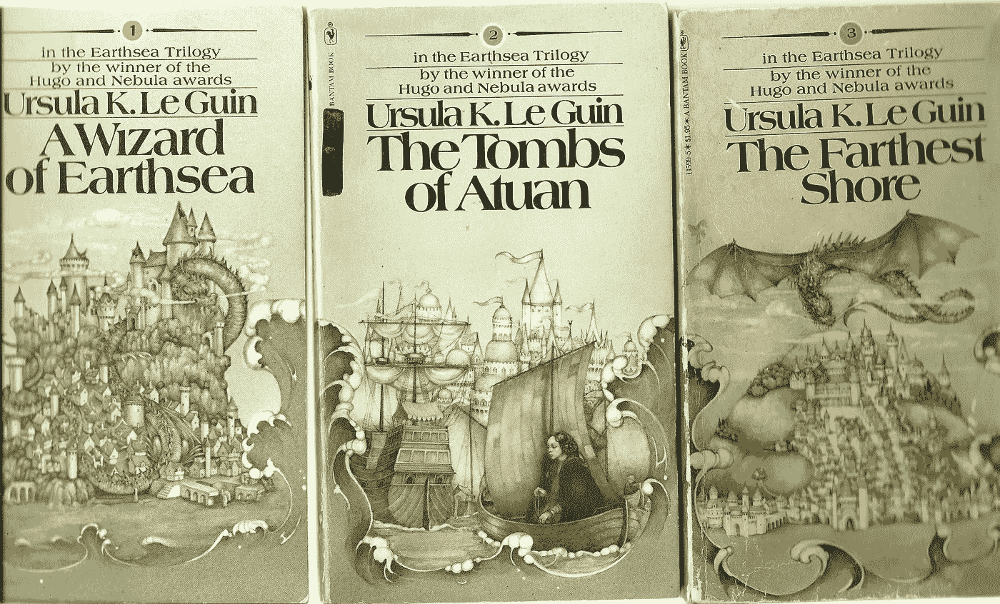
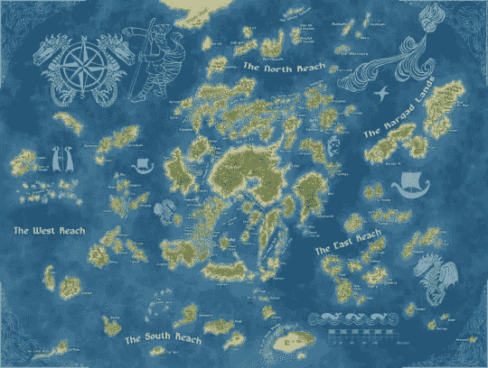
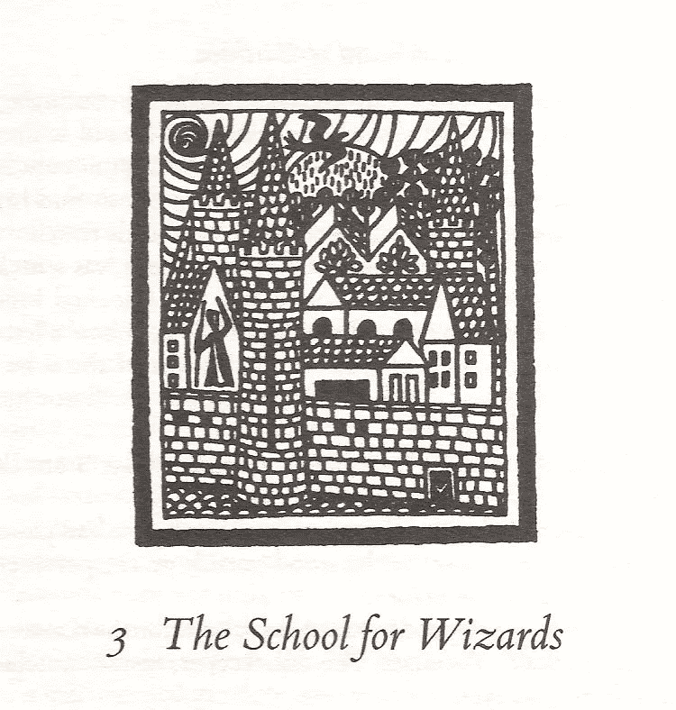
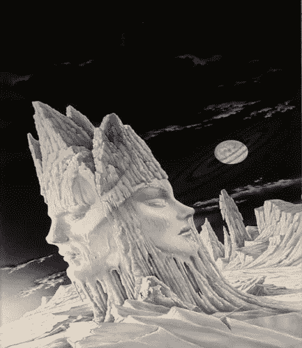
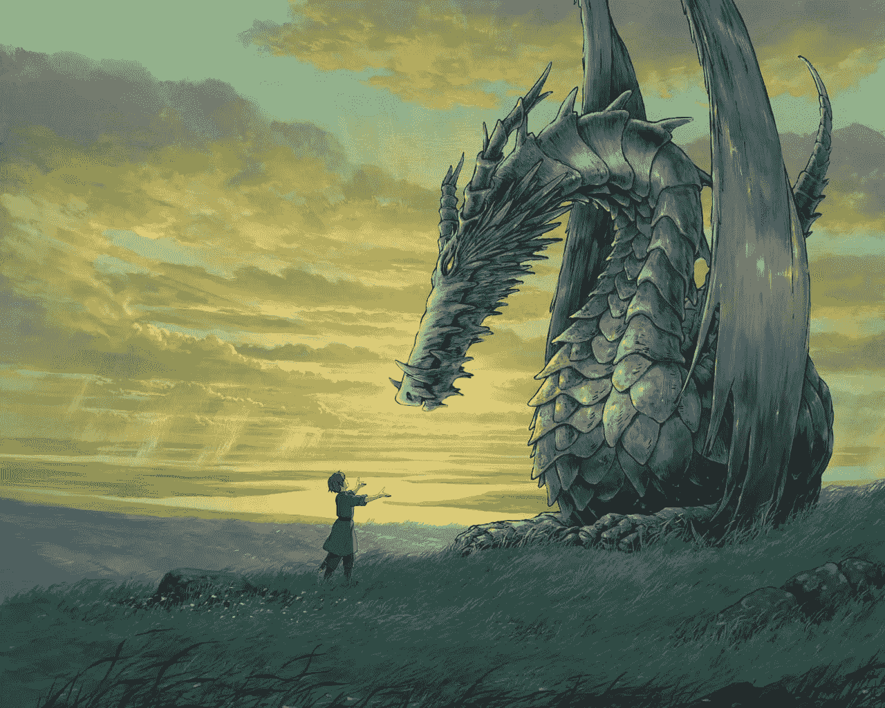

# 记住厄休拉·K·勒·古恩——阅读龙的故事是一回事，与它们相遇又是另一回事

> 原文：<https://medium.com/hackernoon/remembering-ursula-k-le-guin-why-her-her-work-meant-so-much-to-me-41a11307d075>

# 为什么她的工作对我如此重要

像许多其他人一样，我很难过地得知厄休拉·K·勒·古恩今天去世了。

我上周刚刚给她发了一封电子邮件，承诺我们正在创作的一个新的剧本草稿，奇怪的是，还有一个链接指向我的博客条目“[我在亚瑟·C·克拉克在斯里兰卡的书架上发现的东西](https://hackernoon.com/what-i-found-on-arthur-c-clarkes-bookshelf-in-sri-lanka-71c602bc1fdc)”，评论说我很高兴这位著名科幻作家的办公室在他去世后仍然保留着。

在我发完邮件后，我有一种奇怪的感觉——希望她不会认为我在暗示她的年龄和在她死后保留她的职位——我只是想她可能会喜欢这篇文章(她是 2013 年第二届*亚瑟·c·克拉克想象力影响力奖的获得者)。*

当她没有回应时，这种奇怪的感觉只会增加——以我的经验来看，她通常很擅长及时回应，并且不羞于提出自己的意见，尤其是在修改她的作品时。或者如果她很忙，不能马上回复，她通常也会让我知道。我当时没有意识到她已经奄奄一息了；现在知道原因让我很难过。

## ***“只有在寂静中的字，只有在黑暗中的光”——地海魔法师***

paperback versions of the original Earthsea trilogy

对于那些不了解厄休拉作品的人来说，她在某些圈子里被称为科幻小说中的“贵妇人”。自 20 世纪 60 年代首次出版以来，她已经写了 20 多部小说，几乎赢得了科幻/奇幻领域的所有主要奖项，包括雨果奖、星云奖、国家图书奖、PEN-Malamud 奖和国家图书基金会奖章，并在 2002 年被美国科幻和奇幻作家协会评为大师。

我最初认识她是因为她喜欢她的作品，希望得到她的签名，后来我认识她是因为她是一名合作者，将她的一部小说改编成电影(这个项目我们还没有公开宣布)。虽然我很少见到她本人，但在过去的几年里，我们的大部分互动都是通过电子邮件进行的，她非常敏锐，她的幽默(以及当她不喜欢某样东西时的沮丧)表现得非常响亮和清晰！

我想借此机会说一说她的工作在我一生中对我意味着什么。

乌苏拉的作品在科幻和幻想中是独一无二的，与其说是因为书中的内容(这是独一无二的),不如说是因为书中没有的内容。没有兽人或机器人杀手的大规模战斗。她的科幻小说里没有外星人(嗯，至少没有非人类的外星人)。没有单一的“黑魔王”或“天选之子”。真相总是更加模糊，她的小说迫使你思考人、概念、想法、后果，以及特定的故事情节。

## 哥特岛因其巫师而闻名，洛克是第一所巫师学校

A map of the Archipelago of Earthsea

当一些年轻的科幻和幻想迷不知道乌苏拉的作品时，我总是感到惊讶。通常他们知道《哈利波特》、《指环王》、《T2》、《权力的游戏》、《饥饿游戏》、《T5》，但可能没有读过《地海》、《黑暗左手》。这部分是因为她的作品更难适应电视节目和电影的正常叙事结构(相信我，我可能比大多数人都花了更多年来考虑改编她的作品！).

我在中西部读九年级的时候第一次读到她的作品。我是一个棕色皮肤的孩子，生活在白人面孔的海洋中，有点缺乏安全感，只是在寻找我书呆子气的一面；我在《霍比特人》和《托尔金》中找到了避难所。我最喜欢的角色一直是巫师甘道夫。后来，在一个晴朗的日子里，我看到了一篇关于“巫师”如何成为聪明的老巫师的文章——他们去了巫师学校！这一切都记载在一本叫做《地海巫师》的小书里，作者是一个我从未听说过的女人，厄休拉·K·勒·古恩。

我立即在我们位于北卡罗来纳州威利斯顿的小图书馆里寻找这本书，很高兴他们有一本！这是一本相当小的书，我很快就把它囫囵吞下，然后去找它的续集，我们的图书馆不得不利用馆际互借来订购。

看完那第一本书，我就再也不一样了！虽然篇幅很短，但里面充满了切中我要害的想法。

这些年来，当我阅读其他科幻小说和幻想小说时，我总是会回到那本书上，*地海巫师*。将近 35 年后的今天，我仍然记得那些深深印在我少年脑海中的诗句:

## ***“点蜡烛就是投下阴影”***

我以前从未想过魔法的后果。魔法只是巫师能做的事，我也希望我能做。“使用真正的魔法就是以某种方式改变世界”——洛克的大师们对年轻的雀鹰解释道。改变世界是有后果的。

但比起她某些作品背后的道家哲学(随着年龄的增长，这一点对我越来越重要)，想象一下当我得知*地海*的一个巫师是一个和我年龄相仿的棕色皮肤的年轻人时，我有多惊讶！

仿佛闪电击中了我。灵感的闪电从她身上射向了我(也许还有其他从未在幻想世界中见过自己的有色人种儿童)。种族(和性别)问题在她的作品中变得非常重要，她的作品通常以女性或有色人种为主角。她曾经写道，她在 1968 年出版的书中“偷偷”透露了雀鹰是一个年轻的棕色人种。读者和出版商都不会意识到这一点，直到后来的书，到那时，他们太沉迷于关心。那时候，你没有科幻小说或幻想小说中的棕色英雄，只有白色英雄。

对于像我这样的人，在让我感觉“不同”的地方长大，这是一个难以置信的发现！对我来说，雀鹰是一个榜样，就像巴拉克·奥巴马可能是现在在美国成长的黑人孩子的榜样一样。是的，这对我真的很重要，地海的这些地方和雀鹰学到的课程，他去过的地方，以及他交往过的人，这些年来一直伴随着我。

多年后，当基于地海的 Sy Fy 迷你系列不仅大大改变了故事，而且还让一个白人担任主角时，Ursula 写了一篇现在很有名的文章，“SyFy 频道如何粉饰我的地海系列”，我们这些真正的地海粉丝为她的勇气和信念鼓掌！

读了《地海巫师》几年后，当我刚到麻省理工学院上大一时，我独自在晚上的走廊里徘徊，我总是想象自己穿着巫师袍，拿着一根棍子，在洛克魔法学校的走廊里徘徊。这远在任何人(包括 J.K .罗琳本人)听说霍格沃茨之前！

勒奎恩笔下的英雄并不完美，雀鹰也不例外。他恣意妄为，滥用权力，把事情搞得一团糟，给这个世界留下了阴影。他必须对自己行为的后果负责。他释放了阴影，在成为完整的“伟大的幻想英雄”之前，他需要拥抱他的阴影。这不是你典型的“天选之人”！

我可以不停地说地海。直到今天，当我感到压力很大，需要从物质世界中撤退，或者思考世界是如何变化的，平衡是如何被我的每一个行动打破的时候，我仍然想象自己撤退到“内在的小树林”中。我发现自己在想，如果我遇到一只龙或者与一个在世界上撕裂了整个世界，剥夺了龙的语言的巫师战斗，我会怎么做。，我会怎么做？如果我们能唤醒死者的灵魂，我们应该这么做吗？我一直想知道如果它们是真的，龙会不会跟我说话。在我关于灵性和商业的书中，我经常提到龙的主题，这在很大程度上是因为地海。

我被巫师和龙吸引住了，但正是这些书中潜在的主题让我一次又一次地回去。

## “一个外星人是好奇，两个是入侵”——厄休拉·K·勒·古恩

我喜欢上乌苏拉的科幻小说，尤其是她的《海尼什循环》,比她的奇幻小说晚得多。这部分是因为他们没有龙，但也因为他们更有思想，把性别问题加入到文化和政府问题中。对于第一次涉足地海的青少年来说，它们几乎太复杂了。

对于我们这些看着《星际迷航》和《星球大战》长大的人来说，她提供了一个非常不同版本的“行星联邦”。Ekumen 更像是星际人类学家，而不是一个“管理机构”；他们的目标不是征服或统治，而是保存和分享知识。随着我对美洲土著文化越来越感兴趣(制作了几部在纳瓦霍保留地拍摄的电影)，我意识到厄休拉·K·勒·古恩的“K”代表 Kroeber，她的父亲是一位非常著名的人类学家，研究过许多美洲土著文化(Alfred Kroeber)。

虽然她在这个系列中最著名的书包括*黑暗的左手*和*被剥夺者*，但我最喜欢的书之一是*的讲述*，这本书于 2000 年出版，是她最后一部海南小说。在两部*方法*和*讲述*中，主角都是一个来自地球的人类，他代表伊库门被派往一个星球。海涅什系列的书不仅不是直接的续集，每本书都描述了一个特定世界的文化，是对其文化的研究，我们可以理解这一点，因为主要人物来自 Terra(呃，地球)。

One of the early covers for the Left Hand of Darkness

在这个量子时代，我们越来越接近她在作品中介绍的通信设备 Ansible，它使用一种量子纠缠的形式来跨越光年即时发送信息。许多其他科幻作家在他们自己的作品中使用了 Ansible，并以同样的名字命名，以纪念她首次介绍它。如果我们真的与其他星球和文明互动，我们应该记住厄休拉对埃克曼的理想，而不是独立日的理想！

***遇见龙***

乌苏拉曾经写道，“但是阅读关于龙的知识是一回事，与它们相遇又是另一回事。”

当我想到我第一次见到她时她是什么样的，尽管我现在才想到这个比喻，她就像一条智慧、古老但强大的龙。像 Orm·恩布尔或卡莱辛。她知识渊博，睿智，但当她不同意某些事情，而你不想激怒她时，她也很强硬和坚定！其他时候，她就像一位慈祥的老奶奶在照顾你，然而他们是一个非凡存在的不同部分。

虽然我与她的大部分互动是通过电子邮件或电话进行的，但我与她本人的几次会面非常有趣——她思考了许多事情，包括其他科幻和奇幻作家，如乔治·马丁和菲利普·K·蒂克。

事实上，她给我讲了一个关于迪克的故事，很有趣，值得一说。她说，因为菲尔和厄休拉在伯克利上同一所高中，而且他们只相差一岁，所以他们肯定是同时去的。当她意识到这一点时(毕业多年后)，她翻遍了自己的年鉴，没有发现他的任何踪迹。在一次聚会上，她问所有的同学是否记得他——没有人记得他，也找不到他的任何踪迹！她在故事的结尾说，她感觉自己置身于菲利普·K·蒂克的故事中——他的所有痕迹都从年鉴和同学们的脑海中消失了！

我想找到一种方式来结束这篇文章，在她去世之际，感觉我们就像在厄休拉·K·勒·古恩的小说中一样。

虽然《地海》一开始是一个年轻的成人系列，但它非常深入地探讨了围绕死亡的主题。在《最远的海岸》中，一个想要长生不老的巫师在生者和死者之间撕开了一个洞。这是不自然的，导致了平衡的不平衡，结果是它从世界中吸取了魔法。

这取决于 Ged(雀鹰的真名)，他不再是一个早熟的年轻巫师，但现在是 Roke 学校的聪明的老大法师，和他的年轻伙伴，新英雄，一起进入死亡世界去修补这个洞。

为了做到这一点，他必须越过一个栅栏，走下一个巨大的山坡，山坡下是永恒的暮色中一组静止的星星。栅栏是活人和死人世界的分界线。这不是地狱，而是“另一边”。

现在乌苏拉已经穿越到了另一边，我想知道她是否在回头看栅栏，看着静止的星星，看着我们这些仍然在这一边的人，或者她是否渴望找到更多的故事告诉另一个世界的人们。或者像 Tehanu 一样，她会和她的人民，龙，重新结合。

我们这些重视她的作品的人感觉世界上有一个新的洞，魔法和魔力被从中拔出来了。

在*最远的海岸，*是一条龙告诉 Ged 关于“世界上的洞”。如果我们是在《阿乐·奎因的故事》中，我可以想象出与 Ged 和 Orm·恩布尔的类似对话。

“一个伟大而强大的龙神吸走了这个世界的魔法，”年老、睿智、强大的龙说道。"他的力量比我们强大"

“甚至比你的，乌苏拉？”

“甚至比我的，”她会回答。

> 生出于死，死出于生；在对立中，他们渴望彼此，他们生下彼此，永远重生。有了它们，一切都重生了，苹果树的花，星星的光。生命中有死亡。死亡是重生。"
> 
> -厄休拉·K·勒·古恩，最远的海岸