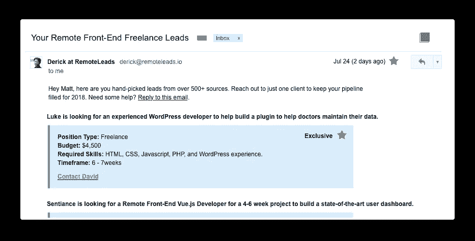
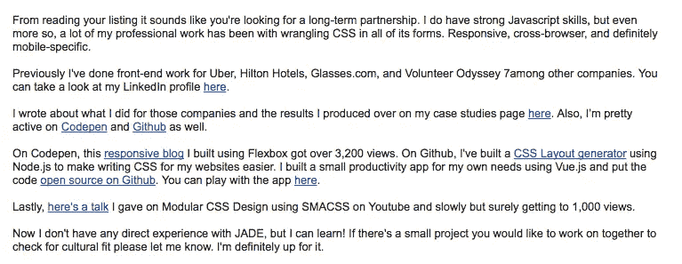

# 作为一名初级网站开发人员，如何获得一份远程自由职业

> 原文：<https://medium.com/hackernoon/remote-freelance-job-junior-web-developer-523dcb814f8b>

如果你是初级开发人员，你可能会想，“我能以我在 T2 的网络开发技能得到一份远程自由职业吗？”如果你开始问这个问题，那么我的猜测是肯定的。

你可能还没有达到高级水平，但是你确实有实现一个网站的技能。你可能不确定如何找到远程自由职业客户或联系他们。

**在这篇文章中，我将揭示一些初级开发人员可能犯的三大错误，以及即使你认为自己是初级开发人员，你可以做些什么来开始登陆远程自由职业项目。**

# 走出初级心态，进入解决问题的心态。

我看到初级开发人员犯的最大错误是称自己为初级开发人员。有些人把它作为荣誉徽章佩戴在他们的 LinkedIn、简历和作品集页面上。

你可能会觉得你还没有达到你想要的水平。谦逊和高标准很好，但事实是你比雇佣你的客户好得多。

当客户看到你称自己为初级时，他们首先想到的不是你的标准有多低多高。**首先想到的是，你可能会成为他们的负担，你可能会让他们付出比你能够为他们创造的更多的钱。**

客户寻找开发人员的原因是帮助他们解决业务问题。他们没有时间或技能自己处理。

你可能还没有达到你想要的水平，但是你确实有必要的技能来执行一些自由职业者的网络开发项目。

你如何向客户传达你的 web 开发技能，以及你如何帮助他们解决业务问题，这就是解决问题的心态。

# 进入解决问题的思维模式

对于初级开发人员来说，解决问题的心态是清晰而积极地交流你以前完成的项目和你目前的 web 开发技能如何帮助客户解决他目前面临的问题。

一些开发者可能认为这是“销售”。**两者都不是，这种思维方式会让你在更多的项目上失败而不是成功。**

事实是，你在和其他同样想要那个远程自由职业者职位的开发者竞争。**记住，客户希望尽快解决他们的问题。**

他们不会假定你是无辜的，只会认为是“责任消极警报”然后开始看下一位候选人的求职信。

不要提及你认为自己缺少什么，比如你的初级职位，而是积极地谈论你已经取得的成就，向客户展示你是一个努力工作的人，愿意承担问题并为他们解决问题。

谈谈你做过的项目，用过的框架，以及你创建这些项目的经验如何帮助你解决客户的问题。

所以，当你在寻找自由职业项目时，不要称自己为初级开发人员。就客户而言，你是一个网站开发者。句号。

# 客户不会来找你。出去找他们。

很多网站开发人员在寻找自由职业客户时的下一个误解是，他们认为自由职业客户会先找他们。

一些开发人员创建了一个作品集网站，放在网上，然后认为客户会神奇地找到他们的网站，给他们发一封寻找工作的电子邮件。

但是，事情不是这样的。

**通常，当一个客户需要远程网络开发工作时，他会在 twitter 或脸书的一个群中发布广告，说他正在找人。**更专业的客户会在 Reddit 或求职网站上发帖找人。

客户通常希望快速得到结果。因此，客户不会花时间去寻找其他选择，而是会回应那些向他求助的人。当他认为他找到了最适合这份工作的人，或者做出了最好的妥协，他就会选择其他人。

所以你必须采取主动，走出去，找到他们实际发布信息的客户。

# 那么，你去哪里找远程自由职业项目呢？

有很多不同的地方可以找到自由网络开发工作。首先访问一些常见的地方，比如 Codepen Jobs、天使名单和特定于框架的脸书小组。

你不必把自己局限于明确寻找初级开发人员的工作。根据我的经验，明确寻找初级开发人员的工作只是在寻找一个非常便宜的开发人员。这些工作可能仍然值得申请，但要更加关注它们。

**这里有几个链接，你可以从那里开始搜索**:

*   Codepen Jobs([https://codepen.io/jobs](https://codepen.io/jobs))
*   **堆栈溢出**([https://stackoverflow.com/jobs](https://stackoverflow.com/jobs))
*   **正宗乔布斯**([https://authenticjobs.com/](https://authenticjobs.com/))
*   **WeWorkMeteor**(【https://www.weworkmeteor.com/】T2)
*   Hubstaff 乔布斯([https://talent.hubstaff.com/search/jobs](https://talent.hubstaff.com/search/jobs))

# 每天节省几个小时，用远程线索搜索好的远程项目

通过订阅远程销售线索，您可以避免花费大量时间搜索销售线索。**我们找到最好的线索，对其进行审查，并通过电子邮件发送给你**。这是确保你有稳定的潜在商机的好方法。可以在这里订阅[。](https://remoteleads.io/remote-freelance-front-end)

# 丢掉一般的简历，个性化你的求职信。

当谈到赢得远程自由职业项目时，最后一个误解是开发者把它当作申请一份正常的工作。

当开发人员发送一封普通的求职信并继续期望客户为他们做所有的工作时，他们就失去了机会。有些人会在他们的标题中包含“青少年”一词，这也会造成更大的伤害。

当你申请一个偏远的自由职业者职位时，你是在和许多其他开发者竞争。

如果你想赢得好的远程自由职业项目，你必须写一封好的求职信。

An example of how I layout the copy in my email body

客户也在寻找许多其他候选人，他们通常会选择一个他们认为可以解决他们业务问题的人。

首先，从尽可能了解客户的需求开始。他们需要一个有日历显示的网站吗？

谈谈你在之前的项目中，如何使用媒体询问和创建响应性网站的经验。你很有信心能造出这样一个东西来帮助他继续他的事业。

如果你能清楚地表达出你是能以最佳方式解决业务问题的人，他会选择你，你会赢得这个项目。

# 结论:你可以获得一个远程自由职业项目，即使你认为你是一个大三学生

最终，寻找自由网站开发者的客户需要一样东西:解决商业问题。你有建立网站的技能，所以你有技能帮助他们解决问题，并为此获得报酬。登陆远程自由职业项目