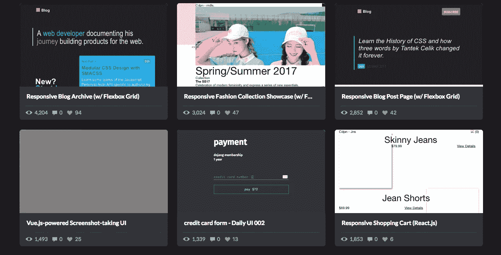
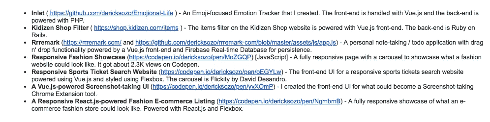
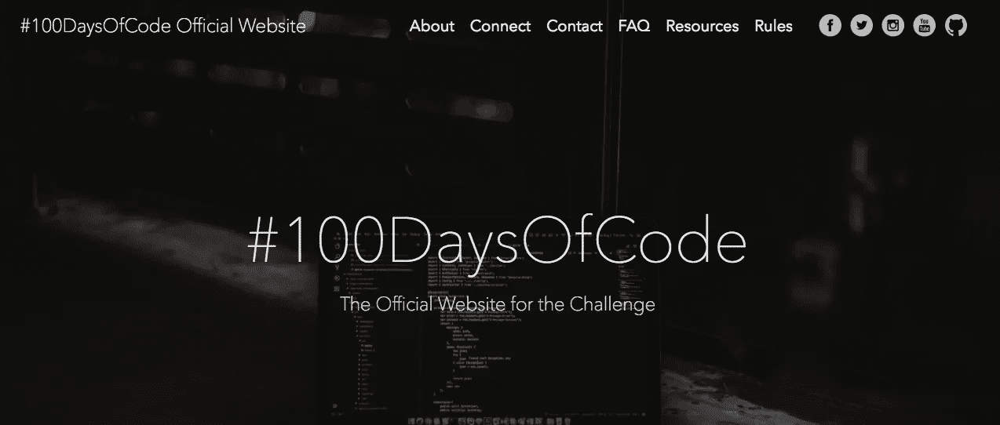
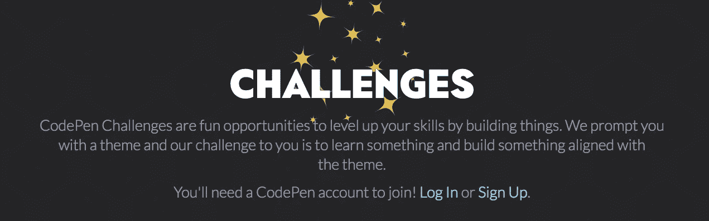

# 如何在没有充实投资组合的情况下，在 21 天内获得一份远程自由职业网站开发工作

> 原文：<https://medium.com/hackernoon/remote-freelance-web-development-job-no-portfolio-2f871f298cbb>

许多新开发人员会经常给我发电子邮件，“嗨，吴镇男，我是一名新开发人员。我也能得到一份远程自由职业者的工作吗？”

我的回答总是，“不同的项目需要不同层次的经验。你有什么项目？”

当我问这个问题时，一些开发人员可能会想到，他们需要创建成熟的应用程序或网站来向客户展示。他们认为如果他们不这样做，他们就不会被认真对待。

现实是这样的:**无论如何，大多数客户都不会完整地浏览一个投资组合。**

客户的主要目标是解决一个商业问题。**大多数投资组合没有案例研究。客户应该如何看待一个项目？即使投资组合有案例研究，它通常也是从开发者的角度来写的。一些开发人员写的是他们完成了什么，而不是这个项目如何帮助客户。**

**在这篇文章中，我将打破你需要一个充满完整案例研究的成熟投资组合网站的神话**。以下是你可以做的，来开始登陆[远程](https://hackernoon.com/tagged/remote)自由网络开发项目。

# 客户不想看简历。他们想要解决一个商业问题。

客户心中唯一的疑问是:**您能帮我快速解决业务问题吗？**

如果你的目标是获得一个远程自由职业项目，你希望在联系客户后，尽快向他们展示你的创作能力。而且，你必须以一种客户可以很容易理解的方式来做，这样可以帮助他们。

# 构建可以在一天内创建的小组件

我发现的最好的方法是建立一系列小的、可理解的项目，客户可以毫不费力地看到。

然后在我发送的电子邮件求职信中，我解释了这些项目如何帮助客户，而不是我完成了什么。

**当客户浏览电子邮件求职信时，他们希望快速了解你如何帮助他们完成业务项目。**

大多数时候他们不会给你好处。他们会转向另一个候选人。此外，他们不会花时间检查你的投资组合。

构建一系列小项目可以让你以一种既方便你构建又方便客户完成的方式来完成。

当我接触潜在客户时，我经常使用这种技巧。

How I structucture my projects when I send out an email

# 你应该在哪里主持你的项目？

有很多服务可以让你免费创建和托管代码。你选哪个都没关系。我个人选择了 CodePen，但是你可以选择任何你觉得最适合的服务。

**这里列出了一些你可能会用到的网站:**

*   【https://codepen.io/】Codepen
*   小故障([http://glitch.me/](http://glitch.me/))
*   JSBin([https://jsbin.com/](https://jsbin.com/))
*   **小提琴**([https://jsfiddle.net/](https://jsfiddle.net/))
*   扑通一声([https://plnkr.co/](https://plnkr.co/))

最重要的是，你可以创建一个帐户，并获得每个项目的链接。这样，当你联系客户时，你可以在邮件中把他们联系起来。

# 选择你的挑战，连续 21 天创建项目。

给自己开始一个 21 天的挑战。每天敲定一个项目，并开始构建一系列可以向客户展示的项目。

已经有一些开发人员参与了同一个概念的不同版本。有一个#100DaysOfCode 挑战，开发者在 100 天内创造新的东西。想象一下，在那之后，你的作品集会变得多么充实！

CodePen 本身有一个/challenges 部分，鼓励开发者每个月都去开发新的东西。

**链接:**https://codepen.io/challenges/

其他开发人员接受了为 DailyUI 挑战创建前端代码的挑战。

A DailyUI React CodePen by Jack Oliver

最终，天数并不重要。重要的是，你得到了一系列的项目，这样你就可以提高你的技能，当你接触客户时，你可以展示它们。

# 结论:创建小项目，这样你就能以一种易于理解的方式向客户展示你的技能。

最后，如果你想获得一个远程自由网络开发项目，归结起来有两点。

*   寻找伟大的远程自由职业者项目。
*   给潜在客户发送伟大的提案，对你的项目进行非常清晰的解释，这样他们就能明白你有能力解决他们的业务问题。

# 阅读下一篇:找到你下一个远程网络开发自由职业项目的 10 个免费地方

 [## 寻找下一个远程网络开发自由职业项目的 10 个免费地点

### 你是一个正在寻找下一个远程自由职业项目的网络开发人员吗？这里有 10 个免费网站，你可以用来找到…

hackernoon.com](https://hackernoon.com/10-free-places-to-find-your-next-remote-web-development-freelance-project-ee6bc5476a07) 

*感谢您的阅读！*