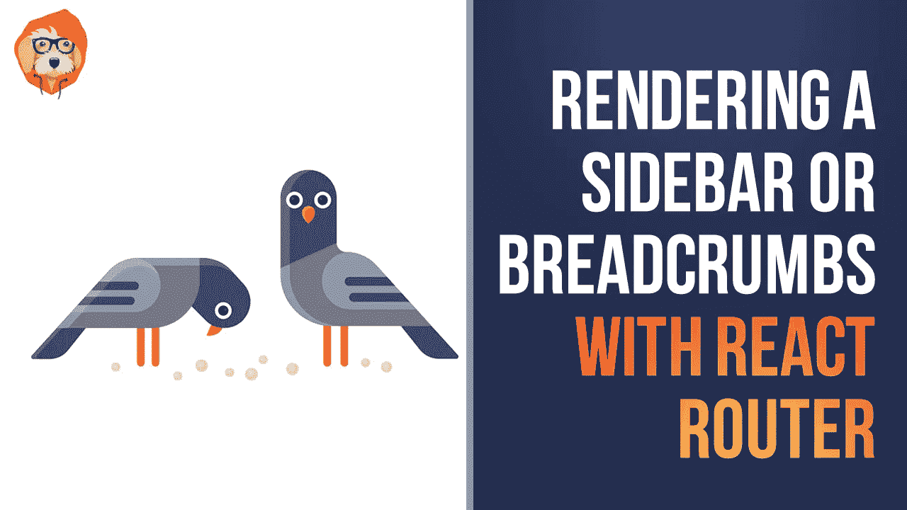

# 使用 React Router v4 呈现侧栏或面包屑

> 原文：<https://medium.com/hackernoon/rendering-a-sidebar-or-breadcrumbs-with-react-router-v4-94365f6a53ed>



当使用 React Router 构建应用程序时，您通常会希望实现侧边栏或面包屑导航条。在本文中，您将通过分解 React Router 文档中的侧栏示例，了解 React Router 是如何做到这一点的。

一个常见的 UI 模式是在你的应用程序中有一个侧边栏或面包屑导航条。因为 React Router 允许您在每页上呈现和匹配多个`Route`,所以实现这种模式非常简单。这篇文章的目的是展示如何通过呈现多个`Route`来基于路径(比如侧边栏)在页面的不同部分呈现不同的组件。

我们要做的第一件事，也是这篇文章的真正秘密，是创建一个 routes 数组。数组中的每一项都将包含关于特定路线的所有信息，以及应该呈现哪个组件。

```
const routes = [
  { path: '/',
    exact: true,
    sidebar: () => <div>home!</div>,
    main: () => <h2>Home</h2>
  },
  { path: '/bubblegum',
    sidebar: () => <div>bubblegum!</div>,
    main: () => <h2>Bubblegum</h2>
  },
  { path: '/shoelaces',
    sidebar: () => <div>shoelaces!</div>,
    main: () => <h2>Shoelaces</h2>
  }
]
```

现在，因为我们已经抽象出了到这个数组的路径，每当我们想要渲染任何`Route`时，我们可以映射它并指定应该渲染哪个组件(`main`或`sidebar`)。为了展示如何做到这一点，让我们首先为我们的应用程序构建一个基本框架。

```
import React from 'react'
import {
  BrowserRouter as Router,
  Route,
  Link,
} from 'react-router-dom'const routes = [
  { path: '/',
    exact: true,
    sidebar: () => <div>home!</div>,
    main: () => <h2>Home</h2>
  },
  { path: '/bubblegum',
    sidebar: () => <div>bubblegum!</div>,
    main: () => <h2>Bubblegum</h2>
  },
  { path: '/shoelaces',
    sidebar: () => <div>shoelaces!</div>,
    main: () => <h2>Shoelaces</h2>
  }
]class App extends React.Component {
  render() {
    return (
      <Router>
        <div style={{ display: 'flex' }}>
          <div style={{
            padding: '10px',
            width: '40%',
            background: '#f0f0f0'
          }}>
            <ul style={{ listStyleType: 'none', padding: 0 }}>
              <li><Link to="/">Home</Link></li>
              <li><Link to="/bubblegum">Bubblegum</Link></li>
              <li><Link to="/shoelaces">Shoelaces</Link></li>
            </ul> </div>
        </div>
      </Router>
    )
  }
}export default App
```

请记住，这里的目标是根据路径在应用程序的不同位置呈现多个组件。我们已经有了我们的`routes`数组，所以无论我们想在哪里渲染一些`Route`我们都可以映射它。首先，让我们添加一些`Route`到侧边栏(在我们的导航里面)。

```
render() {
  return (
    <Router>
      <div style={{ display: 'flex' }}>
        <div style={{
          padding: '10px',
          width: '40%',
          background: '#f0f0f0'
        }}>
          <ul style={{ listStyleType: 'none', padding: 0 }}>
            <li><Link to="/">Home</Link></li>
            <li><Link to="/bubblegum">Bubblegum</Link></li>
            <li><Link to="/shoelaces">Shoelaces</Link></li>
          </ul>
          {routes.map((route) => (
            <Route
              key={route.path}
              path={route.path}
              exact={route.exact}
              component={route.sidebar}
            />
          ))}
        </div>
      </div>
    </Router>
  )
}
```

最值得注意的是，我们已经将`route.sidebar`转换为`Route`的`component`道具。这是这个例子的关键，显示了我们之前创建的`routes`数组的重要性。现在，只要位置与`path`匹配，侧边栏组件就会被呈现。然而，我们并不想就此止步。当位置与路径匹配时，我们还希望在应用程序的主体中呈现一个组件。为此，我们将再次映射`routes`，但不是通过`component` `route.sidebar`，而是通过`route.main`。

```
render() {
  return (
    <Router>
      <div style={{ display: 'flex' }}>
        <div style={{
          padding: '10px',
          width: '40%',
          background: '#f0f0f0'
        }}>
          <ul style={{ listStyleType: 'none', padding: 0 }}>
            <li><Link to="/">Home</Link></li>
            <li><Link to="/bubblegum">Bubblegum</Link></li>
            <li><Link to="/shoelaces">Shoelaces</Link></li>
          </ul>
          {routes.map((route) => (
            <Route
              key={route.path}
              path={route.path}
              exact={route.exact}
              component={route.sidebar}
            />
          ))}
        </div> <div style={{ flex: 1, padding: '10px' }}>
          {routes.map((route) => (
            <Route
              key={route.path}
              path={route.path}
              exact={route.exact}
              component={route.main}
            />
          ))}
        </div>
      </div>
    </Router>
  )
}
```

🕺.现在，因为 React Router 允许我们在一个页面上呈现和匹配多个`Route`，并且因为我们将我们的路由抽象为一个数组，所以每当位置匹配`Route` s `path`时，我们可以在页面的不同部分呈现不同的组件。

*最初发表于*[](https://tylermcginnis.com/react-router-sidebar-breadcrumbs/)**作为他们* [*React 路由器*](https://tylermcginnis.com/courses/react-router/) *课程的一部分。**