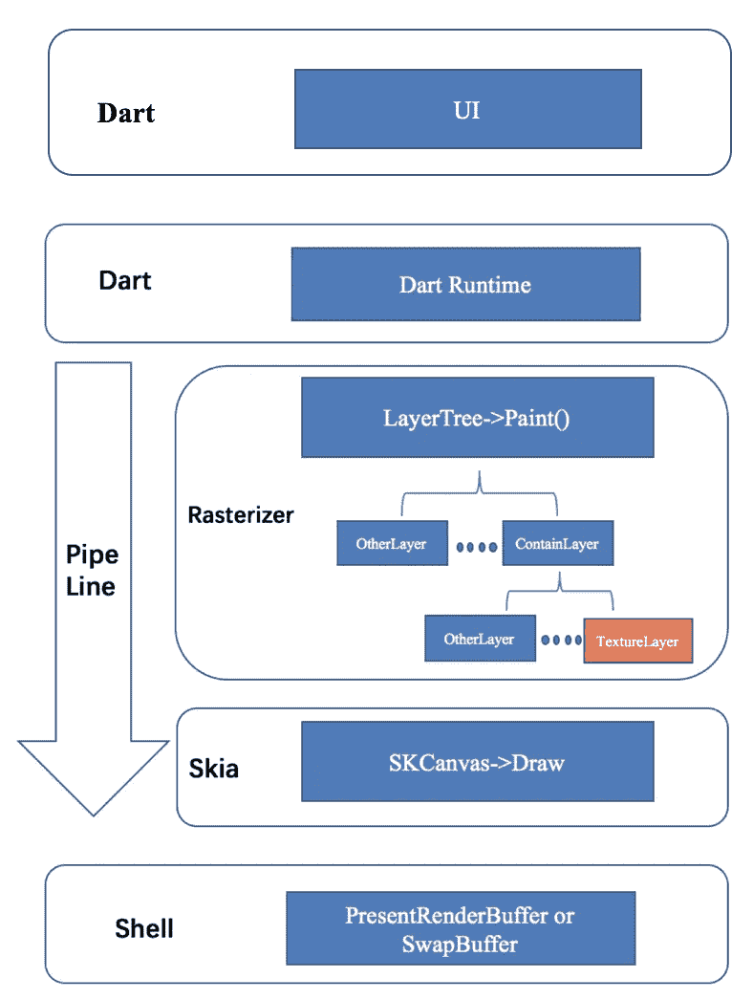
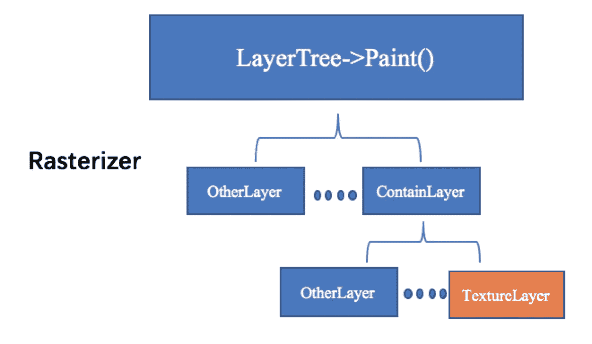
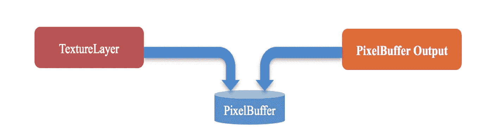
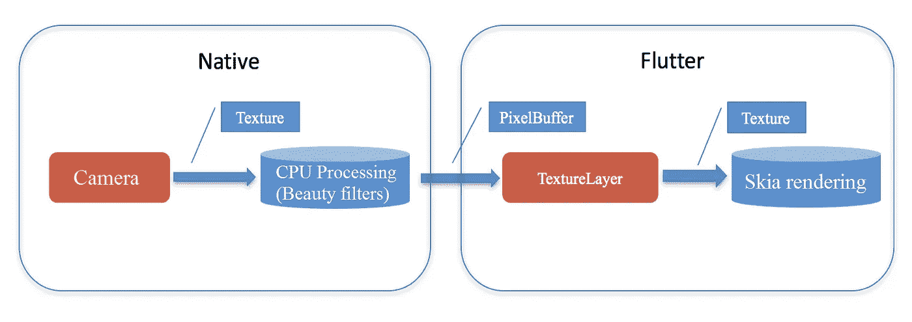
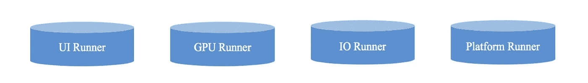

# 渲染“外部纹理”:一个颤振优化的故事

> 原文：<https://medium.com/hackernoon/rendering-external-texture-an-flutter-optimization-by-alibaba-c5ed143af747>

*优化开源 SDK Flutter 处理 Android 和 iOS 应用外部纹理的方式*


*本文是阿里巴巴* [***利用旋舞***](/@alitech_2017/utilizing-flutter-best-practice-from-alibaba-236a53aa32c8) *系列的一部分。*

In computing, as in much of life, any given method can see a lot of use before its latent flaws reach a decisive impasse. For Alibaba, discovering one such flaw in software development kit Flutter meant the difference between success and failure in the group’s recent work on a mobile app for its Xianyu(闲鱼) second-hand trading platform.

现在，阿里巴巴团队已经成功优化了 Flutter，用于仙游市场特有的一系列新用途，为整个 UI 渲染过程实施了 OpenGL 流程，以减少 CPU 和 GPU 资源开销。

在今天的文章中，我们在详细了解 Flutter 的内部工作和“外部纹理”的同时，还将关注该团队的优化工作，技术观众可以在自己的工作中探索这些细节。

# 颤振渲染框架

Flutter 渲染框架被组织成一系列的层，每一层都建立在前一层之上。颤振渲染框架的架构设计如下所示:



The Flutter rendering framework, by layer

1.**图层树**:渲染管道是 Dart API 在运行时输出的树状结构。树上的每个叶节点代表一个界面元素，比如按钮、图像等等。

2. **Skia** :由 Google 发起并管理的跨平台渲染框架。它充当 iOS/Android 应用程序的图形引擎。Skia 的底层被称为 OpenGL 绘图。Vulkan 支持非常有限，金属不提供支持。

3. **Shell** :平台特性，包括 iOS/Android 平台实现、EAGLContext 管理、在屏幕上返回数据以及外部纹理实现。

布局过程在 Dart 运行时执行，并输出一个层树。在流水线中遍历层树的每个叶节点，以调用 Skia 引擎来完成界面元素的绘制。

完成上述过程后，执行以下操作:

1.iOS: 运行 **glPresentRenderBuffer** 命令在屏幕上显示渲染缓冲区的内容。
Android:运行 **glSwapBuffer** 命令对当前窗口使用的层执行缓冲交换。

2.单击完整的屏幕显示链接。

基于这个原理，Flutter 可以在 Native 和 Flutter 引擎上实现 UI 隔离。它还捕获 UI 代码，而不分析跨平台解决方案上的平台实现。

# 实施问题

这种实现有优点也有缺点。Flutter 和 Native 是隔离的，有时候会让人觉得有一座大山把 Flutter Engine 和 Native 隔开。当 Flutter 想要捕获本机端的高内存图像，如相机帧、视频帧、相册图像等时，这就带来了问题。

传统应用程序(RN、Weex 等)可以通过桥接 NativeAPI 直接获取这些数据。同时，Flutter 根据定义的通道机制决定是否可以直接捕获数据并发送通知消息，在传输数据的同时不可避免地导致巨大的内存使用和 CPU 占用。

# 用外部纹理弥合差距

颤动提供了一种称为外部纹理的特殊机制。请注意，纹理是可以应用于颤振视图区域的图像。它们使用特定于平台的纹理注册表来创建、管理和更新。这通常是通过与主机平台视频播放器、相机或 OpenGL APIs 或类似图像源集成的插件来完成的。

LayerTree 的架构图如下所示:



LayerTree architecture

每个叶节点代表一个 dart 代码布局控件。末端的 TextureLayer 节点对应于 Flutter 中的纹理控制。当在 Flutter 中创建一个纹理控件时，它表示这个控件上显示的数据需要由 Native 提供。注意这个纹理和 GPU 的纹理不一样。这是为了颤振的控制。

下面是 iOS 平台上 TextureLayer 节点的最终绘制代码。Android 平台的代码类似，但是它获取纹理的方法略有不同。

建议按照以下三个步骤运行代码:

1.调用外部纹理的 copyPixelBuffer 函数来获取 CVPixelBuffer

2.创建 OpenGL ES 纹理—CVOpenGLESTextureCacheCreateTextureFromImage

3.将 OpenGL ES 纹理捕获到 SKImage 中，调用 Skia 的 DrawImage 函数完成绘制。

```
void IOSExternalTextureGL::Paint(SkCanvas& canvas, const SkRect& bounds) {
  if (!cache_ref_) {
    CVOpenGLESTextureCacheRef cache;
    CVReturn err = CVOpenGLESTextureCacheCreate(kCFAllocatorDefault, NULL,
                                                [EAGLContext currentContext], NULL, &cache);
    if (err == noErr) {
      cache_ref_.Reset(cache);
    } else {
      FXL_LOG(WARNING) << "Failed to create GLES texture cache: " << err;
      return;
    }
  }
  fml::CFRef<CVPixelBufferRef> bufferRef;
  bufferRef.Reset([external_texture_ copyPixelBuffer]);
  if (bufferRef != nullptr) {
    CVOpenGLESTextureRef texture;
    CVReturn err = CVOpenGLESTextureCacheCreateTextureFromImage(
        kCFAllocatorDefault, cache_ref_, bufferRef, nullptr, GL_TEXTURE_2D, GL_RGBA,
        static_cast<int>(CVPixelBufferGetWidth(bufferRef)),
        static_cast<int>(CVPixelBufferGetHeight(bufferRef)), GL_BGRA, GL_UNSIGNED_BYTE, 0,
        &texture);
    texture_ref_.Reset(texture);
    if (err != noErr) {
      FXL_LOG(WARNING) << "Could not create texture from pixel buffer: " << err;
      return;
    }
  }
  if (!texture_ref_) {
    return;
  }
  GrGLTextureInfo textureInfo = {CVOpenGLESTextureGetTarget(texture_ref_),
                                 CVOpenGLESTextureGetName(texture_ref_), GL_RGBA8_OES};
  GrBackendTexture backendTexture(bounds.width(), bounds.height(), GrMipMapped::kNo, textureInfo);
  sk_sp<SkImage> image =
      SkImage::MakeFromTexture(canvas.getGrContext(), backendTexture, kTopLeft_GrSurfaceOrigin,
                               kRGBA_8888_SkColorType, kPremul_SkAlphaType, nullptr);
  if (image) {
    canvas.drawImage(image, bounds.x(), bounds.y());
  }
}
```

external_texture_object 从哪里来？在本机端调用 RegisterExternalTexture 之前，创建一个用于实现 FlutterTexture 协议的对象，该对象被分配给 external_texture 对象。外部纹理是 Flutter 和 Native 之间的桥梁，用于连续获取要显示的图像数据。



如图，PixelBuffer 是 Flutter 和 Native 在使用外部纹理时传输数据的载体。原生端的数据源(相机、播放器等)将数据传输到 PixelBuffer。Flutter 取 PixelBuffer，转换成 OpenGL ES 纹理，供 Skia 完成绘制。

至此，Flutter 可以轻松绘制出原生端想要绘制的所有数据。除了动态图像数据(相机播放器)之外，图像的显示提供了图像控件之外的另一种可能，特别是对于原生端，当有像 SDWebImage 这样的大规模图像加载库时。当需要在 Flutter 端用 dart 写副本时，这个过程非常费时费力。

# 优化处理速度

上面描述的整个过程似乎解决了 Flutter 显示原生端大数据的问题，但它有以下限制:



如上图所示，视频图像数据处理一般采用原生端的 GPU 处理来提升性能。copyPixelBuffer 接口由 Flutter 侧定义。整个数据流经过 GPU > CPU > GPU 进程。请注意，CPU 和 GPU 之间的内存交换是所有操作中最耗时的。一次往返通常比整个管道的处理时间更长。

Skia 渲染引擎需要 GPU 纹理，原生数据处理输出是 GPU 纹理。这个 GPU 纹理可以直接使用 EAGLContext 的共享资源。EAGLContext 对象管理 OpenGL ES 渲染上下文，即使用 OpenGL ES 进行绘制所需的状态信息、命令和资源。

颤振的螺纹结构介绍如下:



颤动通常产生 4 个跑步者。TaskRunner 就像 iOS 的大中央调度(GCD)。它是一种在队列中执行任务的机制。通常，TaskRunner 与一个线程通信，而 Platform Runner 运行在主线程上。

以下 3 个任务运行者与本文相关:

1. **GPU TaskRunner** :负责 GPU 渲染相关操作。

2. **IO TaskRunner** :负责资源的加载。

3.**平台 TaskRunner** :负责本机和颤振引擎之间的所有交换，并在主线程上运行。

通常，使用 OpenGL 的应用程序线程设计会有两个线程——一个线程用于加载资源(从图像到纹理)，另一个线程用于渲染。但是，通常情况下，为了使 load 线程创建的纹理能够在 render 线程中使用，这两个线程共享一个 EAGLContext。这不是标准做法，因为不安全。用锁多线程访问同一个对象必然会影响性能。代码处理不好甚至会造成死锁。

为了避免这个问题，Flutter 为 EAGLContext 的使用提供了一种新的机制——每个线程都使用自己的 EAGLContext，并通过 iOS 应用的 ShareGroup 和 Android 应用的 shareContext 共享纹理数据。

(虽然两个上下文的用户分别是 GPU 和 IO Runner，但是现有的 Flutter 逻辑的两个上下文都是在 Platform Runner 下创建的。Flutter 设计的这一方面相当令人困惑，并且会产生各种各样的问题，但是这些都超出了本文的范围。)

对于在本机端使用 OpenGL 的模块，这也创建了一个对应于它自己的线程的上下文。要将在此上下文下创建的纹理交付给 Flutter，并将此数据发送给 Skia 以完成绘制，请在 Flutter 中创建两个内部上下文时公开 iOS 应用程序的 ShareGroup，然后在本机端保存 ShareGroup。当本机创建上下文时，它也将使用此共享组来创建它。这样 Native 和 Flutter 就可以共享纹理了。

以下是使用 external_texture 的两个好处:

1.**减少计算时间**
阿里巴巴的测试得出结论，一帧 720P RGBA 格式的视频在 Android 机型上从 GPU 读取到 CPU 大约需要 5 毫秒，然后再从 CPU 读取到 GPU 需要 5 毫秒。即使引入 PBO，也有 5ms 左右的时间消耗，这对于高帧率场景来说显然是无法接受的。

2.**减少 CPU 内存消耗**
正如你可能会直觉到的，数据是在 GPU 上传递的，尤其是在图片场景中(因为有很多图片要同时显示)。

# 一些旁注

既然已经介绍了颤振外部纹理和优化策略的基本原理，本节将讨论这些原理的一些缺点和例外。

## Flutter 纹理的完整性与 Pixelbuffer

许多人在这一点上提出的一个问题是:如果直接使用纹理作为外部纹理就像声称的那样好，那么谷歌为什么要使用 Pixelbuffer？

如果使用 Texture，就要公开 ShareGroup，也就是说 Flutter 的 GL 环境是开放的。如果外部 OpenGL 不能正常工作，OpenGL 对象对 CPU 来说只是一个数字、一个纹理或一个帧缓冲区，对用户来说是一个 GLuint(无符号二进制整数)当断点。如果环境是隔离的，用户可以随心所欲地操作 deleteTexture 和 deleteFrameBuffer，而不会影响其他环境中的对象。否则，这些操作可能会影响颤振环境下的对象。作为一个框架设计者，最重要的是确保框架是一个封闭的环境，以保持其完整性。

## 故障排除:崩溃

在开发过程中，团队遇到了一个奇怪的问题:Flutter 在渲染过程中会经常崩溃，但没有人能找出原因。

经过大量搜索，最终确定原因是在主线程没有 setCurrentContext 时调用了 glDeleteFrameBuffer，这意味着 Flutter 的 FrameBuffer 被意外删除。如果您选择使用此程序，本机端的相关总账操作应至少遵循以下几点之一:

1.尽量不要在主线程上执行 GL 操作；

2.在使用 GL 操作调用函数之前，始终添加 setCurrentContext。

## iOS 与 Android

本文的大部分逻辑都是基于 iOS 的例子。对于 Android 来说，总体原则是相同的，但实现略有不同。

Android 端的 Flutter 的外部纹理是通过 SurfaceTexture 实现的。该机制实际上是从 CPU 到 GPU 内存的复制。Android OpenGL 中没有 ShareGroup 这个概念。相反，它使用 shareContext，这意味着上下文直接传输出去。

另外，Android 在 Shell 层的 GL 实现是基于 C++的，所以 Context 是 C++对象。要与 Android 原生端的 Java Context 对象共享这个 C++对象，需要在 jni 层进行如下调用:

```
static jobject GetContext(JNIEnv* env,
                          jobject jcaller,
                          jlong shell_holder) {
    jclass eglcontextClassLocal = env->FindClass("android/opengl/EGLContext");
    jmethodID eglcontextConstructor = env->GetMethodID(eglcontextClassLocal, "<init>", "(J)V");

    void * cxt = ANDROID_SHELL_HOLDER->GetPlatformView()->GetContext();

    if((EGLContext)cxt == EGL_NO_CONTEXT)
    {
        return env->NewObject(eglcontextClassLocal, eglcontextConstructor, reinterpret_cast<jlong>(EGL_NO_CONTEXT));
    }

    return env->NewObject(eglcontextClassLocal, eglcontextConstructor, reinterpret_cast<jlong>(cxt));
}
```

(Original article by Chen Lujun 陈炉军)

# 阿里巴巴科技

关于阿里巴巴最新技术的第一手深度资料→脸书: [**“阿里巴巴科技”**](http://www.facebook.com/AlibabaTechnology) 。推特: [**【阿里巴巴技术】**](https://twitter.com/AliTech2017) 。