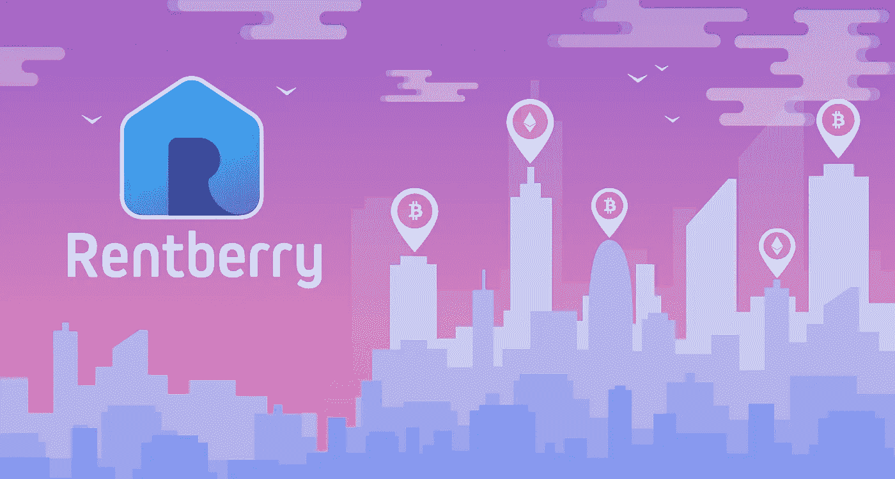
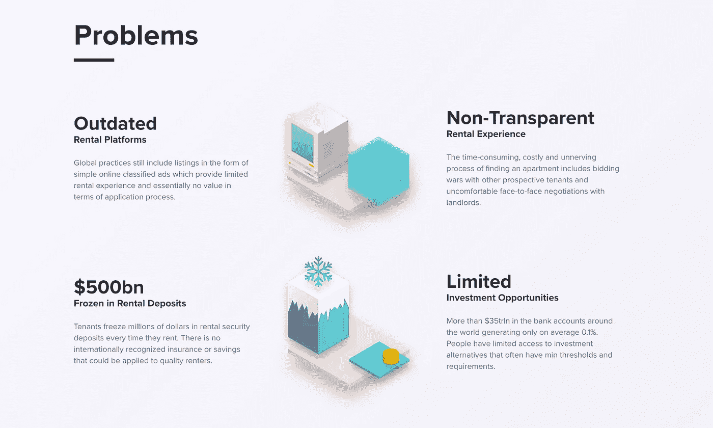
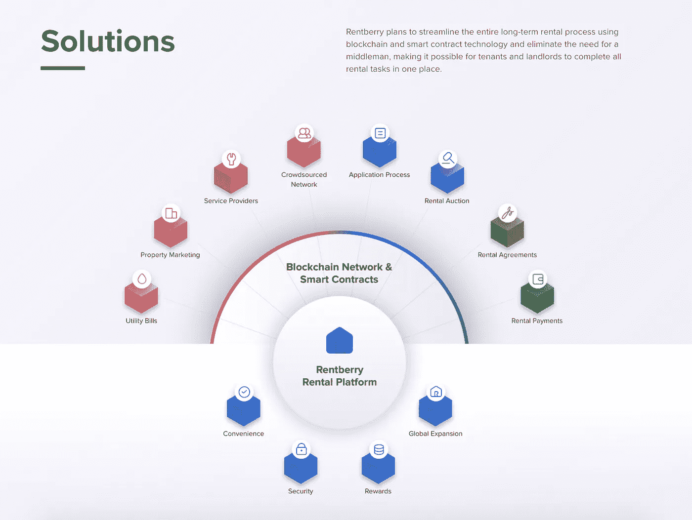
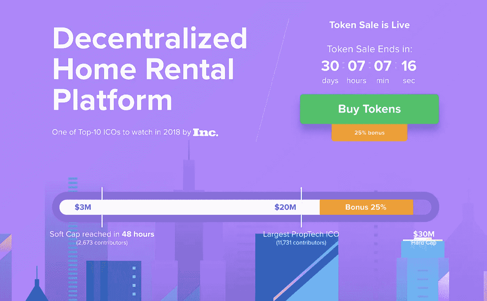
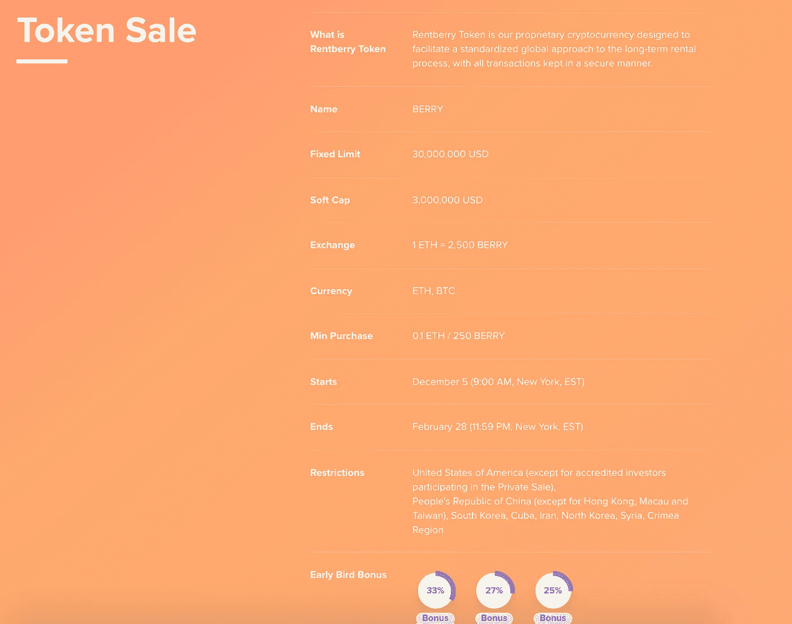
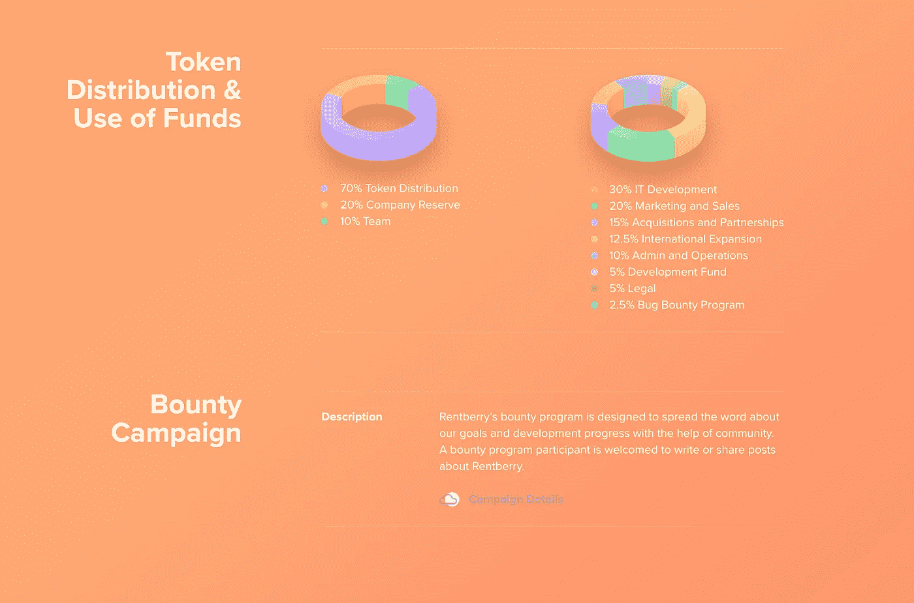
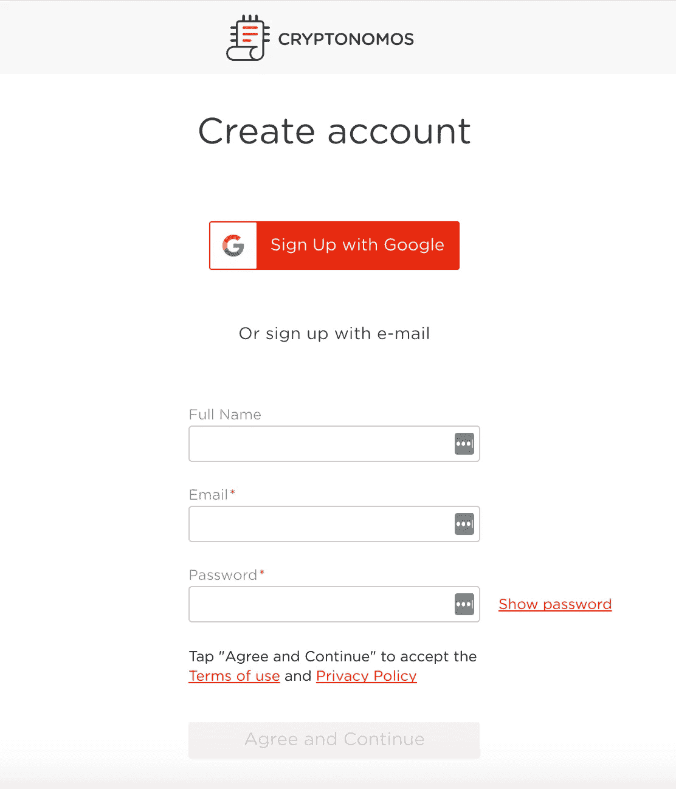
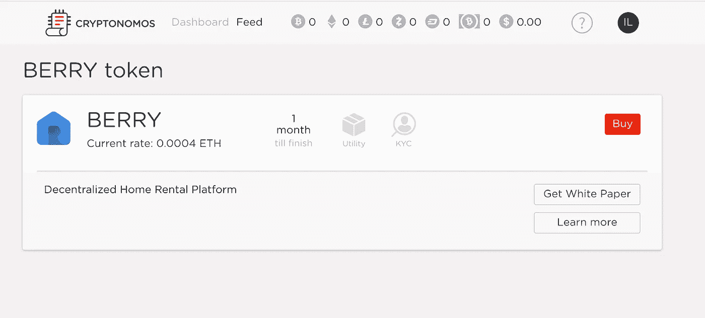
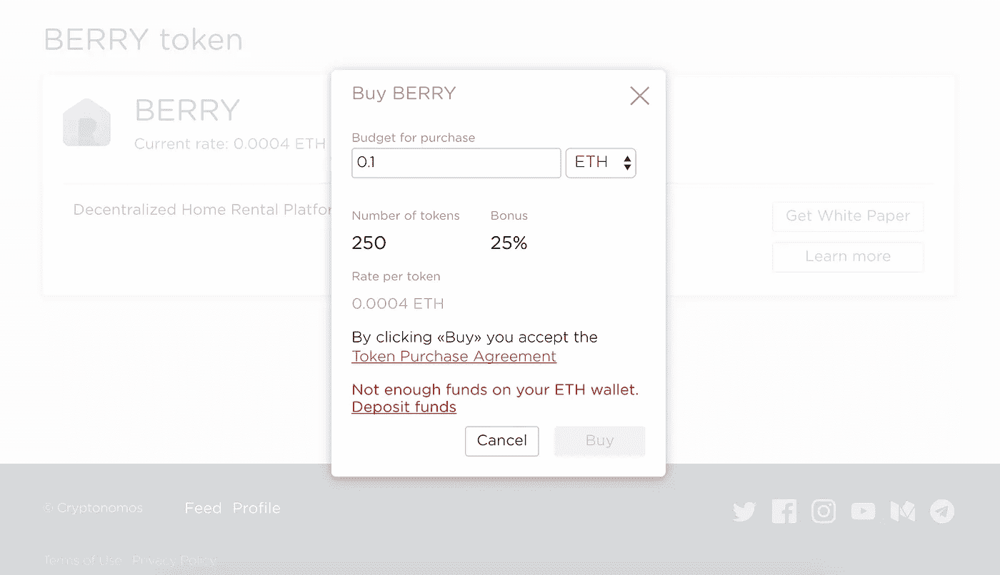
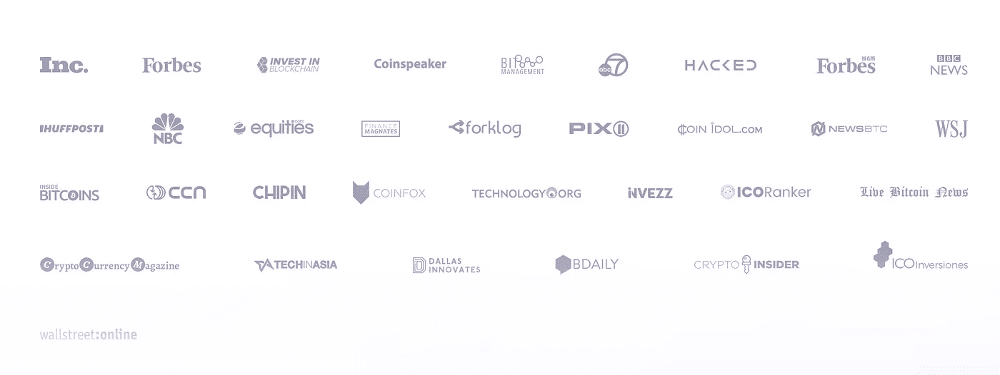

# rent berry——正确租赁

> 原文：<https://medium.com/hackernoon/rentberry-renting-done-right-ca1345fa9c6e>

想象一下，如果你有一个租户评级分数，或者更好的是房东评级分数。

在系统中有某种度量来保持房东或房客不受虐待不是很好吗？

如果你是房东或房客，你基本上信任一个陌生人，他的过去你完全不知道。

以数字方式签署租赁协议不是很棒吗？

这些只是 Rentberry 必须提供的基本功能。

## [Rentberry](http://www.rentberry.com) 到底是什么？

> Rentberry 是一个透明的房屋租赁服务，也是一个团结租客和房东的价格谈判平台。它自动执行所有标准租赁任务，从提交您的个人信息、信用报告和定制优惠，到电子签署租赁协议和在线支付租金。欢迎来到 Rentberry 社区——每天都有新租户搬进来！

Here’s a quick intro with visuals

## Rentberry 将如何解决这些现存的问题？

> Rentberry 计划使用区块链和智能合同技术简化整个长期租赁流程，消除对中间人的需求，使租户和房东在一个地方完成所有租赁任务成为可能。

Rentberry 将提供一个在一个地方提供所有服务的平台:**电子签约**、**洽谈**、**支付租金**、**雇佣第三方提供商**(如搬迁服务、代理等)。

房东只需轻轻一点就能挑选房客。租户也是如此。Rentberry 基本上是租房的未来。

## 但是等等！还有呢！

Rentberry 正在推出一款名为 BERRY token 的新代币。

## [Rentberry 目前的 ICO 运营非常成功。](https://www.coinspeaker.com/2018/01/25/rentberry-becomes-largest-ever-property-industry-ico-raising-20m/) —融资超过 2000 万美元！

[Rentberry ICO](https://rentberry.cryptonomos.com/) 于 12 月 5 日在 Cryptonomos 平台上推出，他们的 berry 代币将在 2 月 28 日之前提供。

Rentberry 选择了 [Cryptonomos](https://cryptonomos.com/) 来提供他们的 ICO 的全面服务，Cryptonomos 提供从营销到代币经济的一切服务，以及他们的区块链的 ICO 基础设施的构建

ICO 代币汇率的目标是 1 ETH = 2.500 BERRYs 左右。

**BERRY token 将用于平台上的支付。**

[***Rentberry ICO 是 2018 年最值得观看的 ICO 之一。***](https://www.inc.com/bill-carmody/top-10-initial-coin-offerings-icos-to-watch-heading-into-2018.html)

我如何能购买浆果代币？这很简单，首先你需要在 cryptonomos 上注册。

登录后，您可以看到“购买”按钮

按下按钮，应该会出现一个弹出窗口！

在我购买之前——有多少人/公司信任 Rentberry？好吧，看看吧！实际上有很多！😊

**免责声明:** *我接受了这次评论的浆果代币。*

感谢阅读！希望你觉得这有用！如果你看到了，请给我一些掌声，这样更多的人可以看到它，并查看我的推特。

你可能会喜欢我的一些其他文章，❤

 [## 理解区块链和加密货币基础知识的终极指南

### 如果你看了那个滑稽讽刺的家伙解释比特币，却几乎一点也不理解——不要担心——今天我们…

hackernoon.com](https://hackernoon.com/the-ultimate-guide-to-understanding-blockchain-and-cryptocurrencies-f37cf4c0043)  [## 不要慌！一月是一年中最好的月份！以下是方法和原因

### 你是否想过涉足加密货币市场，但还没有决定扣动扳机？

hackernoon.com](https://hackernoon.com/dont-panic-january-is-the-best-month-of-the-year-here-s-how-and-why-6f0cc43b74cf)